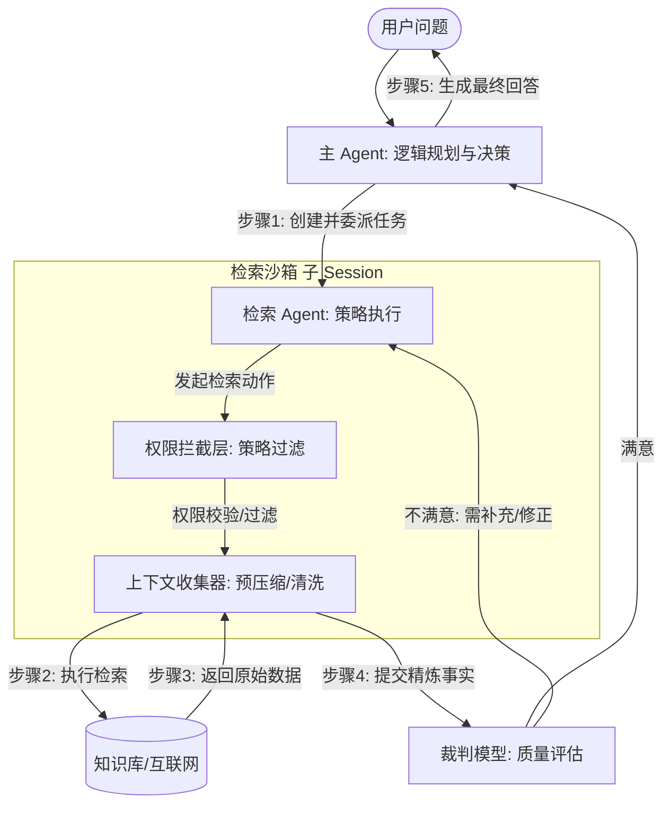
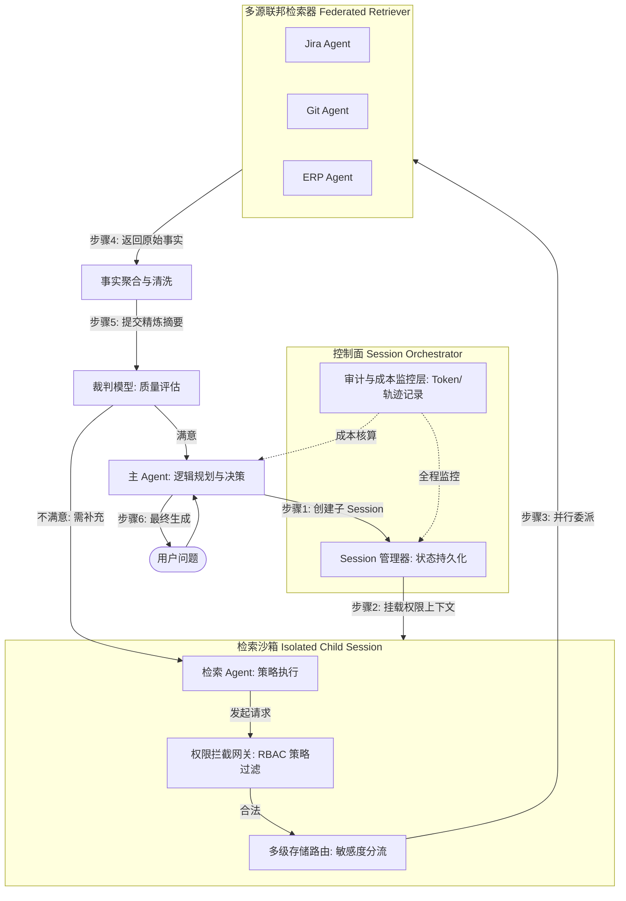
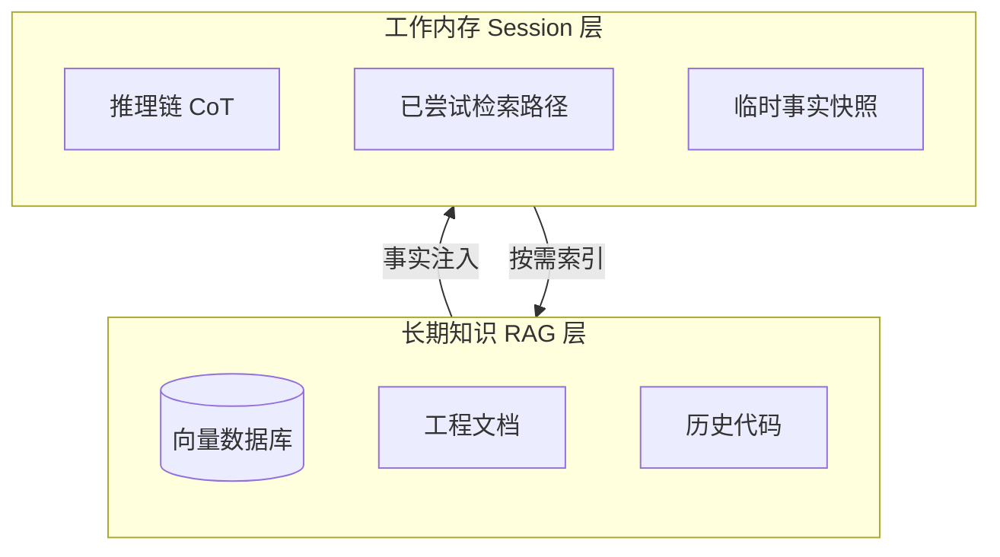
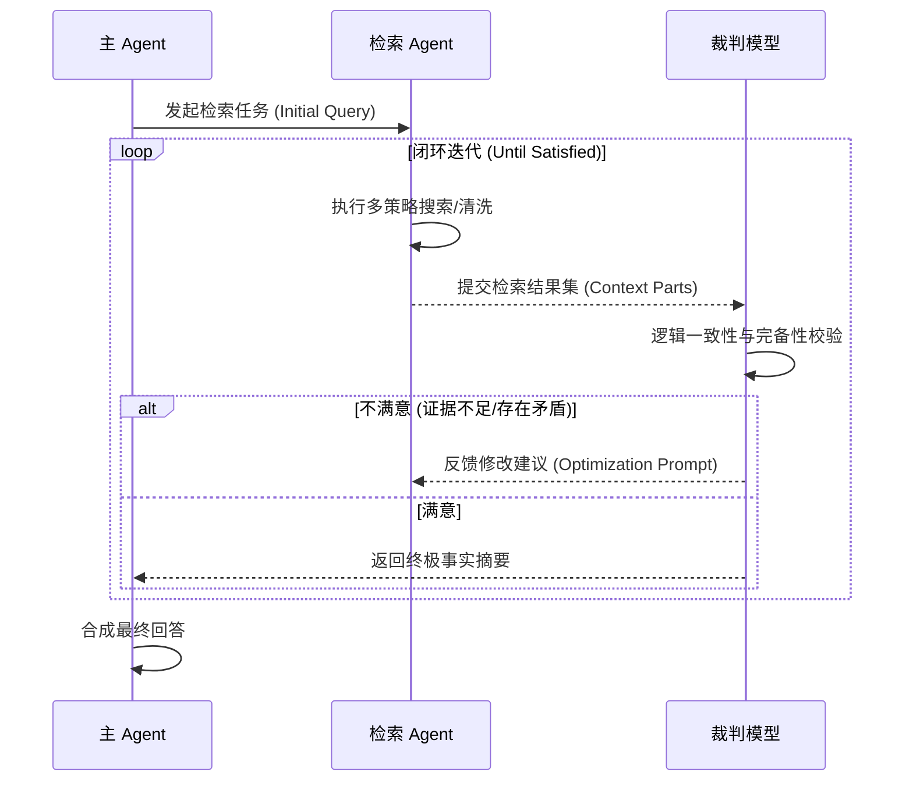

# Agentic RAG：从 OpenCode 架构演进中提取的设计模式与深度洞察

本篇文档旨在从 OpenCode 的核心架构设计中提取普适性的设计模式，并探讨如何将其应用于 **Agentic RAG (检索增强生成的智能体化)** 这一前沿领域。通过解构 OpenCode 的 Session 隔离、任务委派与算力分层机制，我们为构建高性能、企业级的智能检索系统提供一套架构指南。

---

## 一、 核心范式与战略价值：从“被动检索”到“权限感知的决策中枢”

### 1. 模式识别：主动代理与动态委派 (Active Agency & RBAC-Aware Delegation)
在传统的 RAG 系统中，检索是一个被动的、线性的过程。而基于 OpenCode 的设计哲学，我们提倡一种 **“主动代理 (Agentic)”** 的检索范式。

*   **OpenCode 实践**：主 Agent 通过 `TaskTool` 将复杂任务委派给专用子 Agent。
*   **RAG 应用**：主 Agent 负责全局规划，将“寻找事实”封装为一个子任务。检索不再是简单的向量匹配，而是一个具有 **“目的性”** 的多步探索行为。
*   **企业级演进**：利用 **Session 容器化**，在创建子 Session 时传递 **“权限令牌 (Token Scope)”**。检索 Agent 在其沙箱中只能看到该用户权限内的向量分片，实现 **RBAC 驱动的动态委派**。

### 2. 价值解构
*   **解耦与弹性**：主逻辑不关心数据来源（向量库、GitHub 或 ERP）。检索子 Agent 可以自发尝试多跳搜索或关键词重写。
*   **审计与合规**：Session 的持久化特性提供了天然的 **“证据链”**。每一条检索路径、每一个参考文档、每一次权限校验都可回溯。

---

## 二、 机制精妙之处：层级上下文、沙箱化与联邦检索

### 1. 核心抽象：Session 容器化与沙箱 (Sandbox)
RAG 最大的挑战是 **“上下文污染”**。无关的检索结果会产生噪声，导致模型幻觉。

*   **机制描述**：为每一次检索尝试创建一个 **“临时沙箱 (Sandbox)”**。检索过程中的中间状态（清洗日志、初筛结果）全部留在沙箱中。
*   **预压缩 (Pre-compaction)**：只有经过检索 Agent 精炼后的“事实精要”才会被返回至主会话，实现“物理共享、逻辑隔离”。

#### **1. 基础 Agentic RAG 核心架构图 (System Architecture)**

#### **2. 企业级 Agentic RAG 流水线 (Enterprise Pipeline Architecture)**
当系统需要对接企业内部异构数据源，并满足严格的合规与成本控制时，架构演进如下：

- **Session 解耦机制**：通过 Session 管理器为每个任务分配独立的执行环境，确保权限令牌（Auth Token）在沙箱内闭环，审计日志与成本核算则作为旁路插件实时记录。
- **联邦检索逻辑**：Storage Router 根据数据的敏感度等级，将任务动态分流至不同的数据代理，实现异构数据的联邦访问。

### 2. 异构数据孤岛的“联邦检索”
*   **核心抽象：多智能体联邦 (Federated Multi-Agent)**：不要试图建立一个庞大且臃肿的单一向量库。为每个数据源（Jira、SharePoint、ERP）定义专用的 **“数据代理 (Data Agent)”**。
*   **流程剖析**：主 Agent 识别意图后，通过并行委派，各代理在各自权限范围内工作，最后进行 **事实聚合**。

---

## 三、 可迁移的设计模式：自适应路由、内存分层与 HITL

### 1. 模式提取：自适应路由与预处理 (Pre-Retrieval Router)
*   **逻辑判断**：借鉴 OpenCode 的任务类型判定，引入路由机制判断：“内部知识是否足够？”或“该问题是否值得触发昂贵的检索？”
*   **价值**：避免简单问题的无效检索，降低 80% 的延迟与 Token 成本。

### 2. 内存分层架构：Working Memory vs. Long-term Knowledge
*   **架构映射**：
    *   **长期知识 (RAG 层)**：外部向量库、文档、代码仓库。
    *   **工作内存 (Session 层)**：智能体当前的推理状态、已尝试的搜索路径、对已检索事实的初步结论。

#### **内存分层示意图 (Memory Tiering)**

*   **借鉴价值**：利用 Session 持久化，让 Agent 具备 **“检查点恢复 (Checkpoint Recovery)”** 能力，记住上一轮检索失败的原因，避免在噪声中循环。

### 3. 确定性审计与 HITL (人机协同)
*   **模式应用**：在涉及敏感操作前，复用 OpenCode 的 `ask` 机制。Agent 挂起任务，请求人类审批后再继续执行。
*   **歧义消除 (Ambiguity Resolution)**：当用户 Query 模糊时，触发 **“主动提问机制”**。Agent 向用户返回澄清选项，利用人类先验知识为检索“导航”。

---

## 四、 横向对比与架构抉择：框架之困与自研之路

### 1. 深度对比：开源框架 vs. OpenCode 范式
| 维度 | 开源框架 (LangChain/LlamaIndex) | 自研/借鉴 (OpenCode 模式) |
| :--- | :--- | :--- |
| **核心抽象** | **“全家桶”式抽象**：极其庞大的类继承体系 | **“轻量容器化”**：关注 Session 隔离与任务分发 |
| **状态管理** | **显式传递**：Memory 是一个需手动管理的对象 | **隐式环境**：Session 是自动维护的环境上下文 |
| **控制力** | 低：易陷入“抽象汤 (Abstraction Soup)” | 极高：代码透明，无多余依赖 |
| **定制化** | 难：微调底层逻辑需大量 Monkey Patch | 易：根据业务需求自由扩展状态机 |
| **适用场景** | 快速 PoC、标准 RAG、教学演示 | **生产级 Agent、复杂多步推理、安全敏感系统** |

### 2. 同类对比 (VS 传统 RAG & AutoGPT)
*   **VS 传统 RAG**：传统 RAG 是“一锤子买卖”；Agentic RAG 是迭代过程，直到找到满意答案。
*   **VS AutoGPT**：AutoGPT 缺乏有效的 Session 隔离，容易在检索噪声中迷失；本架构通过层级容器保证了路径确定性。

---

## 五、 工程实践与启发：闭环演化与算力路由

### 1. 实现启示：LLM-as-a-Judge 的闭环检索
*   **闭环迭代**：每次检索后，由高能级裁判模型评估。如果不满足，生成“检索优化指令”，驱动检索 Agent 再次尝试。

#### **闭环检索演化时序图 (Iterative Retrieval Flow)**

### 2. 生产级能效平衡：Tiered RAG Pipeline

| 环节 | 推荐模型能级 | 职责 |
| :--- | :--- | :--- |
| **Query 预处理** | Tier 3 (Flash Lite) | 纠错、分词、同义词扩充、意图路由 |
| **初筛与重排序** | Tier 2 (Flash/Sonnet) | 利用超长上下文对 Top-100 块进行语义打分 |
| **终极合成与逻辑校验**| Tier 1 (Opus/GPT-5) | 综合所有事实，进行多步推理并消除矛盾 |

### 3. “教授箴言”
*   > “不要优化检索本身，要优化生成检索指令的系统。好的 Agentic RAG 不是查得最多的，而是想得最清楚的。”
*   > “框架是加速器，架构是底座。初学者在框架里寻找答案，专家在架构里寻找自由。不要让加速器成为了底座。”
*   > “企业级架构的灵魂在于‘受控’。好的 Agentic RAG 应该像一个守规矩的资深员工，而不是一个不受控的天才。”
*   > “架构的本质是约束，而 OpenCode 提供的 Session 隔离正是企业最需要的约束。”

---

## 六、 可视化建议

此部分分析包含 **组件关系、状态流转与调用时序**。若需进一步深化此设计，可调用 `/vizdoc` (文档架构师)，并指示：

“请根据此分析中的核心机制，绘制一张 **Enterprise Agentic RAG Pipeline 图**，重点展示：**权限拦截网关 (Auth Gateway)**、**多源联邦检索器 (Federated Retriever)** 以及 **成本/审计监控层**，并强调它们是如何基于 Session 机制进行解耦的。”

【图表素材参考】
*   **实体**：主 Agent, 检索沙箱, 权限拦截层, 数据代理 (Jira/Git), 裁判模型, 联邦数据源, Storage Router。
*   **关系**：主 Agent -> 创建 Session -> 检索沙箱；检索沙箱 -> 权限过滤 -> 数据代理；数据代理 -> 事实聚合 -> 裁判模型。

---
*本分析由「系统架构洞察者」通过对 OpenCode 源码的深度解构整理而成。*
