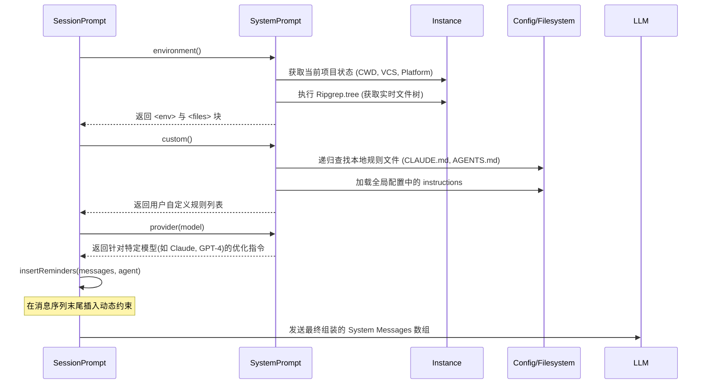

# Agent 设计与实现 (Agent Design)

Agent 是 OpenCode 的核心执行单元，负责理解用户意图并执行操作。

## 1.1 Agent 定义 (`Agent.Info`)

Agent 的配置结构定义在 `packages/opencode/src/agent/agent.ts` 中：

```typescript
// packages/opencode/src/agent/agent.ts:18
export namespace Agent {
  export const Info = z.object({
    name: z.string(),
    mode: z.enum(["subagent", "primary", "all"]), // Agent 类型
    permission: z.object({ ... }),                // 权限配置
    tools: z.record(z.string(), z.boolean()),     // 启用/禁用的工具
    model: z.object({ ... }).optional(),          // 绑定模型
    prompt: z.string().optional(),                // 系统提示词
    // ...
  })
}
```

## 1.2 权限系统 (Permission System)

OpenCode 实现了细粒度的权限控制，默认策略通过 `mergeAgentPermissions` 函数进行合并 (`packages/opencode/src/agent/agent.ts:333`)。

- **edit**: 默认为 `allow`。
- **webfetch**: 默认为 `allow`。
- **bash**: 支持对特定命令的精细控制。
    - `allow`: 允许执行 (如 `ls`, `git status`, `grep`)。
    - `ask`: 需要用户确认 (如 `find -delete`, `rm` 等高危操作)。
    - `deny`: 禁止执行。

## 1.3 内置 Agent (Built-in Agents)

OpenCode 预置了多个 Agent 以应对不同场景 (`packages/opencode/src/agent/agent.ts:117`)：

| Agent Name | Mode | Description | Prompt Source |
| :--- | :--- | :--- | :--- |
| **build** | primary | 默认 Agent，用于构建和通用编码任务。 | Default |
| **plan** | primary | 用于生成任务计划，具有更严格的 Bash 权限。 | Default |
| **explore** | subagent | 专注于代码库探索，使用 `grep`, `ls` 等工具。 | `packages/opencode/src/agent/prompt/explore.txt` |
| **general** | subagent | 通用研究 Agent，并行执行任务。 | - |
| **compaction**| primary | (Hidden) 用于上下文压缩。 | `packages/opencode/src/agent/prompt/compaction.txt` |
| **title** | primary | (Hidden) 生成会话标题。 | `packages/opencode/src/agent/prompt/title.txt` |
| **summary** | primary | (Hidden) 生成会话摘要。 | `packages/opencode/src/agent/prompt/summary.txt` |

## 1.4 Slash Commands & 命令执行流程

Slash Commands 是用户与 Agent 交互的快捷方式，定义在 `packages/opencode/src/command/index.ts` 中。它们通过预定义的模板、模型和 Agent 配置来简化复杂任务。

### 1.4.1 命令列表与 Agent 映射

Slash Commands 分为 **内置命令**、**静态命令** 和 **自定义命令 (Markdown)**。

| 类型 | 命令 | 描述 | 关联 Agent | 备注 |
| :--- | :--- | :--- | :--- | :--- |
| **内置** | `/undo` | 撤销上一步操作 | - | 由 TUI 直接处理 |
| **内置** | `/redo` | 重做上一步操作 | - | 由 TUI 直接处理 |
| **内置** | `/share` | 分享当前会话 | - | 生成分享链接 |
| **内置** | `/help` | 显示帮助信息 | - | 列出所有可用命令 |
| **静态** | `/init` | 初始化项目配置 | 默认 Agent | 使用 `initialize.txt` 模板 |
| **静态** | `/review` | 审查代码变更 | 默认 Agent | 使用 `review.txt` 模板 |
| **Markdown** | `/commit` | Git 提交并推送 | 默认 Agent | 指定模型: `opencode/glm-4.6` |
| **Markdown** | `/issues` | 在 GitHub 上查找相关 Issue | 默认 Agent | 指定模型: `opencode/haiku-4-5` |
| **Markdown** | `/rmslop` | 移除 AI 生成的冗余代码 | 默认 Agent | 清理 Code Slop |
| **Markdown** | `/spellcheck`| Markdown 拼写/语法检查 | 默认 Agent | 针对文档优化 |

*注：*
1.  *Markdown 命令定义在 `.opencode/command/*.md` 中，文件名即为命令名。*
2.  *如果命令未显式指定 `agent`，则默认使用当前会话的 Agent 或系统默认 Agent (`build`)。*
3.  *`subtask: true` 的命令（如 `/review`）会启动一个独立的子任务流，不污染主会话上下文。*

### 1.4.2 命令处理逻辑 (`SessionPrompt.command`)

当用户输入 `/` 开头的命令时，处理流程如下：
1.  **解析**：解析命令名和参数。
2.  **模板渲染**：将命令对应的模板（如 `review.txt`）注入上下文。
3.  **任务执行**：
    -   如果是内置命令（如 `/undo`），直接修改会话状态。
    -   如果是任务类命令（如 `/review`），通常会调用 `TaskTool` 启动一个子任务流。

### 1.4.3 委派核心：TaskTool

`TaskTool` 是主 Agent 实现复杂任务委派的核心机制。它通过启动专门的 **Subagent (子 Agent)** 来分担工作量。

- **`description`**: 任务简述（用于 UI 显示）。
- **`prompt`**: 给子 Agent 的具体指令。
- **`subagent_type`**: 指定子 Agent 类型（`general` 或 `explore`）。

## 1.5 编排哲学：主 Agent 与子 Agent 的辩证关系 (Architectural Insights)

这是 OpenCode 架构中最精妙的设计之一。主从 Agent 之间的关系可以类比为 **“总承包商”与“专业分包商（全能工兵）”**。虽然它们共享相同的代码基础，但在角色定位、可见性和任务边界上有着本质的区别。

### 1.5.1 核心关系：委派与封装 (Delegation & Encapsulation)

- **主 Agent 是“调度中心”**：它直接面对用户，负责理解高层意图、制定全局规划，并决定何时需要“外包”任务。
- **子 Agent (如 `general`) 是“执行单元”**：它是一个被**封装在工具调用中**的 Agent。主 Agent 不会直接告诉用户“我要怎么做”，而是调用 `TaskTool(subagent_type="general")`。

### 1.5.2 核心差异对比

| 维度 | 主 Agent (Primary/Build) | 子 Agent (Subagent/General) |
| :--- | :--- | :--- |
| **用户感知/可见性** | **直接对话者**。它的思考过程、流式输出直接展示在主聊天窗口。 | **幕后执行者（半透明）**。详细思考过程被隔离在子 Session 中，主窗口通常只显示进度条。 |
| **上下文管理** | **长效记忆/长周期**。持有会话全生命周期的语义上下文。 | **瞬时上下文/任务态**。仅持有当前子任务相关的局部上下文，任务结束即销毁。 |
| **控制权限** | **决策中心/策略驱动**。决定是否调用其他 Agent，根据配置执行 `allow/ask/deny`。 | **执行中心/继承受限**。专注于工具调用，继承主 Agent 权限，但禁止递归委派，敏感操作需主 Agent 确认。 |
| **工具访问** | 拥有 `TaskTool`，可以启动和管理其他 Agent。 | 通常不配置 `TaskTool`，专注于原子操作，防止陷入无限递归循环。 |

### 1.5.3 协作机制：为什么需要分层架构？

在 OpenCode 的设计中，主 Agent 并不直接执行所有任务，而是通过 `TaskTool` 委派给子 Agent。这种设计体现了以下核心架构思想：

1. **副作用隔离 (Side-effect Isolation)**：
   - 子 Agent 的复杂思考日志和中间过程被封装在子会话中，防止“信息噪声”干扰主干逻辑。
   - **错误回滚 (Error Containment)**：如果子 Agent 在执行复杂的重构时把代码改乱了，它只会弄脏自己的子 Session 历史。主 Agent 收到失败信号后，可以决定重试或放弃，而主会话的上下文依然是“干净”的。

2. **并发执行 (Concurrency & Parallel Execution)**：
   - 主 Agent 可以同时启动多个子 Agent 处理不同模块（例如同时修改三个不相关的模块），显著提升任务响应效率。

3. **Token 经济学与注意力优化**：
   - **局部上下文**：子 Agent 只需要关注那一小块代码。避免了主 Agent 亲自执行细碎任务时背负过重的上下文历史，减少了输入 Token 消耗，同时也避免了模型因注意力分散导致的幻觉。

## 1.6 进阶机制：高可用 Agent 的深度工程实践 (Advanced Mechanisms)

除了基础的编排外，OpenCode 在 Agent 的稳定性、扩展性和上下文管理上有着极其深厚的工程沉淀。

### 1.6.1 智能上下文经济：Compaction 自动压缩机制

在长对话场景下，LLM 的上下文窗口溢出是不可避免的工程挑战。OpenCode 并没有采用简单的“物理截断”策略，而是实现了一套**基于语义理解的自我进化机制**。

- **隐式 Compaction Agent**：系统内置了一个 `hidden: true` 的 `compaction` Agent。当 Token 消耗接近阈值时，系统会静默启动该 Agent。
- **语义剪枝与重构**：该 Agent 会对历史消息进行深度分析，提取出关键的决策路径、已尝试的方案以及当前确定的状态，生成一份“语义快照”并替换掉冗长的历史消息。
- **架构价值**：这种设计将“系统维护任务”也抽象为一种 Agent 行为。它确保了 Agent 在经过数百轮迭代后，依然能背负着轻量且高质量的上下文进行决策。

### 1.6.2 动态工具沙箱与多级解析 (Dynamic Tool Sandboxing)

OpenCode 的工具绑定逻辑 (`resolveTools`) 采用了类似 CSS 选择器的多级覆盖与隔离策略：

- **三级合并策略**：系统最终的工具清单是由 `Agent 预设配置`、`Tool Registry 全局状态` 以及 `Session 运行时临时调整` 三层逻辑深度合并（`mergeDeep`）而成的。
- **通配符权限控制**：支持如 `mcp_server_*` 的通配符模式，允许开发者一键对特定前缀的所有工具进行权限降级或启用。
- **生命周期 Hook 注入**：通过 `tool.execute.before/after` 插件钩子，实现了在不侵入工具逻辑的前提下，进行全量审计、性能打点和输入校验。

### 1.6.3 “人在回路”的稳健状态机 (HITL State Machine)

OpenCode 的 `SessionProcessor` 将工具调用从简单的“同步执行”重构为了一个复杂的“异步状态流”：

- **半透明执行状态**：当执行高耗时工具（如网络抓取或大规模搜索）时，Agent 会实时推送 `status: "running"` 以及动态元数据（Metadata），让用户在前端能感知到 Agent 思考的每一步细节。
- **拦截器式错误注入**：如果用户在权限弹窗中点击“拒绝”，系统会将此行为转化为一个特定的 `Permission.RejectedError` 注入上下文。Agent 不会崩溃，而是会理解为“该路径已被封锁”，从而自动切换备选策略。
- **架构价值**：这体现了将**“交互反馈”视为模型输入**的先进设计思想，极大地提升了系统在生产环境中的鲁棒性。

### 1.6.4 提示词的“三明治”动态组装架构 (Dynamic Prompt Assembly)

OpenCode 的 System Prompt 不是静态的字符串，而是一个实时生成的动态流水线。这种设计确保了 Agent 能够精准适配不同模型厂商、项目环境和用户自定义规则。

#### 1.6.4.1 核心设计：多维组装流水线

System Prompt 的生成是一个由 `SystemPrompt` 命名空间驱动的、具有四个维度的组装流程：

1.  **Provider 特化层 (Provider Adapting)**：针对不同模型厂商（如 Anthropic, OpenAI, Gemini）注入特定的系统指令，以获得最佳的工具调用和逻辑推理表现。
2.  **环境感知层 (Environment Awareness)**：通过 `SystemPrompt.environment` 动态抓取当前的 OS、工作目录、Git 状态和实时文件树（File Tree），为 Agent 提供“空间感”。
3.  **用户规则层 (Custom Rules)**：通过 `SystemPrompt.custom` 自动从项目根目录（如 `CLAUDE.md`, `AGENTS.md`）或全局配置中加载用户自定义的约束。
4.  **运行时提醒层 (Runtime Reminders)**：在对话流末尾通过 `insertReminders` 动态插入高优先级指令，有效防止长对话中的“注意力漂移”。

#### 1.6.4.2 UML 序列图：动态生成流程



#### 1.6.4.3 关键实现细节

- **环境感知 (`SystemPrompt.environment`)**：通过 `Ripgrep.tree` 实时扫描当前文件目录（通常限额 200 个文件），让 Agent 知道自己运行的上下文，避免其幻觉出不存在的文件。
- **规则自动发现 (`SystemPrompt.custom`)**：系统会沿着文件树向上递归查找规则文件。这种设计允许开发者通过简单的 Markdown 文件直接“驯化” Agent，而无需改动核心代码。
- **模型微码优化 (`SystemPrompt.provider`)**：内置了 `PROMPT_BEAST` (针对 GPT-4 优化), `PROMPT_ANTHROPIC` (针对 Claude 优化) 等模板，确保在不同 Provider 间切换时，工具调用的 schema 描述和语气保持最优。

---

> **教授箴言**
>
> “在 AI 系统设计中，**‘静态即衰减，动态即力量’**。一个优秀的 System Prompt 架构应该像一个**动态加载的操作系统内核**：它必须感知底层硬件环境（Environment）、遵循用户协议（Custom Rules）、并针对特定的处理器指令集（Model Provider）进行微码优化。这种‘分层组装’的思想，是构建具备‘生产级稳定性’智能体的必经之路。”

**具体的代码映射：**
- 组装入口：[../../packages/opencode/src/session/prompt.ts:242](../../packages/opencode/src/session/prompt.ts#L242) 中的 `process` 循环。
- 实现逻辑：[../../packages/opencode/src/session/system.ts:21](../../packages/opencode/src/session/system.ts#L21)。
- 动态提醒：[../../packages/opencode/src/session/prompt.ts:1004](../../packages/opencode/src/session/prompt.ts#L1004) 中的 `insertReminders` 函数。
- 压缩逻辑：[../../packages/opencode/src/session/compaction.ts:18](../../packages/opencode/src/session/compaction.ts#L18)。
- 工具解析：[../../packages/opencode/src/session/prompt.ts:572](../../packages/opencode/src/session/prompt.ts#L572) 中的 `resolveTools` 函数。
- 状态处理：[../../packages/opencode/src/session/processor.ts:17](../../packages/opencode/src/session/processor.ts#L17)。

