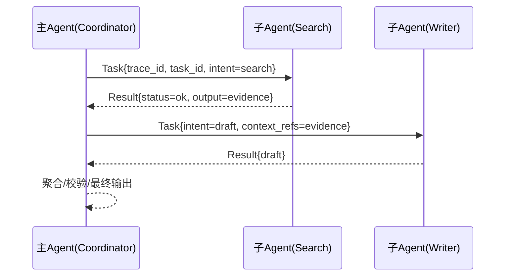
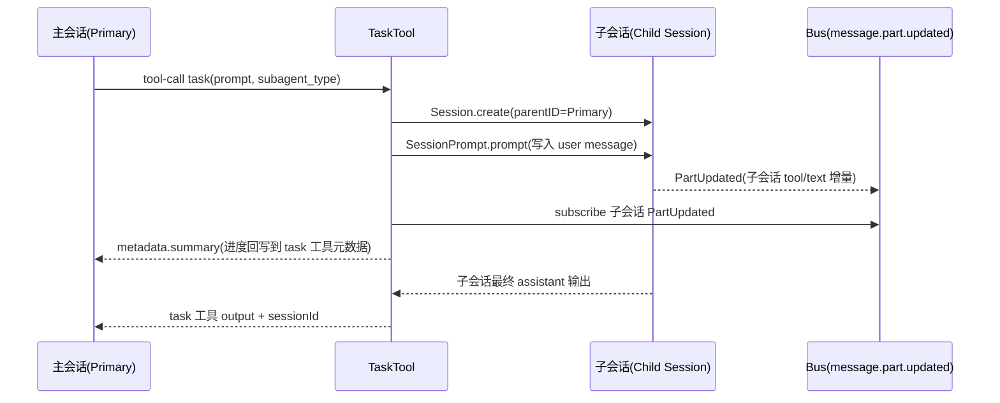
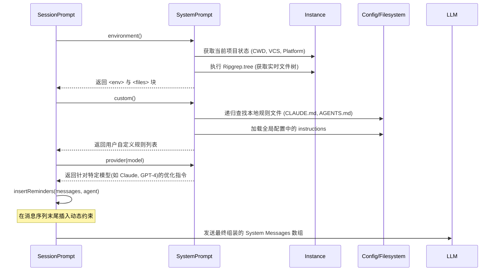

# Agent 设计与实现 (Agent Design)

Agent 是 OpenCode 的核心执行单元，负责理解用户意图并执行操作。

## 阅读指引

- 如果你想了解“Agent 是什么、怎么被约束”：先读「1.1 Agent 定义」与「1.2 权限系统」。
- 如果你想了解“有哪些内置 Agent、如何合成注册表”：读「1.3 内置 Agent」。
- 如果你想了解“命令如何驱动 Agent 执行”：读「1.4 Slash Commands」。
- 如果你想了解“主从 Agent 为什么要分层”：读「1.5 编排哲学」。
- 如果你想了解“生产级工程化机制”：读「1.6 进阶机制」。

## 1.1 Agent 定义 (`Agent.Info`)

Agent 的配置结构定义在 `packages/opencode/src/agent/agent.ts` 中：

```typescript
// packages/opencode/src/agent/agent.ts:18
export namespace Agent {
  export const Info = z.object({
    name: z.string(),
    mode: z.enum(["subagent", "primary", "all"]), // Agent 类型
    permission: z.object({ ... }),                // 权限配置
    tools: z.record(z.string(), z.boolean()),     // 启用/禁用的工具
    model: z.object({ ... }).optional(),          // 绑定模型
    prompt: z.string().optional(),                // 系统提示词
    // ...
  })
}
```

在实现层面，`Agent.Info` 可以理解为“四件套”，用来把一个 Agent 变成可被运行时编排/约束的实体：

| 维度 | 字段 | 作用 | 典型问题 | 代码映射 |
| :--- | :--- | :--- | :--- | :--- |
| **Persona（角色）** | `prompt` / `description` / `color` | 定义“我是谁、怎么说话、偏好什么策略” | 这个 Agent 的定位与口径是否稳定？ | `packages/opencode/src/agent/agent.ts` |
| **Tools（能力）** | `tools` | 定义“能调用哪些工具”（白名单/开关） | 是否能用 `bash/read/edit/task`？ | `SessionPrompt.resolveTools` |
| **Permission（边界）** | `permission` | 定义“能做多危险的事”（allow/ask/deny） | 哪些命令需要用户确认？ | `tool/bash.ts` / `tool/skill.ts` |
| **Limits（刹车）** | `maxSteps` | 定义“最多允许多少轮 agentic 迭代” | 是否会发散/死循环？ | `session/prompt.ts` |

> 关键点：`tools` 是“能不能用某类工具”的开关；`permission` 是“用得有多放得开”的策略。两者是正交的。

补充几个容易忽略但很重要的字段：

- `native` / `hidden` / `default`：用于 UI 展示、是否内置、是否可作为默认主 Agent（默认 Agent 不允许是 subagent）。
- `temperature` / `topP`：模型采样策略，可用于区分“稳健执行型（低温）”与“发散探索型（高温）”。
- `options`：为未来扩展预留的“配置扩展槽”。

<details>
<summary>附：一次讲解草稿与生成记录（保留原文，便于追溯）</summary>

#### 生成记录（工具输出，原样保留）

```text
toolName: todo_write
            
status: success
          
Todos updated: 3 items
          

        
            
toolName: search_codebase
            
status: success
          
query: agent.ts 的整体设计与职责：agent 生命周期、plan/act/review，工具调用与消息编排
          

        
            
toolName: search_codebase
            
status: success
          
query: 查找 agents.ts 或 agent 相关的运行时执行逻辑（step loop、tool calling、permissions enforcement）
          

        
            
toolName: view_files
            
status: success
          
            
filePath: /Users/gavinzhang/ws-ai-recharge-2026/opencode/packages/opencode/src/agent/agent.ts
          

        
            
toolName: search_codebase
            
status: success
          
query: Agent.Info.permission/tools/maxSteps 在运行时如何被使用与校验（工具授权、step 限制、子代理调用）
          

        
            
toolName: view_files
            
status: success
          
            
filePath: /Users/gavinzhang/ws-ai-recharge-2026/opencode/packages/opencode/src/tool/registry.ts
          

        
            
toolName: search_codebase
            
status: success
          
query: Bash/Read/Edit 等工具调用时如何根据 Agent.permission.bash pattern 做 allow/ask/deny 判定
          

        
            
toolName: view_files
            
status: success
          
            
filePath: /Users/gavinzhang/ws-ai-recharge-2026/opencode/packages/opencode/src/tool/bash.ts
          

        
            
toolName: view_files
            
status: success
          
            
filePath: /Users/gavinzhang/ws-ai-recharge-2026/opencode/packages/opencode/src/config/config.ts
          

        
            
toolName: view_files
            
status: success
          
            
filePath: /Users/gavinzhang/ws-ai-recharge-2026/opencode/packages/opencode/src/session/prompt.ts
          

        
            
toolName: todo_write
            
status: failed
          
Todos updated: 0 items
          

        
            
toolName: todo_write
            
status: success
          
Todos updated: 3 items
          

        
            
toolName: todo_write
            
status: success
          
Todos updated: 3 items
          
```

#### 讲解草稿（原样保留）

你问的这个 `agents.ts`（仓库里实际对应的是 [agent.ts](file:///Users/gavinzhang/ws-ai-recharge-2026/opencode/packages/opencode/src/agent/agent.ts)）属于典型的 **AI Agent 系统里的“配置注册中心 + 策略拼装层”**：它不负责“推理/执行循环”，而是把“有哪些 agent、每个 agent 用什么模型/提示词/工具/权限/步数上限”这些策略统一组装成一份可被运行时消费的结构。

先用两问帮你定位学习重点（你不用回答，我会两条线都讲）：  
- 你更关心“怎么新增/分发 agent（配置层）”，还是“怎么做权限隔离与工具调用安全（运行时）”？  
- 你希望 agent 更像“编译型（流程更固定、强约束）”，还是“解释型（更自由、动态规划）”？这个文件明显偏“编译型”的配置治理。

---

## **一眼看穿 agent.ts 的职责边界**
`Agent` 命名空间里主要做 3 件事：

1) **定义 Agent 的“契约”**（Schema + Type）  
- 用 zod 定义 `Agent.Info`：name/mode/model/prompt/tools/permission/maxSteps/options…（[agent.ts:L18-L52](file:///Users/gavinzhang/ws-ai-recharge-2026/opencode/packages/opencode/src/agent/agent.ts#L18-L52)）  
- 这里的 `.meta({ ref: "Agent" })` 也暗示它会被用于 API schema 生成（在 server 里可以看到 `/agent` 用它做响应 schema）。

2) **把“内置 agent + 用户配置 agent”合成最终注册表**  
- `state = Instance.state(async () => { ... })` 生成一个 `Record<string, Info>`（[agent.ts:L54-L278](file:///Users/gavinzhang/ws-ai-recharge-2026/opencode/packages/opencode/src/agent/agent.ts#L54-L278)）  
- 内置的：`build/plan/general/explore/compaction/title/summary`  
- 用户配置：来自 `cfg.agent`（后面会被 merge/override/disable）

3) **提供读取接口 + 生成器**  
- `get/list/defaultAgent()`：运行时只需要问注册表要信息（[agent.ts:L280-L292](file:///Users/gavinzhang/ws-ai-recharge-2026/opencode/packages/opencode/src/agent/agent.ts#L280-L292)）  
- `generate()`：用模型生成一份“新 agent 配置 JSON”（[agent.ts:L294-L330](file:///Users/gavinzhang/ws-ai-recharge-2026/opencode/packages/opencode/src/agent/agent.ts#L294-L330)）

---

## **核心设计：把“Agent”拆成 Persona / Tools / Permission / Limits 四层**
你可以把 `Agent.Info` 看成“四件套”，每一套都支持 override：

1) **Persona（prompt/description/color）**  
- 内置 `explore/compaction/title/summary` 直接绑定提示词文件（例如 [agent.ts:L150-L166](file:///Users/gavinzhang/ws-ai-recharge-2026/opencode/packages/opencode/src/agent/agent.ts#L150-L166)）  
- 用户 agent 的 prompt 通常来自 markdown 文件正文：配置加载在 [config.ts:L226-L266](file:///Users/gavinzhang/ws-ai-recharge-2026/opencode/packages/opencode/src/config/config.ts#L226-L266)

2) **Tools（工具开关是“白名单/总开关”）**  
- `tools: Record<string, boolean>` 用 `Wildcard.all()` 做匹配启用（运行时合并逻辑见 [prompt.ts:L572-L588](file:///Users/gavinzhang/ws-ai-recharge-2026/opencode/packages/opencode/src/session/prompt.ts#L572-L588)）  
- 合并顺序很关键：  
  `agent.tools` → 根据 permission 派生的禁用项 → 用户本次对话临时 tools 覆盖（`lastUser.tools`）

3) **Permission（权限是“策略引擎”而不是简单布尔）**  
- 粗粒度：ToolRegistry 会根据 permission 直接禁用某些工具（比如 `edit=deny` 则 edit/write 直接关掉，[registry.ts:L140-L161](file:///Users/gavinzhang/ws-ai-recharge-2026/opencode/packages/opencode/src/tool/registry.ts#L140-L161)）  
- 细粒度：工具内部再做“allow/ask/deny”判定：  
  - bash 会解析命令 AST，再按 `permission.bash` 的通配规则判定（[bash.ts:L84-L196](file:///Users/gavinzhang/ws-ai-recharge-2026/opencode/packages/opencode/src/tool/bash.ts#L84-L196)）  
  - skill 同样按 `permission.skill` 做 allow/ask/deny（[skill.ts:L31-L58](file:///Users/gavinzhang/ws-ai-recharge-2026/opencode/packages/opencode/src/tool/skill.ts#L31-L58)）

4) **Limits（maxSteps 是“防发散保险丝”）**  
- `maxSteps` 到了之后，系统会在 messages 里塞一个强约束 prompt（MAX_STEPS），迫使模型只能文本回复、不能再调工具（[prompt.ts:L473-L546](file:///Users/gavinzhang/ws-ai-recharge-2026/opencode/packages/opencode/src/session/prompt.ts#L473-L546)）

---

## **实现技巧 1：用 Instance.state 做“单次计算、到处复用”的注册表**
`Instance.state(async () => ...)` 相当于把“从磁盘/配置加载 + 合成”的成本缓存起来：  
- `Agent.get/list/defaultAgent` 都只是读缓存（[agent.ts:L280-L292](file:///Users/gavinzhang/ws-ai-recharge-2026/opencode/packages/opencode/src/agent/agent.ts#L280-L292)）  
- 这避免了每次 prompt 都重新 parse/merge 一遍 agent 配置，属于工程化 Agent 系统非常关键的一步（减少抖动、降低延迟、保持一致性）。

你可以自检一下：如果不用缓存，每次会话 step 都读配置，会发生什么？（性能、热更新一致性、线程安全）

---

## **实现技巧 2：权限 merge 的“规范化 + 默认兜底”**
`mergeAgentPermissions()` 做了两件很工程化的事（[agent.ts:L333-L397](file:///Users/gavinzhang/ws-ai-recharge-2026/opencode/packages/opencode/src/agent/agent.ts#L333-L397)）：

- **输入规范化**：允许 `bash`/`skill` 写成字符串（等价全局），也允许写成 map；函数会把 string 统一转成 `{ "*": value }`。  
- **默认兜底**：merge 后如果是对象，会再补一个默认 `{"*":"allow"}`，避免用户只写了局部规则导致“其它全变成 undefined 行为”。

这类技巧本质是在做“配置 DSL 的容错与向后兼容”，是 Agent 系统长期演进的关键。

---

## **实现技巧 3：plan agent 的权限配置是“安全探索”模板**
`plan` 这个内置 agent 特别值得学：  
- `edit: deny`，避免一上来就改文件  
- `bash` 允许大量“只读/低风险”命令（ls/rg/git diff 等），其它默认 `ask`（[agent.ts:L71-L115](file:///Users/gavinzhang/ws-ai-recharge-2026/opencode/packages/opencode/src/agent/agent.ts#L71-L115)）

对应到 Agent 架构模式：这是在把“探索/规划”阶段做成一个 **低权限解释型环节**，而把“执行/修改”留给高权限 agent（例如 build）。这能显著降低“模型一冲动就破坏仓库”的风险。

---

## **扩展与重构建议（不改代码也能立刻用）**
- **新增自定义 agent 的最短路径**：在 `agent/**/*.md` 放一个带 frontmatter 的文件；Config 会把正文当 prompt，把 frontmatter 当配置（[config.ts:L226-L266](file:///Users/gavinzhang/ws-ai-recharge-2026/opencode/packages/opencode/src/config/config.ts#L226-L266)）。  
- **把 Agent 设计成“角色 = prompt，能力 = tools，边界 = permission，刹车 = maxSteps”**：任何新 agent 先按这四块写清楚，后面基本不会乱。  
- **避免过度设计的信号**：如果你发现新增 agent 只是换个 prompt，但 tools/permission/maxSteps 都一样，优先考虑“模式参数化”（mode/options）而不是再加一个 agent。

---

## **给你的挑战练习（5 分钟）**
画一个简化交互图（Mermaid 即可）回答：  
- “一次用户 prompt 进来后，Agent.Info 是怎么影响 tools 是否可用、bash 是否 ask、以及 maxSteps 如何截断的？”  
提示：沿着 [agent.ts](file:///Users/gavinzhang/ws-ai-recharge-2026/opencode/packages/opencode/src/agent/agent.ts) → [prompt.ts](file:///Users/gavinzhang/ws-ai-recharge-2026/opencode/packages/opencode/src/session/prompt.ts) → [registry.ts](file:///Users/gavinzhang/ws-ai-recharge-2026/opencode/packages/opencode/src/tool/registry.ts) → [bash.ts](file:///Users/gavinzhang/ws-ai-recharge-2026/opencode/packages/opencode/src/tool/bash.ts) 这条链走。

如果你把图贴出来，我会按“坏味道侦察兵”的方式指出一个最关键的可维护性改进点。

</details>

## 1.2 权限系统 (Permission System)

OpenCode 实现了细粒度的权限控制，默认策略通过 `mergeAgentPermissions` 函数进行合并 (`packages/opencode/src/agent/agent.ts:333`)。

- **edit**: 默认为 `allow`。
- **webfetch**: 默认为 `allow`。
- **bash**: 支持对特定命令的精细控制。
    - `allow`: 允许执行 (如 `ls`, `git status`, `grep`)。
    - `ask`: 需要用户确认 (如 `find -delete`, `rm` 等高危操作)。
    - `deny`: 禁止执行。

## 1.3 内置 Agent (Built-in Agents)

OpenCode 预置了多个 Agent 以应对不同场景 (`packages/opencode/src/agent/agent.ts:117`)：

| Agent Name | Mode | Description | Prompt Source |
| :--- | :--- | :--- | :--- |
| **build** | primary | 默认 Agent，用于构建和通用编码任务。 | Default |
| **plan** | primary | 用于生成任务计划，具有更严格的 Bash 权限。 | Default |
| **explore** | subagent | 专注于代码库探索，使用 `grep`, `ls` 等工具。 | `packages/opencode/src/agent/prompt/explore.txt` |
| **general** | subagent | 通用研究 Agent，并行执行任务。 | - |
| **compaction** | primary | (Hidden) 用于上下文压缩。 | `packages/opencode/src/agent/prompt/compaction.txt` |
| **title** | primary | (Hidden) 生成会话标题。 | `packages/opencode/src/agent/prompt/title.txt` |
| **summary** | primary | (Hidden) 生成会话摘要。 | `packages/opencode/src/agent/prompt/summary.txt` |

### 1.3.1 Agent 注册表：合成与覆盖顺序

OpenCode 并不是把 Agent 写死在代码里，而是把它们统一汇聚到一个“注册表”（`Record<string, Agent.Info>`）中，运行时只读注册表。

合成策略可以概括为：

1. 读取全局配置：`cfg.tools` 作为默认工具集，`cfg.permission` 作为默认权限基线。
2. 生成两套权限：
    - `agentPermission`：用于大多数 Agent。
    - `planPermission`：用于 `plan`（更严格，默认 edit=deny，bash 以只读为主）。
3. 写入内置 Agent（`build/plan/...`）。
4. 合并用户自定义 Agent（`cfg.agent`）：
    - `disable: true` 会直接从注册表移除。
    - 其余字段按“内置默认 + 用户覆盖”合并；并在最后再叠加 `defaultTools`，确保配置一致性。
5. 计算默认 Agent：
    - 优先使用 `cfg.default_agent` 指定；但如果它是 subagent，则回退到 `build`。
    - 若没有任何 primary/all 的可用 Agent，会抛出配置错误，避免系统无可用执行者。

代码映射：

- 注册表构建：`packages/opencode/src/agent/agent.ts` 的 `state`（约 `L54-L278`）。
- 默认 Agent 选择：`defaultAgent` 与 `default` 标记（约 `L257-L267`）。

### 1.3.2 “plan/build” 的安全分层范式

`plan` 的权限设计非常适合作为生产系统的“安全探索模板”：

- `edit: deny`：规划阶段默认不允许改文件，避免“边想边改”带来的副作用。
- `bash: allow + ask + deny`：常见只读命令放行；高风险模式（如 `find -delete`）提升到 ask；其余未知命令默认 ask。

这种分层把一次复杂任务拆成两种不同风格的 Agent：

- **解释型探索（plan）**：自由生成方案，但低权限、低副作用。
- **编译型执行（build）**：在确认方案后执行变更，权限更完整。

这也是 OpenCode 在“灵活性 vs 可控性”之间做的核心权衡。

## 1.4 Slash Commands & 命令执行流程

Slash Commands 是用户与 Agent 交互的快捷方式，定义在 `packages/opencode/src/command/index.ts` 中。它们通过预定义的模板、模型和 Agent 配置来简化复杂任务。

### 1.4.1 命令列表与 Agent 映射

Slash Commands 分为 **内置命令**、**静态命令** 和 **自定义命令 (Markdown)**。

| 类型 | 命令 | 描述 | 关联 Agent | 备注 |
| :--- | :--- | :--- | :--- | :--- |
| **内置** | `/undo` | 撤销上一步操作 | - | 由 TUI 直接处理 |
| **内置** | `/redo` | 重做上一步操作 | - | 由 TUI 直接处理 |
| **内置** | `/share` | 分享当前会话 | - | 生成分享链接 |
| **内置** | `/help` | 显示帮助信息 | - | 列出所有可用命令 |
| **静态** | `/init` | 初始化项目配置 | 默认 Agent | 使用 `initialize.txt` 模板 |
| **静态** | `/review` | 审查代码变更 | 默认 Agent | 使用 `review.txt` 模板 |
| **Markdown** | `/commit` | Git 提交并推送 | 默认 Agent | 指定模型: `opencode/glm-4.6` |
| **Markdown** | `/issues` | 在 GitHub 上查找相关 Issue | 默认 Agent | 指定模型: `opencode/haiku-4-5` |
| **Markdown** | `/rmslop` | 移除 AI 生成的冗余代码 | 默认 Agent | 清理 Code Slop |
| **Markdown** | `/spellcheck`| Markdown 拼写/语法检查 | 默认 Agent | 针对文档优化 |

*注：*
1.  *Markdown 命令定义在 `.opencode/command/*.md` 中，文件名即为命令名。*
2.  *如果命令未显式指定 `agent`，则默认使用当前会话的 Agent 或系统默认 Agent (`build`)。*
3.  *`subtask: true` 的命令（如 `/review`）会启动一个独立的子任务流，不污染主会话上下文。*

### 1.4.2 命令处理逻辑 (`SessionPrompt.command`)

当用户输入 `/` 开头的命令时，处理流程如下：
1.  **解析**：解析命令名和参数。
2.  **模板渲染**：将命令对应的模板（如 `review.txt`）注入上下文。
3.  **任务执行**：
    -   如果是内置命令（如 `/undo`），直接修改会话状态。
    -   如果是任务类命令（如 `/review`），通常会调用 `TaskTool` 启动一个子任务流。

### 1.4.3 委派核心：TaskTool

`TaskTool` 是主 Agent 实现复杂任务委派的核心机制。它通过启动专门的 **Subagent (子 Agent)** 来分担工作量。

- **`description`**: 任务简述（用于 UI 显示）。
- **`prompt`**: 给子 Agent 的具体指令。
- **`subagent_type`**: 指定子 Agent 类型（`general` 或 `explore`）。

## 1.5 编排哲学：主 Agent 与子 Agent 的辩证关系 (Architectural Insights)

这是 OpenCode 架构中最精妙的设计之一。主从 Agent 之间的关系可以类比为 **“总承包商”与“专业分包商（全能工兵）”**。虽然它们共享相同的代码基础，但在角色定位、可见性和任务边界上有着本质的区别。

### 1.5.1 核心关系：委派与封装 (Delegation & Encapsulation)

- **主 Agent 是“调度中心”**：它直接面对用户，负责理解高层意图、制定全局规划，并决定何时需要“外包”任务。
- **子 Agent (如 `general`) 是“执行单元”**：它是一个被**封装在工具调用中**的 Agent。主 Agent 不会直接告诉用户“我要怎么做”，而是调用 `TaskTool(subagent_type="general")`。

### 1.5.2 核心差异对比

| 维度 | 主 Agent (Primary/Build) | 子 Agent (Subagent/General) |
| :--- | :--- | :--- |
| **用户感知/可见性** | **直接对话者**。它的思考过程、流式输出直接展示在主聊天窗口。 | **幕后执行者（半透明）**。详细思考过程被隔离在子 Session 中，主窗口通常只显示进度条。 |
| **上下文管理** | **长效记忆/长周期**。持有会话全生命周期的语义上下文。 | **瞬时上下文/任务态**。仅持有当前子任务相关的局部上下文，任务结束即销毁。 |
| **控制权限** | **决策中心/策略驱动**。决定是否调用其他 Agent，根据配置执行 `allow/ask/deny`。 | **执行中心/继承受限**。专注于工具调用，继承主 Agent 权限，但禁止递归委派，敏感操作需主 Agent 确认。 |
| **工具访问** | 拥有 `TaskTool`，可以启动和管理其他 Agent。 | 通常不配置 `TaskTool`，专注于原子操作，防止陷入无限递归循环。 |

### 1.5.3 协作机制：为什么需要分层架构？

在 OpenCode 的设计中，主 Agent 并不直接执行所有任务，而是通过 `TaskTool` 委派给子 Agent。这种设计体现了以下核心架构思想：

1. **副作用隔离 (Side-effect Isolation)**：
   - 子 Agent 的复杂思考日志和中间过程被封装在子会话中，防止“信息噪声”干扰主干逻辑。
   - **错误回滚 (Error Containment)**：如果子 Agent 在执行复杂的重构时把代码改乱了，它只会弄脏自己的子 Session 历史。主 Agent 收到失败信号后，可以决定重试或放弃，而主会话的上下文依然是“干净”的。

2. **并发执行 (Concurrency & Parallel Execution)**：
   - 主 Agent 可以同时启动多个子 Agent 处理不同模块（例如同时修改三个不相关的模块），显著提升任务响应效率。

3. **Token 经济学与注意力优化**：
   - **局部上下文**：子 Agent 只需要关注那一小块代码。避免了主 Agent 亲自执行细碎任务时背负过重的上下文历史，减少了输入 Token 消耗，同时也避免了模型因注意力分散导致的幻觉。

### 1.5.4 主子 Agent 之间如何通信：传输层与消息契约

在 OpenCode 中，主从 Agent 的“业务通信”通常被封装在一次 `TaskTool` 调用里：主 Agent 把任务描述与必要上下文交给子 Agent 执行，子 Agent 回传结构化结果，主 Agent 再决定是否继续、重试或聚合输出。

从更通用的工程视角看，主子 Agent 通信可以拆成两层：

1. **传输层（怎么送达）**：同进程调用、进程内事件总线、RPC、消息队列。
2. **消息契约（送什么内容）**：统一的任务/结果“信封”，保证可追踪、可重试、可演进。

#### 1.5.4.1 常见传输层

| 方式 | 典型形态 | 优点 | 代价 | 适用场景 |
| :--- | :--- | :--- | :--- | :--- |
| **同进程** | 函数调用 / 协程 / 子 Session | 低延迟、实现简单、共享上下文方便 | 隔离差、并发扩展受限、权限边界易混 | 单机、PoC、确定性强的编排 |
| **进程内事件总线** | Bus / EventEmitter / 内存 Pub/Sub | 低延迟、实现简单、天然适合进度推送 | 不持久化、不跨进程、断连即丢 | 单进程事件驱动、子任务进度回传 |
| **RPC** | HTTP/gRPC 调用子 Agent 服务 | 隔离强、易扩容、权限边界清晰 | 超时/重试/版本兼容要工程化治理 | 子能力独立部署、跨团队维护 |
| **异步消息** | 队列/事件总线（Kafka/RabbitMQ/SQS 等） | 削峰填谷、天然并行、失败可重放 | 链路更复杂、需要状态机与聚合 | 长耗时任务、多子 Agent 并行 |

> 直觉选型：流程确定、强可控优先选“同进程/RPC”；需要实时进度更新优先用“进程内事件总线”（单进程）；耗时长、并发高优先选“队列”。

#### 1.5.4.2 推荐的最小消息信封（Task Envelope）

无论走哪种传输层，建议把“任务”封装成统一结构，至少包含：可追踪的链路标识、可重试的幂等键、可控的截止时间、最小权限声明、以及上下文引用。

任务请求（主 Agent → 子 Agent）：

```json
{
  "task_id": "uuid",
  "parent_task_id": "uuid-or-null",
  "trace_id": "distributed-trace-id",
  "sender": "primary",
  "recipient": "search_agent",
  "intent": "search_and_summarize",
  "input": {
    "query": "...",
    "constraints": { "time_budget_ms": 8000 }
  },
  "context_refs": [
    { "type": "doc", "id": "kb:123" },
    { "type": "memory", "id": "mem:session:456" }
  ],
  "auth_scope": ["kb.read"],
  "idempotency_key": "uuid",
  "deadline_ms": 8000
}
```

结果响应（子 Agent → 主 Agent）：

```json
{
  "task_id": "uuid",
  "trace_id": "distributed-trace-id",
  "status": "ok",
  "output": { "answer": "...", "citations": [] },
  "tool_calls": [],
  "metrics": { "tokens": 1234, "latency_ms": 5321 }
}
```

关键字段的工程价值：

- `trace_id` / `task_id`：把一次主→子→主的链路串起来，便于排障与审计。
- `context_refs`：尽量“传引用不传全文”，避免上下文爆炸；需要时再按引用拉取。
- `auth_scope`：把权限最小化，避免“主 Agent 全权”外溢到所有子 Agent。
- `idempotency_key`：支撑重试与去重，避免重复副作用。
- `deadline_ms`：让超时成为协议的一部分，避免子 Agent 无限制运行。

#### 1.5.4.3 最小协作时序（编排 + 执行 + 聚合）



#### 1.5.4.4 OpenCode 的实现路径：TaskTool + 子 Session + Bus 事件流

OpenCode 并不把主子 Agent 通信实现为“两个独立进程互发消息”。它把“委派”封装成一次工具调用（`task`），并把子 Agent 的执行放进一个独立的子 Session 中运行。主会话通过事件订阅实时接收子会话的执行进度，最终以工具输出的形式拿到子 Agent 的结果。

关键代码入口：

- TaskTool：`packages/opencode/src/tool/task.ts`（[TaskTool](file:///Users/gavinzhang/ws-ai-recharge-2026/opencode/packages/opencode/src/tool/task.ts#L14-L135)）
- 会话循环与 subtask 执行：`packages/opencode/src/session/prompt.ts`（[SessionPrompt.loop](file:///Users/gavinzhang/ws-ai-recharge-2026/opencode/packages/opencode/src/session/prompt.ts#L230-L537)）
- 消息/部件事件：`packages/opencode/src/session/message-v2.ts`（[MessageV2.Event](file:///Users/gavinzhang/ws-ai-recharge-2026/opencode/packages/opencode/src/session/message-v2.ts#L383-L412)）
- 写入消息与触发事件：`packages/opencode/src/session/index.ts`（[Session.updatePart](file:///Users/gavinzhang/ws-ai-recharge-2026/opencode/packages/opencode/src/session/index.ts#L359-L380)）

#### 1.5.4.5 主 → 子：把任务“投递”到子会话

TaskTool 会创建或复用一个子 Session，并记录父子关系（`parentID`）：

- 创建/复用子 Session：见 [task.ts:L31-L44](file:///Users/gavinzhang/ws-ai-recharge-2026/opencode/packages/opencode/src/tool/task.ts#L31-L44)

随后 TaskTool 调用 `SessionPrompt.prompt`，在子 Session 中写入一条 user message（包含任务 prompt parts），再启动子 Session 的 loop 产出 assistant response：

- 启动子会话 prompt：见 [task.ts:L89-L108](file:///Users/gavinzhang/ws-ai-recharge-2026/opencode/packages/opencode/src/tool/task.ts#L89-L108)
- `SessionPrompt.prompt` 写入 user message 并进入 loop：见 [prompt.ts:L140-L152](file:///Users/gavinzhang/ws-ai-recharge-2026/opencode/packages/opencode/src/session/prompt.ts#L140-L152)

#### 1.5.4.6 子 → 主：通过事件订阅回传“进度”与“摘要”

子 Session 在运行过程中会持续写入 `MessageV2.Part`（例如 tool part 的 `running/completed/error` 状态）。每次写入都会触发 `message.part.updated` 事件：

- 事件定义：见 [message-v2.ts:L383-L412](file:///Users/gavinzhang/ws-ai-recharge-2026/opencode/packages/opencode/src/session/message-v2.ts#L383-L412)
- 事件发布点：见 [session/index.ts:L371-L379](file:///Users/gavinzhang/ws-ai-recharge-2026/opencode/packages/opencode/src/session/index.ts#L371-L379)

TaskTool 在父会话侧订阅这个事件，只关注“属于子 Session 的 tool part”，并把汇总写回父会话中该次 task 工具调用的 metadata，用于 UI 展示进度与跳转：

- 订阅并回写 summary：见 [task.ts:L55-L77](file:///Users/gavinzhang/ws-ai-recharge-2026/opencode/packages/opencode/src/tool/task.ts#L55-L77)

#### 1.5.4.7 子 → 主：把“最终结果”作为工具输出回传

子 Session 完成后，TaskTool 会拉取子 Session 消息，提取子 Agent 的最终文本输出并拼装为 task 工具的 output，同时把子 Session 的 `session_id` 写入输出元数据，便于后续继续执行或打开子会话：

- 汇总子会话工具摘要与文本输出：见 [task.ts:L109-L133](file:///Users/gavinzhang/ws-ai-recharge-2026/opencode/packages/opencode/src/tool/task.ts#L109-L133)

#### 1.5.4.8 额外触发入口：Slash Command 的 subtask part

除 LLM 直接调用 `task` 工具外，OpenCode 还支持在 Slash Command 执行时生成 `subtask` part（例如命令显式 `subtask: true`，或 agent 是 subagent 且未禁用）。随后 `SessionPrompt.loop` 会识别该 `subtask` 并自动执行 TaskTool。

- command 生成 `subtask` part：见 [prompt.ts:L1352-L1364](file:///Users/gavinzhang/ws-ai-recharge-2026/opencode/packages/opencode/src/session/prompt.ts#L1352-L1364)
- loop 执行 pending subtask（把 subtask 转成 task 工具调用并运行）：见 [prompt.ts:L288-L443](file:///Users/gavinzhang/ws-ai-recharge-2026/opencode/packages/opencode/src/session/prompt.ts#L288-L443)

#### 1.5.4.9 OpenCode 时序图：一次 task 子会话的真实消息流



#### 1.5.4.10 跨产品视角：Claude Code / Cursor 的父子协作如何传输信息

这一节用于把 OpenCode 的实现放到更广泛的“AI IDE/Agent 产品”谱系里对齐理解。这里仅基于公开资料总结其设计取向与常见实现形态。

| 产品 | 父子抽象 | 信息传输载体（概念层） | 典型回传内容 | 公开参考 |
| :--- | :--- | :--- | :--- | :--- |
| **Claude Code** | 显式 Subagents（Plan/Explore/General 等） | 委派执行（子代理在隔离上下文中运行）+ 结果聚合回传 | 只回传相关结论/证据与变更说明，支持恢复继续（agentId） | https://code.claude.com/docs/en/sub-agents |
| **Cursor** | 主要是单一 Agent + 工具回路；另有 Background Agents 异步形态 | tool call（工具入参/出参）+ UI 进度更新；Background Agents 更像后台作业系统 | 工具输出（搜索结果、终端输出、文件变更 diff/PR 等）；后台任务完成通知与产物 | https://docs.cursor.com/chat/agent ；https://docs.cursor.com/en/agent/tools ；https://docs.cursor.com/en/background-agent |

对齐到“传输层分类”的直觉：

- Claude Code 更接近“同一运行时内的子会话委派 + 事件驱动进度更新”，并提供可恢复的子代理标识。
- Cursor 在 Agent 模式下更像“单代理多工具”的 tool-call 回路；在 Background Agents 场景下更像“异步作业系统”的父子关系。

#### 1.5.4.11 可移植的字段设计：把父子通信抽象成 Task/Progress/Result

为了让“主子协作”可复用并能在不同传输层上迁移，建议把通信拆成 3 类消息：TaskRequest（下发）、TaskProgress（进度）、TaskResult（回包）。

##### 1.5.4.11.1 TaskRequest（主 → 子）建议字段

| 字段 | 作用 | 备注 |
| :--- | :--- | :--- |
| `trace_id` | 跨任务/跨工具的全链路追踪 | 一次用户请求建议共用一个 trace |
| `task_id` | 子任务唯一标识 | 幂等键常可复用 `task_id` |
| `parent_task_id` | 形成任务树/依赖关系 | 支持并行与聚合 |
| `agent` | 子 Agent 类型/名称 | 如 `general`/`explore` |
| `intent` | 意图/路由标签 | 便于统计、审计与策略路由 |
| `input` | 结构化输入参数 | 避免纯文本不可控 |
| `context_refs` | 上下文引用（传引用不传全文） | file/symbol/doc/memory 等 |
| `attachments` | 输入侧工件引用 | 如压缩包、截图、日志 |
| `capabilities` / `auth_scope` | 权限最小化与工具白名单 | 防越权与防递归委派 |
| `deadline_ms` | 截止时间/预算 | 超时成为协议的一部分 |
| `resume_token` | 恢复执行的标识 | 等价于 session_id/agentId |

##### 1.5.4.11.2 TaskProgress（子 → 主）建议字段

| 字段 | 作用 | 备注 |
| :--- | :--- | :--- |
| `trace_id` / `task_id` | 关联任务 | 必备 |
| `status` | `pending/running/completed/error` | 状态机的最小集合 |
| `events[]` | 结构化进度事件 | 常见为 tool-call 的状态变化 |
| `metrics` | 成本/耗时/Token | 支持预算控制与告警 |
| `partial_output` | 阶段性输出 | 避免一次性塞回全量过程 |

##### 1.5.4.11.3 TaskResult（子 → 主）建议字段

| 字段 | 作用 | 备注 |
| :--- | :--- | :--- |
| `trace_id` / `task_id` / `status` | 关联与结果状态 | 必备 |
| `output` | 最终结果（文本/结构化） | 建议同时支持结构化字段 |
| `attachments` | 子任务产物 | 如生成的文件、图片、报告 |
| `patch` | 变更表示 | 文件列表 + diff 或 snapshot hash |
| `errors[]` | 可重试/不可重试错误 | 支持重试策略 |
| `provenance` | 证据/引用 | RAG/审计场景关键 |

##### 1.5.4.11.4 OpenCode 字段映射（实现对齐）

OpenCode 的字段落在 Session/Message/Part/ToolState 上，可按如下方式对齐理解：

| 抽象字段 | OpenCode 对应 | 参考 |
| :--- | :--- | :--- |
| `resume_token` | `session_id`（TaskTool 参数） / 子 Session `session.id` | [TaskTool](file:///Users/gavinzhang/ws-ai-recharge-2026/opencode/packages/opencode/src/tool/task.ts#L24-L44) |
| `parent_task_id` | 子 Session 的 `parentID` | [TaskTool](file:///Users/gavinzhang/ws-ai-recharge-2026/opencode/packages/opencode/src/tool/task.ts#L40-L43) |
| `events[]` | `MessageV2.Event.PartUpdated` 事件流 | [MessageV2.Event](file:///Users/gavinzhang/ws-ai-recharge-2026/opencode/packages/opencode/src/session/message-v2.ts#L383-L412) |
| `status` | `ToolState`（running/completed/error） | [ToolState](file:///Users/gavinzhang/ws-ai-recharge-2026/opencode/packages/opencode/src/session/message-v2.ts#L268-L273) |
| `attachments` | `ToolStateCompleted.attachments` | [ToolStateCompleted](file:///Users/gavinzhang/ws-ai-recharge-2026/opencode/packages/opencode/src/session/message-v2.ts#L233-L250) |
| `patch` | `PatchPart` / snapshot patch | [PatchPart](file:///Users/gavinzhang/ws-ai-recharge-2026/opencode/packages/opencode/src/session/message-v2.ts#L52-L59) |
| `capabilities` | 子任务 tools 白名单收缩（禁用 task/todo* 等） | [TaskTool](file:///Users/gavinzhang/ws-ai-recharge-2026/opencode/packages/opencode/src/tool/task.ts#L100-L107) |

### 1.5.5 常见坑点与工程化保障

| 常见问题 | 典型症状 | 建议手段 |
| :--- | :--- | :--- |
| **上下文传太多** | Token 暴涨、响应变慢、幻觉增多 | `context_refs` + 按需拉取 + 局部摘要层 |
| **重试导致重复副作用** | 下单/写库执行多次 | 幂等键 + 去重表 + 外部动作“预检查→提交” |
| **权限边界不清** | 子 Agent 越权调用工具/读敏感数据 | capability-based 权限（`auth_scope`）+ 工具白名单 |
| **失败不可追溯** | 线上难复现、无法定位哪一步出错 | 全链路 `trace_id` + 结构化日志 + 关键指标打点 |
| **链路过度异步** | 结果迟到、聚合逻辑复杂 | 用状态机建模任务生命周期，明确超时与取消语义 |

## 1.6 进阶机制：高可用 Agent 的深度工程实践 (Advanced Mechanisms)

除了基础的编排外，OpenCode 在 Agent 的稳定性、扩展性和上下文管理上有着极其深厚的工程沉淀。

### 1.6.1 智能上下文经济：Compaction 自动压缩机制

在长对话场景下，LLM 的上下文窗口溢出是不可避免的工程挑战。OpenCode 并没有采用简单的“物理截断”策略，而是实现了一套**基于语义理解的自我进化机制**。

- **隐式 Compaction Agent**：系统内置了一个 `hidden: true` 的 `compaction` Agent。当 Token 消耗接近阈值时，系统会静默启动该 Agent。
- **语义剪枝与重构**：该 Agent 会对历史消息进行深度分析，提取出关键的决策路径、已尝试的方案以及当前确定的状态，生成一份“语义快照”并替换掉冗长的历史消息。
- **架构价值**：这种设计将“系统维护任务”也抽象为一种 Agent 行为。它确保了 Agent 在经过数百轮迭代后，依然能背负着轻量且高质量的上下文进行决策。

### 1.6.2 动态工具沙箱与多级解析 (Dynamic Tool Sandboxing)

OpenCode 的工具绑定逻辑 (`resolveTools`) 采用了类似 CSS 选择器的多级覆盖与隔离策略：

- **三级合并策略**：系统最终的工具清单是由 `Agent 预设配置`、`Tool Registry 全局状态` 以及 `Session 运行时临时调整` 三层逻辑深度合并（`mergeDeep`）而成的。
- **优先级直觉**：
  - `Agent.tools` 决定“默认开关”（比如 `explore` 关闭 `edit/write`）。
  - `ToolRegistry.enabled(agent)` 根据 `permission` 决定“强制禁用”（比如 `edit=deny` 会强制关掉 `edit/write`）。
  - `lastUser.tools` 决定“本轮会话临时覆盖”（例如用户临时关闭某工具）。
- **过滤规则**：最终是否启用某工具由 `Wildcard.all(toolId, enabledTools)` 决定，支持 `mcp_*` 这类前缀通配。
- **通配符权限控制**：支持如 `mcp_server_*` 的通配符模式，允许开发者一键对特定前缀的所有工具进行权限降级或启用。
- **生命周期 Hook 注入**：通过 `tool.execute.before/after` 插件钩子，实现了在不侵入工具逻辑的前提下，进行全量审计、性能打点和输入校验。

代码映射：

- 工具解析入口：`packages/opencode/src/session/prompt.ts` 中的 `resolveTools`（约 `L572` 起）。
- 权限驱动的工具强制禁用：`packages/opencode/src/tool/registry.ts` 的 `enabled`。

### 1.6.3 “人在回路”的稳健状态机 (HITL State Machine)

OpenCode 的 `SessionProcessor` 将工具调用从简单的“同步执行”重构为了一个复杂的“异步状态流”：

- **半透明执行状态**：当执行高耗时工具（如网络抓取或大规模搜索）时，Agent 会实时推送 `status: "running"` 以及动态元数据（Metadata），让用户在前端能感知到 Agent 思考的每一步细节。
- **拦截器式错误注入**：如果用户在权限弹窗中点击“拒绝”，系统会将此行为转化为一个特定的 `Permission.RejectedError` 注入上下文。Agent 不会崩溃，而是会理解为“该路径已被封锁”，从而自动切换备选策略。
- **架构价值**：这体现了将**“交互反馈”视为模型输入**的先进设计思想，极大地提升了系统在生产环境中的鲁棒性。

### 1.6.4 提示词的“三明治”动态组装架构 (Dynamic Prompt Assembly)

OpenCode 的 System Prompt 不是静态的字符串，而是一个实时生成的动态流水线。这种设计确保了 Agent 能够精准适配不同模型厂商、项目环境和用户自定义规则。

#### 1.6.4.1 核心设计：多维组装流水线

System Prompt 的生成是一个由 `SystemPrompt` 命名空间驱动的、具有四个维度的组装流程：

1.  **Provider 特化层 (Provider Adapting)**：针对不同模型厂商（如 Anthropic, OpenAI, Gemini）注入特定的系统指令，以获得最佳的工具调用和逻辑推理表现。
2.  **环境感知层 (Environment Awareness)**：通过 `SystemPrompt.environment` 动态抓取当前的 OS、工作目录、Git 状态和实时文件树（File Tree），为 Agent 提供“空间感”。
3.  **用户规则层 (Custom Rules)**：通过 `SystemPrompt.custom` 自动从项目根目录（如 `CLAUDE.md`, `AGENTS.md`）或全局配置中加载用户自定义的约束。
4.  **运行时提醒层 (Runtime Reminders)**：在对话流末尾通过 `insertReminders` 动态插入高优先级指令，有效防止长对话中的“注意力漂移”。

#### 1.6.4.2 UML 序列图：动态生成流程



#### 1.6.4.3 关键实现细节

- **环境感知 (`SystemPrompt.environment`)**：通过 `Ripgrep.tree` 实时扫描当前文件目录（通常限额 200 个文件），让 Agent 知道自己运行的上下文，避免其幻觉出不存在的文件。
- **规则自动发现 (`SystemPrompt.custom`)**：系统会沿着文件树向上递归查找规则文件。这种设计允许开发者通过简单的 Markdown 文件直接“驯化” Agent，而无需改动核心代码。
- **模型微码优化 (`SystemPrompt.provider`)**：内置了 `PROMPT_BEAST` (针对 GPT-4 优化), `PROMPT_ANTHROPIC` (针对 Claude 优化) 等模板，确保在不同 Provider 间切换时，工具调用的 schema 描述和语气保持最优。

---

> **教授箴言**
>
> “在 AI 系统设计中，**‘静态即衰减，动态即力量’**。一个优秀的 System Prompt 架构应该像一个**动态加载的操作系统内核**：它必须感知底层硬件环境（Environment）、遵循用户协议（Custom Rules）、并针对特定的处理器指令集（Model Provider）进行微码优化。这种‘分层组装’的思想，是构建具备‘生产级稳定性’智能体的必经之路。”

**具体的代码映射：**
- 组装入口：[../../packages/opencode/src/session/prompt.ts:242](../../packages/opencode/src/session/prompt.ts#L242) 中的 `process` 循环。
- 实现逻辑：[../../packages/opencode/src/session/system.ts:21](../../packages/opencode/src/session/system.ts#L21)。
- 动态提醒：[../../packages/opencode/src/session/prompt.ts:1004](../../packages/opencode/src/session/prompt.ts#L1004) 中的 `insertReminders` 函数。
- 压缩逻辑：[../../packages/opencode/src/session/compaction.ts:18](../../packages/opencode/src/session/compaction.ts#L18)。
- 工具解析：[../../packages/opencode/src/session/prompt.ts:572](../../packages/opencode/src/session/prompt.ts#L572) 中的 `resolveTools` 函数。
- 状态处理：[../../packages/opencode/src/session/processor.ts:17](../../packages/opencode/src/session/processor.ts#L17)。
