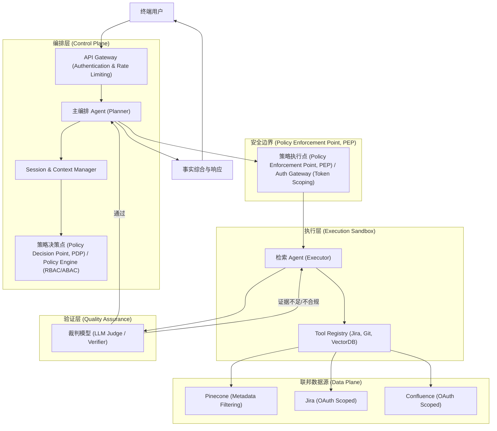
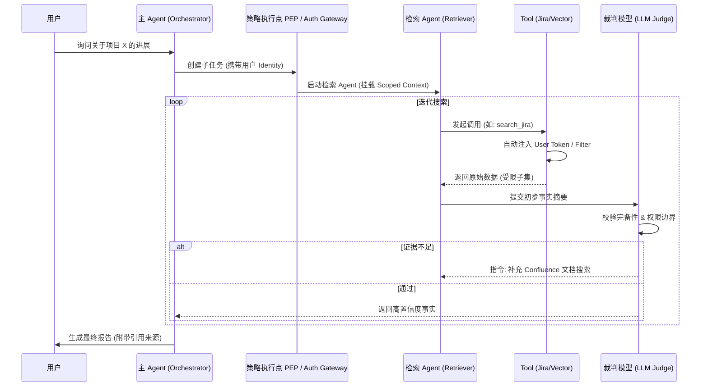
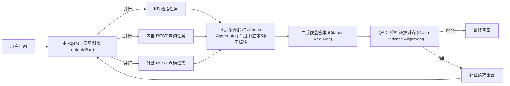
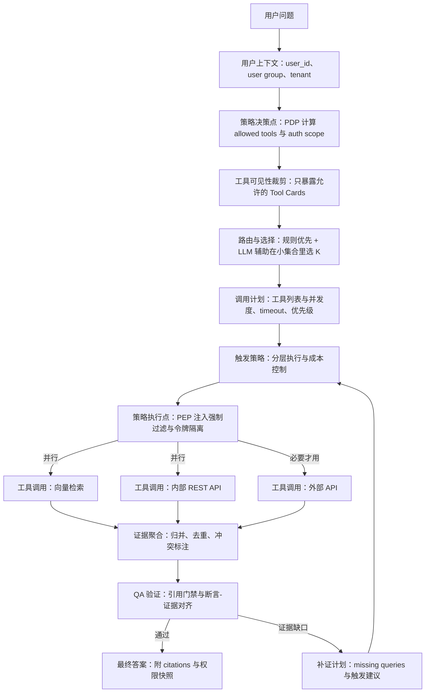
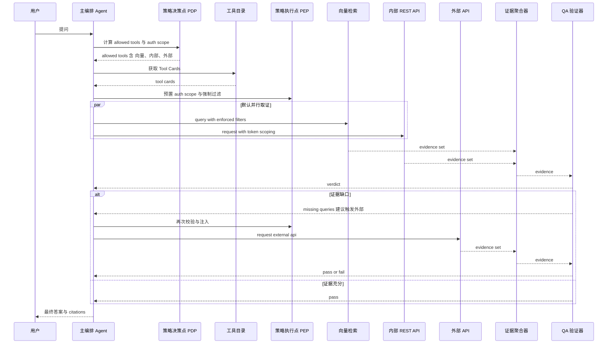
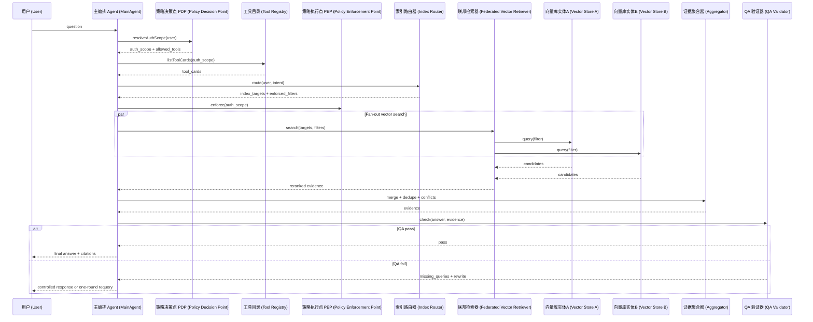
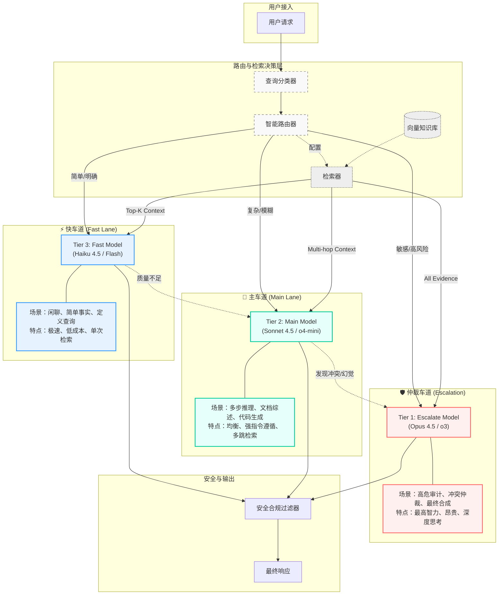
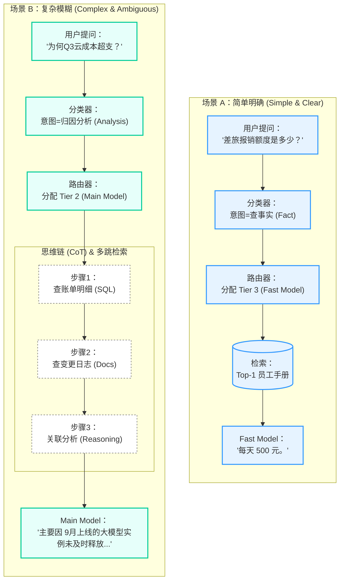
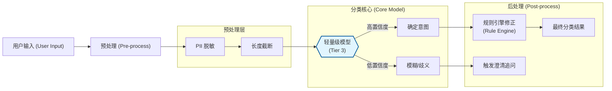
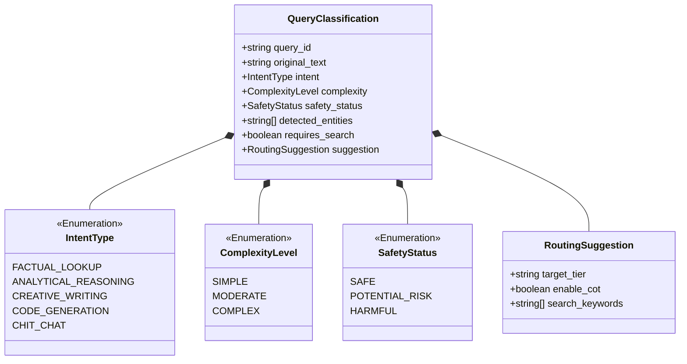

# 企业级 Agentic RAG 系统架构设计指南 (Enterprise Agentic RAG)

构建一个“企业级”的 Agentic RAG 系统，其核心挑战在于如何将 AI 的不确定性封装在严谨的工程治理体系内。以下是基于 OpenCode 架构演进的深度建议。

---

## 一、 核心范式与战略价值

### 1. 模式识别：治理驱动的智能体编排 (Governance-Driven Orchestration)
在企业场景下，检索不再是简单的语义匹配，而是一个**受控的策略执行过程**。
- **范式转变**：从“检索增强生成”转向“**策略驱动的事实综合 (Policy-Driven Fact Synthesis)**”。
- **战略价值**：通过引入“治理层”，解决 AI 在访问敏感数据时的权限越位问题，同时确保输出的确定性（Factuality）。

### 2. 价值解构
- **解耦决策与执行**：主 Agent 负责业务逻辑，检索 Agent 负责在受限沙箱内寻找证据。
- **权限闭环**：检索行为必须携带用户身份上下文（Identity Context），确保 AI 无法通过“幻觉”绕过 RBAC 限制。

---

## 二、 系统架构总览 (System Architecture Overview)

企业级 Agentic RAG 系统必须具备明确的**控制面 (Control Plane)** 和 **数据面 (Data Plane)** 分离。

### 2.1 核心架构组件图



---

## 三、 主体设计实现细节 (Implementation Details)

### 3.1 权限锚定与 Token 穿透实现

为了确保 Agent 只能访问用户权限内的数据，我们采用 **“凭证托管 (Credential Vaulting)”** 与 **“动态过滤器注入 (Dynamic Filter Injection)”** 相结合的方案。

#### 1. OAuth Token 的安全路由
- **实现机制**：主 Agent 不直接持有用户的 OAuth Token，而是持有指向 `Credential Vault` 的引用。
- **执行流**：当检索 Agent 调用 `JiraTool` 时，请求经过 `Auth Gateway`，网关根据当前 `SessionID` 从 Vault 中提取对应的 `UserToken` 并注入到 HTTP Header 中。
- **优势**：Agent 始终无法获取明文 Token，防止了提示词泄露（Prompt Leakage）导致的凭证被盗。

#### 2. 向量库的强制元数据过滤
- **实现机制**：在 Pinecone/Milvus 中，每个 Chunk 必须包含 `acl` 字段（如 `["dept_engineering", "project_x"]`）。
- **代码层逻辑**：
  ```typescript
  // AuthGateway 自动注入的过滤器示例
  const userAcl = await policyEngine.getUserGroups(userId);
  const secureQuery = {
    vector: queryVector,
    filter: {
      acl: { "$in": userAcl } // 强制注入，Agent 无法覆盖
    },
    topK: 10
  };
  ```

### 3.2 检索时序与闭环逻辑



### 3.3 差异化授权下的“工具发现门控” (Dynamic Tool Gating)

针对不同用户组拥有不同 API 调用权限的场景，引入 **“动态工具发现(Dynamic Discovery)”** 机制。

#### 1. 核心机制：权限驱动的工具暴露 (Auth-Driven Tool Exposure)
- **实现原理**：在 Agent 初始化阶段，`Tool Registry` 会查询 `Policy Engine`，根据当前 `UserID` 返回一个**过滤后的工具列表**。
- **差异化表现**：
    - **高级用户组**：Agent 看到 `JiraTool`, `ConfluenceTool`, `ERP_API_Tool`, `VectorDBTool`。
    - **普通用户组**：Agent 只能看到 `VectorDBTool`。
- **优势**：Agent 从一开始就不知道那些它无权访问的 API 存在，彻底杜绝了 Agent 尝试调用非法 API 的可能性。

#### 2. “降级检索”逻辑 (Graceful Degradation)
- 当用户没有 API 权限时，Agent 会自动识别到只有 `VectorDBTool` 可用。
- **逻辑流**：Agent 会将原本需要通过 API 获取的实时数据需求，转化为对向量库中“授权历史快照”的查询。
- **透明感知**：用户感知的差异仅在于回答的时效性（实时 API vs. 历史文档），而架构的安全性得到了刚性保障。

### 3.4 查询型 Agentic RAG 的主子任务编排：Fan-out / Fan-in

在“纯查询、不改变任何状态”的企业问答场景中，最稳健且性价比最高的演进路线通常不是把一个 Agent 做得越来越聪明，而是把一次问答拆成**有界的并行子请求**，再做确定性的归并与验证。

核心结构可以抽象为：

- **主 Agent (Orchestrator/Coordinator)**：意图识别、工具选择、并行调度、证据归并、最终输出。
- **子任务 (Executor Tasks)**：各自调用一个数据源（向量库/内部 REST/外部 REST/MCP 工具等），返回结构化结果与可追溯引用。
- **验证器 (Verifier / LLM-as-a-Judge)**：对候选答案做“断言-证据 (Claim–Evidence)”一致性检查，并给出可执行的补证建议。



有界性建议：

- **补证回路最多 1 轮**：优先补证，而不是无限自我反思。
- **并行任务 Top-K**：通常 3～6 个数据源足以覆盖主要事实，超出会显著增加噪声与成本。
- **超时与部分成功**：任何子任务超时，主 Agent 仍应基于已获得证据输出“部分答案 + 缺失项说明”。

### 3.5 工具注册与接口规范化：把 REST/MCP/Agent 统一成 Tool Card

当数据源扩展到内部/外部 REST API 与 MCP 工具时，主 Agent 最大的风险来自“工具发现与参数填充”不稳定。因此建议引入一个稳定的中间层：**Tool Card（工具卡片）**。

每个工具卡片描述一个可调用能力，并以结构化 schema 约束输入输出：

| 字段 | 作用 |
| :--- | :--- |
| `name` / `description` | 让主 Agent 能做意图路由与解释 |
| `input_schema` | 让参数填充可校验、可回放 |
| `output_schema` | 让聚合与 QA 不依赖“长文本猜测” |
| `auth_scope` | 最小权限声明（纯查询也必须做） |
| `freshness` | 时效性标签（实时/准实时/离线快照） |
| `rate_limit` / `timeout_ms` | 让工程治理成为系统一等公民 |
| `citation_policy` | 是否能给出 recordId/url/chunk range 等可追溯引用 |

工程实践上，推荐主 Agent 先在工具卡片库中做 Top-K 召回（规则/稀疏检索/向量均可），再在 Top-K 内做参数填充与并行调度。

### 3.6 可移植消息协议：Task / Progress / Result

为了在“同进程调用 / 进程内事件总线 / RPC / MQ”等传输层之间迁移，建议把主子协作通信抽象成三类消息：TaskRequest、TaskProgress、TaskResult。

TaskRequest（主 → 子）最小字段：

```json
{
  "trace_id": "trace-123",
  "task_id": "task-001",
  "parent_task_id": "root-001",
  "intent": "hr_policy",
  "tool": "confluence_search",
  "auth_scope": ["kb.read"],
  "deadline_ms": 4000,
  "context_refs": [{"type": "session", "id": "s-xxx"}],
  "input": {"query": "年假结转规则", "filters": {"space": "HR"}}
}
```

TaskResult（子 → 主）建议结构：

```json
{
  "trace_id": "trace-123",
  "task_id": "task-001",
  "status": "ok",
  "output": {
    "facts": [
      {
        "statement": "年假结转上限为 5 天",
        "confidence": 0.86,
        "citation": {"doc_id": "HR-2024-001", "url": "...", "range": "p3-4", "updated_at": "2024-11-02"}
      }
    ]
  },
  "metrics": {"latency_ms": 820}
}
```

与 OpenCode 主子 Agent 委派实现的对齐，可参考 [agents.md](agents.md)。

---

## 十一、 落地清单：从 Naive RAG 演进到企业级 Agentic RAG

这一节给出可直接执行的工程落地检查清单，便于把系统从“能答”升级到“可控、可审计、可扩展”。

### 11.1 必做（低成本高收益）

- 工具卡片化：把内部/外部 REST 与 MCP 工具统一为 Tool Card + 输入输出 schema。
- 引用标准化：统一 citation 结构（doc_id/url/range/updated_at/record_id）。
- 并行 Fan-out：主 Agent 按意图选 Top-K 工具并行查询。
- 证据归并：对多源结果去重、聚类、冲突标注，产出结构化 evidence。
- 引用门禁：无引用覆盖的关键断言一律降级输出。

### 11.2 进阶（稳定性与可观测性）

- 全链路 trace：所有 TaskRequest/Result 贯穿 `trace_id/task_id/parent_task_id`。
- 超时与部分成功：每个工具 `timeout_ms`，聚合器支持 partial answer。
- 成本与配额：按用户组/部门做速率限制与预算，必要时降级为“只查 KB”。
- 质量评估：离线数据集回放（回放同一 trace，比较版本差异）。

### 11.3 反幻觉闭环（强烈建议）

- QA 输出结构化：unsupported_claims/conflicts/missing_queries/rewrite_instructions。
- 有界补证：最多 1 轮补证（避免无限循环与成本失控）。
- 冲突处理策略：按权威等级与更新时间排序，必要时在答案中显式声明冲突。

---

## 四、 企业级增强：可观测性、成本与性能 (Enterprise Enhancements)

### 4.1 全链路审计与溯源 (Traceability & Audit)
- **Session 轨迹记录**：利用 OpenCode 的 Session 机制，记录 Agent 的每一次 `Tool Call`、入参、出参以及对应的 `Identity Context`。
- **证据链可视化**：在最终答案中强制要求标注 **“引用源 (Citations)”**。
  - **精妙之处**：引用源不仅包含文档链接，还包含检索时的 **“权限快照”**。这确保了即便权限后来发生了变化，审计员也能知道当时 Agent 是合法访问的。

### 4.2 成本控制与配额管理 (Cost & Quota Management)

Agentic RAG 由于存在循环迭代，Token 消耗具有不可预测性。

- **能级预算 (Token Budgeting)**：为每个 Session 设置 `Hard Limit` 和 `Soft Limit`。
- **用户组配额**：通过 `Auth Gateway` 实现针对不同用户组的速率限制 (Rate Limiting) 和总额配额。
- **熔断机制**：当循环迭代超过 5 轮且 `Critic` 仍不满意时，强制触发 **“人工介入 (Escalation)”**。

### 4.3 多级缓存策略 (Multi-level Caching)
1.  **语义缓存 (Semantic Cache)**：在 `API Gateway` 层级，对高度相似的问题直接返回脱敏答案。
2.  **检索块缓存 (Chunk Cache)**：在 `Tool` 层级缓存常用的文档块。
3.  **Prompt 缓存**：利用模型厂商（如 Anthropic/OpenAI）的 Prompt Cache 技术，减少长上下文（Long Context）下的重复计费。

---

## 五、 多源异构场景下的 RBAC 穿透架构

### 5.1 核心挑战：权限孤岛与 Token 污染
- **挑战 1：向量库的权限映射**。向量库通常不支持细粒度的 RBAC，存在“越权查看”风险。
- **挑战 2：SaaS API 的 Token 穿透**。如何安全地将当前用户的 OAuth Token 传递给 Agent，而又不让 Agent 看到该 Token。

### 5.2 深度解决方案：三层权限隔离模型
1.  **第一层：Session 令牌隔离 (Session-Level Token Isolation)**：Agent 只能通过受控接口使用凭证。
2.  **第二层：元数据强制拦截**：在召回阶段实现权限隔离，确保 AI 视界安全。
3.  **第三层：联邦聚合与冲突解决**：引入 **“权限感知聚合器”**。如果 Jira 提到一个文档但 Confluence 检索不到，聚合器将其标记为“不可见引用”，防止 AI 编造内容。

### 5.3 多用户组的工具门控：工具可见性门控 (Tool Visibility / Exposure Gating) + 策略执行门控 (Policy Enforcement)

在企业内多用户组场景中，权限差异往往同时存在于两层：

- **工具级差异**：哪些信息源/工具对该用户组可见。
- **数据级差异**：即使同一个工具，不同用户组可见的数据切片不同。

建议采用“双重门控”来对抗幻觉与提示注入（本质是把权限从“提示词约束”升级为“控制面 + 数据面”的硬边界）：

1) **Discovery Gating（工具发现/暴露门控 / Tool Exposure Gating, Capability Discovery）**

- 主 Agent 仅能看到当前用户组允许的 Tool Cards（服务目录 / Service Catalog，含 schema、timeout、citation policy）。
- 主 Agent 的 Top-K 工具选择只在这份裁剪后的集合内进行（防止模型“规划出不存在的工具”）。

2) **Enforcement Gating（执行强制门控 / Policy Enforcement Point, PEP）**

- 所有工具调用必须经过 Auth Gateway / Data Proxy（策略执行点 / Policy Enforcement Point, PEP）。
- 网关根据 `user_id/groups` 注入 `auth_scope` 与强制过滤器（行级安全 / Row-Level Security, RLS；元数据过滤 / Metadata Filtering），并拒绝任何越权调用。

常见的 ABAC/RBAC 术语对齐：

- **PDP（Policy Decision Point）**：策略决策点，通常由 Policy Engine 承担（计算 allowed tools / allowed indexes / auth_scope）。
- **PEP（Policy Enforcement Point）**：策略执行点，通常由 Auth Gateway/Data Proxy 承担（强制拦截、注入过滤器）。
- **PIP（Policy Information Point）**：策略信息点，例如组织架构/HR 系统/用户组目录（提供属性与分组）。

典型用户组差异可以抽象成“工具门控矩阵（Tool Access Matrix）”：

| 用户组 (User Group) | 允许的查询能力（示例 / Allowed Capabilities） | 典型约束（Common Constraints） |
| :--- | :--- | :--- |
| 基础用户 | 画像/描述库（结构化 DB / relational DB） | RLS（部门/租户） |
| 业务用户 | 销量库（结构化 DB / OLAP/warehouse） + 内部 App 查询（Internal App APIs） | 业务线/区域 scope |
| 高级用户 | 向量库检索（Vector Search） + 内部 API + 外部 API | 多域并行（scatter-gather）+ 更严格审计 |

#### 5.3.1 工具门控矩阵示例：小工具集（每组 4～5 个）

当每个用户组可见工具数量很小（例如最多 4～5 个）时，“Top-K 召回工具卡片”的工程意义会从“从海量工具里检索”转变为“在小集合里做工具选择与成本/风险控制”。

| 用户组 | 可见工具集合（Allowed Tools） | 推荐默认策略（Default Strategy） | 典型 K |
| :--- | :--- | :--- | :--- |
| A | 向量库检索（Vector Search） | 单工具固定路径：只跑向量检索 + 引用门禁（Citation Gating） | 1 |
| B | 向量库检索 + 内部 REST API（Internal REST APIs） | 向量 + 内部 API 并行 fan-out；按意图区分“背景 vs. 实时事实” | 1～2 |
| C | 向量库检索 + 内部 REST API + 外部 API（External APIs） | 分层触发（Tiered Activation）：默认先用向量 + 内部；只有证据缺口或强需求才触发外部 | 2（默认）/ 3（必要时） |
| D | 向量库检索 + Git + Jira | 并行 fan-out：Jira 取状态与归属，Git 取提交与证据；向量库补背景/规范 | 2～3 |

#### 5.3.2 小工具集下的工具选择与触发策略（Routing & Activation）

当 allowed tools 很少时，主 Agent 可以直接枚举候选工具，但仍建议明确两类策略，以保证稳定性与可审计性：

1) **选择策略（Routing / Tool Choice）**

- 优先规则路由（Deterministic Router）：基于 `intent` 把工具集合裁剪为 1～3 个候选（可被审计、可回放）。
- 在候选集合内再用 LLM 做细选（LLM-assisted Routing）：结合 Tool Card 的 `freshness/citation_policy/timeout_ms` 选择更合适的组合与并发度。

2) **触发策略（Activation / Tiered Execution）**

- 外部 API 通常具有更高的成本与合规风险，推荐“必要才用”：由 QA/Verifier 的 `missing_queries[]` 或明确意图触发。
- Git/Jira 属于工程系统，推荐按问题类型触发：工程变更/责任归属/进展状态问题优先触发；纯知识解释类问题可不触发。
- 对每个工具设置 `timeout_ms`，允许 partial success，并把“缺失项”显式体现在答案里。

#### 5.3.3 Diagram：小工具集下的门控、选择与分层触发流程



#### 5.3.4 Diagram：以用户组 C 为例的分层触发调用时序



### 5.4 多向量库实体的联邦检索：索引/分片路由 (Index/Shards Routing) + 联邦向量检索 (Federated Vector Retrieval)

当企业内部存在多个“物理隔离”的向量库实体（按业务线/数据域/合规边界拆分）时，推荐把它们收敛为一个可治理的检索平面：

- **Index Router（索引路由器 / Index Router；亦称 Shard Router）**：决定“该用户本次查询允许命中哪些向量库实体（index/shard）”，并为每个目标生成不可覆盖的强制过滤条件。
- **Federated Retriever（联邦检索器 / Scatter–Gather Retriever）**：对路由后的多个实体并行检索（scatter/fan-out），统一重排与归并（gather/fan-in），输出可追溯证据。

关键原则：主 Agent 不直接选择“查哪个向量库实体”，只调用一个统一工具（如 `vector_search_federated`），由 Router/检索平面在背后做路由与治理（避免模型越权或误选 shard）。

路由器建议输入：

- `user_groups` / `tenant` / `biz_line`
- `query_intent`
- `freshness_requirement`
- `latency_budget_ms` / `cost_budget`

路由器建议输出：

- `index_targets[]`（向量库实体列表）
- `filters`（强制 ACL/业务线/项目/地域）
- `topK_per_index` / `timeout_ms`

联邦归并建议（Federated Merge & Rerank）：

- **跨库统一重排（Cross-index reranking）**：各库先召回 topK，再用统一 reranker 做 cross-index 排序（常见为 cross-encoder reranker）。
- **分数对齐（Score normalization）**：不同实体的相似度分数不可直接比较时，优先用 reranker 或融合算法（如 RRF / Reciprocal Rank Fusion）。
- **去重与版本策略（Deduplication & versioning）**：用 `canonical_doc_id` 去重；按“权威等级 (authority tier) + 更新时间 (recency)”选择主版本。
- **强制可追溯（Provenance & traceability）**：每条证据输出必须包含 `index_id/namespace/doc_id/range/updated_at`。

### 5.5 UML：多用户组门控与多向量库联邦检索

#### 5.5.1 组件关系（UML Class Diagram / Logical Components）


#### 5.5.2 调用时序（UML Sequence Diagram）



---

## 六、 质量保证与评价体系 (Quality & Evaluation)

### 6.1 企业级“双重验证”评估框架
- **忠实度 (Faithfulness)**：回答是否完全基于检索到的证据。
- **权限边界校验 (Boundary Check)**：通过“对抗性测试”，尝试诱导 Agent 访问其视界外的工具。
- **拒绝率分析 (Refusal Rate)**：分析 Agent 在面对权限不足时的处理是否得体。

### 6.2 反幻觉闭环：引用门禁 (Citation Gating) + 断言-证据对齐 (Claim–Evidence Alignment)

在企业问答中，“幻觉”往往不是模型能力不足，而是系统没有把“证据覆盖”写成硬约束。针对纯查询系统，推荐把以下两条做成默认策略：

1) **引用门禁 (Citation Gating)**

- 最终答案中的每个关键断言（数字、时间、政策结论、操作步骤）必须能映射到至少一个 `citation`。
- 若无证据覆盖，答案必须降级为“目前无法从已授权来源确认”，并给出可执行的补查方向。

2) **断言-证据对齐 (Claim–Evidence Alignment) QA**

QA/Verifier 的目标不是“再生成一次答案”，而是输出可执行的结构化反馈：

```json
{
  "trace_id": "trace-123",
  "status": "fail",
  "unsupported_claims": [
    {"claim": "可以结转 10 天", "reason": "无引用覆盖"}
  ],
  "conflicts": [
    {"claim": "结转上限", "a": "来源A=5天", "b": "来源B=10天"}
  ],
  "missing_queries": [
    {"intent": "hr_policy", "tool": "hr_policy_api", "input": {"topic": "carry_over_limit"}}
  ],
  "rewrite_instructions": "若无明确上限证据，请改为‘以HR最新政策为准’，并附上查询入口。"
}
```

主 Agent 的执行策略建议：

- 若存在 `missing_queries[]`，触发一轮补证并行查询。
- 若补证后仍 fail，则输出带不确定性说明的受控回复（宁可承认无知，不可产生幻觉）。

---

## 七、 工程实践建议与设计模式

### 1. 模式提取：影子检索 (Shadow Retrieval)
- **定义**：在返回答案前，后台并行触发多个检索策略（如关键词、向量、知识图谱 / Knowledge Graph, KG），并由 Agent 进行交叉比对。

### 2. 模式提取：确定性回退 (Deterministic Fallback)
- **定义**：当 Agent 尝试 N 轮仍无法获得事实时，强制转向“人工协作 (HITL)”或返回受控回复。
- **哲学**：**宁可承认无知，不可产生幻觉**。

### 3. 能级分配 (Compute Tiering)
- **Tier 3 (意图分流 / Query Routing)**：使用高速低成本模型做分类、Query 改写与缓存命中判定（如 Claude Haiku 4.5 / Gemini 3 Flash / OpenAI o4-mini）。
- **Tier 2 (检索与清洗 / Retrieval & Normalization)**：使用中等能级模型做多步检索计划、结构化抽取、去噪摘要与格式归一（如 Claude Sonnet 4.5 / Gemini 3 Flash（Thinking）/ OpenAI o4-mini）。
- **Tier 1 (决策与合成 / Synthesis & Verification)**：仅在最终阶段使用最高能级模型做事实综合、冲突仲裁与引用门禁下的严格核对（如 OpenAI o3（或 o3-pro）/ Claude Opus 4.5 / Gemini 3 Pro（或 Deep Think））。

#### 3.1 流程可视化：动态路由与能级跃迁 (Dynamic Routing & Escalation Flow)

该流程展示了如何通过“质量检测器”实现从低成本模型到高智能模型的自动跃迁（Escalation），同时确保所有输出经过安全合规过滤。



#### 3.2 路由实例解析 (Routing Examples)

为了更直观地理解路由器的决策逻辑，以下对比了“简单明确”与“复杂模糊”两种典型场景的处理流程：

| 场景类型 | 用户提问示例 (Example Query) | 特征 (Characteristics) | 路由决策 (Decision) | 处理模型 (Model) |
| :--- | :--- | :--- | :--- | :--- |
| **简单明确** | "2025年的差旅报销额度是多少？" | 意图单一、事实性强、只需单次检索、无歧义 | **Fast Lane** | **Tier 3** (Haiku 4.5 / Flash) |
| **复杂模糊** | "分析上季度AWS成本超支的原因，并对比Q2给出优化建议。" | 意图复合、需推理归因、跨多数据源、需生成结构化报告 | **Main Lane** | **Tier 2** (Sonnet 4.5 / o4-mini) |



#### 3.3 查询分类器详解 (Query Classifier Details)

查询分类器 (Query Classifier) 是智能路由系统的“前哨”，负责在毫秒级内解析用户意图，为后续的计算资源分配提供决策依据。它不仅仅是一个简单的标签生成器，更是一个包含预处理和规则修正的复合组件。

**核心职责：**
1.  **意图识别 (Intent Recognition)**：判断用户是想查事实、做分析、写代码还是闲聊。
2.  **复杂度评估 (Complexity Scoring)**：评估问题的难度（简单/中等/困难），决定是否需要 CoT（思维链）。
3.  **安全性预检 (Safety Pre-check)**：快速识别明显的恶意注入或合规风险。

**工作流程图 (Workflow Diagram):**



**分类结果数据结构 (Data Structure):**

为了让下游的路由器（Router）能高效工作，分类器会输出一个标准化的数据对象。以下是其 UML 类图定义：



### 4. 引用门禁与事实核查 (Citation Gating)

---

## 八、 技术栈选型与推荐 (Tech Stack Selection & Recommendations)

构建企业级 Agentic RAG 时，技术栈的选择应平衡**工程严谨性**、**生态成熟度**与**模型编排能力**。

### 8.1 核心编程语言与框架选型

| 语言生态 | 推荐组合 | 适用场景 | 核心优势 |
| :--- | :--- | :--- | :--- |
| **Python** | **PydanticAI + LiteLLM** | 快速原型、AI 原生应用、算法密集型检索 | 极强的 AI 生态兼容性，Pydantic 提供的严谨类型校验。 |
| **TypeScript** | **Vercel AI SDK + Hono** | 复杂交互、全栈 Agent、高并发流式响应 | 丝滑的流式输出处理，Zod 声明式 Schema 验证。 |
| **Java** | **Spring AI + Project Loom** | 企业级核心业务系统、复杂 RBAC 治理 | 极致的工程化能力，通过虚拟线程处理高并发工具调用。 |
| **Go** | **Genkit + Struct Tags** | 云原生微服务、高吞吐量数据网关 | 编译速度快，内存占用低，适合作为数据代理层。 |

### 8.2 关键基础设施组件

1.  **模型路由层 (Model Routing & Gateway)**:
    *   **推荐**: **LiteLLM** 或 **One-API**。
    *   **价值**: 实现多模型灾备、负载均衡以及统一的 Token 成本核算，屏蔽不同厂商 API 差异。
2.  **数据面 (Data Plane)**:
    *   **向量数据库**: **Pinecone** (Serverless) 或 **Milvus** (自托管)。必须支持 **Metadata Filtering** 以实现权限拦截。
    *   **图数据库**: **Neo4j** (用于结构化知识增强，如 KAG 模式)。
3.  **编排与验证**:
    *   **结构化输出**: 强制使用 **Zod** (TS) 或 **Pydantic** (Python) 约束 Agent 的输出格式，确保后续逻辑的确定性。

### 8.3 算力分层与模型配比 (Compute Tiering)

根据任务复杂度，建议采用分层模型策略以优化成本与响应速度：

*   **L1 - 决策与合成 (o3/Opus 4.5/Gemini 3 Pro)**: 负责最终的事实综合、逻辑推理、冲突仲裁与用户响应。
*   **L2 - 检索与清洗 (o4-mini/Sonnet 4.5/Gemini 3 Flash)**: 负责多步检索指令生成、原始数据清洗、初步摘要与结构化抽取。
*   **L3 - 意图路由 (Haiku 4.5/GPT-4.1 mini/Gemini 3 Flash（Fast）)**: 负责 Query 纠错、简单分类、轻量改写与缓存命中判定。

---

> **教授箴言**
>
> “技术栈是你的工具箱，而不是你的枷锁。在企业级 RAG 中，最贵的不是算力，而是‘错误的决策’。选择一个能够提供强类型约束和可观测性的框架，比选择一个流行的框架更重要。”

---

## 九、 横向对比与应用拓展

### 1. 同类对比
| 维度 | 朴素 RAG (Naive) | 传统 Agentic RAG | **企业级 Agentic RAG** |
| :--- | :--- | :--- | :--- |
| **检索策略** | 单次 Top-K | 多轮迭代 | **权限感知的多策略联邦检索** |
| **质量控制** | 无 | Agent 自检 | **独立的裁判模型 + 冲突检测** |
| **安全合规** | 依赖前端过滤 | 弱权限意识 | **Session 级别的沙箱化与 RBAC 强制注入** |
| **成本管理** | 低 | 不可控 | **能级路由与 Token 熔断机制** |

### 2. 场景外推
这种架构不仅适用于文档问答，还可拓展至：
- **自动化合规审计**：Agent 主动在海量合同中寻找违规条款。
- **智能排障系统**：Agent 联动监控数据、日志和代码库进行分析。

---

## 十、 总结与展望

### 1. “教授箴言”
- > “企业级架构的灵魂在于‘约束’。给 AI 越多的约束，它产生的价值就越稳定。”
- > > “不要试图教 AI 守规矩，要用代码把规矩写进它必须经过的管道里。”
- > > “好的检索不是找到更多数据，而是排除更多噪声。架构设计的本质是构建过滤器的层级。”

---

🤖 **协作说明**
*本可视化文档基于架构师教授 `/prof` 的深度分析生成，并由 `vizdoc` 进行结构化与图表实现。*
