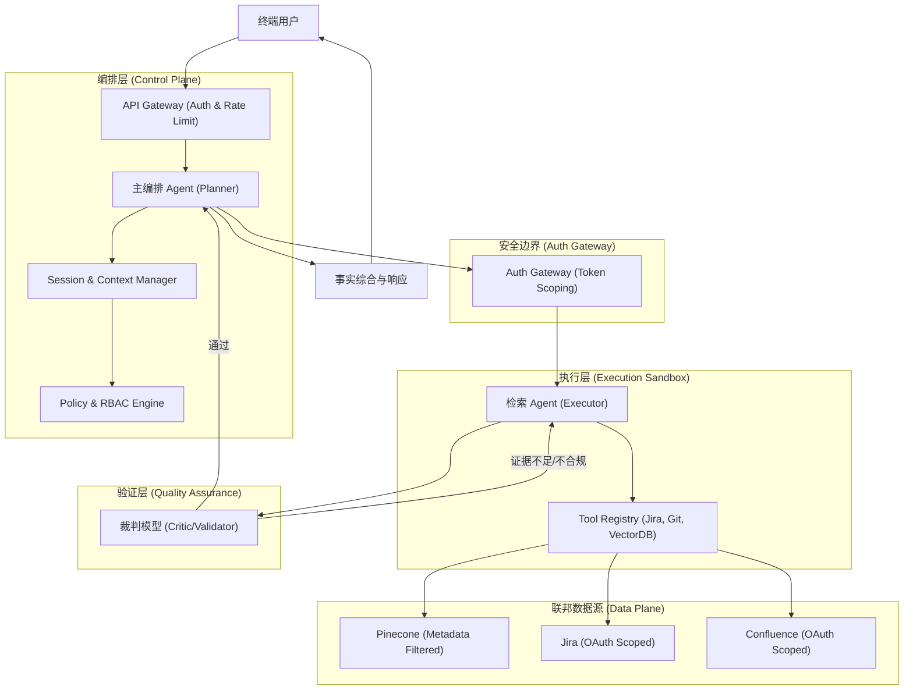
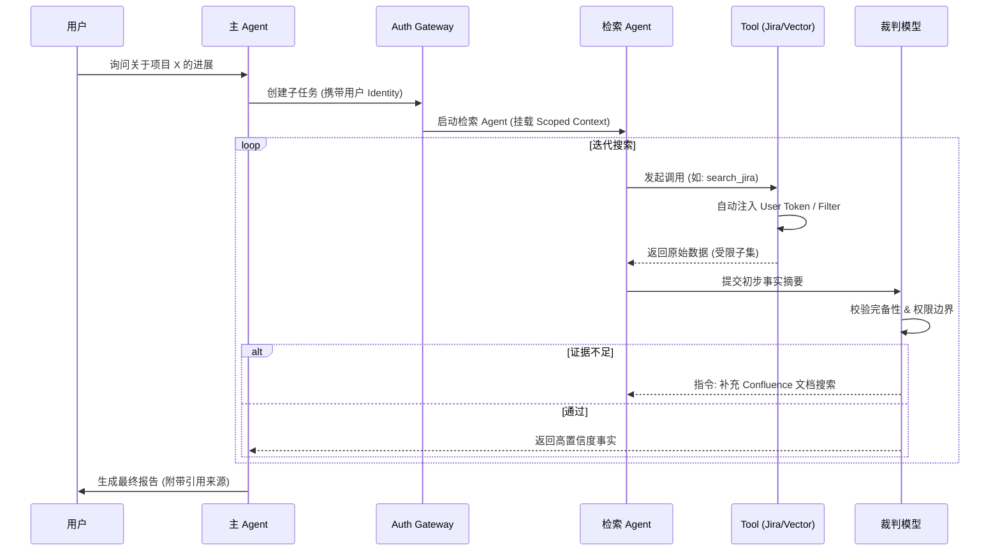

# 企业级 Agentic RAG 系统架构设计指南 (Enterprise Agentic RAG)

构建一个“企业级”的 Agentic RAG 系统，其核心挑战在于如何将 AI 的不确定性封装在严谨的工程治理体系内。以下是基于 OpenCode 架构演进的深度建议。

---

## 一、 核心范式与战略价值

### 1. 模式识别：治理驱动的智能体编排 (Governance-Driven Orchestration)
在企业场景下，检索不再是简单的语义匹配，而是一个**受控的策略执行过程**。
- **范式转变**：从“检索增强生成”转向“**策略驱动的事实综合 (Policy-Driven Fact Synthesis)**”。
- **战略价值**：通过引入“治理层”，解决 AI 在访问敏感数据时的权限越位问题，同时确保输出的确定性（Factuality）。

### 2. 价值解构
- **解耦决策与执行**：主 Agent 负责业务逻辑，检索 Agent 负责在受限沙箱内寻找证据。
- **权限闭环**：检索行为必须携带用户身份上下文（Identity Context），确保 AI 无法通过“幻觉”绕过 RBAC 限制。

---

## 二、 系统架构总览 (System Architecture Overview)

企业级 Agentic RAG 系统必须具备明确的**控制面 (Control Plane)** 和 **数据面 (Data Plane)** 分离。

### 2.1 核心架构组件图



---

## 三、 主体设计实现细节 (Implementation Details)

### 3.1 权限锚定与 Token 穿透实现

为了确保 Agent 只能访问用户权限内的数据，我们采用 **“凭证托管 (Credential Vaulting)”** 与 **“动态过滤器注入 (Dynamic Filter Injection)”** 相结合的方案。

#### 1. OAuth Token 的安全路由
- **实现机制**：主 Agent 不直接持有用户的 OAuth Token，而是持有指向 `Credential Vault` 的引用。
- **执行流**：当检索 Agent 调用 `JiraTool` 时，请求经过 `Auth Gateway`，网关根据当前 `SessionID` 从 Vault 中提取对应的 `UserToken` 并注入到 HTTP Header 中。
- **优势**：Agent 始终无法获取明文 Token，防止了提示词泄露（Prompt Leakage）导致的凭证被盗。

#### 2. 向量库的强制元数据过滤
- **实现机制**：在 Pinecone/Milvus 中，每个 Chunk 必须包含 `acl` 字段（如 `["dept_engineering", "project_x"]`）。
- **代码层逻辑**：
  ```typescript
  // AuthGateway 自动注入的过滤器示例
  const userAcl = await policyEngine.getUserGroups(userId);
  const secureQuery = {
    vector: queryVector,
    filter: {
      acl: { "$in": userAcl } // 强制注入，Agent 无法覆盖
    },
    topK: 10
  };
  ```

### 3.2 检索时序与闭环逻辑



### 3.3 差异化授权下的“工具发现门控” (Dynamic Tool Gating)

针对不同用户组拥有不同 API 调用权限的场景，引入 **“动态工具发现(Dynamic Discovery)”** 机制。

#### 1. 核心机制：权限驱动的工具暴露 (Auth-Driven Tool Exposure)
- **实现原理**：在 Agent 初始化阶段，`Tool Registry` 会查询 `Policy Engine`，根据当前 `UserID` 返回一个**过滤后的工具列表**。
- **差异化表现**：
    - **高级用户组**：Agent 看到 `JiraTool`, `ConfluenceTool`, `ERP_API_Tool`, `VectorDBTool`。
    - **普通用户组**：Agent 只能看到 `VectorDBTool`。
- **优势**：Agent 从一开始就不知道那些它无权访问的 API 存在，彻底杜绝了 Agent 尝试调用非法 API 的可能性。

#### 2. “降级检索”逻辑 (Graceful Degradation)
- 当用户没有 API 权限时，Agent 会自动识别到只有 `VectorDBTool` 可用。
- **逻辑流**：Agent 会将原本需要通过 API 获取的实时数据需求，转化为对向量库中“授权历史快照”的查询。
- **透明感知**：用户感知的差异仅在于回答的时效性（实时 API vs. 历史文档），而架构的安全性得到了刚性保障。

---

## 四、 企业级增强：可观测性、成本与性能 (Enterprise Enhancements)

### 4.1 全链路审计与溯源 (Traceability & Audit)
- **Session 轨迹记录**：利用 OpenCode 的 Session 机制，记录 Agent 的每一次 `Tool Call`、入参、出参以及对应的 `Identity Context`。
- **证据链可视化**：在最终答案中强制要求标注 **“引用源 (Citations)”**。
  - **精妙之处**：引用源不仅包含文档链接，还包含检索时的 **“权限快照”**。这确保了即便权限后来发生了变化，审计员也能知道当时 Agent 是合法访问的。

### 4.2 成本控制与配额管理 (Cost & Quota Management)

Agentic RAG 由于存在循环迭代，Token 消耗具有不可预测性。

- **能级预算 (Token Budgeting)**：为每个 Session 设置 `Hard Limit` 和 `Soft Limit`。
- **用户组配额**：通过 `Auth Gateway` 实现针对不同用户组的速率限制 (Rate Limiting) 和总额配额。
- **熔断机制**：当循环迭代超过 5 轮且 `Critic` 仍不满意时，强制触发 **“人工介入 (Escalation)”**。

### 4.3 多级缓存策略 (Multi-level Caching)
1.  **语义缓存 (Semantic Cache)**：在 `API Gateway` 层级，对高度相似的问题直接返回脱敏答案。
2.  **检索块缓存 (Chunk Cache)**：在 `Tool` 层级缓存常用的文档块。
3.  **Prompt 缓存**：利用模型厂商（如 Anthropic/OpenAI）的 Prompt Cache 技术，减少长上下文（Long Context）下的重复计费。

---

## 五、 多源异构场景下的 RBAC 穿透架构

### 5.1 核心挑战：权限孤岛与 Token 污染
- **挑战 1：向量库的权限映射**。向量库通常不支持细粒度的 RBAC，存在“越权查看”风险。
- **挑战 2：SaaS API 的 Token 穿透**。如何安全地将当前用户的 OAuth Token 传递给 Agent，而又不让 Agent 看到该 Token。

### 5.2 深度解决方案：三层权限隔离模型
1.  **第一层：Session 令牌隔离 (Session-Level Token Isolation)**：Agent 只能通过受控接口使用凭证。
2.  **第二层：元数据强制拦截**：在召回阶段实现权限隔离，确保 AI 视界安全。
3.  **第三层：联邦聚合与冲突解决**：引入 **“权限感知聚合器”**。如果 Jira 提到一个文档但 Confluence 检索不到，聚合器将其标记为“不可见引用”，防止 AI 编造内容。

---

## 六、 质量保证与评价体系 (Quality & Evaluation)

### 6.1 企业级“双重验证”评估框架
- **忠实度 (Faithfulness)**：回答是否完全基于检索到的证据。
- **权限边界校验 (Boundary Check)**：通过“对抗性测试”，尝试诱导 Agent 访问其视界外的工具。
- **拒绝率分析 (Refusal Rate)**：分析 Agent 在面对权限不足时的处理是否得体。

---

## 七、 工程实践建议与设计模式

### 1. 模式提取：影子检索 (Shadow Retrieval)
- **定义**：在返回答案前，后台并行触发多个检索策略（如关键词、向量、Graph），并由 Agent 进行交叉比对。

### 2. 模式提取：确定性回退 (Deterministic Fallback)
- **定义**：当 Agent 尝试 N 轮仍无法获得事实时，强制转向“人工协作 (HITL)”或返回受控回复。
- **哲学**：**宁可承认无知，不可产生幻觉**。

### 3. 能级分配 (Compute Tiering)
- **Tier 3 (意图分流)**：使用高速模型（如 GPT-4o-mini）进行快速分类。
- **Tier 2 (数据清洗)**：使用具备强指令遵循能力的模型处理异构数据。
- **Tier 1 (事实合成)**：仅在最后的事实综合阶段使用最高能级模型（如 GPT-4o / Claude-3.5-Sonnet）。

---

## 八、 横向对比与应用拓展

### 1. 同类对比
| 维度 | 朴素 RAG (Naive) | 传统 Agentic RAG | **企业级 Agentic RAG** |
| :--- | :--- | :--- | :--- |
| **检索策略** | 单次 Top-K | 多轮迭代 | **权限感知的多策略联邦检索** |
| **质量控制** | 无 | Agent 自检 | **独立的裁判模型 + 冲突检测** |
| **安全合规** | 依赖前端过滤 | 弱权限意识 | **Session 级别的沙箱化与 RBAC 强制注入** |
| **成本管理** | 低 | 不可控 | **能级路由与 Token 熔断机制** |

### 2. 场景外推
这种架构不仅适用于文档问答，还可拓展至：
- **自动化合规审计**：Agent 主动在海量合同中寻找违规条款。
- **智能排障系统**：Agent 联动监控数据、日志和代码库进行分析。

---

## 九、 总结与展望

### 1. “教授箴言”
- > “企业级架构的灵魂在于‘约束’。给 AI 越多的约束，它产生的价值就越稳定。”
- > > “不要试图教 AI 守规矩，要用代码把规矩写进它必须经过的管道里。”
- > > “好的检索不是找到更多数据，而是排除更多噪声。架构设计的本质是构建过滤器的层级。”

---

🤖 **协作说明**
*本可视化文档基于架构师教授 `/prof` 的深度分析生成，并由 `vizdoc` 进行结构化与图表实现。*
