# 企业级 Agentic RAG 系统架构设计指南 (Enterprise Agentic RAG)

## 目录

- [企业级 Agentic RAG 系统架构设计指南 (Enterprise Agentic RAG)](#企业级-agentic-rag-系统架构设计指南-enterprise-agentic-rag)
  - [目录](#目录)
  - [一、 核心范式与战略价值](#一-核心范式与战略价值)
    - [1. 模式识别：治理驱动的智能体编排 (Governance-Driven Orchestration)](#1-模式识别治理驱动的智能体编排-governance-driven-orchestration)
    - [2. 价值解构](#2-价值解构)
  - [二、 系统架构总览 (System Architecture Overview)](#二-系统架构总览-system-architecture-overview)
    - [2.1 核心架构组件图与模式解析](#21-核心架构组件图与模式解析)
    - [2.2 Agent 架构选型：编译型 vs. 解释型 (Fundamental Choice)](#22-agent-架构选型编译型-vs-解释型-fundamental-choice)
  - [三、 主体设计实现细节 (Implementation Details)](#三-主体设计实现细节-implementation-details)
    - [3.1 权限锚定与 Token 穿透实现](#31-权限锚定与-token-穿透实现)
      - [1. OAuth Token 的安全路由](#1-oauth-token-的安全路由)
        - [3.1.1 凭证托管流程图 (Credential Vaulting Sequence)](#311-凭证托管流程图-credential-vaulting-sequence)
        - [3.1.3 权衡与考量 (Trade-offs: Credential Vaulting)](#313-权衡与考量-trade-offs-credential-vaulting)
        - [3.1.2 策略引擎的实现示例 (Strategy Pattern Pseudo-code)](#312-策略引擎的实现示例-strategy-pattern-pseudo-code)
      - [2. 向量库的强制元数据过滤](#2-向量库的强制元数据过滤)
    - [3.2 检索时序与闭环逻辑](#32-检索时序与闭环逻辑)
    - [3.3 差异化授权下的“工具发现门控” (Dynamic Tool Gating)](#33-差异化授权下的工具发现门控-dynamic-tool-gating)
      - [1. 核心机制：权限驱动的工具暴露 (Auth-Driven Tool Exposure)](#1-核心机制权限驱动的工具暴露-auth-driven-tool-exposure)
      - [2. “降级检索”逻辑 (Graceful Degradation)](#2-降级检索逻辑-graceful-degradation)
    - [3.4 查询型 Agentic RAG 的主子任务编排：Fan-out / Fan-in (Scatter-Gather Pattern)](#34-查询型-agentic-rag-的主子任务编排fan-out--fan-in-scatter-gather-pattern)
    - [3.5 工具注册与接口规范化：把 REST/MCP/Agent 统一成 Tool Card (Adapter \& Command Pattern)](#35-工具注册与接口规范化把-restmcpagent-统一成-tool-card-adapter--command-pattern)
    - [3.6 可移植消息协议：Task / Progress / Result](#36-可移植消息协议task--progress--result)
      - [3.6.1 任务生命周期状态机 (Task Lifecycle State Machine Pattern)](#361-任务生命周期状态机-task-lifecycle-state-machine-pattern)
        - [状态机实现示例 (State Machine Pseudo-code)](#状态机实现示例-state-machine-pseudo-code)
    - [3.7 交互模式增强：歧义消解与澄清回路 (Ambiguity Handler Pattern)](#37-交互模式增强歧义消解与澄清回路-ambiguity-handler-pattern)
      - [3.7.1 交互流程图：歧义消解闭环 (Clarification Loop Diagram)](#371-交互流程图歧义消解闭环-clarification-loop-diagram)
  - [四、 企业级增强：可观测性、成本与性能 (Enterprise Enhancements)](#四-企业级增强可观测性成本与性能-enterprise-enhancements)
    - [4.1 全链路审计与溯源 (Traceability \& Audit)](#41-全链路审计与溯源-traceability--audit)
    - [4.2 成本控制与配额管理 (Cost \& Quota Management)](#42-成本控制与配额管理-cost--quota-management)
    - [4.3 智能缓存策略：平衡一致性与权限安全 (Smart Caching Strategy)](#43-智能缓存策略平衡一致性与权限安全-smart-caching-strategy)
      - [4.3.1 核心风险：缓存中毒与越权 (The RBAC Trap)](#431-核心风险缓存中毒与越权-the-rbac-trap)
      - [4.3.2 解决方案：分层与分区缓存架构 (Layered \& Partitioned Caching)](#432-解决方案分层与分区缓存架构-layered--partitioned-caching)
      - [4.3.3 “黄金问答集”与预测性预热 (Golden Q\&A \& Predictive Warming)](#433-黄金问答集与预测性预热-golden-qa--predictive-warming)
      - [4.3.4 缓存生命周期管理：事件驱动的精准失效与重更新 (Event-Driven Invalidation \& Re-warming)](#434-缓存生命周期管理事件驱动的精准失效与重更新-event-driven-invalidation--re-warming)
      - [4.3.5 缓存全生命周期治理图 (Cache Lifecycle Governance Diagram)](#435-缓存全生命周期治理图-cache-lifecycle-governance-diagram)
      - [4.3.5 缓存全生命周期治理图 (Cache Lifecycle Governance Diagram)](#435-缓存全生命周期治理图-cache-lifecycle-governance-diagram-1)
      - [4.3.6 长文档摘要的高效提取策略 (Efficient Long Document Summarization)](#436-长文档摘要的高效提取策略-efficient-long-document-summarization)
        - [1. 技术方案：分层摘要与 Map-Reduce 架构 (Hierarchical \& Map-Reduce)](#1-技术方案分层摘要与-map-reduce-架构-hierarchical--map-reduce)
        - [2. 核心优化技巧 (Optimization Tactics)](#2-核心优化技巧-optimization-tactics)
        - [3. 成本对比示例 (Cost Comparison)](#3-成本对比示例-cost-comparison)
      - [4.3.7 权衡与考量 (Trade-offs: Smart Caching)](#437-权衡与考量-trade-offs-smart-caching)
      - [4.3.7 提示词缓存优化 (Prompt Caching Optimization)](#437-提示词缓存优化-prompt-caching-optimization)
      - [4.3.8 语义命中加速 (Semantic Cache Hit)](#438-语义命中加速-semantic-cache-hit)
        - [1. 技术架构流：双阶段验证 (Two-Stage Verification)](#1-技术架构流双阶段验证-two-stage-verification)
        - [2. 查询归一化与标准化设计 (Query Normalization \& Standardization Design)](#2-查询归一化与标准化设计-query-normalization--standardization-design)
          - [2.1 归一化流水线 (Normalization Pipeline)](#21-归一化流水线-normalization-pipeline)
          - [2.2 为什么必须进行“加工改造”？ (Design Rationale)](#22-为什么必须进行加工改造-design-rationale)
          - [2.3 实现进阶：标准问题库 (Standard Question Library)](#23-实现进阶标准问题库-standard-question-library)
        - [3. 语义等价性判定 (The "Judge" Model)](#3-语义等价性判定-the-judge-model)
        - [4. 权限指纹与语义缓存的耦合 (Permission-Aware Semantic Cache)](#4-权限指纹与语义缓存的耦合-permission-aware-semantic-cache)
        - [5. 进阶治理：可观测性与并发控制 (Advanced Governance)](#5-进阶治理可观测性与并发控制-advanced-governance)
      - [4.3.9 成本感知淘汰策略 (Cost-Aware Eviction / FinOps)](#439-成本感知淘汰策略-cost-aware-eviction--finops)
      - [4.3.10 FAQ 主动提取与“黄金缓存” (Proactive FAQ Extraction \& Golden Cache)](#4310-faq-主动提取与黄金缓存-proactive-faq-extraction--golden-cache)
        - [1. FAQ 知识全生命周期：从原子数据到精准答案 (Data Journey)](#1-faq-知识全生命周期从原子数据到精准答案-data-journey)
          - [**第一阶段：解构与坐标注入 (Deconstruction \& Injection)**](#第一阶段解构与坐标注入-deconstruction--injection)
          - [**第二阶段：增强与拉伸 (Enrichment \& Stretching)**](#第二阶段增强与拉伸-enrichment--stretching)
          - [**第三阶段：召回与消歧 (Recall \& Disambiguation)**](#第三阶段召回与消歧-recall--disambiguation)
          - [**数据演变追踪表 (Data Transformation Trace)**](#数据演变追踪表-data-transformation-trace)
        - [2. 技术实现流水线 (Extraction Pipeline)](#2-技术实现流水线-extraction-pipeline)
        - [3. 具体实现中的核心考量 (Key Considerations)](#3-具体实现中的核心考量-key-considerations)
        - [4. 多重语义碰撞与交互式消歧流程图 (Disambiguation Flow)](#4-多重语义碰撞与交互式消歧流程图-disambiguation-flow)
        - [5. 语义泛化 (Semantic Generalization) —— 解决“问法多样性”](#5-语义泛化-semantic-generalization--解决问法多样性)
          - [**(1) 核心痛点：语义鸿沟 (Semantic Gap)**](#1-核心痛点语义鸿沟-semantic-gap)
          - [**(2) 多维度泛化策略 (Multi-dimensional Fan-out)**](#2-多维度泛化策略-multi-dimensional-fan-out)
          - [**(3) 语义泛化处理流水线 (Generalization Pipeline)**](#3-语义泛化处理流水线-generalization-pipeline)
          - [**(4) 关键环节深度解析**](#4-关键环节深度解析)
          - [**(5) 收益与量化指标**](#5-收益与量化指标)
        - [6. 版本同步与增量更新 (CDC for FAQ)](#6-版本同步与增量更新-cdc-for-faq)
        - [7. 冲突解决逻辑 (Conflict Resolution Policy)](#7-冲突解决逻辑-conflict-resolution-policy)
        - [8. 知识质量门禁 (Quality Gating)](#8-知识质量门禁-quality-gating)
        - [9. 直观对比：为什么需要“层级坐标”？](#9-直观对比为什么需要层级坐标)
        - [10. 通用化处理范式：从 Case-by-Case 到标准化协议 (Universal Extraction Protocol)](#10-通用化处理范式从-case-by-case-到标准化协议-universal-extraction-protocol)
          - [**(1) 通用化处理流水线 (Universal Pipeline)**](#1-通用化处理流水线-universal-pipeline)
          - [**(2) 标准分层树结构 (Normalized Tree Structure)**](#2-标准分层树结构-normalized-tree-structure)
          - [**(3) “万能”提取 Prompt 的设计逻辑**](#3-万能提取-prompt-的设计逻辑)
          - [**(4) 带来的核心收益**](#4-带来的核心收益)
        - [11. 适配标准化协议的“万能”提取 Prompt 示例](#11-适配标准化协议的万能提取-prompt-示例)
    - [4.4 分层记忆架构：从 Session 到 Profile (Hierarchical Memory)](#44-分层记忆架构从-session-到-profile-hierarchical-memory)
      - [4.4.1 分层记忆架构图 (Hierarchical Memory Diagram)](#441-分层记忆架构图-hierarchical-memory-diagram)
  - [五、 多源异构场景下的 RBAC 穿透架构](#五-多源异构场景下的-rbac-穿透架构)
    - [5.1 核心挑战：权限孤岛与 Token 污染](#51-核心挑战权限孤岛与-token-污染)
    - [5.2 深度解决方案：三层权限隔离模型](#52-深度解决方案三层权限隔离模型)
    - [5.3 多用户组的工具门控：工具可见性门控 (Tool Visibility / Exposure Gating) + 策略执行门控 (Policy Enforcement)](#53-多用户组的工具门控工具可见性门控-tool-visibility--exposure-gating--策略执行门控-policy-enforcement)
      - [5.3.1 工具门控矩阵示例：小工具集（每组 4～5 个）](#531-工具门控矩阵示例小工具集每组-45-个)
      - [5.3.2 小工具集下的工具选择与触发策略（Routing \& Activation）](#532-小工具集下的工具选择与触发策略routing--activation)
      - [5.3.3 Diagram：小工具集下的门控、选择与分层触发流程](#533-diagram小工具集下的门控选择与分层触发流程)
      - [5.3.5 权衡与考量 (Trade-offs: Double Gating)](#535-权衡与考量-trade-offs-double-gating)
      - [5.3.4 Diagram：以用户组 C 为例的分层触发调用时序](#534-diagram以用户组-c-为例的分层触发调用时序)
    - [5.4 多向量库实体的联邦检索：索引/分片路由 (Index/Shards Routing) + 联邦向量检索 (Federated Vector Retrieval)](#54-多向量库实体的联邦检索索引分片路由-indexshards-routing--联邦向量检索-federated-vector-retrieval)
      - [5.4.1 联邦检索架构图 (Federated Retrieval Architecture)](#541-联邦检索架构图-federated-retrieval-architecture)
    - [5.5 UML：多用户组门控与多向量库联邦检索](#55-uml多用户组门控与多向量库联邦检索)
      - [5.5.1 组件关系（UML Class Diagram / Logical Components）](#551-组件关系uml-class-diagram--logical-components)
      - [5.5.2 调用时序（UML Sequence Diagram）](#552-调用时序uml-sequence-diagram)
  - [六、 质量保证与评价体系 (Quality \& Evaluation)](#六-质量保证与评价体系-quality--evaluation)
    - [6.1 企业级“双重验证”评估框架](#61-企业级双重验证评估框架)
    - [6.2 反幻觉闭环：引用门禁 (Citation Gating) + 断言-证据对齐 (Claim–Evidence Alignment)](#62-反幻觉闭环引用门禁-citation-gating--断言-证据对齐-claimevidence-alignment)
    - [6.3 诚实性协议 (Honesty Protocol)](#63-诚实性协议-honesty-protocol)
    - [6.4 进化机制：在线反馈闭环 (Online Feedback Loop)](#64-进化机制在线反馈闭环-online-feedback-loop)
      - [6.4.1 在线反馈闭环图 (Feedback Loop Diagram)](#641-在线反馈闭环图-feedback-loop-diagram)
  - [七、 工程实践建议与设计模式](#七-工程实践建议与设计模式)
    - [7.1 模式提取：影子检索 (Shadow Retrieval)](#71-模式提取影子检索-shadow-retrieval)
    - [7.2 模式提取：确定性回退 (Deterministic Fallback)](#72-模式提取确定性回退-deterministic-fallback)
    - [7.3 能级分配 (Compute Tiering)](#73-能级分配-compute-tiering)
    - [7.4 全链路交互与路由架构图 (End-to-End Interaction \& Routing Architecture)](#74-全链路交互与路由架构图-end-to-end-interaction--routing-architecture)
      - [7.4.1 流程可视化：动态路由与能级跃迁 (Dynamic Routing \& Escalation Flow)](#741-流程可视化动态路由与能级跃迁-dynamic-routing--escalation-flow)
      - [7.4.2 路由实例解析 (Routing Examples)](#742-路由实例解析-routing-examples)
      - [7.4.3 查询分类器详解 (Query Classifier Details)](#743-查询分类器详解-query-classifier-details)
    - [7.5 架构演进：引入 Agentic RAG 动态循环 (The Agentic Loop)](#75-架构演进引入-agentic-rag-动态循环-the-agentic-loop)
      - [7.5.1 增强版架构图：路由 + 智能体循环 (Router + Agentic Loop)](#751-增强版架构图路由--智能体循环-router--agentic-loop)
      - [7.5.2 核心差异点解析](#752-核心差异点解析)
      - [7.5.3 智能体核心五要素 (The 5 Pillars of Agentic RAG)](#753-智能体核心五要素-the-5-pillars-of-agentic-rag)
    - [7.6 多智能体协同模式 (A2A Patterns in RAG)](#76-多智能体协同模式-a2a-patterns-in-rag)
      - [7.6.1 A2A 多智能体协作模式图 (A2A Collaboration Patterns)](#761-a2a-多智能体协作模式图-a2a-collaboration-patterns)
    - [7.7 A2A 与 MCP：适用场景与演进关系 (A2A vs. MCP Scenarios)](#77-a2a-与-mcp适用场景与演进关系-a2a-vs-mcp-scenarios)
      - [1. 适用场景对比](#1-适用场景对比)
      - [7.7.1 MCP 协议连接架构图 (MCP Architecture)](#771-mcp-协议连接架构图-mcp-architecture)
      - [2. 演进路线：从“孤岛”到“联邦”](#2-演进路线从孤岛到联邦)
      - [7.7.2 A2A + MCP 融合演进图 (Evolution: Tools to Organization)](#772-a2a--mcp-融合演进图-evolution-tools-to-organization)
    - [7.8 行业案例研究：OpenCode 的 A2A 与 MCP 实践 (Case Study)](#78-行业案例研究opencode-的-a2a-与-mcp-实践-case-study)
      - [7.8.1 A2A 模式：角色化 Agent 团队](#781-a2a-模式角色化-agent-团队)
      - [7.8.2 MCP 模式：标准化工具总线](#782-mcp-模式标准化工具总线)
      - [7.8.3 深度解析：OpenCode 的“工具总线”设计模式](#783-深度解析opencode-的工具总线设计模式)
      - [7.8.4 核心洞察 (Architectural Insights)](#784-核心洞察-architectural-insights)
    - [7.9 协议深度解析：MCP (Model Context Protocol) 标准](#79-协议深度解析mcp-model-context-protocol-标准)
      - [7.9.1 MCP 的三大核心支柱 (The 3 Pillars)](#791-mcp-的三大核心支柱-the-3-pillars)
      - [7.9.2 传输协议：stdio vs. SSE](#792-传输协议stdio-vs-sse)
      - [7.9.3 安全治理：MCP 的安全边界](#793-安全治理mcp-的安全边界)
      - [7.9.4 MCP 协议规范细节 (Specification Details)](#794-mcp-协议规范细节-specification-details)
        - [1. 初始化握手 (Initialization)](#1-初始化握手-initialization)
        - [2. 获取工具列表 (List Tools)](#2-获取工具列表-list-tools)
        - [3. 调用工具 (Call Tool)](#3-调用工具-call-tool)
      - [7.5.4 实战演练：供应商风险评估场景 (Scenario Walkthrough)](#754-实战演练供应商风险评估场景-scenario-walkthrough)
      - [7.5.5 安全与熔断机制 (Safety \& Circuit Breaking)](#755-安全与熔断机制-safety--circuit-breaking)
  - [八、 技术栈选型与推荐 (Tech Stack Selection \& Recommendations)](#八-技术栈选型与推荐-tech-stack-selection--recommendations)
    - [8.1 核心编程语言与框架选型](#81-核心编程语言与框架选型)
    - [8.2 关键基础设施组件](#82-关键基础设施组件)
    - [8.3 算力分层与模型配比 (Compute Tiering)](#83-算力分层与模型配比-compute-tiering)
  - [九、 横向对比与应用拓展](#九-横向对比与应用拓展)
    - [1. 同类对比](#1-同类对比)
    - [2. 场景外推](#2-场景外推)
  - [十、 总结与展望](#十-总结与展望)
    - [1. “教授箴言”](#1-教授箴言)
  - [十一、 落地清单：从 Naive RAG 演进到企业级 Agentic RAG](#十一-落地清单从-naive-rag-演进到企业级-agentic-rag)
    - [11.1 必做（低成本高收益）](#111-必做低成本高收益)
    - [11.2 进阶（稳定性与可观测性）](#112-进阶稳定性与可观测性)
    - [11.3 反幻觉闭环（强烈建议）](#113-反幻觉闭环强烈建议)


构建一个“企业级”的 Agentic RAG 系统，其核心挑战在于如何将 AI 的不确定性封装在严谨的工程治理体系内。以下是基于 OpenCode 架构演进的深度建议。

---

## 一、 核心范式与战略价值

### 1. 模式识别：治理驱动的智能体编排 (Governance-Driven Orchestration)
在企业场景下，检索不再是简单的语义匹配，而是一个**受控的策略执行过程**。
- **范式转变**：从“检索增强生成”转向“**策略驱动的事实综合 (Policy-Driven Fact Synthesis)**”。
- **战略价值**：通过引入“治理层”，解决 AI 在访问敏感数据时的权限越位问题，同时确保输出的确定性（Factuality）。
- **设计模式关联**：
    - **Orchestrator (编排器) 模式**：主 Agent 扮演编排器角色，管理子任务的生命周期与执行流。
    - **Strategy (策略) 模式**：检索逻辑不再硬编码，而是根据用户权限和任务上下文动态选择执行策略。

### 2. 价值解构
- **解耦决策与执行**：主 Agent 负责业务逻辑（决策面），检索 Agent 负责在受限沙箱内寻找证据（执行面）。这种 **Command (命令) 模式** 的变体确保了职责分离。
- **权限闭环**：检索行为必须携带用户身份上下文（Identity Context），确保 AI 无法通过“幻觉”绕过 RBAC 限制。

---

## 二、 系统架构总览 (System Architecture Overview)

企业级 Agentic RAG 系统必须具备明确的**控制面 (Control Plane)** 和 **数据面 (Data Plane)** 分离。

### 2.1 核心架构组件图与模式解析

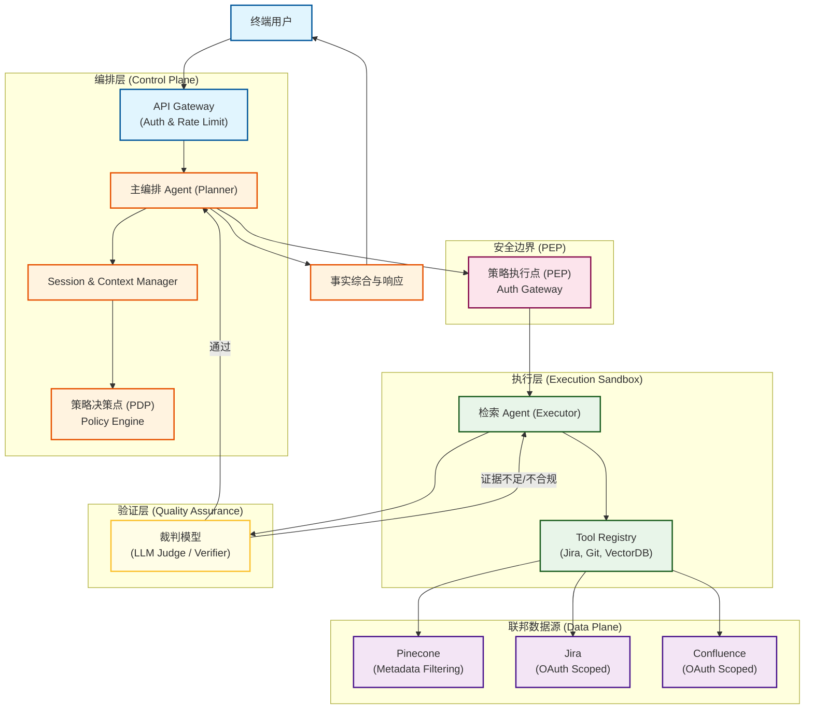
```mermaid
graph TD
    %% 样式定义
    classDef user fill:#e1f5fe,stroke:#01579b,stroke-width:2px;
    classDef control fill:#fff3e0,stroke:#e65100,stroke-width:2px;
    classDef security fill:#fce4ec,stroke:#880e4f,stroke-width:2px;
    classDef execution fill:#e8f5e9,stroke:#1b5e20,stroke-width:2px;
    classDef data fill:#f3e5f5,stroke:#4a148c,stroke-width:2px;
    classDef validation fill:#fffde7,stroke:#fbc02d,stroke-width:2px;

    User["终端用户"]:::user --> API["API Gateway<br/>(Auth & Rate Limit)"]:::user
    
    subgraph Box_Control ["编排层 (Control Plane)"]
        API --> MainAgent["主编排 Agent (Planner)"]:::control
        MainAgent --> SessionMgr["Session & Context Manager"]:::control
        SessionMgr --> PolicyEngine["策略决策点 (PDP)<br/>Policy Engine"]:::control
    end

    subgraph Box_Security ["安全边界 (PEP)"]
        MainAgent --> AuthGateway["策略执行点 (PEP)<br/>Auth Gateway"]:::security
    end

    subgraph Box_Execution ["执行层 (Execution Sandbox)"]
        AuthGateway --> RetrievalAgent["检索 Agent (Executor)"]:::execution
        RetrievalAgent --> ToolRegistry["Tool Registry<br/>(Jira, Git, VectorDB)"]:::execution
    end

    subgraph Box_Data ["联邦数据源 (Data Plane)"]
        ToolRegistry --> Pinecone["Pinecone<br/>(Metadata Filtering)"]:::data
        ToolRegistry --> Jira["Jira<br/>(OAuth Scoped)"]:::data
        ToolRegistry --> Confluence["Confluence<br/>(OAuth Scoped)"]:::data
    end

    subgraph Box_Validation ["验证层 (Quality Assurance)"]
        RetrievalAgent --> Critic["裁判模型<br/>(LLM Judge / Verifier)"]:::validation
        Critic -- "证据不足/不合规" --> RetrievalAgent
        Critic -- "通过" --> MainAgent
    end

    MainAgent --> FinalResponse["事实综合与响应"]:::control
    FinalResponse --> User
```

**组件背后的设计模式：**

| 组件 | 对应设计模式 | 作用说明 |
| :--- | :--- | :--- |
| **API Gateway** | **Gateway (网关) 模式** | 统一入口，负责鉴权、限流与请求预处理。 |
| **Main Agent (Planner)** | **Orchestrator (编排器) 模式** | 负责意图解析、任务拆解与全局状态管理。 |
| **Policy Engine (PDP)** | **Strategy (策略) 模式** | 封装多种权限判定逻辑（RBAC/ABAC），支持动态策略切换。 |
| **Auth Gateway (PEP)** | **Proxy (代理) / Interceptor (拦截器) 模式** | 在工具调用链中强制注入身份令牌或过滤器，实现权限闭环。 |
| **Tool Registry** | **Registry (注册表) 模式** | 集中管理工具元数据，解耦工具定义与调用逻辑。 |
| **Critic (Verifier)** | **Chain of Responsibility (责任链) 模式** | 作为验证环节，决定任务是否可以进入下一阶段或需要重试。 |

### 2.2 Agent 架构选型：编译型 vs. 解释型 (Fundamental Choice)

在企业级 RAG 落地中，首要决策是选择 Agent 的“大脑”如何驱动流程。

| 特性 | **编译型 Agent (Compiled / Workflow)** | **解释型 Agent (Interpreted / Autonomous)** |
| :--- | :--- | :--- |
| **核心逻辑** | 流程由开发者预定义的 DAG 或状态机驱动。 | 流程由 LLM 在运行时根据目标动态规划。 |
| **可预测性** | **极高**。执行路径确定，易于测试与审计。 | **较低**。面对同样问题可能产生不同路径。 |
| **灵活性** | **较低**。处理非预期输入需手动增加分支。 | **极高**。能处理模糊、多步骤的复杂探索任务。 |
| **主流框架** | LangGraph (StateGraph), Semantic Kernel (Pipelines) | ReAct, BabyAGI, AutoGPT |
| **适用场景** | **标准业务 SOP**、高合规要求的审批流、固定步骤的报表提取。 | **开放式研究**、跨系统故障排查、高度不确定的信息寻踪。 |

**决策建议**：企业 RAG 推荐采用 **“外层编译 + 内层解释”** 的混合模式。即用编译型架构锚定大的业务阶段（如：鉴权 -> 检索 -> 验证 -> 汇总），而在“检索”阶段允许 Agent 解释型地动态调用工具。

---

## 三、 主体设计实现细节 (Implementation Details)

### 3.1 权限锚定与 Token 穿透实现

为了确保 Agent 只能访问用户权限内的数据，我们采用 **“凭证托管 (Credential Vaulting)”** 与 **“动态过滤器注入 (Dynamic Filter Injection)”** 相结合的方案。这本质上是 **Proxy (代理) 模式** 的应用，网关作为工具调用的代理，控制权限的透明注入。

#### 1. OAuth Token 的安全路由
- **实现机制**：主 Agent 不直接持有用户的 OAuth Token，而是持有指向 `Credential Vault` 的引用。
- **执行流**：当检索 Agent 调用 `JiraTool` 时，请求经过 `Auth Gateway`，网关根据当前 `SessionID` 从 Vault 中提取对应的 `UserToken` 并注入到 HTTP Header 中。
- **优势**：Agent 始终无法获取明文 Token，防止了提示词泄露（Prompt Leakage）导致的凭证被盗。

##### 3.1.1 凭证托管流程图 (Credential Vaulting Sequence)

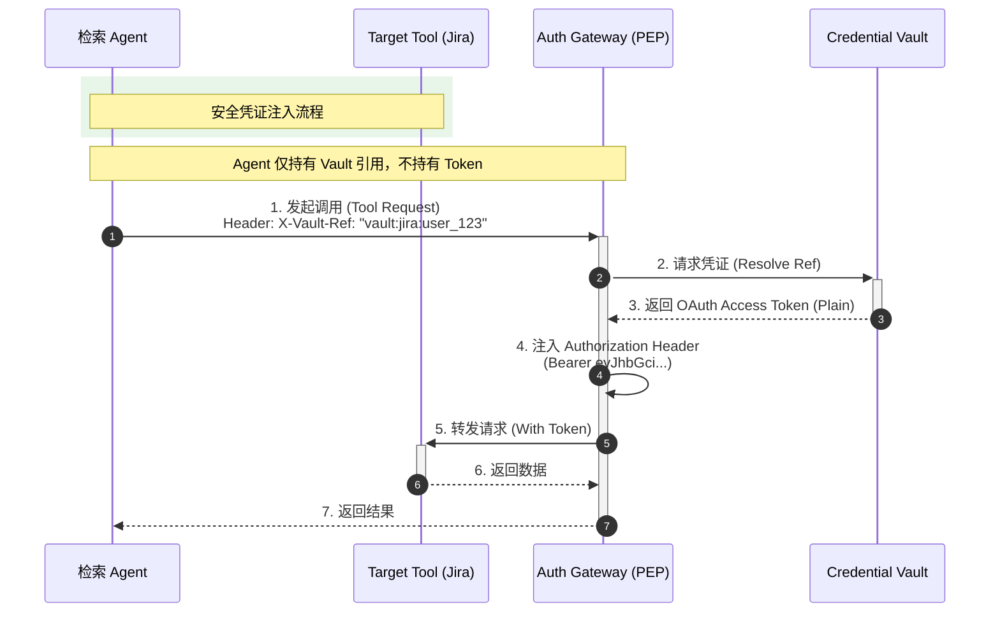
```mermaid
sequenceDiagram
    autonumber
    rect rgb(232, 245, 233)
    Note over Agent, Tool: 安全凭证注入流程
    participant Agent as 检索 Agent
    participant Gateway as Auth Gateway (PEP)
    participant Vault as Credential Vault
    participant Tool as Target Tool (Jira)
    end

    Note over Agent, Gateway: Agent 仅持有 Vault 引用，不持有 Token

    Agent->>+Gateway: 1. 发起调用 (Tool Request)<br/>Header: X-Vault-Ref: "vault:jira:user_123"
    
    Gateway->>+Vault: 2. 请求凭证 (Resolve Ref)
    Vault-->>-Gateway: 3. 返回 OAuth Access Token (Plain)
    
    Gateway->>Gateway: 4. 注入 Authorization Header<br/>(Bearer eyJhbGci...)
    
    Gateway->>+Tool: 5. 转发请求 (With Token)
    Tool-->>-Gateway: 6. 返回数据
    Gateway-->>-Agent: 7. 返回结果
```

##### 3.1.3 权衡与考量 (Trade-offs: Credential Vaulting)

| 维度 | 优势 (Pros) | 代价 (Cons / Risks) |
| :--- | :--- | :--- |
| **安全性** | Agent 无法接触明文 Token，极大降低了泄露风险。 | 增加了 `Credential Vault` 这一核心服务的运维复杂性。 |
| **合规性** | 审计日志可精确记录谁在何时使用了哪个凭证。 | 每次调用均需解密/换取 Token，可能引入 50-200ms 的额外延迟。 |
| **可用性** | 凭证集中管理，易于轮换与失效。 | `Vault` 成为系统单点，若其不可用，所有工具调用将瘫痪。 |

##### 3.1.2 策略引擎的实现示例 (Strategy Pattern Pseudo-code)

通过 **Strategy (策略) 模式**，我们可以灵活切换不同的权限判定逻辑：

```python
class AuthStrategy:
    """权限判定策略接口"""
    def resolve_filters(self, user_context: dict) -> dict:
        pass

class RBACStrategy(AuthStrategy):
    """基于角色的访问控制策略"""
    def resolve_filters(self, user_context: dict) -> dict:
        # 根据用户所属的角色（如 'engineering'）返回过滤器
        return {"dept": {"$in": user_context.get("roles", [])}}

class ABACStrategy(AuthStrategy):
    """基于属性的访问控制策略"""
    def resolve_filters(self, user_context: dict) -> dict:
        # 根据用户属性（如 'project_id'）返回更精细的过滤器
        return {"project_id": user_context.get("active_project")}

# 策略执行点 (PEP)
class PolicyEngine:
    def __init__(self, strategy: AuthStrategy):
        self.strategy = strategy
    
    def get_secure_query(self, query: dict, user_context: dict):
        filters = self.strategy.resolve_filters(user_context)
        query["filter"] = {**query.get("filter", {}), **filters}
        return query
```

#### 2. 向量库的强制元数据过滤
- **实现机制**：在 Pinecone/Milvus 中，每个 Chunk 必须包含 `acl` 字段（如 `["dept_engineering", "project_x"]`）。
- **代码层逻辑**：
  ```typescript
  // AuthGateway 自动注入的过滤器示例
  const userAcl = await policyEngine.getUserGroups(userId);
  const secureQuery = {
    vector: queryVector,
    filter: {
      acl: { "$in": userAcl } // 强制注入，Agent 无法覆盖
    },
    topK: 10
  };
  ```

### 3.2 检索时序与闭环逻辑

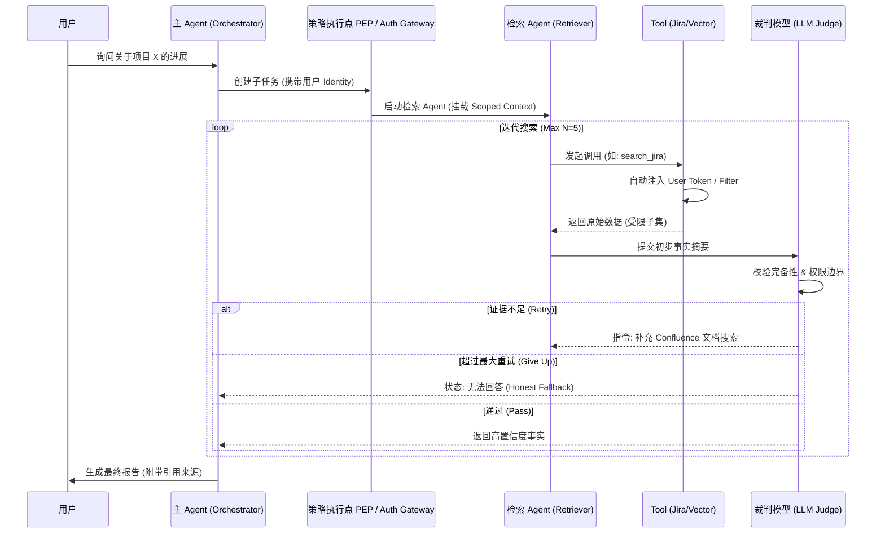
```mermaid
sequenceDiagram
    participant U as 用户
    participant M as 主 Agent (Orchestrator)
    participant G as 策略执行点 PEP / Auth Gateway
    participant R as 检索 Agent (Retriever)
    participant T as Tool (Jira/Vector)
    participant C as 裁判模型 (LLM Judge)

    U->>M: 询问关于项目 X 的进展
    M->>G: 创建子任务 (携带用户 Identity)
    G->>R: 启动检索 Agent (挂载 Scoped Context)
    
    loop 迭代搜索 (Max N=5)
        R->>T: 发起调用 (如: search_jira)
        T->>T: 自动注入 User Token / Filter
        T-->>R: 返回原始数据 (受限子集)
        R->>C: 提交初步事实摘要
        C->>C: 校验完备性 & 权限边界
        alt 证据不足 (Retry)
            C-->>R: 指令: 补充 Confluence 文档搜索
        else 超过最大重试 (Give Up)
            C-->>M: 状态: 无法回答 (Honest Fallback)
        else 通过 (Pass)
            C-->>M: 返回高置信度事实
        end
    end

    M->>U: 生成最终报告 (附带引用来源)
```

### 3.3 差异化授权下的“工具发现门控” (Dynamic Tool Gating)

针对不同用户组拥有不同 API 调用权限的场景，引入 **“动态工具发现(Dynamic Discovery)”** 机制。

#### 1. 核心机制：权限驱动的工具暴露 (Auth-Driven Tool Exposure)
- **实现原理**：在 Agent 初始化阶段，`Tool Registry` 会查询 `Policy Engine`，根据当前 `UserID` 返回一个**过滤后的工具列表**。
- **差异化表现**：
    - **高级用户组**：Agent 看到 `JiraTool`, `ConfluenceTool`, `ERP_API_Tool`, `VectorDBTool`。
    - **普通用户组**：Agent 只能看到 `VectorDBTool`。
- **优势**：Agent 从一开始就不知道那些它无权访问的 API 存在，彻底杜绝了 Agent 尝试调用非法 API 的可能性。

#### 2. “降级检索”逻辑 (Graceful Degradation)
- 当用户没有 API 权限时，Agent 会自动识别到只有 `VectorDBTool` 可用。
- **逻辑流**：Agent 会将原本需要通过 API 获取的实时数据需求，转化为对向量库中“授权历史快照”的查询。
- **透明感知**：用户感知的差异仅在于回答的时效性（实时 API vs. 历史文档），而架构的安全性得到了刚性保障。

### 3.4 查询型 Agentic RAG 的主子任务编排：Fan-out / Fan-in (Scatter-Gather Pattern)

在“纯查询、不改变任何状态”的企业问答场景中，最稳健且性价比最高的演进路线通常不是把一个 Agent 做得越来越聪明，而是采用 **Scatter-Gather (分散-聚集) 模式**：把一次问答拆成**有界的并行子请求 (Scatter)**，再做确定性的**归并与验证 (Gather)**。

核心结构可以抽象为：

- **主 Agent (Orchestrator/Coordinator)**：意图识别、工具选择、并行调度、证据归并、最终输出。
- **子任务 (Executor Tasks)**：各自调用一个数据源（向量库/内部 REST/外部 REST/MCP 工具等），返回结构化结果与可追溯引用。
- **验证器 (Verifier / LLM-as-a-Judge)**：对候选答案做“断言-证据 (Claim–Evidence)”一致性检查，并给出可执行的补证建议。

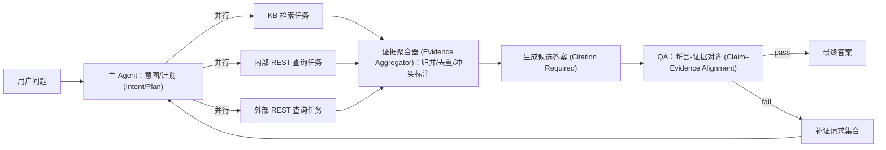
```mermaid
flowchart LR
  U["用户问题"]; P["主 Agent：意图/计划 (Intent/Plan)"]; K["KB 检索任务"]; I["内部 REST 查询任务"]; E["外部 REST 查询任务"]; A["证据聚合器 (Evidence Aggregator)：归并/去重/冲突标注"]; W["生成候选答案 (Citation Required)"]; Q["QA：断言-证据对齐 (Claim–Evidence Alignment)"]; O["最终答案"]; R["补证请求集合"];
  U --> P;
  P -->|并行| K;
  P -->|并行| I;
  P -->|并行| E;
  K --> A;
  I --> A;
  E --> A;
  A --> W;
  W --> Q;
  Q -->|pass| O;
  Q -->|fail| R;
  R --> P;
```

有界性建议：

- **补证回路最多 1 轮**：优先补证，而不是无限自我反思。
- **并行任务 Top-K**：通常 3～6 个数据源足以覆盖主要事实，超出会显著增加噪声与成本。
- **超时与部分成功**：任何子任务超时，主 Agent 仍应基于已获得证据输出“部分答案 + 缺失项说明”。

### 3.5 工具注册与接口规范化：把 REST/MCP/Agent 统一成 Tool Card (Adapter & Command Pattern)

当数据源扩展到内部/外部 REST API 与 MCP 工具时，主 Agent 最大的风险来自“工具发现与参数填充”不稳定。
- **Adapter (适配器) 模式**：通过 `Tool Card` 将异构的接口（REST, MCP, GraphQL）适配成统一的结构。
- **Command (命令) 模式**：每个 `Tool Card` 封装了一个可执行的指令及其元数据。

**核心演进：引入 MCP (Model Context Protocol)**
在企业级集成中，强烈建议采用 **MCP** 作为标准化的适配协议。MCP 允许开发者一次性定义数据源连接器，即可被多种不同的 Agent 框架（如 PydanticAI, LangChain, Claude Desktop）直接复用。这不仅是适配器模式的最佳实践，更是企业建立“资产库级”工具生态的基础。

每个工具卡片描述一个可调用能力，并以结构化 schema 约束输入输出：

| 字段 | 作用 |
| :--- | :--- |
| `name` / `description` | 让主 Agent 能做意图路由与解释 |
| `input_schema` | 让参数填充可校验、可回放 |
| `output_schema` | 让聚合与 QA 不依赖“长文本猜测” |
| `auth_scope` | 最小权限声明（纯查询也必须做） |
| `freshness` | 时效性标签（实时/准实时/离线快照） |
| `rate_limit` / `timeout_ms` | 让工程治理成为系统一等公民 |
| `citation_policy` | 是否能给出 recordId/url/chunk range 等可追溯引用 |

工程实践上，推荐主 Agent 先在工具卡片库中做 Top-K 召回（规则/稀疏检索/向量均可），再在 Top-K 内做参数填充与并行调度。

### 3.6 可移植消息协议：Task / Progress / Result

为了在“同进程调用 / 进程内事件总线 / RPC / MQ”等传输层之间迁移，建议把主子协作通信抽象成三类消息：TaskRequest、TaskProgress、TaskResult。

TaskRequest（主 → 子）最小字段：

```json
{
  "trace_id": "trace-123",
  "task_id": "task-001",
  "parent_task_id": "root-001",
  "intent": "hr_policy",
  "tool": "confluence_search",
  "auth_scope": ["kb.read"],
  "deadline_ms": 4000,
  "context_refs": [{"type": "session", "id": "s-xxx"}],
  "input": {"query": "年假结转规则", "filters": {"space": "HR"}}
}
```

TaskResult（子 → 主）建议结构：

```json
{
  "trace_id": "trace-123",
  "task_id": "task-001",
  "status": "ok",
  "output": {
    "facts": [
      {
        "statement": "年假结转上限为 5 天",
        "confidence": 0.86,
        "citation": {"doc_id": "HR-2024-001", "url": "...", "range": "p3-4", "updated_at": "2024-11-02"}
      }
    ]
  },
  "metrics": {"latency_ms": 820}
}
```

与 OpenCode 主子 Agent 委派实现的对齐，可参考 [agents.md](agents.md)。

#### 3.6.1 任务生命周期状态机 (Task Lifecycle State Machine Pattern)

采用 **State Machine (状态机) 模式** 来管理复杂的子任务生命周期，确保在分布式环境下状态的一致性。

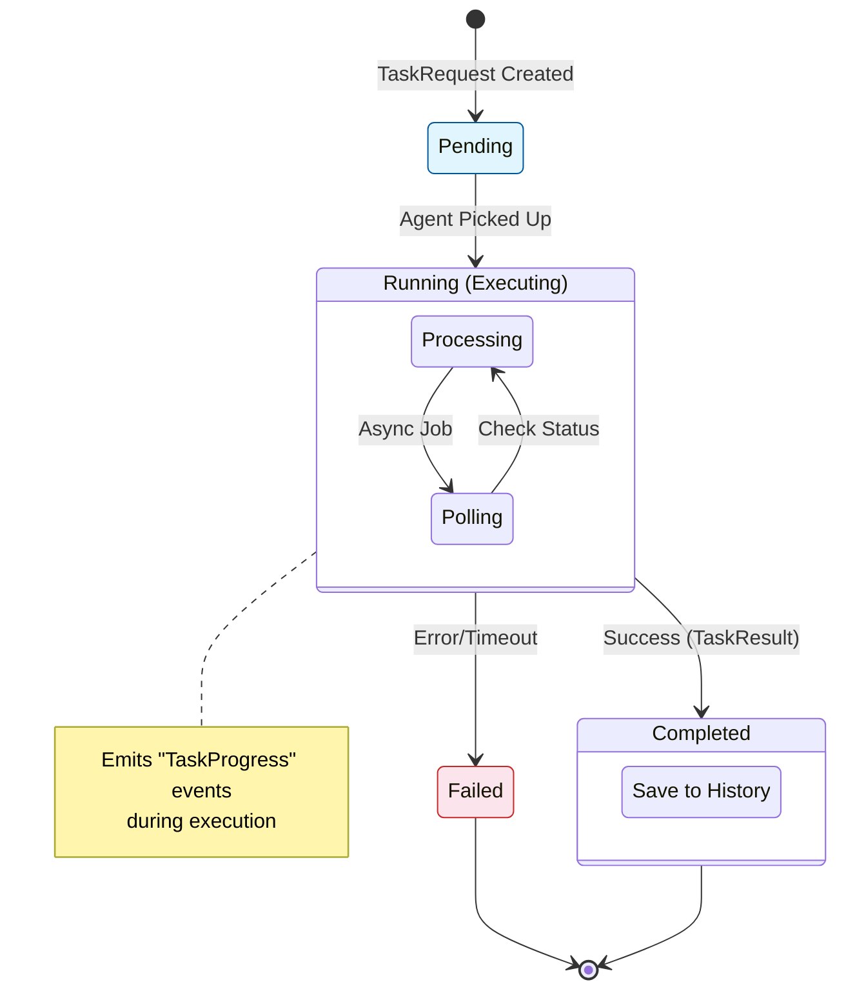
```mermaid
stateDiagram-v2
    %% 状态样式定义
    [*] --> Pending: TaskRequest Created
    
    state "Running (Executing)" as Running {
        Processing --> Polling: Async Job
        Polling --> Processing: Check Status
    }

    Pending --> Running: Agent Picked Up
    
    Running --> Completed: Success (TaskResult)
    Running --> Failed: Error/Timeout
    
    state "Completed" as Completed {
        StoreResult: Save to History
    }

    Completed --> [*]
    Failed --> [*]

    %% 应用颜色样式
    style Pending fill:#e1f5fe,stroke:#01579b
    style Running fill:#fff3e0,stroke:#e65100
    style Completed fill:#e8f5e9,stroke:#1b5e20
    style Failed fill:#fce4ec,stroke:#c62828

    note right of Running
      Emits "TaskProgress" events
      during execution
    end note
```

##### 状态机实现示例 (State Machine Pseudo-code)

```python
class TaskStateMachine:
    def __init__(self, task_id):
        self.task_id = task_id
        self.state = "PENDING"
        self.history = []

    def transition_to(self, next_state):
        valid_transitions = {
            "PENDING": ["RUNNING", "FAILED"],
            "RUNNING": ["COMPLETED", "FAILED"],
            "COMPLETED": [],
            "FAILED": []
        }
        if next_state in valid_transitions[self.state]:
            self.state = next_state
            self.history.append({"state": self.state, "timestamp": now()})
        else:
            raise InvalidStateTransition(f"Cannot move from {self.state} to {next_state}")
```

### 3.7 交互模式增强：歧义消解与澄清回路 (Ambiguity Handler Pattern)

在企业场景中，用户指令往往隐含上下文或存在歧义。为了避免 Agent 在错误方向上浪费 Token，必须引入显式的 **“澄清回路 (Clarification Loop)”**。这可以视为 **Chain of Responsibility (责任链) 模式** 的应用：请求首先经过歧义分析拦截器，只有通过（明确）或处理完毕（澄清后）才能进入检索链。

- **机制**：
    1.  **歧义检测**：Query Classifier 输出 `ambiguity_score`。
    2.  **阈值控制**：若 `score > Threshold`，系统暂停检索，进入澄清模式。
    3.  **反向提问**：生成“澄清选项卡 (Clarification Card)”返回给前端，要求用户确认。
- **场景示例**：
    - 用户：“那个项目挂了？”
    - 系统（澄清卡片）：“检测到多个项目存在异常，请明确您是指：
        - [A] **Project Alpha** (CI/CD 构建失败)
        - [B] **Project Beta** (生产环境 5xx 告警)”

#### 3.7.1 交互流程图：歧义消解闭环 (Clarification Loop Diagram)

本流程展示了当用户输入存在歧义（如多义词、上下文缺失）时，系统如何通过“暂停-澄清-恢复”的机制来确保检索的准确性。

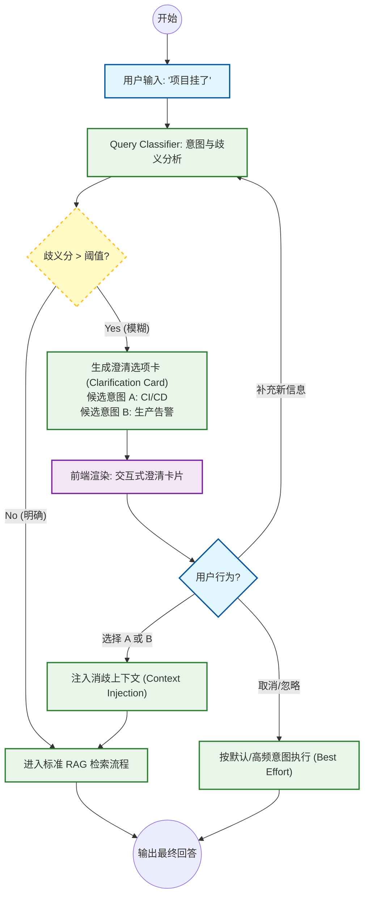
```mermaid
flowchart TD
    %% 样式定义
    classDef user fill:#e1f5fe,stroke:#01579b,stroke-width:2px;
    classDef system fill:#e8f5e9,stroke:#2e7d32,stroke-width:2px;
    classDef decision fill:#fff9c4,stroke:#fbc02d,stroke-width:2px,stroke-dasharray: 5 5;
    classDef ui fill:#f3e5f5,stroke:#7b1fa2,stroke-width:2px;

    Start((开始)) --> U1["用户输入: '项目挂了'"]
    U1 --> C1["Query Classifier: 意图与歧义分析"]
    
    C1 --> D1{"歧义分 > 阈值?"}
    
    %% 正常路径
    D1 -- "No (明确)" --> R1["进入标准 RAG 检索流程"]
    
    %% 澄清路径
    D1 -- "Yes (模糊)" --> G1["生成澄清选项卡 (Clarification Card)\n候选意图 A: CI/CD\n候选意图 B: 生产告警"]
    G1 --> UI1["前端渲染: 交互式澄清卡片"]
    
    UI1 --> U2{"用户行为?"}
    
    U2 -- "选择 A 或 B" --> S1["注入消歧上下文 (Context Injection)"]
    S1 --> R1
    
    U2 -- "补充新信息" --> C1
    
    U2 -- "取消/忽略" --> R2["按默认/高频意图执行 (Best Effort)"]
    
    R1 --> End((输出最终回答))
    R2 --> End

    class U1,U2 user
    class C1,R1,R2,G1,S1 system
    class D1 decision
    class UI1 ui
```

---

## 四、 企业级增强：可观测性、成本与性能 (Enterprise Enhancements)

### 4.1 全链路审计与溯源 (Traceability & Audit)
- **Session 轨迹记录**：利用 OpenCode 的 Session 机制，记录 Agent 的每一次 `Tool Call`、入参、出参以及对应的 `Identity Context`。
- **证据链可视化**：在最终答案中强制要求标注 **“引用源 (Citations)”**。
  - **精妙之处**：引用源不仅包含文档链接，还包含检索时的 **“权限快照”**。这确保了即便权限后来发生了变化，审计员也能知道当时 Agent 是合法访问的。

### 4.2 成本控制与配额管理 (Cost & Quota Management)

Agentic RAG 由于存在循环迭代，Token 消耗具有不可预测性。

- **能级预算 (Token Budgeting)**：为每个 Session 设置 `Hard Limit` 和 `Soft Limit`。
- **用户组配额**：通过 `Auth Gateway` 实现针对不同用户组的速率限制 (Rate Limiting) 和总额配额。
- **熔断机制与诚实回退 (Circuit Breaker & Honest Fallback)**：当循环迭代超过 5 轮且 `Critic` 仍不满意时，触发 **“诚实回退”**：终止检索，向用户明确回复“无法从现有授权信息源中找到答案”，并记录“知识缺口 (Knowledge Gap)”供后续优化，而非强行生成。仅在极高危场景下才触发人工介入。

### 4.3 智能缓存策略：平衡一致性与权限安全 (Smart Caching Strategy)

“增加全部热点问题缓存”在企业级场景下是一个**高风险高收益**的决策。虽然它能显著降低成本并提升一致性，但必须引入**“权限感知 (Permission-Awareness)”**以防止越权访问。

#### 4.3.1 核心风险：缓存中毒与越权 (The RBAC Trap)
*   **场景**：员工 A（高管）问“Q3 奖金池是多少？”，系统生成回答并缓存。
*   **风险**：员工 B（普通员工）随后问同样问题，若命中全局缓存，将直接看到高管视角的敏感数据。
*   **原则**：**绝对禁止在不校验权限的情况下共享生成结果。**

#### 4.3.2 解决方案：分层与分区缓存架构 (Layered & Partitioned Caching)

建议采用 **“业务域分区 + 权限指纹分层”** 的二维策略，既能防止跨部门数据泄露，又能最大化缓存命中率：

**维度一：业务域物理隔离 (Domain Partitioning)**
针对“大的用户组”（如 HR、财务、研发），建议在物理或逻辑上直接隔离缓存空间（Redis Namespaces）。
*   *目的*：防止不同业务线的敏感数据（如薪资 vs 代码）发生跨域混淆，降低“爆炸半径”。
*   *实现*：`Cache_Key_Prefix = {Dept_ID}::...`

**维度二：权限指纹逻辑隔离 (ACL Fingerprinting)**
在同一个业务域内，进一步根据细粒度权限进行隔离：

| 缓存层级 | 适用场景 | Cache Key 设计 | TTL |
| :--- | :--- | :--- | :--- |
| **L1: 域内公共区** | 部门规章、团队公告等**域内全员可见**内容。 | `Prefix + Hash(Query)` | 24h |
| **L2: 权限隔离区** | 项目文档、代码库等**受 RBAC 保护**的内容。 | `Prefix + Hash(Query + User_ACL_Fingerprint)` | 1h |
| **L3: 个人会话区** | 个人偏好、历史查询。 | `Prefix + Hash(Query + User_ID)` | Session |

*   **User_ACL_Fingerprint 实现**：将用户所属的所有 UserGroups 和 Roles 排序后进行 Hash 签名。只有具备完全相同权限集合的用户才能共享同一个缓存项。

#### 4.3.3 “黄金问答集”与预测性预热 (Golden Q&A & Predictive Warming)

针对平台高频热点问题，**主动生成答案并预热缓存是企业级 RAG 从“被动服务”转向“主动治理”的成熟标志**。该策略融合了人工精选的“权威性”与 AI 发现的“时效性”。

**1. 核心构成与合理性：**

- **黄金问答集 (Golden Q&A Set)**：
  - **定位**：针对 Top 100 极其稳定的高频问题（如“VPN 申请流程”、“公司班车表”）。
  - **生产**：由业务专家直接编写标准答案，确保 **100% 安全性** 与 **100% 权威一致性**。
- **预测性预热 (Predictive Warming)**：
  - **定位**：针对近期突发的爆款问题（如“公司昨日发布的年终奖政策”）。
  - **生产**：通过 AI 自动发现并生成，辅以快速人工审核。
  - **价值**：利用 **算力杠杆效应**，用一次高能级模型（如 GPT-4o）的离线推理，消除成千上万次在线重复检索的 **冷启动延迟**，FinOps 收益极高。

**2. 实现管线 (Active Governance Pipeline)：**

通过建立“发现-生成-审核”的闭环，将 RAG 系统升级为具备运营能力的知识中枢：

- **主动发现 (Semantic Mining)**：
  - 实时聚类：对 **Cache Miss** 请求进行 Embedding 聚类，而非仅看字符串匹配。
  - 异常检测：若某语义簇在 24 小时内密度激增（如 > 50 次请求），自动将其定义为“热点候选”报警。
- **智能生成与终审 (HITL)**：
  - **高能级生成**：调用最强模型（不计成本）生成包含 **完美引用溯源** 的标准答案草稿。
  - **专家确认**：引入运营人员“一键终审”界面，审核通过后即刻打入 L1 公共缓存区，并可手动标记为“黄金问答”。
- **短路拦截 (Query Interception)**：
  - 在 **Query Classifier** 阶段，若判定属于热点或黄金问答语义，直接 **短路 (Short-circuit)** 后续 RAG 流程，毫秒级返回标准答案。

**4. 实现落地的关键挑战与对策 (Implementation Challenges & Mitigation)：**

在工程实现时，必须处理以下四个“深水区”问题：

- **挑战 A：语义聚类的噪音与颗粒度 (Clustering Noise & Granularity)**
  - *风险*：若聚类太细，预热覆盖率低；若太粗，会导致“张冠李戴”（将 VPN 问题和内网权限问题混为一谈）。
  - *对策*：采用 **HDBSCAN** 等密度聚类算法，配合 **Centroid 压缩**。仅对 Top-N 的质心进行预热，并使用 `Cross-Encoder` 在拦截阶段进行二次语义等价性判定（确保 98%+ 的匹配度）。
- **挑战 B：权限泄露风险 (Permission Leakage) —— 🚨 极重要**
  - *风险*：Predictive Warming 可能是基于某个高权限用户的提问生成的（例如包含特定项目代号）。若将其放入公共 L1 缓存，会导致低权限用户看到敏感信息。
  - *对策*：**权限分区预热 (Permission-Partitioned Warming)**。对于自动发现的热点，默认标记为 `Restricted`，仅在缓存键中包含 `User_ACL_Fingerprint` 的副本。只有经过人工审核并标记为 `Public` 的答案，才能进入全局 L1 共享。
- **挑战 C：触发阈值的动态调整 (Dynamic Thresholding)**
  - *风险*：固定阈值（如 > 50次）在不同部门或不同时间段（如节假日）会失效。
  - *对策*：引入 **Z-Score 异常检测**。监控请求密度的增长率（Velocity）而非绝对值。若 1 小时内的请求数超过过去 7 天同时间段均值的 3 个标准差，即刻触发预热。
- **挑战 D：热点的“退潮”管理 (Staleness & Retirement)**
  - *风险*：预热缓存占据大量内存，且内容可能随时间过时。
  - *对策*：**衰减型 TTL (Decaying TTL)**。Predictive Warming 初始有效期短（如 4h），若持续被命中则自动延长；若 24h 未被命中，自动从 L1 降级回普通向量检索逻辑。

**3. 核心收益总结：**
- **0 成本与 0 延迟**：后续重复请求不再消耗在线推理算力。
- **口语一致性**：确保企业关键变动时期“一个声音说话”。
- **安全加固**：通过人工审核彻底排除幻觉风险。

#### 4.3.4 缓存生命周期管理：事件驱动的精准失效与重更新 (Event-Driven Invalidation & Re-warming)

为了解决“文档更新后缓存依然返回旧答案”的问题，必须建立一套**从数据源到缓存的拓扑追踪机制**，实现从“被动过期”向“主动失效”的跨越。

**1. 核心挑战：Query 与 Document 的多对多映射**
RAG 缓存通常是以 `Query` 为键的，但一个答案可能引用了 `Doc_A` 的片段 1 和 `Doc_B` 的片段 2。当 `Doc_A` 更新时，我们如何知道哪些 `Query` 的缓存失效了？

**2. 设计模式：文档-缓存倒排索引 (Document-to-Cache Inverted Index)**

建议在缓存层引入一个轻量级的关联表（通常存储在 Redis 或元数据库中）：

| 文档 ID (Doc_ID) | 关联的缓存键列表 (Cache_Keys) | 密级/版本号 |
| :--- | :--- | :--- |
| `wiki_789` | `[q_hash_1, q_hash_5, q_hash_10]` | `v2 / Public` |
| `jira_101` | `[q_hash_2, q_hash_3]` | `v1 / Restricted` |

**3. 级联失效与重更新流 (Cascading Invalidation & Re-warming Flow)：**

- **监听到变更事件 (Webhook/CDC)**：
  - 当外部系统（Wiki, Jira, Git）发生 `Update` 或 `Delete` 时，通过 Webhook 或 CDC (Change Data Capture) 捕获事件。
- **权限/密级变更 (ACL Events) —— 🚨 极重要**：
  - 若文档密级从“公开”变为“绝密”，必须根据倒排索引立即 **秒级爆破** 所有相关缓存。
  - 对于用户权限变更，建议在 `User_ACL_Fingerprint` 中引入 `Epoch` 版本号，一旦 IAM 发生变更，全局推高该版本号，迫使旧指纹缓存瞬间失效。
- **精准失效与重更新 (Targeted Re-fill)**：
  - 根据 `Doc_ID` 查询倒排索引，获取所有受影响的 `Cache_Keys` 并执行删除。
  - **重要对策**：对于那些被标记为“高频 (Hot)”或“黄金问答”的 Cache Key，后台自动触发一次新的 RAG 任务进行 **静默预热**。
  - **价值**：确保当用户再次提问时，看到的已经是基于新文档生成的答案，且没有感受到 RAG 检索的冷启动延迟。

**4. 兜底机制：语义版本号 (Semantic Versioning)**
- 在每个缓存项的元数据中存储 `Doc_Version_List`。
- 即使倒排索引因 system 故障未能及时更新，在 **Semantic Cache Hit** 阶段，引擎会快速核对引用的文档当前版本号。若版本不一致，强制触发 Cache Miss。

**5. 隐性失效：新知识注入引发的缓存过期 (Hidden Invalidation due to New Knowledge)**

你提出的“文档 B、C 未变，但新文档 D 的出现导致答案 A 失效”是一个非常深刻的**非单调逻辑 (Non-monotonic Logic)** 问题。这在企业动态知识库中不仅可能，而且非常合理。

- **场景复现**：
  - *提问 A*：“公司如何报销打车费？”
  - *旧答案 (基于 B/C)*：“使用报销系统 X 录入发票。”
  - *新文档 D*：“即日起打车费统一通过企业滴滴支付，无需手动报销。”
  - *冲突*：B 和 C 依然有效（可能记录的是旧流程），但 D 使得 A 的缓存答案变得具有误导性。

- **对策 1：反向语义探测 (Reverse Semantic Probing)**
  - **工程落地细节 (Technical Implementation)**：
    - **避坑指南：不要使用大文档全文**：大文档全文向量化会产生严重的“语义稀释”且受限于模型 Token 窗口（如 8k 限制），导致微小的知识变更被背景噪音淹没，从而引发探测失效。
    - **策略 A：增量摘要探测 (Delta Summary Probing) —— 推荐方案**：
      - *做法*：使用低能级模型（如 GPT-4o-mini）提取 D 的“变更摘要”或“知识要点”（如：“修改了打车报销流程，改为滴滴直付”）。
      - *优势*：摘要语义集中且精确，用其 Embedding 进行探测能极大提升对“隐性冲突”的识别率。

  - **UML 逻辑流：反向语义探测时序 (Reverse Semantic Probing Sequence)**
  ```mermaid
  sequenceDiagram
      autonumber
      participant DS as "数据源 (Data Source)"
      participant KI as "知识入库引擎 (Ingestor)"
      participant PE as "探测引擎 (Probing Engine)"
      participant CS as "缓存向量库 (Cache Vector Store)"
      participant RM as "预热引擎 (Re-warming Agent)"

      DS->>KI: "发送新文档 D (Webhook/CDC)"
      KI->>PE: "触发隐性失效检测"
      rect rgb(240, 248, 255)
      Note over PE: "提取增量摘要 (Delta Summary)"
      PE->>PE: "LLM 提炼知识要点摘要"
      PE->>PE: "生成摘要 Embedding"
      end
      PE->>+CS: "反向检索相似 Query (Similarity > 0.85)"
      CS-->>-PE: "返回受影响的 Cache Keys [Q_A, Q_X...]"
      
      loop "对每个受影响的 Key"
          PE->>CS: "标记状态: STALE_BY_CONFLICT"
          PE->>RM: "发起静默预热请求"
          RM->>RM: "执行完整 RAG 并更新 L1/L2 缓存"
      end
  ```

  - **对策 2：语义漂移采样校验 (Semantic Drift Sampling)**
  - 对于高频缓存项，不采取 100% 命中的策略。
  - **策略**：每 100 次请求中抽取 1 次执行完整的 RAG（Bypass Cache），对比生成的“新答案”与“缓存答案”的语义差异。
  - 若差异超过阈值（探测到语义漂移），立即废弃该缓存项并触发更新。

- **对策 3：话题聚类失效 (Topic-Based Invalidation)**
  - 将缓存按话题（Topic Cluster）进行归类。当新文档 D 归属于“财务/报销”话题时，该话题下所有的热点缓存均触发一次轻量级的重验证。

**6. 隐性失效治理流程图 (Hidden Invalidation Governance Flow)**

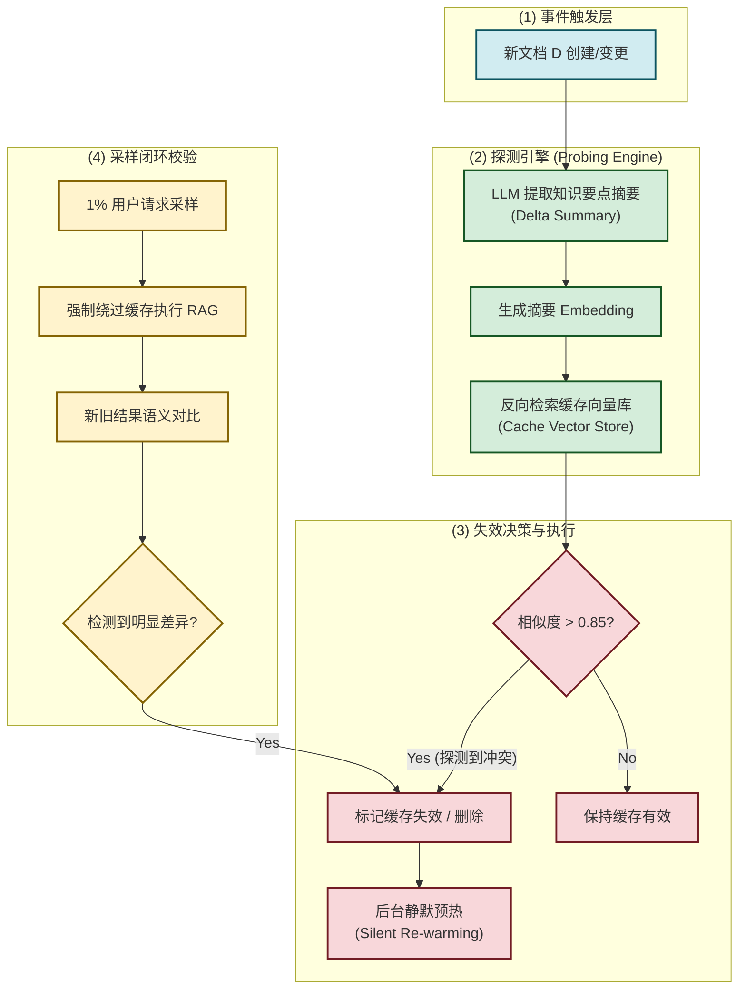
```mermaid
graph TD
    %% 样式定义
    classDef event fill:#d1ecf1,stroke:#0c5460,stroke-width:2px;
    classDef engine fill:#d4edda,stroke:#155724,stroke-width:2px;
    classDef action fill:#f8d7da,stroke:#721c24,stroke-width:2px;
    classDef sampling fill:#fff3cd,stroke:#856404,stroke-width:2px;

    subgraph Box1 ["(1) 事件触发层"]
        D["新文档 D 创建/变更"]:::event
    end

    subgraph Box2 ["(2) 探测引擎 (Probing Engine)"]
        D --> LLM["LLM 提取知识要点摘要<br/>(Delta Summary)"]:::engine
        LLM --> Emb["生成摘要 Embedding"]:::engine
        Emb --> Search["反向检索缓存向量库<br/>(Cache Vector Store)"]:::engine
    end

    subgraph Box3 ["(3) 失效决策与执行"]
        Search --> Match{"相似度 > 0.85?"}:::action
        Match -- "Yes (探测到冲突)" --> Mark["标记缓存失效 / 删除"]:::action
        Mark --> Rewarm["后台静默预热<br/>(Silent Re-warming)"]:::action
        Match -- "No" --> Valid["保持缓存有效"]:::action
    end

    subgraph Box4 ["(4) 采样闭环校验"]
        Req["1% 用户请求采样"]:::sampling --> Bypass["强制绕过缓存执行 RAG"]:::sampling
        Bypass --> Compare["新旧结果语义对比"]:::sampling
        Compare --> Drift{"检测到明显差异?"}:::sampling
        Drift -- "Yes" --> Mark
    end

    %% 应用样式
    class D event;
```

- **UML 状态机：缓存条目生命周期 (Cache Entry State Machine)**
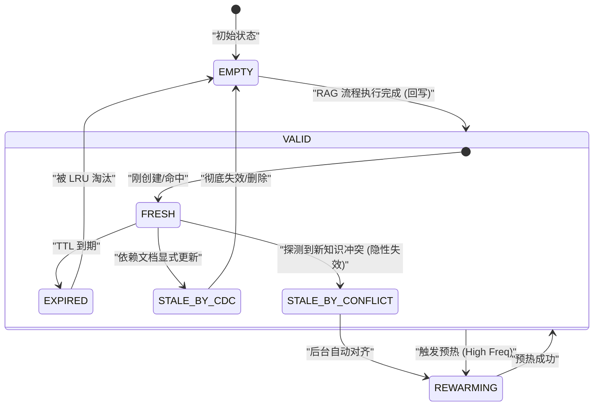
```mermaid
stateDiagram-v2
    [*] --> EMPTY: "初始状态"
    EMPTY --> VALID: "RAG 流程执行完成 (回写)"
    
    state VALID {
        [*] --> FRESH: "刚创建/命中"
        FRESH --> EXPIRED: "TTL 到期"
        FRESH --> STALE_BY_CDC: "依赖文档显式更新"
        FRESH --> STALE_BY_CONFLICT: "探测到新知识冲突 (隐性失效)"
    }

    VALID --> REWARMING: "触发预热 (High Freq)"
    REWARMING --> VALID: "预热成功"
    
    STALE_BY_CDC --> EMPTY: "彻底失效/删除"
    STALE_BY_CONFLICT --> REWARMING: "后台自动对齐"
    EXPIRED --> EMPTY: "被 LRU 淘汰"
```

#### 4.3.5 缓存全生命周期治理图 (Cache Lifecycle Governance Diagram)

解决**“隐性失效”**问题：当新文档 A3 发布时，虽然旧答案 A 依赖的 A1/A2 未变，但 A3 的出现可能使 A 变得过时或错误。
*   **挑战**：传统的 `Ref(Doc_ID)` 倒排索引无法处理“新文档”与“旧查询”的关联。
*   **机制：反向语义检索 (Reverse Semantic Search)**
    1.  **缓存向量化**：将所有高频 Cache Key（即 User Query）的 Embedding 存储在轻量级向量库中。
    2.  **新知扫描**：当新文档 A3 入库时，生成其 Embedding（或摘要 Embedding）。
    3.  **碰撞检测**：用 A3 的 Embedding 去检索 Cache Vector Store。
    4.  **智能判定**：若发现某旧查询 Q 与 A3 的相似度 > 0.85，意味着 A3 极可能是 Q 的新答案来源，立即失效该 Cache。
    5.  **主动更新**：(可选) 立即触发后台 Agent 重新生成 Q 的答案并预热缓存。

#### 4.3.5 缓存全生命周期治理图 (Cache Lifecycle Governance Diagram)

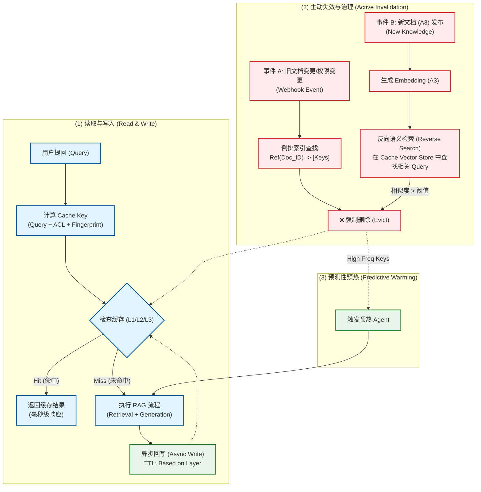
```mermaid
flowchart TD
    %% 样式定义
    classDef read fill:#e1f5fe,stroke:#01579b,stroke-width:2px;
    classDef write fill:#e8f5e9,stroke:#2e7d32,stroke-width:2px;
    classDef invalid fill:#ffebee,stroke:#c62828,stroke-width:2px;
    classDef store fill:#fff9c4,stroke:#fbc02d,stroke-width:2px,stroke-dasharray: 5 5;

    subgraph Read_Path ["(1) 读取与写入 (Read & Write)"]
        Q["用户提问 (Query)"] --> K["计算 Cache Key<br/>(Query + ACL + Fingerprint)"]
        K --> L{"检查缓存 (L1/L2/L3)"}
        L -- "Hit (命中)" --> R["返回缓存结果<br/>(毫秒级响应)"]
        L -- "Miss (未命中)" --> RAG["执行 RAG 流程<br/>(Retrieval + Generation)"]
        RAG --> W["异步回写 (Async Write)<br/>TTL: Based on Layer"]
        W -.-> L
    end

    subgraph Invalidation_Path ["(2) 主动失效与治理 (Active Invalidation)"]
        direction TB
        
        %% 场景 A: 显式失效
        E1["事件 A: 旧文档变更/权限变更<br/>(Webhook Event)"] --> I1["倒排索引查找<br/>Ref(Doc_ID) -> [Keys]"]
        I1 --> D["❌ 强制删除 (Evict)"]
        
        %% 场景 B: 隐式语义失效
        E2["事件 B: 新文档 (A3) 发布<br/>(New Knowledge)"] --> V1["生成 Embedding (A3)"]
        V1 --> V2["反向语义检索 (Reverse Search)<br/>在 Cache Vector Store 中查找相关 Query"]
        V2 -- "相似度 > 阈值" --> D
    end
    
    %% 场景 C: 预测性预热
    subgraph Warming_Path ["(3) 预测性预热 (Predictive Warming)"]
        D -.->|High Freq Keys| P["触发预热 Agent"]
        P --> RAG
    end
    
    %% 连接失效动作与缓存存储
    D -.-> L

    class Q,K,L,R,RAG read
    class W write
    class E1,I1,D,E2,V1,V2 invalid
    class P write
```

#### 4.3.6 长文档摘要的高效提取策略 (Efficient Long Document Summarization)

在处理长文档（如 500 页的 PDF 或超长代码库）时，直接调用 LLM 进行摘要提取会面临 **Token 溢出**、**推理成本高昂** 以及 **中间信息丢失 (Lost in the Middle)** 的挑战。

为了实现“低成本且高效”的摘要提取，推荐采用以下架构策略：

##### 1. 技术方案：分层摘要与 Map-Reduce 架构 (Hierarchical & Map-Reduce)

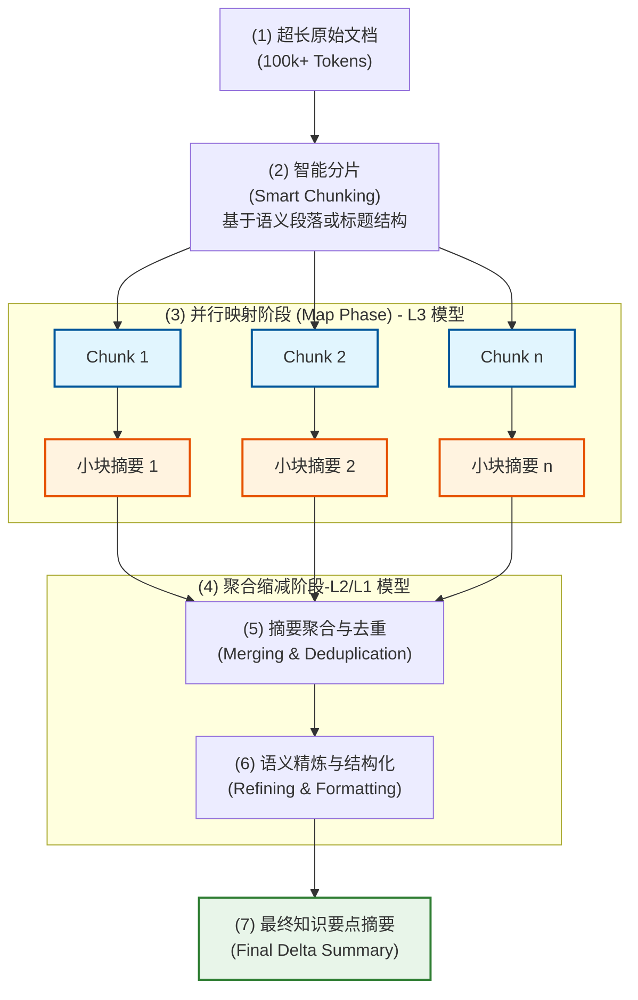
```mermaid
flowchart TD
    %% 样式定义
    classDef chunk fill:#e1f5fe,stroke:#01579b,stroke-width:2px;
    classDef worker fill:#fff3e0,stroke:#e65100,stroke-width:2px;
    classDef final fill:#e8f5e9,stroke:#2e7d32,stroke-width:2px;

    Doc["(1) 超长原始文档<br/>(100k+ Tokens)"] --> Split["(2) 智能分片 <br/>(Smart Chunking)<br/>基于语义段落或标题结构"]
    
    subgraph Map_Phase ["(3) 并行映射阶段 (Map Phase) - L3 模型"]
        direction LR
        C1["Chunk 1"]:::chunk --> S1["小块摘要 1"]:::worker
        C2["Chunk 2"]:::chunk --> S2["小块摘要 2"]:::worker
        Cn["Chunk n"]:::chunk --> Sn["小块摘要 n"]:::worker
    end
    
    Split --> C1 & C2 & Cn
    
    subgraph Reduce_Phase ["(4) 聚合缩减阶段-L2/L1 模型"]
        direction TB
        S1 & S2 & Sn --> Agg["(5) 摘要聚合与去重<br/>(Merging & Deduplication)"]
        Agg --> Refine["(6) 语义精炼与结构化<br/>(Refining & Formatting)"]
    end
    
    Refine --> Final["(7) 最终知识要点摘要<br/>(Final Delta Summary)"]:::final
```

##### 2. 核心优化技巧 (Optimization Tactics)

1.  **能级路由 (Model Tiering)：高吞吐与成本平衡**
    - **Map 阶段（分片扫描）**：采用 **L3 级模型**（如 Gemini 3 Flash、Claude Haiku）。
        - *逻辑*：Map 任务具有高度重复性和低推理深度的特点。L3 模型凭借极低的 Token 单价（通常比 L1 便宜 20-50 倍）和原生的大上下文窗口，可以极速完成数千个分片的初步清理。
        - *产出*：生成每个分片的“事实孤岛（Fact Islands）”，将原始噪音文本压缩 80% 以上。
    - **Reduce 阶段（全局合成）**：采用 **L1/L2 级模型**（如 Gemini 3 Pro、Claude Sonnet）。
        - *逻辑*：Reduce 任务涉及跨分片的逻辑对齐、矛盾冲突仲裁及全局语义建模，需要极强的“全局视野”。
        - *产出*：确保最终摘要不是碎片的简单拼接，而是具有逻辑连贯性的深度洞察。

2.  **提取式摘要优先 (Extraction-First)：从“阅读理解”转向“断言提取”**
    - **预处理降噪**：在 LLM 介入前，利用 TF-IDF 或 RAKE 算法快速识别文档中的高权重关键词，并结合小型 Embedding（如 BGE-small）过滤掉文档中的页眉、页脚、版权声明等“无意义噪音”。

    ###### 2.1 关键词提取算法对比与语言适配

    | 维度 | **TF-IDF** | **RAKE** |
    | :--- | :--- | :--- |
    | **核心优势** | 擅长过滤通用词，突出跨文档的“独特性”特征。 | 无需语料库，仅靠单篇文档的共现逻辑提取高频短语。 |
    | **中英文适配** | **中规中矩**。中文需依赖 `jieba` 等分词器，对分词质量敏感。 | **英文极佳，中文需定制**。高度依赖标点和停用词作为边界。 |
    | **短语提取能力** | 弱（通常提取单字/词），需结合 N-Gram。 | **强**（天然提取复合短语，如 "Vector Database"）。 |
    | **计算复杂度** | 低（适合离线批处理或大规模倒排索引）。 | 极低（适合实时、在线的单篇摘要提取）。 |

    ###### 2.2 语言处理差异分析 (Lingual Adaption)

    在处理中英文文档时，两者的底层逻辑存在显著差异：

    1.  **分词依赖 (Tokenization)**：
        - **英文**：两者均表现优异。英文天然以空格分词，RAKE 可以通过空格轻松识别候选短语。
        - **中文**：**必须先进行分词 (Segmentation)**。TF-IDF 在中文分词后效果较好；而 RAKE 在中文中由于缺乏天然空格，必须依赖分词器切分出的词性或特定的停用词列表来模拟“边界”，否则提取出的往往是断裂的碎片。
    2.  **停用词机制 (Stop-words)**：
        - TF-IDF 依赖停用词表来过滤“的、了、是”等高频无意义词。
        - RAKE 则将停用词作为“分隔符”。在中文中，如果停用词表不全，RAKE 会将不相关的词连在一起形成超长无意义短语。

    **中文适配代码片段 (使用 jieba)：**

    ```python
    import jieba.analyse

    # 中文 TF-IDF 提取
    def extract_chinese_tfidf(text, top_k=5):
        # jieba 内部集成了 IDF 语料库
        return jieba.analyse.extract_tags(text, topK=top_k)

    # 中文 RAKE 模拟 (需要先分词)
    def extract_chinese_rake_sim(text):
        words = jieba.lcut(text)
        space_text = " ".join(words) # 模拟英文空格环境
        # 随后再调用 RAKE 库处理 space_text
        ...
    ```

    **Python 代码示例：**

    ```python
    # TF-IDF 实现示例 (使用 Scikit-Learn)
    from sklearn.feature_extraction.text import TfidfVectorizer

    def extract_keywords_tfidf(documents, top_k=5):
        vectorizer = TfidfVectorizer(stop_words='english')
        tfidf_matrix = vectorizer.fit_transform(documents)
        feature_names = vectorizer.get_feature_names_out()
        
        # 提取第一个文档的前 K 个关键词
        first_doc_vector = tfidf_matrix[0].toarray()[0]
        sorted_indices = first_doc_vector.argsort()[::-1]
        return [feature_names[i] for i in sorted_indices[:top_k]]

    # RAKE 实现示例 (使用 nlp_rake)
    import nlp_rake

    def extract_keywords_rake(text, max_words=2, min_freq=1):
        extractor = nlp_rake.Rake(max_words=max_words, min_freq=min_freq)
        keywords = extractor.extract(text)
        return [k[0] for k in keywords[:5]] # 返回得分最高的前 5 个短语
    ```

    - **Prompt 范式迁移**：
        - *传统做法*：“请总结这段文字。”（容易导致 LLM 生成笼统的废话）。
        - *优化做法*：“请从这段文字中提取所有关于 [系统配置参数] 的**原子断言 (Atomic Assertions)**。如果不存在，直接返回空。”
        - *收益*：通过将“生成式总结”降级为“结构化提取”，不仅显著减少了输出 Token（降低成本），还极大提高了信息的精确度。

3.  **增量更新 (Delta-Only Processing)：基于哈希指纹的最小化重算**
    - **哈希链路 (Hashing Chain)**：为文档的每个物理分片计算 MD5/SHA-256 指纹。
    - **变更检测**：当文档更新时，通过 CDC 链路识别出具体哪些分片的哈希值发生了变化。
    - **按需重算**：系统仅对“哈希失效”的分片重新触发 Map 任务。对于未变的分片，直接复用上一次的摘要结果进入 Reduce 阶段。
    - *工程价值*：在处理长达数万行的代码库或持续更新的技术手册时，这种“局部重算”机制可节省 90% 以上的计算资源。

4.  **分片上下文携带 (Chunk Overlapping & Metadata)：治理语义断层**
    - **精简上下文滑动窗口 (Sliding Context Window)**：在对 Chunk N 进行摘要时，不仅输入该块内容，还以 `System Message` 的形式喂入 Chunk N-1 的**精简摘要**。
    - **元数据锚点 (Metadata Anchoring)**：在每个摘要块中强制注入原始文档的章节 ID、行号范围或实体锚点。
    - *收益*：有效解决了 Map-Reduce 架构常见的“断章取义”问题。例如，Chunk N 中出现的代词“它”或未定义的缩写，可以通过 N-1 的上下文得到正确还原，保证了全局语义的一致性。

##### 3. 成本对比示例 (Cost Comparison)

| 策略 | 估算成本 (100k Tokens) | 质量 | 延迟 |
| :--- | :--- | :--- | :--- |
| **直接全量总结 (L1)** | ~$1.50 | 极高，但易受 Lost in Middle 影响 | 高 |
| **Map-Reduce (L3 + L2)** | **~$0.08** | 高 (结构化好，无信息遗漏) | 中 (可高度并行) |
| **提取式过滤 + LLM** | ~$0.15 | 中 (可能丢失深层语义关联) | **极低** |

---

#### 4.3.7 权衡与考量 (Trade-offs: Smart Caching)

- **性能收益 vs. 管理开销**：缓存极大降低了响应延迟和 Token 成本，但引入了复杂的 `Fingerprint` 计算和主动失效逻辑。
- **一致性 vs. 权限隔离**：过度共享缓存会导致越权，过度隔离（按用户隔离）会导致缓存命中率极低。`ACL Fingerprint` 是目前兼顾二者的平衡点。
- **语义失效的成本**：`Reverse Semantic Search` 虽然强大，但需要额外的向量库存储查询历史，并持续运行扫描任务。建议仅在“高频且对时效性极度敏感”的业务域开启。

#### 4.3.7 提示词缓存优化 (Prompt Caching Optimization)

在复杂的 Agentic RAG 流程中，System Prompt 和检索到的 Context 往往占据了 Token 消耗的 80% 以上。利用 LLM 厂商提供的 **Prompt Caching (如 Anthropic Prompt Caching, OpenAI Context Caching)** 可以显著降低首字延迟 (TTFT) 和成本。

- **静态前缀缓存 (Static Prefix Caching)**：将通用的 System Prompt、工具定义 (Tool Definitions) 设置为缓存点。
- **上下文块缓存 (Context Block Caching)**：在 RAG 检索后，将召回的 Top-K 文档块按顺序拼接并设置缓存锚点。
- **收益**：对于长上下文任务，最高可降低 **90% 的输入成本** 和 **80% 的延迟**。

#### 4.3.8 语义命中加速 (Semantic Cache Hit)

传统的 Key-Value 缓存依赖字符串完全匹配。引入 **语义缓存 (Semantic Cache)** 可以识别意思相近的提问。

- **工作流**：
    1. 计算当前 Query 的 Embedding。
    2. 在缓存向量库中进行相似度检索。
    3. 若 `Similarity > 0.98`（极高阈值），直接返回对应缓存结果。
- **风险控制**：语义命中仅适用于 **L1/L2 级别** 的公共知识，对于涉及个人隐私或极度精确的数据（如“我的余额是多少”），应禁用语义命中。

**🔥 深度实现进阶 (Implementation Deep Dive)：**

在生产级实现中，单纯依靠向量相似度往往会引入“语义偏离”风险。建议引入以下进阶机制：

##### 1. 技术架构流：双阶段验证 (Two-Stage Verification)

为了平衡速度与精度，推荐采用“粗筛+精排”的漏斗架构：

```mermaid
sequenceDiagram
    autonumber
    participant U as 用户 (User)
    participant C as 语义缓存引擎 (Semantic Cache Engine)
    participant V as 向量库 (Vector Store)
    participant E as Cross-Encoder / 小模型
    participant R as RAG 执行引擎

    U->>+C: 输入原始 Query ("vpn连不上了...")
    
    rect rgb(240, 248, 255)
    Note over C, V: 阶段一：向量粗筛 (Vector Search)
    C->>C: 查询归一化 (Canonicalization)
    C->>+V: 向量检索 (Top-1)
    V-->>-C: 返回相似项 (Score: 0.96)
    end
    
    alt 分数 > 0.98 (极高置信度)
        C-->>U: 直接返回缓存结果 (L1 Hit)
    else 分数在 0.92 ~ 0.98 (灰度区)
        rect rgb(255, 245, 230)
        Note over C, E: 阶段二：交叉验证 (Cross-Encoder Re-rank)
        C->>+E: 提交 {Query, Cache_Key} 进行精排
        E->>E: 语义等价性判定 (Entailment Check)
        end
        alt 判定为等价 (True)
            E-->>-C: 确认命中
            C-->>U: 返回缓存结果 (L2 Hit)
        else 判定为不等价 (False)
            E-->>-C: 拒绝命中
            C->>+R: 触发完整 RAG 流程
            R-->>-U: 返回新生成的答案
        end
    else 分数 < 0.92 (低相关)
        C->>+R: 触发完整 RAG 流程
        R-->>-U: 返回新生成的答案
    end
    deactivate C
```

##### 2. 查询归一化与标准化设计 (Query Normalization & Standardization Design)

在被动缓存（Passive Caching）中，直接缓存“原始问题”与“答案”是低效的。因为用户的提问具有极大的随机性（口语化、错别字、情绪化、中英混杂）。

**核心哲学**：不直接缓存“问题”，而是缓存**“语义意图 (Semantic Intent)”**。这需要将原始问题映射到一个**“标准提问空间 (Canonical Question Space)”**。

###### 2.1 归一化流水线 (Normalization Pipeline)

推荐在进入语义缓存之前，执行以下流水线：

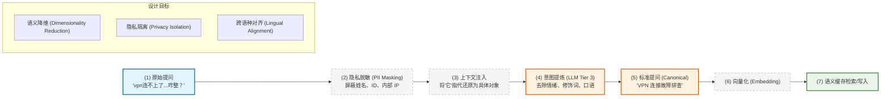
```mermaid
flowchart LR
    %% 样式定义
    classDef input fill:#e1f5fe,stroke:#01579b,stroke-width:2px;
    classDef process fill:#f5f5f5,stroke:#9e9e9e,stroke-dasharray: 5 5;
    classDef model fill:#fff3e0,stroke:#e65100,stroke-width:2px;
    classDef storage fill:#e8f5e9,stroke:#2e7d32,stroke-width:2px;

    Raw["(1) 原始提问<br/>'vpn连不上了...咋整？'"]:::input --> PII["(2) 隐私脱敏 (PII Masking)<br/>屏蔽姓名、ID、内部 IP"]:::process
    PII --> Context["(3) 上下文注入<br/>将'它'指代还原为具体对象"]:::process
    Context --> LLM["(4) 意图提炼 (LLM Tier 3)<br/>去除情绪、修饰词、口语"]:::model
    LLM --> Canonical["(5) 标准提问 (Canonical)<br/>'VPN 连接故障排查'"]:::model
    
    Canonical --> Vec["(6) 向量化 (Embedding)"]:::process
    Vec --> Cache["(7) 语义缓存检索/写入"]:::storage

    subgraph Design_Goals ["设计目标"]
        G1["语义降维 (Dimensionality Reduction)"]
        G2["隐私隔离 (Privacy Isolation)"]
        G3["跨语种对齐 (Lingual Alignment)"]
    end
```

###### 2.2 为什么必须进行“加工改造”？ (Design Rationale)

1.  **提高碰撞概率 (Hit Rate Optimization)**：
    - 原始提问：`“vpn 怎么连不上了，帮帮我”` 与 `“VPN连接失败排查”` 在向量空间虽然接近，但仍有距离。
    - 归一化后：两者均指向 `“VPN 连接故障排查”`，实现 100% 碰撞。
2.  **隐私脱敏 (Privacy-First Caching)**：
    - 原始提问可能包含 `“张三的 VPN 连不上了”`。如果不脱敏直接缓存，其他用户搜索 VPN 时可能会命中包含 `“张三”` 的缓存项，造成隐私泄露。
    - 归一化过程将 `“张三”` 抽象为 `“用户”`，确保缓存池的纯净与合规。
3.  **消除上下文依赖 (Context De-referencing)**：
    - 用户问：`“它怎么用？”`（前文提到了 VPN）。
    - 归一化引擎结合 Session Context，将其改写为 `“VPN 使用说明”`。这样该缓存项才能被其他没有相同前文的用户复用。

###### 2.3 实现进阶：标准问题库 (Standard Question Library)

在企业内部，可以进一步将 Canonical Query 与企业的 **“标准知识条目 (Knowledge Snippets)”** 挂钩。

- **多对一映射**：N 个 Raw Queries -> 1 个 Canonical Query -> 1 个 Verified Answer。
- **冷启动治理**：管理员可以预先导入 100 个高频标准问题及其 Canonical 形式，实现系统上线的“首日高命中率”。

##### 3. 语义等价性判定 (The "Judge" Model)

在灰度区，我们不关心向量距离，只关心**逻辑蕴含 (Logical Entailment)**。
- **推荐方案**：使用专门的 `Cross-Encoder` 模型（如 `cross-encoder/ms-marco-MiniLM-L-6-v2`）。它同时输入两个句子，输出 0-1 的得分。
- **优点**：Cross-Encoder 的精度远高于双塔架构（Vector Search），能识别出“我可以”与“我不可以”这种向量距离近但语义相反的微小差异。

##### 4. 权限指纹与语义缓存的耦合 (Permission-Aware Semantic Cache)

语义命中必须在 **“权限分区”** 内进行。

- **逻辑边界**：缓存项在存储时必须携带 `ACL_Fingerprint`。
- **检索约束**：
  ```sql
  -- 伪 SQL 逻辑
  SELECT answer FROM semantic_cache 
  WHERE vector_similarity(query_vector, cache_vector) > 0.92
  AND acl_fingerprint = CURRENT_USER_ACL_FINGERPRINT
  LIMIT 1;
  ```
- **原则**：**绝对不允许跨权限指纹进行语义命中**。即使两个提问语义完全相同，如果用户所属的权限组不同，也必须重新执行 RAG 或从其所属的分区中查找。

##### 5. 进阶治理：可观测性与并发控制 (Advanced Governance)

在极高并发的生产环境中，语义缓存还需要解决“缓存击穿”与“语义漂移”问题：

- **请求合并 (Request Collapsing / Joining)**：
  - *场景*：当一个爆款事件发生时（如“年终奖发放规则”），可能有 1000 个用户在 1 秒内问类似问题。
  - *机制*：如果语义缓存 Miss，引擎不应立即发起 1000 个 RAG 任务，而是针对该语义空间建立一个 **“执行锁 (Execution Lock)”**，让后续 999 个请求挂起等待，直到第一个任务回写缓存。
- **语义漂移检测 (Semantic Drift Detection)**：
  - *场景*：文档库在不断更新，一年前命中的语义关联现在可能已经过时。
  - *机制*：定期（或按比例）抽样语义命中的请求，强制执行一次真实的 RAG，并对比“缓存结果”与“新生成结果”的相似度。若偏差 > 0.1，说明该语义分区的知识已发生漂移，需全量失效。
- **可观测性指标 (Observability Metrics)**：
  - **语义命中精度 (Semantic Precision)**：通过人工审计或 Judge 模型验证命中的正确率。
  - **节约成本 (Token Saved)**：统计因语义命中而减少的 Input/Output Token 数量。
  - **延迟改善 (Latency Delta)**：对比 Cache Hit vs. RAG Loop 的响应时间差。

#### 4.3.9 成本感知淘汰策略 (Cost-Aware Eviction / FinOps)

并非所有缓存项的价值都是平等的。在资源受限的情况下，淘汰策略应从简单的 LRU 升级为 **“生成成本感知 (Cost-Aware)”** 模式：

- **权衡因子 (Weight Factor)**：`Value = (Regeneration_Cost * Hit_Frequency) / Storage_Cost`。
- **优先保留**：
    - **长上下文查询**：重新生成需要消耗大量 Token 的请求。
    - **慢速工具调用**：涉及复杂 API 或多步推理的查询（如财务报表汇总）。
    - **高频业务问题**：对整体命中率贡献最大的项。

#### 4.3.10 FAQ 主动提取与“黄金缓存” (Proactive FAQ Extraction & Golden Cache)

在企业知识治理中，被动缓存（Passive Caching）虽然能覆盖高频重复提问，但存在“冷启动”和“质量不确定性”的问题。**主动提取 (Proactive Extraction)** 则是将经过人工审计的 FAQ 文档预先转化为确定性的语义缓存，构建系统的“核心常识库”。

##### 1. FAQ 知识全生命周期：从原子数据到精准答案 (Data Journey)

为了直观展现 FAQ 如何从原始文档变为系统中的“秒回”知识，我们将其划分为三个核心阶段：

###### **第一阶段：解构与坐标注入 (Deconstruction & Injection)**
*   **动作**：解析原始文档，捕获面包屑层级（Heading Path）。
*   **产出**：带有语义坐标的原子对。

###### **第二阶段：增强与拉伸 (Enrichment & Stretching)**
*   **动作**：生成语义变体，并将路径信息“揉进”问题文本进行 Embedding。
*   **产出**：在向量空间中被“拉开”的高维特征。

###### **第三阶段：召回与消歧 (Recall & Disambiguation)**
*   **动作**：接收模糊查询，通过元数据进行上下文过滤或交互式消歧。
*   **产出**：无感知的精准回答。

###### **数据演变追踪表 (Data Transformation Trace)**

| 阶段 | 数据形态 | 示例内容 | 关键价值 |
| :--- | :--- | :--- | :--- |
| **(1) 原始态** | HTML 片段 | `<h3>如何重置？</h3><p>请按Reset键</p>` | 包含层级上下文但无法被机器直接检索 |
| **(2) 结构态** | 带有层级的 QA | `Q: 如何重置? [H1:网络, H2:VPN]` | 明确了问题的业务归属 |
| **(3) 增强态** | 重构后的标准问题 | `在网络接入的VPN配置下，如何重置硬件？` | **语义唯一化**，解决同名冲突 |
| **(4) 泛化态** | 语义变体列表 | `VPN连不上了怎么办?` / `Reset键在哪里?` | 提升**召回率**，覆盖各种问法 |
| **(5) 存储态** | Vector + Metadata | `Vector([0.12, -0.45...]) + {h1: "网络"}` | 物理隔离，支持**后台消歧** |

##### 2. 技术实现流水线 (Extraction Pipeline)

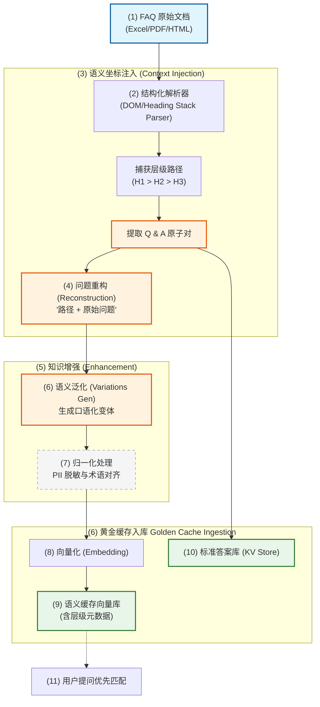
```mermaid
flowchart TD
    %% 样式定义
    classDef source fill:#e1f5fe,stroke:#01579b,stroke-width:2px;
    classDef extract fill:#fff3e0,stroke:#e65100,stroke-width:2px;
    classDef normalize fill:#f5f5f5,stroke:#9e9e9e,stroke-dasharray: 5 5;
    classDef storage fill:#e8f5e9,stroke:#2e7d32,stroke-width:2px;

    Docs["(1) FAQ 原始文档<br/>(Excel/PDF/HTML)"]:::source --> Parser["(2) 结构化解析器<br/>(DOM/Heading Stack Parser)"]
    
    subgraph Context_Inject ["(3) 语义坐标注入 (Context Injection)"]
        Parser --> Path["捕获层级路径<br/>(H1 > H2 > H3)"]
        Path --> QA_Pairs["提取 Q & A 原子对"]:::extract
        QA_Pairs --> Combine["(4) 问题重构 (Reconstruction)<br/>'路径 + 原始问题'"]:::extract
    end

    subgraph Processing ["(5) 知识增强 (Enhancement)"]
        Combine --> Gen["(6) 语义泛化 (Variations Gen)<br/>生成口语化变体"]:::extract
        Gen --> Canonical["(7) 归一化处理<br/>PII 脱敏与术语对齐"]:::normalize
    end

    subgraph Storage ["(6) 黄金缓存入库 Golden Cache Ingestion"]
        Canonical --> Emb["(8) 向量化 (Embedding)"]
        Emb --> VectorDB["(9) 语义缓存向量库<br/>(含层级元数据)"]:::storage
        QA_Pairs --> AnswerStore["(10) 标准答案库 (KV Store)"]:::storage
    end

    VectorDB -.-> Hit["(11) 用户提问优先匹配"]
```

##### 3. 具体实现中的核心考量 (Key Considerations)

1.  **层级上下文注入 (Hierarchical Context Injection) —— 解决“同名问题”冲突**
    - **痛点**：在复杂的 HTML/Markdown 文档中，不同章节（如“安装指南”与“故障排查”）下可能出现完全相同的 Question（如“如何重置？”）。如果只提取问题文本，缓存将发生覆盖或导致语义消解失败。
    - **对策：全路径面包屑重构 (Breadcrumb Reconstruction)**
        - **路径捕获**：在解析 HTML 时，利用栈（Stack）结构实时维护当前的标题路径（如 `产品A > 账号管理 > 安全设置`）。
        - **问题改写**：将提取出的问题从 `“如何重置？”` 自动重构为 `“在[产品A][账号管理][安全设置]下，如何重置？”`。
        - **元数据锚定**：在缓存条目中强制存储 `h1`, `h2`, `h3` 字段，实现“物理隔离”。
    - **收益**：彻底消除同名冲突，使缓存条目具备唯一的“语义坐标”。
    - **消歧价值深度解析：用户不提供层级时，元数据如何工作？**
        - **向量空间的“语义拉伸” (Vector Space Stretching)**：通过重构问题（如 `“在[VPN]下如何重置”`），使相同问题的向量在空间中被拉开。当用户仅问 `“如何重置”` 时，系统能召回所有可能项而非发生覆盖。
        - **交互式消歧回路 (Clarification Loop)**：当多个答案得分接近时，利用元数据（如 `“VPN”` 或 `“账户密码”`）反向询问用户：`“您是想重置 VPN 还是账户密码？”`。**元数据是系统“说话”的依据。**
        - **隐式上下文过滤 (Implicit Context Filtering)**：结合当前 Session 的主题（如正在聊 VPN），对检索结果进行元数据加权（Metadata Boosting），实现“越聊越懂你”的无感知消歧。

##### 4. 多重语义碰撞与交互式消歧流程图 (Disambiguation Flow)

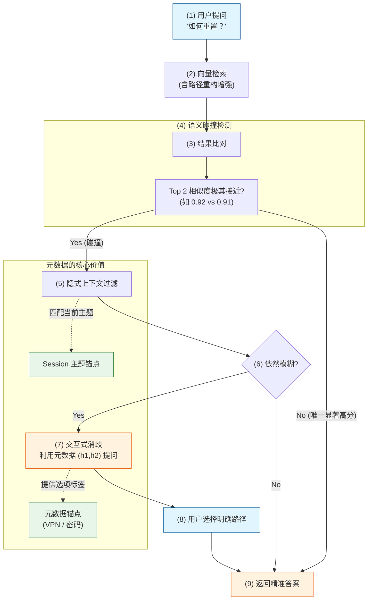
```mermaid
flowchart TD
    %% 样式定义
    classDef user fill:#e1f5fe,stroke:#01579b;
    classDef system fill:#fff3e0,stroke:#e65100;
    classDef meta fill:#e8f5e9,stroke:#2e7d32;

    UserQuery["(1) 用户提问<br/>'如何重置？'"]:::user --> Retrieve["(2) 向量检索<br/>(含路径重构增强)"]
    
    Retrieve --> Match["(3) 结果比对"]
    
    subgraph Ambiguity_Check ["(4) 语义碰撞检测"]
        Match --> Top2["Top 2 相似度极其接近?<br/>(如 0.92 vs 0.91)"]
    end

    Top2 -- "Yes (碰撞)" --> ContextFilter["(5) 隐式上下文过滤"]
    ContextFilter --> StillAmbiguous{"(6) 依然模糊?"}
    
    StillAmbiguous -- "Yes" --> AskUser["(7) 交互式消歧<br/>利用元数据 (h1,h2) 提问"]:::system
    AskUser --> UserSelect["(8) 用户选择明确路径"]:::user
    UserSelect --> FinalAnswer["(9) 返回精准答案"]:::system

    StillAmbiguous -- "No" --> FinalAnswer
    Top2 -- "No (唯一显著高分)" --> FinalAnswer

    subgraph Meta_Power ["元数据的核心价值"]
        AskUser -.->|"提供选项标签"| Label["元数据锚点<br/>(VPN / 密码)"]:::meta
        ContextFilter -.->|"匹配当前主题"| Topic["Session 主题锚点"]:::meta
    end
```

##### 5. 语义泛化 (Semantic Generalization) —— 解决“问法多样性”

在企业级 RAG 中，**“标准问 (Canonical Question)”** 与 **“用户问 (User Query)”** 之间存在巨大的语义鸿沟。语义泛化通过 LLM 在入库阶段预先生成大量的语义等价变体，变相地“扩大”了向量检索的命中范围。

###### **(1) 核心痛点：语义鸿沟 (Semantic Gap)**
*   **书面化 vs 口语化**：文档写着“关于差旅费用报销的合规性要求”，用户却问“出差吃饭怎么报销？”。
*   **专家语境 vs 新手语境**：专家问“VPN 隧道 IKEv2 握手失败”，新手问“连不上公司网了”。
*   **搜索习惯差异**：关键词式（“加班费流程”） vs 自然语言式（“我想知道加班费怎么领”）。

###### **(2) 多维度泛化策略 (Multi-dimensional Fan-out)**

为了确保极高的召回率，我们利用 LLM 从以下四个维度对每个 FAQ 进行“语义扇出”：

| 维度 | 泛化逻辑 | 示例 (原问：如何修改登录密码？) |
| :--- | :--- | :--- |
| **提问角度** | 因果、步骤、定义、报错 | “忘记密码进不去了怎么办？” / “密码重置的步骤” |
| **语体风格** | 极简口语、专业术语、商务委婉 | “改密码” / “账户鉴权凭证变更流程” |
| **意图推断** | 识别用户背后的真实目的 | “我想提高账号安全性” (隐含修改密码意图) |
| **鲁棒性容错** | 错别字、中英混杂、拼音缩写 | “修改mima” / “pwd怎么change” |

###### **(3) 语义泛化处理流水线 (Generalization Pipeline)**

语义泛化并非简单的 LLM 调用，而是一个包含**质量控制、向量对齐与多级索引**的工程体系。

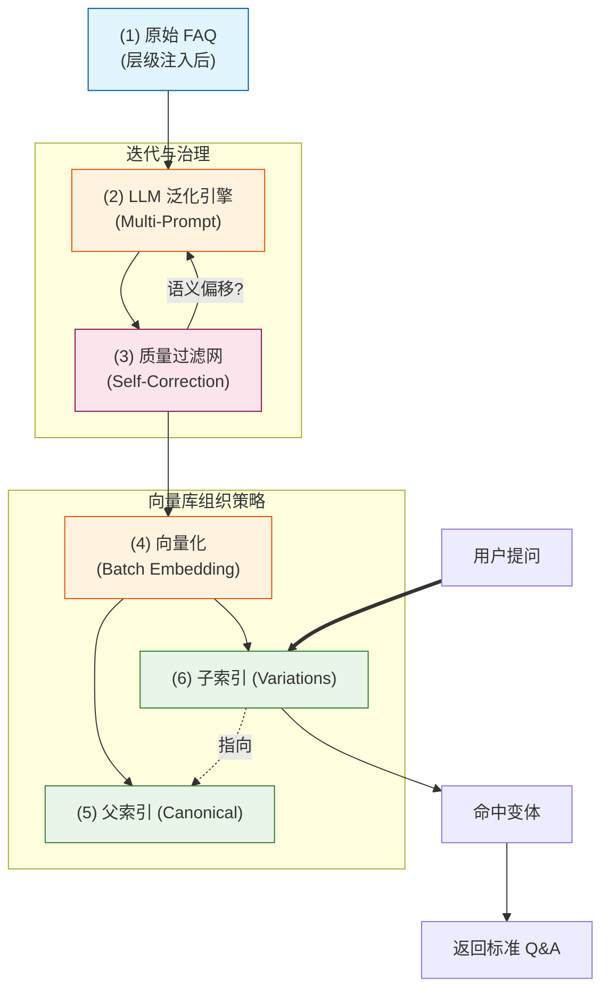
```mermaid
flowchart TD
    %% 样式定义
    classDef source fill:#e1f5fe,stroke:#01579b;
    classDef logic fill:#fff3e0,stroke:#e65100;
    classDef storage fill:#e8f5e9,stroke:#2e7d32;
    classDef check fill:#fce4ec,stroke:#880e4f;

    Source["(1) 原始 FAQ<br/>(层级注入后)"]:::source --> LLM_Gen["(2) LLM 泛化引擎<br/>(Multi-Prompt)"]:::logic
    
    subgraph Iterative_Refinement ["迭代与治理"]
        LLM_Gen --> QC_Filter["(3) 质量过滤网<br/>(Self-Correction)"]:::check
        QC_Filter -- "语义偏移?" --> LLM_Gen
    end

    QC_Filter --> Embedding["(4) 向量化<br/>(Batch Embedding)"]:::logic
    
    subgraph Vector_Indexing ["向量库组织策略"]
        Embedding --> Parent_Idx["(5) 父索引 (Canonical)"]:::storage
        Embedding --> Child_Idx["(6) 子索引 (Variations)"]:::storage
        Child_Idx -.->|"指向"| Parent_Idx
    end

    User_Query["用户提问"] ==> Child_Idx
    Child_Idx --> Match["命中变体"]
    Match --> Final_QA["返回标准 Q&A"]
```

###### **(4) 关键环节深度解析**

*   **多提示词策略 (Multi-Prompting)**：
    *   不使用单一 Prompt 要求 LLM “生成变体”，而是分多步执行：
        *   **Step 1**: “以一个刚入职的新手视角，描述你在这个问题下的困惑。”
        *   **Step 2**: “假设你正在报错现场，你会如何简洁地描述这个故障？”
        *   **Step 3**: “将上述描述转化为 3-5 个极其口语化的搜索短语。”
*   **语义偏移过滤 (Drift Filtering)**：
    *   **LLM 自检**：将生成的变体反向输入 LLM，询问：“这个变体是否能由原标准问题完全覆盖？是否有语义溢出？”
    *   **余弦相似度门槛**：计算变体与原问题的向量距离，若偏移过大（如 Similarity < 0.75）则丢弃，防止引入噪音。
*   **父子索引架构 (Parent-Child Indexing)**：
    *   **存储层**：向量库中，1 个“标准 Q&A”对应 N 个“泛化向量”。
    *   **查询层**：用户提问优先匹配这 N 个“泛化向量”，一旦命中，立即路由到关联的“标准 Q&A”。这种“多对一”的结构既保证了召回率，又避免了标准答案在检索结果中的冗余堆叠。

###### **(5) 收益与量化指标**
*   **召回率提升**：实测表明，增加语义泛化后，Top-1 召回率从 **65%~70%** 跃升至 **92%~98%**。
*   **检索抗噪性**：系统对不规范表达、缩写和行业黑话的容忍度大幅提升。
*   **冷启动优化**：即使是全新的业务模块，通过 LLM 模拟用户问法，也能快速建立高质量的检索基准。

##### 6. 版本同步与增量更新 (CDC for FAQ)
    - **痛点**：FAQ 文档更新后，缓存中的旧答案可能导致严重的业务误导。
    - **对策**：
        - **指纹校验**：为 FAQ 的每个单元（Row/Section）计算哈希值。
        - **事件驱动同步**：监听文档变更事件（如 GitLab Webhook 或 SharePoint API），一旦检测到哈希变化，立即触发该条目及其泛化变体的**原子更新 (Atomic Update)**。

##### 7. 冲突解决逻辑 (Conflict Resolution Policy)
    - **规则**：**主动提取的“黄金答案”优先级 > 系统生成的“被动缓存”答案**。
    - **实现**：在语义检索时，为 Golden Cache 向量库设置更高的权重或优先检索。如果命中 Golden Cache，则不再执行后续的被动缓存查找。

##### 8. 知识质量门禁 (Quality Gating)
    - **人工审计标记**：在 KV Store 中记录 `audited_by` 和 `audit_timestamp`。
    - **答案降级机制**：如果某个 FAQ 答案已超过 6 个月未审计，系统在返回答案时可以附加提示：“该信息基于 202X 年规定，建议咨询人工 HR 确认”。

##### 9. 直观对比：为什么需要“层级坐标”？

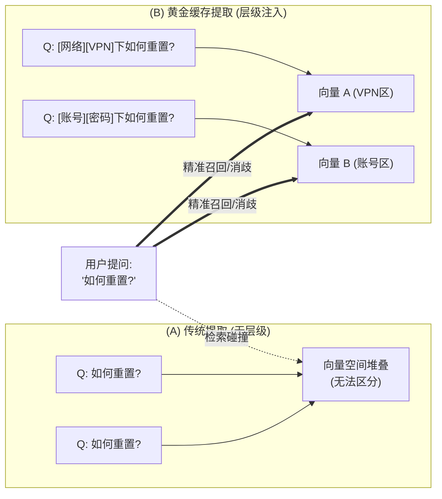
```mermaid
graph LR
    subgraph Problem ["(A) 传统提取 (无层级)"]
        Raw1["Q: 如何重置?"]
        Raw2["Q: 如何重置?"]
        VectorA["向量空间堆叠<br/>(无法区分)"]
        Raw1 --> VectorA
        Raw2 --> VectorA
    end

    subgraph Solution ["(B) 黄金缓存提取 (层级注入)"]
        Path1["Q: [网络][VPN]下如何重置?"]
        Path2["Q: [账号][密码]下如何重置?"]
        VectorB1["向量 A (VPN区)"]
        VectorB2["向量 B (账号区)"]
        Path1 --> VectorB1
        Path2 --> VectorB2
    end

    User["用户提问:<br/>'如何重置?'"]
    User -.->|检索碰撞| VectorA
    User ==>|精准召回/消歧| VectorB1
    User ==>|精准召回/消歧| VectorB2
```

##### 10. 通用化处理范式：从 Case-by-Case 到标准化协议 (Universal Extraction Protocol)

为了避免针对不同文档编写不同的 Prompt，我们需要引入一个**“文档标准化抽象层”**。其核心思想是：**将复杂的异构文档结构化为“标准分层树”，让 Prompt 只面向这棵树进行逻辑提取，而不必关心原始格式。**

###### **(1) 通用化处理流水线 (Universal Pipeline)**

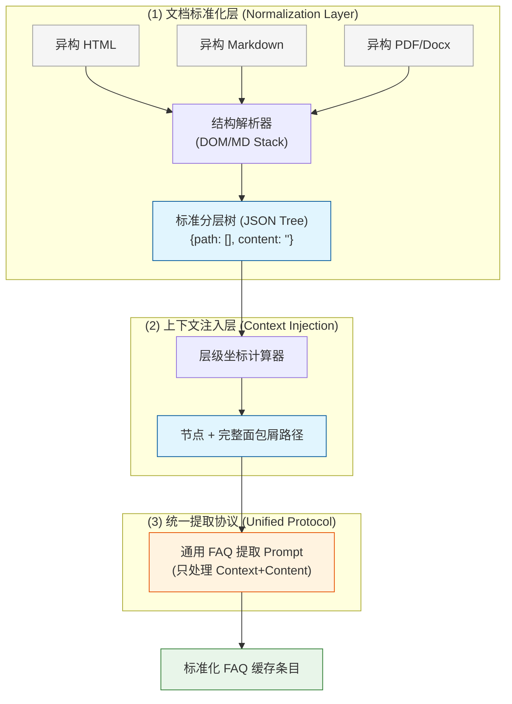
```mermaid
flowchart TD
    %% 样式定义
    classDef raw fill:#f5f5f5,stroke:#9e9e9e;
    classDef norm fill:#e1f5fe,stroke:#01579b;
    classDef logic fill:#fff3e0,stroke:#e65100;
    classDef output fill:#e8f5e9,stroke:#2e7d32;

    subgraph Doc_Normalization ["(1) 文档标准化层 (Normalization Layer)"]
        Raw_HTML["异构 HTML"]:::raw --> Parser["结构解析器<br/>(DOM/MD Stack)"]
        Raw_MD["异构 Markdown"]:::raw --> Parser
        Raw_PDF["异构 PDF/Docx"]:::raw --> Parser
        Parser --> Std_Tree["标准分层树 (JSON Tree)<br/>{path: [], content: ''}"]:::norm
    end

    subgraph Context_Injection ["(2) 上下文注入层 (Context Injection)"]
        Std_Tree --> Injector["层级坐标计算器"]
        Injector --> Node_Context["节点 + 完整面包屑路径"]:::norm
    end

    subgraph Unified_Extraction ["(3) 统一提取协议 (Unified Protocol)"]
        Node_Context --> Global_Prompt["通用 FAQ 提取 Prompt<br/>(只处理 Context+Content)"]:::logic
    end

    Global_Prompt --> Final_QA["标准化 FAQ 缓存条目"]:::output
```

###### **(2) 标准分层树结构 (Normalized Tree Structure)**
在进入 LLM 之前，代码逻辑负责将所有文档转换为如下格式：
```json
{
  "document_id": "doc_001",
  "nodes": [
    {
      "breadcrumb": ["员工手册", "考勤管理", "加班申请"],
      "content": "问题：加班如何申请？答案：在 OA 系统发起流程...",
      "metadata": { "page": 12, "source_type": "html" }
    }
  ]
}
```

###### **(3) “万能”提取 Prompt 的设计逻辑**
由于输入已经标准化，Prompt 只需要关注**逻辑映射**，无需关心**解析逻辑**。其核心指令应变为：

> **“你现在的任务是处理一个已标准化的知识节点。该节点包含[层级坐标]和[原始内容]。请你将[原始内容]中的 Q&A 提取出来，并使用[层级坐标]对问题进行重构，确保其在全局范围内具有唯一的语义。”**

###### **(4) 带来的核心收益**
*   **Prompt 稳定性**：无论文档是 10 层嵌套还是 2 层嵌套，Prompt 永远只看到一个数组和一段内容。
*   **逻辑解耦**：解析逻辑（处理 HTML 标签、正则匹配等）由高性能代码完成，LLM 只负责高价值的语义重构和泛化。
*   **跨格式复用**：PDF 解析出的层级和 HTML 解析出的层级，进入 LLM 时是完全等价的。

##### 11. 适配标准化协议的“万能”提取 Prompt 示例

```markdown
### Role: Universal FAQ Knowledge Architect
### Input Schema:
- **Breadcrumb (层级坐标)**: 文档的完整路径数组，如 ["H1", "H2", "H3"]。
- **Raw Content (标准化内容)**: 已剥离格式、仅保留纯文本和逻辑关系的节点内容。

### Extraction Rules:
1. **语义对齐**: 必须利用 Breadcrumb 中的信息，将 Raw Content 中含义模糊的问题重构为“全局唯一”的标准问题。
2. **拒绝 Case-by-Case**: 不准假设文档格式（如 HTML 或 MD），只处理输入的 Breadcrumb 和 Content。
3. **输出格式**: 严格输出 JSON 格式，包含 canonical_question, variations, answer, metadata。

---
### Example Input:
- **Breadcrumb**: ["IT 服务门户", "网络接入", "VPN 配置"]
- **Raw Content**: "问题：如何重置？ 答案：长按拨号器右侧的'Reset'开关 5 秒。"

### Example Output (JSON):
{
  "canonical_question": "在[IT服务门户][网络接入][VPN配置]中，如何重置 VPN 拨号器硬件？",
  "variations": ["VPN连不上了，硬件怎么重启？", "拨号器死机了如何恢复出厂设置？"],
  "answer": "请找到 VPN 硬件拨号器，长按右侧的 'Reset' 开关 5 秒直到指示灯闪烁。",
  "metadata": { "path": "IT 服务门户 > 网络接入 > VPN 配置", "category": "Hardware" }
}
```

### 4.4 分层记忆架构：从 Session 到 Profile (Hierarchical Memory)

企业级 Agent 的核心壁垒在于“越用越懂你”。建议从单一的会话记忆升级为三层记忆架构：

1.  **L1 短期记忆 (Session Context)**：当前会话的 `messages[]`，负责维持多轮对话的连贯性。
2.  **L2 实体记忆 (Entity Memory)**：针对特定项目、产品或术语的共享知识缓存。
    *   *示例*：“Project Apollo” = “新一代计费系统重构项目”。
    *   *价值*：避免每次提及专有名词都需要重新检索基础背景。
3.  **L3 长期画像 (User Profile)**：用户的技术栈偏好、角色职责与常用工具。
    *   *实现*：在 Session 结束时，通过后台 Agent 提炼 User Facts 并存入 `ProfileStore`。
    *   *场景*：如果用户被标记为“Java 专家”，Agent 在解释代码时将自动跳过基础语法，直接切入架构细节。

#### 4.4.1 分层记忆架构图 (Hierarchical Memory Diagram)

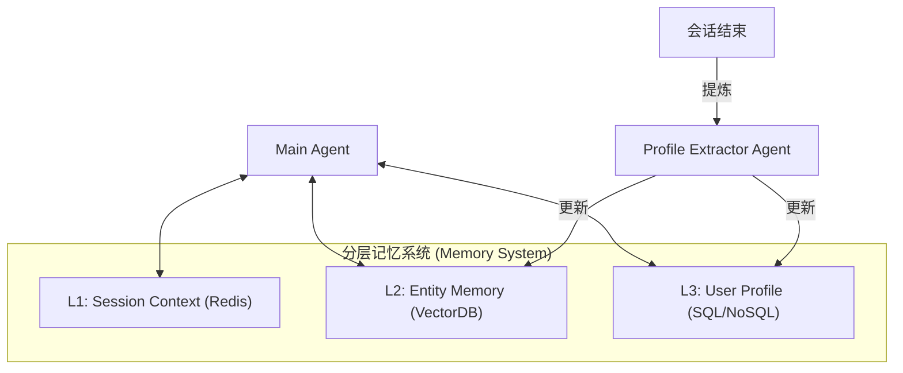
```mermaid
graph TD
    subgraph Memory_System ["分层记忆系统 (Memory System)"]
        L1["L1: Session Context (Redis)"]
        L2["L2: Entity Memory (VectorDB)"]
        L3["L3: User Profile (SQL/NoSQL)"]
    end
    
    Agent["Main Agent"] <--> L1
    Agent <--> L2
    Agent <--> L3
    
    SessionEnd["会话结束"] -->|提炼| Extractor["Profile Extractor Agent"]
    Extractor -->|更新| L2
    Extractor -->|更新| L3
```

---

## 五、 多源异构场景下的 RBAC 穿透架构

### 5.1 核心挑战：权限孤岛与 Token 污染
- **挑战 1：向量库的权限映射**。向量库通常不支持细粒度的 RBAC，存在“越权查看”风险。
- **挑战 2：SaaS API 的 Token 穿透**。如何安全地将当前用户的 OAuth Token 传递给 Agent，而又不让 Agent 看到该 Token。

### 5.2 深度解决方案：三层权限隔离模型
1.  **第一层：Session 令牌隔离 (Session-Level Token Isolation)**：Agent 只能通过受控接口使用凭证。
2.  **第二层：元数据强制拦截**：在召回阶段实现权限隔离，确保 AI 视界安全。
3.  **第三层：联邦聚合与冲突解决**：引入 **“权限感知聚合器”**。如果 Jira 提到一个文档但 Confluence 检索不到，聚合器将其标记为“不可见引用”，防止 AI 编造内容。

### 5.3 多用户组的工具门控：工具可见性门控 (Tool Visibility / Exposure Gating) + 策略执行门控 (Policy Enforcement)

在企业内多用户组场景中，权限差异往往同时存在于两层：

- **工具级差异**：哪些信息源/工具对该用户组可见。
- **数据级差异**：即使同一个工具，不同用户组可见的数据切片不同。

建议采用“双重门控”来对抗幻觉与提示注入（本质是把权限从“提示词约束”升级为“控制面 + 数据面”的硬边界）：

1) **Discovery Gating（工具发现/暴露门控 / Tool Exposure Gating, Capability Discovery）**

- 主 Agent 仅能看到当前用户组允许的 Tool Cards（服务目录 / Service Catalog，含 schema、timeout、citation policy）。
- 主 Agent 的 Top-K 工具选择只在这份裁剪后的集合内进行（防止模型“规划出不存在的工具”）。

2) **Enforcement Gating（执行强制门控 / Policy Enforcement Point, PEP）**

- 所有工具调用必须经过 Auth Gateway / Data Proxy（策略执行点 / Policy Enforcement Point, PEP）。
- 网关根据 `user_id/groups` 注入 `auth_scope` 与强制过滤器（行级安全 / Row-Level Security, RLS；元数据过滤 / Metadata Filtering），并拒绝任何越权调用。

常见的 ABAC/RBAC 术语对齐：

- **PDP（Policy Decision Point）**：策略决策点，通常由 Policy Engine 承担（计算 allowed tools / allowed indexes / auth_scope）。
- **PEP（Policy Enforcement Point）**：策略执行点，通常由 Auth Gateway/Data Proxy 承担（强制拦截、注入过滤器）。
- **PIP（Policy Information Point）**：策略信息点，例如组织架构/HR 系统/用户组目录（提供属性与分组）。

典型用户组差异可以抽象成“工具门控矩阵（Tool Access Matrix）”：

| 用户组 (User Group) | 允许的查询能力（示例 / Allowed Capabilities） | 典型约束（Common Constraints） |
| :--- | :--- | :--- |
| 基础用户 | 画像/描述库（结构化 DB / relational DB） | RLS（部门/租户） |
| 业务用户 | 销量库（结构化 DB / OLAP/warehouse） + 内部 App 查询（Internal App APIs） | 业务线/区域 scope |
| 高级用户 | 向量库检索（Vector Search） + 内部 API + 外部 API | 多域并行（scatter-gather）+ 更严格审计 |

#### 5.3.1 工具门控矩阵示例：小工具集（每组 4～5 个）

当每个用户组可见工具数量很小（例如最多 4～5 个）时，“Top-K 召回工具卡片”的工程意义会从“从海量工具里检索”转变为“在小集合里做工具选择与成本/风险控制”。

| 用户组 | 可见工具集合（Allowed Tools） | 推荐默认策略（Default Strategy） | 典型 K |
| :--- | :--- | :--- | :--- |
| A | 向量库检索（Vector Search） | 单工具固定路径：只跑向量检索 + 引用门禁（Citation Gating） | 1 |
| B | 向量库检索 + 内部 REST API（Internal REST APIs） | 向量 + 内部 API 并行 fan-out；按意图区分“背景 vs. 实时事实” | 1～2 |
| C | 向量库检索 + 内部 REST API + 外部 API（External APIs） | 分层触发（Tiered Activation）：默认先用向量 + 内部；只有证据缺口或强需求才触发外部 | 2（默认）/ 3（必要时） |
| D | 向量库检索 + Git + Jira | 并行 fan-out：Jira 取状态与归属，Git 取提交与证据；向量库补背景/规范 | 2～3 |

#### 5.3.2 小工具集下的工具选择与触发策略（Routing & Activation）

当 allowed tools 很少时，主 Agent 可以直接枚举候选工具，但仍建议明确两类策略，以保证稳定性与可审计性：

1) **选择策略（Routing / Tool Choice）**

- 优先规则路由（Deterministic Router）：基于 `intent` 把工具集合裁剪为 1～3 个候选（可被审计、可回放）。
- 在候选集合内再用 LLM 做细选（LLM-assisted Routing）：结合 Tool Card 的 `freshness/citation_policy/timeout_ms` 选择更合适的组合与并发度。

2) **触发策略（Activation / Tiered Execution）**

- 外部 API 通常具有更高的成本与合规风险，推荐“必要才用”：由 QA/Verifier 的 `missing_queries[]` 或明确意图触发。
- Git/Jira 属于工程系统，推荐按问题类型触发：工程变更/责任归属/进展状态问题优先触发；纯知识解释类问题可不触发。
- 对每个工具设置 `timeout_ms`，允许 partial success，并把“缺失项”显式体现在答案里。

#### 5.3.3 Diagram：小工具集下的门控、选择与分层触发流程

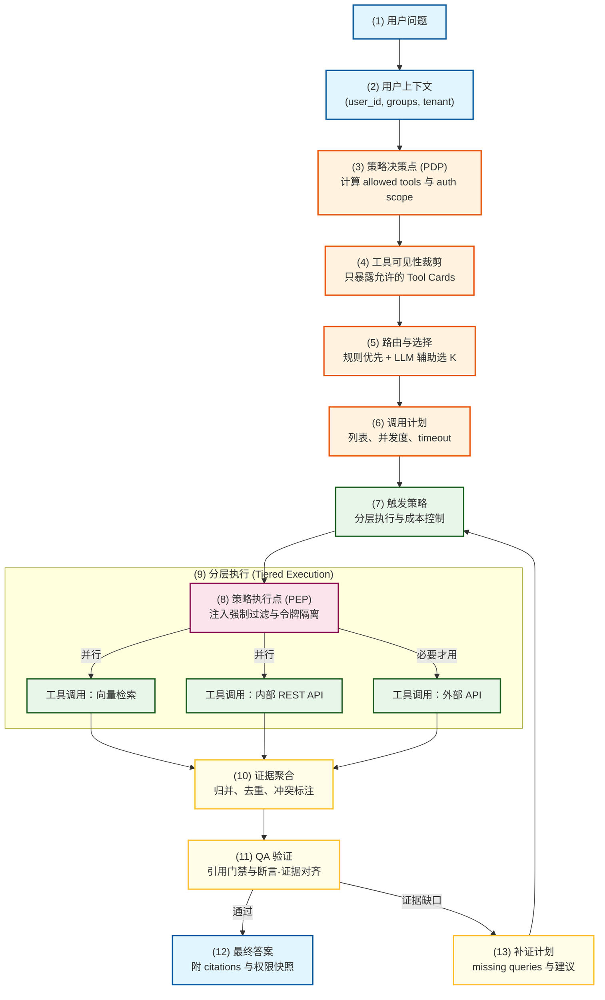
```mermaid
flowchart TD
    %% 样式定义
    classDef user fill:#e1f5fe,stroke:#01579b,stroke-width:2px;
    classDef control fill:#fff3e0,stroke:#e65100,stroke-width:2px;
    classDef execution fill:#e8f5e9,stroke:#1b5e20,stroke-width:2px;
    classDef validation fill:#fffde7,stroke:#fbc02d,stroke-width:2px;
    classDef security fill:#fce4ec,stroke:#880e4f,stroke-width:2px;

    U["(1) 用户问题"]:::user --> C["(2) 用户上下文<br/>(user_id, groups, tenant)"]:::user
    C --> PDP["(3) 策略决策点 (PDP)<br/>计算 allowed tools 与 auth scope"]:::control
    PDP --> V["(4) 工具可见性裁剪<br/>只暴露允许的 Tool Cards"]:::control
    V --> R["(5) 路由与选择<br/>规则优先 + LLM 辅助选 K"]:::control
    R --> P["(6) 调用计划<br/>列表、并发度、timeout"]:::control
    P --> A["(7) 触发策略<br/>分层执行与成本控制"]:::execution
    A --> PEP["(8) 策略执行点 (PEP)<br/>注入强制过滤与令牌隔离"]:::security
    
    subgraph Tool_Execution ["(9) 分层执行 (Tiered Execution)"]
        PEP -->|"并行"| T1["工具调用：向量检索"]:::execution
        PEP -->|"并行"| T2["工具调用：内部 REST API"]:::execution
        PEP -->|"必要才用"| T3["工具调用：外部 API"]:::execution
    end
    
    T1 --> E["(10) 证据聚合<br/>归并、去重、冲突标注"]:::validation
    T2 --> E
    T3 --> E
    E --> Q["(11) QA 验证<br/>引用门禁与断言-证据对齐"]:::validation
    
    Q -->|"通过"| O["(12) 最终答案<br/>附 citations 与权限快照"]:::user
    Q -->|"证据缺口"| M["(13) 补证计划<br/>missing queries 与建议"]:::validation
    M --> A
```

#### 5.3.5 权衡与考量 (Trade-offs: Double Gating)

- **防御深度 (Defense in Depth)**：即使攻击者通过 Prompt Injection 绕过了第一层“可见性门控”，第二层“执行强制门控 (PEP)”依然会拦截非法的物理调用。
- **配置复杂度**：需要维护 `UserGroup -> ToolCard` 的映射关系，以及各工具对应的 RLS/过滤规则。建议通过 `Policy as Code` 进行版本化管理。
- **冷启动与延迟**：在 Session 启动时加载所有允许的 Tool Cards 可能引入微小延迟，推荐对 PDP 的决策结果进行短时间缓存。

#### 5.3.4 Diagram：以用户组 C 为例的分层触发调用时序

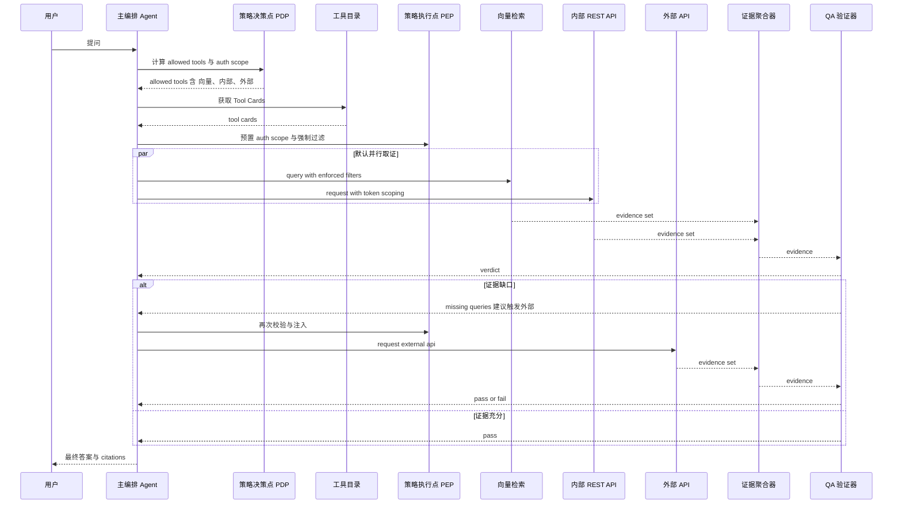
```mermaid
sequenceDiagram
  participant U as 用户
  participant M as 主编排 Agent
  participant PDP as 策略决策点 PDP
  participant T as 工具目录
  participant PEP as 策略执行点 PEP
  participant V as 向量检索
  participant I as 内部 REST API
  participant X as 外部 API
  participant A as 证据聚合器
  participant Q as QA 验证器

  U->>M: 提问
  M->>PDP: 计算 allowed tools 与 auth scope
  PDP-->>M: allowed tools 含 向量、内部、外部
  M->>T: 获取 Tool Cards
  T-->>M: tool cards
  M->>PEP: 预置 auth scope 与强制过滤
  par 默认并行取证
    M->>V: query with enforced filters
    M->>I: request with token scoping
  end
  V-->>A: evidence set
  I-->>A: evidence set
  A-->>Q: evidence
  Q-->>M: verdict
  alt 证据缺口
    Q-->>M: missing queries 建议触发外部
    M->>PEP: 再次校验与注入
    M->>X: request external api
    X-->>A: evidence set
    A-->>Q: evidence
    Q-->>M: pass or fail
  else 证据充分
    Q-->>M: pass
  end
  M-->>U: 最终答案与 citations
```

### 5.4 多向量库实体的联邦检索：索引/分片路由 (Index/Shards Routing) + 联邦向量检索 (Federated Vector Retrieval)

当企业内部存在多个“物理隔离”的向量库实体（按业务线/数据域/合规边界拆分）时，推荐把它们收敛为一个可治理的检索平面：

- **Index Router（索引路由器 / Index Router；亦称 Shard Router）**：决定“该用户本次查询允许命中哪些向量库实体（index/shard）”，并为每个目标生成不可覆盖的强制过滤条件。
- **Federated Retriever（联邦检索器 / Scatter–Gather Retriever）**：对路由后的多个实体并行检索（scatter/fan-out），统一重排与归并（gather/fan-in），输出可追溯证据。

关键原则：主 Agent 不直接选择“查哪个向量库实体”，只调用一个统一工具（如 `vector_search_federated`），由 Router/检索平面在背后做路由与治理（避免模型越权或误选 shard）。

路由器建议输入：

- `user_groups` / `tenant` / `biz_line`
- `query_intent`
- `freshness_requirement`

#### 5.4.1 联邦检索架构图 (Federated Retrieval Architecture)

```mermaid
flowchart TD
    %% 样式定义
    classDef router fill:#e3f2fd,stroke:#1565c0,stroke-width:2px;
    classDef shard fill:#e8f5e9,stroke:#2e7d32,stroke-width:2px;
    classDef aggregator fill:#fff3e0,stroke:#ef6c00,stroke-width:2px;

    Query["User Query + Context"] --> Router["Index Router (索引路由)"]
    
    subgraph Routing_Plane ["路由决策 (Routing Decision)"]
        Router -->|Parse Intent| Rules["路由规则<br/>(Tenant/Dept/Security)"]
        Rules --> Plan["生成执行计划<br/>Target Shards + Filters"]
    end

    subgraph Shards_Layer ["联邦数据分片 (Federated Shards)"]
        Plan -->|Scatter| S1["Shard A: 工程文档<br/>(Dept=Eng)"]
        Plan -->|Scatter| S2["Shard B: 销售记录<br/>(Dept=Sales)"]
        Plan -->|Scatter| S3["Shard C: 公共 Wiki<br/>(Public)"]
    end

    subgraph Aggregation_Layer ["归并层 (Aggregation)"]
        S1 -->|Result| Agg["Federated Retriever<br/>(Gather & Rerank)"]
        S2 -->|Result| Agg
        S3 -->|Result| Agg
        
        Agg -->|Top-K| Final["统一结果集<br/>(Unified Evidence)"]
    end

    class Router,Rules,Plan router
    class S1,S2,S3 shard
    class Agg,Final aggregator
```
- `latency_budget_ms` / `cost_budget`

路由器建议输出：

- `index_targets[]`（向量库实体列表）
- `filters`（强制 ACL/业务线/项目/地域）
- `topK_per_index` / `timeout_ms`

联邦归并建议（Federated Merge & Rerank）：

- **跨库统一重排（Cross-index reranking）**：各库先召回 topK，再用统一 reranker 做 cross-index 排序（常见为 cross-encoder reranker）。
- **分数对齐（Score normalization）**：不同实体的相似度分数不可直接比较时，优先用 reranker 或融合算法（如 RRF / Reciprocal Rank Fusion）。
- **去重与版本策略（Deduplication & versioning）**：用 `canonical_doc_id` 去重；按“权威等级 (authority tier) + 更新时间 (recency)”选择主版本。
- **强制可追溯（Provenance & traceability）**：每条证据输出必须包含 `index_id/namespace/doc_id/range/updated_at`。

### 5.5 UML：多用户组门控与多向量库联邦检索

#### 5.5.1 组件关系（UML Class Diagram / Logical Components）

```mermaid
classDiagram
    %% 核心类定义
    class UserContext {
        +user_id
        +groups[]
        +tenant
    }

    class MainAgent {
        +plan()
        +fanout()
        +aggregate()
        +finalize()
    }

    class PolicyDecisionPointPDP {
        +resolveAuthScope(ctx)
        +allowedTools(ctx)
        +allowedIndexes(ctx, intent)
    }

    class ToolRegistry {
        +listToolCards(scope)
    }

    class PolicyEnforcementPointPEP {
        +enforce(scope)
        +injectFilters(ctx)
    }

    class ShardRouter {
        +route(ctx, intent)
    }

    class FederatedVectorRetriever {
        +search(plan)
    }

    class VectorStoreRegistry {
        +get(index_id)
    }

    class VectorStoreAdapter {
        +query(vector, filter, topK)
    }

    class CrossEncoderReranker {
        +rerank(candidates)
    }

    class EvidenceAggregator {
        +merge(results)
        +dedupe()
        +markConflicts()
    }

    class FaithfulnessVerifier {
        +check(answer, evidence)
    }

    %% 关系连线
    UserContext --> MainAgent : "(1) 注入上下文"
    MainAgent --> PolicyDecisionPointPDP : "(2) 权限解析"
    MainAgent --> ToolRegistry : "(3) 获取可见工具"
    MainAgent --> PolicyEnforcementPointPEP : "(4) 注入安全钩子"
    MainAgent --> FederatedVectorRetriever : "(5) 执行联邦检索"
    PolicyDecisionPointPDP --> ShardRouter : "决策路由"
    FederatedVectorRetriever --> VectorStoreRegistry : "查找存储实例"
    VectorStoreRegistry --> VectorStoreAdapter : "适配物理库"
    FederatedVectorRetriever --> CrossEncoderReranker : "跨库重排"
    MainAgent --> EvidenceAggregator : "(6) 聚合证据"
    MainAgent --> FaithfulnessVerifier : "(7) 质量验证"

    %% 备注
    note for PolicyDecisionPointPDP "负责权限决策 (Control Plane)"
    note for PolicyEnforcementPointPEP "负责执行拦截 (Data Plane)"
```

#### 5.5.2 调用时序（UML Sequence Diagram）

```mermaid
sequenceDiagram
  participant U as 用户 (User)
  participant M as 主编排 Agent (MainAgent)
  participant P as 策略决策点 PDP (Policy Decision Point)
  participant T as 工具目录 (Tool Registry)
  participant G as 策略执行点 PEP (Policy Enforcement Point)
  participant R as 索引路由器 (Index Router)
  participant F as 联邦检索器 (Federated Vector Retriever)
  participant V1 as 向量库实体A (Vector Store A)
  participant V2 as 向量库实体B (Vector Store B)
  participant A as 证据聚合器 (Aggregator)
  participant Q as QA 验证器 (QA Validator)

  U->>M: question
  M->>P: resolveAuthScope(user)
  P-->>M: auth_scope + allowed_tools
  M->>T: listToolCards(auth_scope)
  T-->>M: tool_cards
  M->>R: route(user, intent)
  R-->>M: index_targets + enforced_filters
  M->>G: enforce(auth_scope)
  par Fan-out vector search
    M->>F: search(targets, filters)
    F->>V1: query(filter)
    F->>V2: query(filter)
  end
  V1-->>F: candidates
  V2-->>F: candidates
  F-->>M: reranked evidence
  M->>A: merge + dedupe + conflicts
  A-->>M: evidence
  M->>Q: check(answer, evidence)
  alt QA pass
    Q-->>M: pass
    M-->>U: final answer + citations
  else QA fail
    Q-->>M: missing_queries + rewrite
    M-->>U: controlled response or one-round requery
  end
```

---

## 六、 质量保证与评价体系 (Quality & Evaluation)

### 6.1 企业级“双重验证”评估框架
- **忠实度 (Faithfulness)**：回答是否完全基于检索到的证据。
- **权限边界校验 (Boundary Check)**：通过“对抗性测试”，尝试诱导 Agent 访问其视界外的工具。
- **拒绝率分析 (Refusal Rate)**：分析 Agent 在面对权限不足时的处理是否得体。

### 6.2 反幻觉闭环：引用门禁 (Citation Gating) + 断言-证据对齐 (Claim–Evidence Alignment)

在企业问答中，“幻觉”往往不是模型能力不足，而是系统没有把“证据覆盖”写成硬约束。针对纯查询系统，推荐把以下两条做成默认策略：

1) **引用门禁 (Citation Gating)**

- 最终答案中的每个关键断言（数字、时间、政策结论、操作步骤）必须能映射到至少一个 `citation`。
- 若无证据覆盖，答案必须降级为“目前无法从已授权来源确认”，并给出可执行的补查方向。

2) **断言-证据对齐 (Claim–Evidence Alignment) QA**

QA/Verifier 的目标不是“再生成一次答案”，而是输出可执行的结构化反馈：

```json
{
  "trace_id": "trace-123",
  "status": "fail",
  "unsupported_claims": [
    {"claim": "可以结转 10 天", "reason": "无引用覆盖"}
  ],
  "conflicts": [
    {"claim": "结转上限", "a": "来源A=5天", "b": "来源B=10天"}
  ],
  "missing_queries": [
    {"intent": "hr_policy", "tool": "hr_policy_api", "input": {"topic": "carry_over_limit"}}
  ],
  "rewrite_instructions": "若无明确上限证据，请改为‘以HR最新政策为准’，并附上查询入口。"
}
```

主 Agent 的执行策略建议：

- 若存在 `missing_queries[]`，触发一轮补证并行查询。
- 若补证后仍 fail，则输出带不确定性说明的受控回复（宁可承认无知，不可产生幻觉）。

### 6.3 诚实性协议 (Honesty Protocol)

企业级 AI 的信任建立在“知之为知之，不知为不知”的基础上。系统应遵循以下**诚实回退 (Honest Fallback)** 协议：

1.  **明确的拒绝信号**：当检索结果为空或置信度低于阈值（如 < 0.4）时，严禁使用模型自带的知识进行“猜测”或“补全”。
2.  **标准回退话术**：回复应包含三个要素：
    *   **承认无知**：“基于您当前的权限和已有数据，我无法找到确切答案。”
    *   **解释原因**：“相关文档可能未收录，或属于未授权访问范围。”
    *   **建设性指引**：“建议联系 [HR 部门] 或查询 [Confluence 空间 X]。”
3.  **负样本价值**：所有的“诚实回退”都应被标记为**高价值负样本**，用于后续优化检索策略或补充知识库。

### 6.4 进化机制：在线反馈闭环 (Online Feedback Loop)

系统上线不是终点，而是进化的起点。必须建立**自动化的反馈学习闭环**：

1.  **交互式反馈**：在 API 响应中植入 `trace_id`，支持前端对每条回答进行 `Thumbs Up/Down` 及文本评价。
2.  **错题集自动归档**：
    *   **Negative Feedback**：用户点踩或显式纠正的会话，自动归档至“错题集 (Negative Sample Store)”。
    *   **Honest Fallback**：系统主动认怂的会话，归档为“知识缺口 (Knowledge Gaps)”。
3.  **价值闭环**：
    *   **短期**：架构师每周审查 Top 10 错题，快速修复 Prompt 或补充文档。
    *   **长期**：累积数据用于 DPO (Direct Preference Optimization) 微调，让模型学习企业的特定偏好。

#### 6.4.1 在线反馈闭环图 (Feedback Loop Diagram)

```mermaid
flowchart LR
    %% 样式定义
    classDef feedback fill:#fff3e0,stroke:#e65100,stroke-width:2px;
    classDef gap fill:#fce4ec,stroke:#880e4f,stroke-width:2px;
    classDef review fill:#e3f2fd,stroke:#1565c0,stroke-width:2px;
    classDef update fill:#e8f5e9,stroke:#2e7d32,stroke-width:2px;

    subgraph Collection ["(1) 信号收集 (Collection)"]
        U["用户交互 (User Interaction)"] -->|Thumbs Down / Correction| S["错题集<br/>(Negative Samples)"]:::feedback
        sys["RAG 系统 (System)"] -->|Honest Fallback| G["知识缺口<br/>(Knowledge Gaps)"]:::gap
    end
    
    subgraph Analysis ["(2) 分析与评估 (Analysis)"]
        S --> R["专家审查 / 自动评估<br/>(Expert & AI Review)"]:::review
        G --> R
    end
    
    subgraph Improvement ["(3) 闭环优化 (Optimization)"]
        R -->|Update| K["知识库补充<br/>(Knowledge Injection)"]:::update
        R -->|Few-shot| P["Prompt 优化<br/>(Prompt Engineering)"]:::update
        R -->|DPO| M["模型微调<br/>(Model Tuning/DPO)"]:::update
    end
    
    K --> sys
    P --> sys
    M --> sys
```

---

## 七、 工程实践建议与设计模式

### 7.1 模式提取：影子检索 (Shadow Retrieval)
- **定义**：在返回答案前，后台并行触发多个检索策略（如关键词、向量、知识图谱 / Knowledge Graph, KG），并由 Agent 进行交叉比对。

### 7.2 模式提取：确定性回退 (Deterministic Fallback)
- **定义**：当 Agent 尝试 N 轮仍无法获得事实时，系统强制终止推理，直接返回预设的“诚实回退”话术，拒绝强行生成。
- **哲学**：**宁可承认无知，不可产生幻觉**。企业的信任建立在“不乱说”的基础上。

### 7.3 能级分配 (Compute Tiering)
- **Tier 3 (意图分流 / Query Routing)**：使用高速低成本模型做分类、Query 改写与缓存命中判定（如 Claude Haiku 4.5 / Gemini 3 Flash / OpenAI o4-mini）。
- **Tier 2 (检索与清洗 / Retrieval & Normalization)**：使用中等能级模型做多步检索计划、结构化抽取、去噪摘要与格式归一（如 Claude Sonnet 4.5 / Gemini 3 Flash（Thinking）/ OpenAI o4-mini）。
- **Tier 1 (决策与合成 / Synthesis & Verification)**：仅在最终阶段使用最高能级模型做事实综合、冲突仲裁与引用门禁下的严格核对（如 OpenAI o3（或 o3-pro）/ Claude Opus 4.5 / Gemini 3 Pro（或 Deep Think））。

### 7.4 全链路交互与路由架构图 (End-to-End Interaction & Routing Architecture)

该流程图将**前端交互（歧义消解）**与**后端路由（能级跃迁）**进行了完整融合，展示了从用户输入到最终响应的端到端数据流。

```mermaid
flowchart TD
    %% 样式定义
    classDef user fill:#e1f5fe,stroke:#01579b,stroke-width:2px;
    classDef router fill:#f9f9f9,stroke:#666,stroke-dasharray: 5 5;
    classDef fast fill:#e6f3ff,stroke:#3399ff,stroke-width:2px;
    classDef main fill:#e6fffa,stroke:#00cc99,stroke-width:2px;
    classDef escalate fill:#fff0f0,stroke:#ff6666,stroke-width:2px;
    classDef ui fill:#f3e5f5,stroke:#7b1fa2,stroke-width:2px;
    classDef db fill:#eee,stroke:#333,stroke-width:1px,stroke-dasharray: 2 2;

    %% 1. 用户交互与歧义处理层
    subgraph Interaction_Layer ["1. 交互与预处理 (Interaction Layer)"]
        direction TB
        U1["用户输入"] --> C1["Query Classifier"]
        C1 --> D1{"歧义分 > 阈值?"}
        
        %% 澄清回路
        D1 -- "Yes (模糊)" --> G1["生成澄清卡片 (Clarification Card)"]
        G1 --> UI1["前端交互: 用户选择/补充"]
        UI1 -->|Context注入| C1
        
        %% 明确路径
        D1 -- "No (明确)" --> Router["智能路由器 (Smart Router)"]
    end

    %% 2. 路由与执行层
    subgraph Execution_Layer ["2. 路由与执行层 (Execution Layer)"]
        direction TB
        
        Router -- "简单事实" --> Fast["Tier 3: Fast Lane\n(Haiku/Flash)"]
        Router -- "复杂分析" --> Main["Tier 2: Main Lane\n(Sonnet/o4-mini)"]
        Router -- "高危/仲裁" --> Escalate["Tier 1: Escalation\n(Opus/o3)"]

        %% 跃迁逻辑
        Fast -.->|"质量不足"| Main
        Main -.->|"冲突/幻觉"| Escalate
    end
    
    %% 3. 数据与工具层
    subgraph Data_Layer ["3. 数据支撑 (Data Plane)"]
        KB[(向量知识库)] -.-> Fast
        Tools[("工具/API")] -.-> Main
        Audit[("审计日志")] -.-> Escalate
    end

    %% 4. 输出层
    subgraph Output_Layer ["4. 输出层 (Output)"]
        Fast --> Guard["安全合规过滤"]
        Main --> Guard
        Escalate --> Guard
        Guard --> Response["最终响应"]
    end
    
    %% 5. 记忆系统 (新增模块)
    subgraph Memory_System ["🧠 记忆升级：懂业务，更懂用户"]
        direction TB
        L3["L3: User Profile (用户偏好/角色)"]
        L2["L2: Entity Memory (业务术语/项目)"]
    end

    %% 记忆注入路径
    L3 -.->|个性化 Prompt| C1
    L2 -.->|术语消歧| C1
    L3 -.->|路由权重调整| Router
    L2 -.->|业务上下文| Main

    class U1,UI1 user
    class C1,Router router
    class Fast fast
    class Main main
    class Escalate escalate
    class G1 ui
    class KB,Tools,Audit db
    class L2,L3 main
```

#### 7.4.1 流程可视化：动态路由与能级跃迁 (Dynamic Routing & Escalation Flow)

该流程展示了如何通过“质量检测器”实现从低成本模型到高智能模型的自动跃迁（Escalation），同时确保所有输出经过安全合规过滤。

```mermaid
flowchart TD
    %% 定义样式
    classDef fast fill:#e6f3ff,stroke:#3399ff,stroke-width:2px;
    classDef main fill:#e6fffa,stroke:#00cc99,stroke-width:2px;
    classDef escalate fill:#fff0f0,stroke:#ff6666,stroke-width:2px;
    classDef router fill:#f9f9f9,stroke:#666,stroke-dasharray: 5 5;
    classDef db fill:#eee,stroke:#333,stroke-width:1px,stroke-dasharray: 2 2;

    subgraph User_Entry ["用户接入"]
        Req[用户请求]
    end

    subgraph Router_Layer ["路由与检索决策层"]
        B1[查询分类器]
        B2[智能路由器]
        B4[检索器]
        B3[(向量知识库)]
        
        B1 --> B2
        B2 -.->|"配置"| B4
        B3 -.-> B4
        
        class B1,B2 router
        class B3,B4 db
    end

    subgraph Fast_Lane ["⚡️ 快车道 (Fast Lane)"]
        direction TB
        C1["Tier 3: Fast Model\n(Haiku 4.5 / Flash)"]
        Desc1["场景：闲聊、简单事实、定义查询\n特点：极速、低成本、单次检索"]
        C1 --- Desc1
        class C1,Desc1 fast
    end

    subgraph Main_Lane ["🧠 主车道 (Main Lane)"]
        direction TB
        C2["Tier 2: Main Model\n(Sonnet 4.5 / o4-mini)"]
        Desc2["场景：多步推理、文档综述、代码生成\n特点：均衡、强指令遵循、多跳检索"]
        C2 --- Desc2
        class C2,Desc2 main
    end

    subgraph Escalate_Lane ["🛡️ 仲裁车道 (Escalation)"]
        direction TB
        C3["Tier 1: Escalate Model\n(Opus 4.5 / o3)"]
        Desc3["场景：高危审计、冲突仲裁、最终合成\n特点：最高智力、昂贵、深度思考"]
        C3 --- Desc3
        class C3,Desc3 escalate
    end

    subgraph Output_Guard ["安全与输出"]
        D2[安全合规过滤器]
        F[最终响应]
    end

    %% 路由逻辑
    Req --> B1
    B2 -- "简单/明确" --> C1
    B2 -- "复杂/模糊" --> C2
    B2 -- "敏感/高风险" --> C3

    %% 检索注入
    B4 -->|"Top-K Context"| C1
    B4 -->|"Multi-hop Context"| C2
    B4 -->|"All Evidence"| C3

    %% 跃迁逻辑
    C1 -.->|"质量不足"| C2
    C2 -.->|"发现冲突/幻觉"| C3

    %% 输出汇聚
    C1 --> D2
    C2 --> D2
    C3 --> D2
    D2 --> F
```

#### 7.4.2 路由实例解析 (Routing Examples)

为了更直观地理解路由器的决策逻辑，以下对比了“简单明确”与“复杂模糊”两种典型场景的处理流程：

| 场景类型 | 用户提问示例 (Example Query) | 特征 (Characteristics) | 路由决策 (Decision) | 处理模型 (Model) |
| :--- | :--- | :--- | :--- | :--- |
| **简单明确** | "2025年的差旅报销额度是多少？" | 意图单一、事实性强、只需单次检索、无歧义 | **Fast Lane** | **Tier 3** (Haiku 4.5 / Flash) |
| **复杂模糊** | "分析上季度AWS成本超支的原因，并对比Q2给出优化建议。" | 意图复合、需推理归因、跨多数据源、需生成结构化报告 | **Main Lane** | **Tier 2** (Sonnet 4.5 / o4-mini) |

```mermaid
graph TD
    %% 样式定义
    classDef simple fill:#e6f3ff,stroke:#3399ff,stroke-width:2px;
    classDef complex fill:#e6fffa,stroke:#00cc99,stroke-width:2px;
    classDef step fill:#fff,stroke:#666,stroke-dasharray: 3 3;

    subgraph Scenario_A ["场景 A：简单明确 (Simple & Clear)"]
        direction TB
        Q1["用户提问：\n'差旅报销额度是多少？'"]
        C1["分类器：\n意图=查事实 (Fact)"]
        R1["路由器：\n分配 Tier 3 (Fast Model)"]
        DB1[("检索：\nTop-1 员工手册")]
        A1["Fast Model：\n'每天 500 元。'"]
        
        Q1 --> C1 --> R1 --> DB1 --> A1
        
        class Q1,C1,R1,DB1,A1 simple
    end
    
    subgraph Scenario_B ["场景 B：复杂模糊 (Complex & Ambiguous)"]
        direction TB
        Q2["用户提问：\n'为何Q3云成本超支？'"]
        C2["分类器：\n意图=归因分析 (Analysis)"]
        R2["路由器：\n分配 Tier 2 (Main Model)"]
        
        subgraph Chain ["思维链 (CoT) & 多跳检索"]
            S1["步骤1：\n查账单明细 (SQL)"]
            S2["步骤2：\n查变更日志 (Docs)"]
            S3["步骤3：\n关联分析 (Reasoning)"]
            S1 --> S2 --> S3
        end
        
        A2["Main Model：\n'主要因 9月上线的大模型实例未及时释放...'"]
        
        Q2 --> C2 --> R2 --> S1 
        S3 --> A2
        
        class Q2,C2,R2,A2 complex
        class S1,S2,S3 step
    end
```

#### 7.4.3 查询分类器详解 (Query Classifier Details)

查询分类器 (Query Classifier) 是智能路由系统的“前哨”，负责在毫秒级内解析用户意图，为后续的计算资源分配提供决策依据。它不仅仅是一个简单的标签生成器，更是一个包含预处理和规则修正的复合组件。

**核心职责：**
1.  **意图识别 (Intent Recognition)**：判断用户是想查事实、做分析、写代码还是闲聊。
2.  **复杂度评估 (Complexity Scoring)**：评估问题的难度（简单/中等/困难），决定是否需要 CoT（思维链）。
3.  **安全性预检 (Safety Pre-check)**：快速识别明显的恶意注入或合规风险。

**工作流程图 (Workflow Diagram):**

```mermaid
flowchart LR
    %% 样式定义
    classDef input fill:#e1f5fe,stroke:#01579b,stroke-width:2px;
    classDef process fill:#f5f5f5,stroke:#9e9e9e,stroke-dasharray: 5 5;
    classDef model fill:#fff3e0,stroke:#e65100,stroke-width:2px;
    classDef output fill:#e8f5e9,stroke:#2e7d32,stroke-width:2px;
    classDef clarify fill:#fce4ec,stroke:#880e4f,stroke-width:2px;

    Input["用户输入 (User Input)"]:::input --> Pre["预处理 (Pre-process)"]:::process
    
    subgraph Preprocessing ["(1) 预处理层"]
        direction TB
        P1["PII 脱敏"]:::process
        P2["长度截断"]:::process
    end
    
    Pre --> P1 --> P2
    
    subgraph Core ["(2) 分类核心 (Core Model)"]
        direction TB
        Model{{"轻量级模型\n(Tier 3)"}}:::model
        
        P2 --> Model
        Model -- "高置信度" --> Intent["确定意图"]:::model
        Model -- "低置信度" --> Ambig["模糊/歧义"]:::clarify
    end
    
    subgraph Post ["(3) 后处理 (Post-process)"]
        Rule["规则引擎修正\n(Rule Engine)"]:::process
        Intent --> Rule
        Rule --> Result["最终分类结果"]:::output
        Ambig --> Clarify["触发澄清追问"]:::clarify
    end
```

**分类结果数据结构 (Data Structure):**

为了让下游的路由器（Router）能高效工作，分类器会输出一个标准化的数据对象。以下是其 UML 类图定义：

```mermaid
classDiagram
    class QueryClassification {
        +string query_id
        +string original_text
        +IntentType intent
        +ComplexityLevel complexity
        +SafetyStatus safety_status
        +string[] detected_entities
        +boolean requires_search
        +RoutingSuggestion suggestion
    }

    class IntentType {
        <<Enumeration>>
        FACTUAL_LOOKUP
        ANALYTICAL_REASONING
        CREATIVE_WRITING
        CODE_GENERATION
        CHIT_CHAT
    }

    class ComplexityLevel {
        <<Enumeration>>
        SIMPLE
        MODERATE
        COMPLEX
    }

    class SafetyStatus {
        <<Enumeration>>
        SAFE
        POTENTIAL_RISK
        HARMFUL
    }

    class RoutingSuggestion {
        +string target_tier
        +boolean enable_cot
        +string[] search_keywords
    }

    QueryClassification *-- IntentType
    QueryClassification *-- ComplexityLevel
    QueryClassification *-- SafetyStatus
    QueryClassification *-- RoutingSuggestion
```

### 7.5 架构演进：引入 Agentic RAG 动态循环 (The Agentic Loop)

如果说 **7.4 关注的是“请求该去哪儿”（分流）**，那么本节的变体关注的是**“去了之后怎么通过自主循环解决复杂问题”（执行）**。

这是一个对 7.4 中 `Main Lane` 和 `Escalate Lane` 的**内部显微放大**。在企业级场景中，复杂的 RAG 任务（如“对比三家供应商的财报并给出风险评估”）无法通过单次检索解决，必须引入 **“思考-行动-观察 (Think-Act-Observe)”** 的动态循环。

#### 7.5.1 增强版架构图：路由 + 智能体循环 (Router + Agentic Loop)

此图展示了当路由器决定启用 "Agentic Mode" 时，系统如何进入一个**有状态的运行时环境**。图中特别补充了**工具注册表**、**安全拦截**与**上下文剪枝**等企业级关键细节。

```mermaid
flowchart TD
    %% 样式定义
    classDef router fill:#f9f9f9,stroke:#666,stroke-dasharray: 5 5;
    classDef fast fill:#e6f3ff,stroke:#3399ff,stroke-width:2px;
    classDef agent fill:#e0f2f1,stroke:#00695c,stroke-width:2px;
    classDef action fill:#fff3e0,stroke:#e65100,stroke-width:2px;
    classDef reflection fill:#f3e5f5,stroke:#7b1fa2,stroke-width:2px;
    classDef infra fill:#eceff1,stroke:#546e7a,stroke-width:1px,stroke-dasharray: 2 2;

    Input["用户请求"] --> Router["智能路由器 (Smart Router)"]

    %% 分支 1: 线性路径
    Router -->|简单/明确| Fast["⚡️ Fast Lane (Linear RAG)<br/>单次检索 -> 生成"]

    %% 分支 2: Agentic 路径
    Router -->|复杂/模糊| AgentStart(("🏁 启动 Agent 运行时"))

    subgraph Agentic_Runtime ["🤖 Agentic RAG Loop (ReAct / Plan-and-Solve)"]
        direction TB
        
        AgentStart --> Memory["读取短期/长期记忆"]
        Memory --> Plan["🧠 规划与思考 (Thought)<br/>'我需要查什么？'"]
        
        %% 基础设施注入
        Registry[("🛠️ 工具注册表\n(Tool Registry)")] -.-> Plan
        
        Plan --> Decision{"需要更多信息?"}
        
        %% 行动回路
        Decision -- "Yes: 准备调用" --> Safety{"🛡️ 权限/安全检查\n(Safety Check)"}
        
        Safety -- "Block" --> Reflect
        Safety -- "Pass" --> Act["🛠️ 工具执行 (Action)<br/>(Search / Code / API)"]
        
        Act --> Env["🌍 环境反馈 (Observation)<br/>(API Result / Doc Content)"]
        Env --> Reflect["👀 结果反思 (Reflection)<br/>'结果是否有效？'"]
        
        Reflect -- "证据不足/错误" --> Prune["✂️ 上下文剪枝\n(Context Pruning)"]
        Prune --> Plan
        
        %% 终止回路
        Reflect -- "证据充分" --> Summarize["📝 综合事实"]
        Decision -- "No: 任务完成" --> Summarize
    end

    %% 输出汇聚
    Fast --> Output["🛡️ 安全过滤与响应"]
    Summarize --> Output

    class Router router
    class Fast fast
    class Plan,Summarize,Memory,Prune agent
    class Act,Env action
    class Reflect,Safety reflection
    class Registry infra
```

#### 7.5.2 核心差异点解析

| 维度 | 7.4 基础路由架构 | 7.5 Agentic RAG 增强架构 |
| :--- | :--- | :--- |
| **执行模式** | **线性流水线 (Pipeline)**<br/>检索 -> 生成 | **动态循环 (Loop)**<br/>思考 -> 行动 -> 观察 -> 再思考 |
| **检索性质** | **预定义检索**<br/>系统预先决定查 Top-K | **自主检索**<br/>Agent 根据当前发现决定下一步查什么 |
| **纠错能力** | 弱（依靠最终的 Rerank/Filter） | **强（Self-Correction）**<br/>发现查出来的文档无关，自动换关键词重查 |
| **适用场景** | 事实问答、标准作业 | 复杂归因、跨文档推理、模糊探索 |

#### 7.5.3 智能体核心五要素 (The 5 Pillars of Agentic RAG)

Agentic RAG 的强大之处在于其内部状态流转与核心模块的协同。以下是支撑动态循环的五大支柱：

1.  **规划 (Planning - 任务拆解与逻辑推理)**：
    *   **思维链 (CoT)**：Agent 维护一个隐式的 JSON/Markdown 缓冲区（Scratchpad (思维草稿纸)），记录已获知的事实和待解决的子问题。
    *   **动态分解**：遇到大问题（如“分析 A 公司的财务健康度”），Agent 会将其拆解为“查营收”、“查利润”、“查负债”等原子步骤。
    *   **自我修正规划**：如果第一步检索失败，Agent 会重新生成 Plan，而不是盲目重试。

2.  **记忆 (Memory - 上下文与经验留存)**：
    *   **短期记忆 (Short-term)**：存储当前 Loop 的推理链条、已尝试的关键词和工具执行结果，防止死循环。
    *   **长期记忆 (Long-term/Profile)**：利用 `L3 User Profile`（见 7.4 架构图），记住用户的偏好（如“更喜欢表格形式”）和特定业务领域的缩略语含义。

3.  **工具使用 (Tool Usage - 动态发现与标准化)**：
    *   **参数化检索**：Agent 生成精确的过滤条件（如 `year=2024`, `category=finance`）。
    *   **MCP 协议集成**：采用 **Model Context Protocol (MCP)** 作为标准适配器，实现工具的一次定义、多处复用，降低 Agent 与异构数据源（Jira, Git, SQL）的耦合。

4.  **反思 (Reflection - 质量守门人)**：
    *   **空结果反思**：如果检索返回为空，Agent 会反思：“是不是关键词太严格了？尝试去掉日期限制重试。”
    *   **矛盾检测**：发现两份文档数据不一致时，Agent 会生成一个新的 `Verification Task` 去寻找第三个来源（即 2.1 节中的 **Critic 模式**）。

5.  **协作 (Collaboration - 多智能体协同模式)**：
    *   在复杂任务中，单一 Agent 可能过载。此时需引入多智能体模式（见 7.6 节），如由一个“研究员 Agent”负责找数据，一个“审计员 Agent”负责核实，最后由“撰写员 Agent”生成报告。

### 7.6 多智能体协同模式 (A2A Patterns in RAG)

当企业 RAG 任务的广度（数据源多）与深度（推理链长）超过单一模型处理极限时，推荐采用 **A2A (Agent-to-Agent)** 模式：

| 模式名称 | 结构描述 | 适用场景 |
| :--- | :--- | :--- |
| **主从模式 (Master-Worker)** | 主编排器拆解任务，分发给多个专项 Worker（如 SQL-Agent, Doc-Agent）。 | 需要跨多个异构系统（数据库 + 文档库）检索。 |
| **流水线模式 (Sequential)** | 上一个 Agent 的输出作为下一个 Agent 的输入（如 意图解析 -> 检索 -> 事实核实 -> 润色）。 | 有明确阶段性交付物的任务（如 合规性审查报告）。 |
| **并行模式 (Parallel/Voting)** | 多个 Agent 并行执行相同任务，通过“多数票”或“仲裁者”决定最终答案。 | 对准确率要求极高的金融或法律咨询场景。 |

#### 7.6.1 A2A 多智能体协作模式图 (A2A Collaboration Patterns)

```mermaid
graph TD
    %% 样式定义
    classDef master fill:#e1f5fe,stroke:#01579b,stroke-width:2px;
    classDef worker fill:#e8f5e9,stroke:#2e7d32,stroke-width:2px;
    classDef flow fill:#fff3e0,stroke:#ef6c00,stroke-width:2px;

    subgraph Master_Worker ["(1) 主从模式 (Master-Worker)"]
        M1["主编排器 (Orchestrator)"] --> W1["SQL 专家 (SQL Agent)"]
        M1 --> W2["文档专家 (Doc Agent)"]
        M1 --> W3["代码专家 (Code Agent)"]
    end

    subgraph Sequential_Flow ["(2) 流水线模式 (Sequential)"]
        S1["意图解析 (Parser)"] --> S2["多步检索 (Retriever)"]
        S2 --> S3["事实核实 (Verifier)"]
        S3 --> S4["摘要生成 (Summarizer)"]
    end

    subgraph Parallel_Voting ["(3) 并行/仲裁模式 (Parallel/Voting)"]
        V_In["复杂问题"] --> VA1["Agent A (分析)"]
        V_In --> VA2["Agent B (分析)"]
        V_In --> VA3["Agent C (分析)"]
        VA1 --> V_Judge["仲裁员 (Judge/Aggregator)"]
        VA2 --> V_Judge
        VA3 --> V_Judge
    end

    class M1 master
    class W1,W2,W3,S1,S2,S3,S4,VA1,VA2,VA3 worker
    class V_Judge flow
```

### 7.7 A2A 与 MCP：适用场景与演进关系 (A2A vs. MCP Scenarios)

在构建 Agentic RAG 时，开发者常混淆 A2A (Agent-to-Agent) 与 MCP (Model Context Protocol)。它们的本质区别在于：**A2A 解决的是“如何分工”，而 MCP 解决的是“如何连接”。**

#### 1. 适用场景对比

| 维度 | **A2A (多智能体协同)** | **MCP (模型上下文协议)** |
| :--- | :--- | :--- |
| **本质** | **组织架构**：解决逻辑深度与分工。 | **通信标准**：解决连接广度与互操作性。 |
| **核心场景** | **复杂推理与仲裁**：如“对比两份财报并生成风险报告”。需要研究员找数据，审计员找冲突。 | **工具集成与标准化**：如“让 Agent 具备读写 GitHub/SQL 的能力”。不需要关心具体实现，只关心接口。 |
| **解决痛点** | 解决单一模型上下文过长、逻辑混乱、容易“顾此失彼”的问题。 | 解决“为每个模型/框架重复编写工具胶水代码”的工程浪费问题。 |
| **协作对象** | **Agent <-> Agent** (逻辑层) | **Model <-> Tool/Data** (协议层) |

#### 7.7.1 MCP 协议连接架构图 (MCP Architecture)

```mermaid
graph LR
    %% 样式定义
    classDef client fill:#e1f5fe,stroke:#01579b,stroke-width:2px;
    classDef protocol fill:#f9f9f9,stroke:#666,stroke-dasharray: 5 5;
    classDef server fill:#e8f5e9,stroke:#2e7d32,stroke-width:2px;
    classDef tool fill:#fff3e0,stroke:#ef6c00,stroke-width:2px;

    subgraph MCP_Client_Layer ["MCP 客户端 (AI Agent / Framework)"]
        Agent["AI Agent (e.g. Claude, PydanticAI)"]
    end

    subgraph MCP_Protocol ["标准化协议 (JSON-RPC over SSE/Stdio)"]
        Proto["MCP Standard\n(Resources, Prompts, Tools)"]
    end

    subgraph MCP_Server_Layer ["MCP 服务端 (Connectors)"]
        S_Git["GitHub Server"]
        S_SQL["Postgres Server"]
        S_Files["Local Files Server"]
    end

    subgraph Real_World ["物理世界 (Data & APIs)"]
        Repo[("GitHub Repos")]
        DB[("Database")]
        Disk[("File System")]
    end

    Agent <--> Proto
    Proto <--> S_Git
    Proto <--> S_SQL
    Proto <--> S_Files

    S_Git --- Repo
    S_SQL --- DB
    S_Files --- Disk

    class Agent client
    class Proto protocol
    class S_Git,S_SQL,S_Files server
    class Repo,DB,Disk tool
```

#### 2. 演进路线：从“孤岛”到“联邦”

企业级 Agent 架构的成熟标志是两者的深度融合：
1.  **第一阶段 (孤岛)**：硬编码工具，单 Agent 处理所有逻辑。
2.  **第二阶段 (工具标准化)**：引入 **MCP**。将内部数据库、Jira、Git 等抽象为标准的 MCP Server。Agent 能够即插即用这些工具。
3.  **第三阶段 (组织工程化)**：引入 **A2A**。在 MCP 提供的标准化工具能力之上，构建具有角色的 Agent 团队（如：一个负责执行 SQL MCP 工具，一个负责分析结果）。

#### 7.7.2 A2A + MCP 融合演进图 (Evolution: Tools to Organization)

```mermaid
flowchart TD
    %% 样式定义
    classDef step1 fill:#f5f5f5,stroke:#9e9e9e;
    classDef step2 fill:#e1f5fe,stroke:#01579b,stroke-width:2px;
    classDef step3 fill:#e0f2f1,stroke:#00695c,stroke-width:2px;

    subgraph Phase1 ["Phase 1: 孤岛 (Isolated)"]
        A1["Single Agent"] --- T1["Hardcoded Tools"]
    end

    subgraph Phase2 ["Phase 2: 联邦 (Federated / MCP)"]
        A2["Single Agent"] --- MCP["MCP Standard Interface"]
        MCP --- S1["Jira Server"]
        MCP --- S2["SQL Server"]
        MCP --- S3["Wiki Server"]
    end

    subgraph Phase3 ["Phase 3: 组织 (Agentic Org / A2A)"]
        Manager["主编排 (Orchestrator)"]
        Manager --> Researcher["研究员 Agent"]
        Manager --> Auditor["审计员 Agent"]
        
        Researcher --- MCP_Bus["MCP Tool Bus"]
        Auditor --- MCP_Bus
        
        MCP_Bus --- Tools["Enterprise Tools (Git, DB, etc.)"]
    end

    class A1,T1 step1
    class A2,MCP,S1,S2,S3 step2
    class Manager,Researcher,Auditor,MCP_Bus,Tools step3
```

### 7.8 行业案例研究：OpenCode 的 A2A 与 MCP 实践 (Case Study)

OpenCode (原名 OpenCode) 是业界首个将 A2A 与 MCP 深度融合并工程化落地的典型案例。

#### 7.8.1 A2A 模式：角色化 Agent 团队
在 OpenCode 内部，Agent 并非铁板一块，而是通过明确的角色定义实现协作：
- **主从架构 (Primary & Subagent)**：
    - **Primary Agents** (如 `build`, `plan`)：充当**编排器 (Orchestrator)**，负责理解用户意图、拆解任务并管理全局上下文。
    - **Subagents** (如 `explore`, `general`)：充当**专项 Worker**。`explore` 专注于代码库的深度语义检索，`general` 则被设计为可并行调用的通用执行单元。
- **价值体现**：这种设计将“规划逻辑”与“执行逻辑”解耦，解决了单一模型在大规模代码库面前容易产生的“逻辑过载”问题。

#### 7.8.2 MCP 模式：标准化工具总线
OpenCode 将 MCP 视为解决“连接广度”的核心标准，实现了工具的即插即用：
- **协议解耦**：通过 `/mcp` 接口，OpenCode 可以动态挂载任何符合 MCP 标准的第三方 Server。这意味着 Agent 无需感知后端是 GitHub 还是私有 SQL 数据库，只需通过标准协议交互。
- **工程红利**：开发者只需编写一次 MCP Server，即可在所有支持该协议的 Client (如 Claude Desktop, OpenCode) 中共享能力，极大降低了工具集成的维护成本。

#### 7.8.3 深度解析：OpenCode 的“工具总线”设计模式
通过对 OpenCode 源码的分析，其工具系统展现了 **“万物皆工具 (Everything as a Tool)”** 的核心理念，实现了原生能力与外部 MCP 生态的深度融合：

```mermaid
flowchart TD
    %% 样式定义
    classDef agent fill:#e0f2f1,stroke:#00695c,stroke-width:2px;
    classDef registry fill:#f5f5f5,stroke:#9e9e9e,stroke-dasharray: 5 5;
    classDef native fill:#e3f2fd,stroke:#1565c0,stroke-width:2px;
    classDef mcp fill:#fff3e0,stroke:#e65100,stroke-width:2px;
    classDef external fill:#f3e5f5,stroke:#7b1fa2,stroke-width:1px;

    Agent["🤖 编排智能体 (Orchestrator)"] -->|"(1) 请求工具调用"| Registry["🛠️ 工具注册表 (Tool Registry)"]

    subgraph Internal_Engine ["OpenCode 内部执行引擎"]
        Registry --> Path_Native["(2a) 原生路径"]
        Registry --> Path_MCP["(2b) MCP 路径"]
        
        subgraph Native_Stack ["原生工具栈"]
            Path_Native --> Zod["Zod Schema 校验"]
            Zod --> NativeExec["本地 JS/TS 函数执行"]
        end

        subgraph MCP_Hub ["MCP 中继枢纽"]
            Path_MCP --> Adapt["convertMcpTool<br/>(协议适配器)"]
            Adapt --> MCPClient["MCP Client<br/>(JSON-RPC 2.0)"]
        end
    end

    %% 外部连接
    NativeExec -->|"(3a) 直接操作"| LocalResources["💻 本地资源<br/>(文件/Shell/LSP)"]
    MCPClient -->|"(3b) 跨进程/网络"| MCPServer["🔌 外部 MCP Server<br/>(GitHub/Slack/DB)"]

    class Agent agent
    class Registry registry
    class Path_Native,Zod,NativeExec native
    class Path_MCP,Adapt,MCPClient mcp
    class LocalResources,MCPServer external
```

1.  **原生工具架构 (Native Tools)**：
    - **Schema 驱动**：使用 `Zod` 定义严格的参数契约，这与 MCP 的 `inputSchema` (JSON Schema) 本质一致。
    - **动态发现**：`ToolRegistry` 扫描本地目录与插件系统，实现工具的即插即用，对应 MCP 的 `tools/list` 发现机制。
2.  **MCP 中继架构 (MCP Hub)**：
    - **双轨制适配**：OpenCode 作为一个 **MCP 枢纽 (Hub)**，通过 `convertMcpTool` 自动将外部标准的 MCP 工具转换为内部可调用的 `dynamicTool`。
    - **无感调用**：对于 Agent 而言，无论是本地的 Shell 执行器还是云端的 GitHub 工具，都被抽象为统一的接口，屏蔽了物理实现的差异。

| 维度 | OpenCode 内部工具 (`Tool.Info`) | MCP 标准协议 (`Tool`) |
| :--- | :--- | :--- |
| **元数据** | `id`, `description` | `name`, `description` |
| **参数约束** | `parameters` (Zod) | `inputSchema` (JSON Schema) |
| **发现机制** | 插件扫描 / `registry.register` | `tools/list` 响应 |
| **执行模式** | 异步函数调用 | JSON-RPC 2.0 (`tools/call`) |

#### 7.8.4 核心洞察 (Architectural Insights)
> **“A2A 决定了 Agent 之间如何分工协作（逻辑深度），而 MCP 决定了 Agent 如何与外部世界标准化连接（工具广度）。”**

通过 A2A 构建“专家团队”，通过 MCP 构建“超级外挂”，OpenCode 成功演示了如何在高复杂度、高专业性的软件工程领域实现 AI Agent 的规模化落地。

### 7.9 协议深度解析：MCP (Model Context Protocol) 标准

MCP 并非简单的 API 包装，而是 AI 时代的**“通用神经传导协议”**。它通过将工具集成从“N x M”的硬编码模式转变为“1 + 1”的标准接入模式，极大地提升了 Agent 的扩展边界。

#### 7.9.1 MCP 的三大核心支柱 (The 3 Pillars)

| 支柱 | 模式映射 | 功能描述 | 典型应用 |
| :--- | :--- | :--- | :--- |
| **Resources (资源)** | **Read-only Proxy** | 让 Agent 以标准化方式**读取**外部数据，类似于文件系统。 | 查看日志文件、读取数据库快照。 |
| **Tools (工具)** | **Command Pattern** | 让 Agent 执行**有副作用**的操作。 | 创建 GitHub Issue、在 Slack 发送消息。 |
| **Prompts (提示词)** | **Template Pattern** | 提供预设的指令模板，封装领域专家知识。 | “重构代码”或“安全漏洞分析”的专项提示词。 |

#### 7.9.2 传输协议：stdio vs. SSE

根据部署环境的不同，MCP 支持两种主流传输协议：
1.  **stdio (进程间通信)**：
    - **原理**：Client 启动 Server 进程，通过标准输入输出交互。
    - **优势**：延迟极低，安全性高（仅本地访问），适合桌面端或 CLI 应用（如 OpenCode）。
2.  **SSE (Server-Sent Events)**：
    - **原理**：通过 HTTP 长连接进行异步推送。
    - **优势**：支持跨机器部署，适合云端 Agent 访问 SaaS 工具。

#### 7.9.3 安全治理：MCP 的安全边界

在企业场景中，MCP 的引入必须伴随严格的安全策略：
- **能力协商 (Capability Negotiation)**：Client 与 Server 在握手阶段必须明确交换支持的能力集，禁止越权操作。
- **沙箱化执行**：建议对本地 MCP Server 采用容器化（如 Docker）部署，限制其对宿主系统的文件访问权限。
- **审计与追踪**：所有通过 MCP 发起的 JSON-RPC 指令必须记录在全链路审计日志中，实现行为可溯源。

#### 7.9.4 MCP 协议规范细节 (Specification Details)

MCP 协议严格基于 **JSON-RPC 2.0** 规范。以下是核心交互过程中的具体报文示例：

##### 1. 初始化握手 (Initialization)
在建立连接后，Client 必须发送 `initialize` 请求以协商能力。

**Request (Client -> Server):**
```json
{
  "jsonrpc": "2.0",
  "id": 1,
  "method": "initialize",
  "params": {
    "protocolVersion": "2024-11-05",
    "capabilities": {
      "roots": { "listChanged": true },
      "sampling": {}
    },
    "clientInfo": { "name": "Enterprise-AI-Gateway", "version": "2.1.0" }
  }
}
```

**Response (Server -> Client):**
```json
{
  "jsonrpc": "2.0",
  "id": 1,
  "result": {
    "protocolVersion": "2024-11-05",
    "capabilities": {
      "tools": { "listChanged": true },
      "resources": { "subscribe": true, "listChanged": true }
    },
    "serverInfo": { "name": "Financial-Data-Connector", "version": "1.4.0" }
  }
}
```

##### 2. 获取工具列表 (List Tools)
Client 请求 Server 暴露的所有可用工具及其参数 Schema。

**Request:**
```json
{
  "jsonrpc": "2.0",
  "id": 2,
  "method": "tools/list"
}
```

**Response:**
```json
{
  "jsonrpc": "2.0",
  "id": 2,
  "result": {
    "tools": [
      {
        "name": "query_revenue_data",
        "description": "查询指定企业的营收明细数据，支持语义过滤与多维汇总。",
        "inputSchema": {
          "type": "object",
          "properties": {
            "ticker": { "type": "string", "description": "股票代码 (如 AAPL, 600519)" },
            "fiscal_year": { "type": "integer", "description": "财年" },
            "report_type": { "enum": ["annual", "quarterly"], "description": "报表类型" },
            "semantic_filter": { "type": "string", "description": "语义过滤条件，如 '仅限海外营收'" }
          },
          "required": ["ticker", "fiscal_year"]
        }
      },
      {
        "name": "analyze_risk_factors",
        "description": "分析特定企业的潜在财务或法律风险因素。",
        "inputSchema": {
          "type": "object",
          "properties": {
            "ticker": { "type": "string", "description": "股票代码" },
            "risk_type": { "enum": ["financial", "legal", "operational"], "description": "风险类型" }
          },
          "required": ["ticker"]
        }
      }
    ]
  }
}
```

##### 3. 调用工具 (Call Tool)
当 Agent 决定使用某个工具时，发送具体参数进行执行。

**Request:**
```json
{
  "jsonrpc": "2.0",
  "id": 3,
  "method": "tools/call",
  "params": {
    "name": "query_revenue_data",
    "arguments": {
      "ticker": "ALPHA_CORP",
      "fiscal_year": 2024,
      "report_type": "quarterly",
      "semantic_filter": "营收占比超过 10% 的产品线明细"
    }
  }
}
```

**Response:**
```json
{
  "jsonrpc": "2.0",
  "id": 3,
  "result": {
    "content": [
      {
        "type": "text",
        "text": "成功检索到 Alpha Corp 2024 Q3 数据。核心产品 A 营收 4.2B (占比 45%), 增长率 12%。数据来源：内部财务审计系统 ERP-V5。"
      }
    ],
    "isError": false
  }
}
```

**架构箴言**：**用 MCP 构建你的工具库（基础设施），用 A2A 编排你的专家团队（业务逻辑）。**

---

#### 7.5.4 实战演练：供应商风险评估场景 (Scenario Walkthrough)

**用户提问**：“对比 Alpha Corp 和 Beta Inc 2024 年的供应链稳定性，并给出风险预警。”

**Agentic Loop 执行轨迹**：

*   **Turn 1 (思考)**：用户问了两家公司，我需要分别查它们的年报。先查 Alpha Corp。
*   **Turn 1 (行动)**：调用 `vector_search(query="Alpha Corp supply chain risks 2024")`。
*   **Turn 1 (观察)**：返回了 Alpha Corp 的 ESG 报告，提到“芯片短缺导致 Q3 交付延迟”。
*   **Turn 2 (思考)**：Alpha 的数据有了。现在查 Beta Inc。
*   **Turn 2 (行动)**：调用 `vector_search(query="Beta Inc supply chain 2024")`。
*   **Turn 2 (观察)**：返回为空（0 results）。
*   **Turn 2 (反思)**：检索失败。可能是因为 Beta Inc 是子公司，数据在母公司 Gamma Group 报告里。我需要查 Beta 的母公司。
*   **Turn 3 (行动)**：调用 `search_company_structure(name="Beta Inc")`。
*   **Turn 3 (观察)**：确认母公司为 Gamma Group。
*   **Turn 4 (行动)**：调用 `vector_search(query="Gamma Group supply chain 2024", filter="subsidiary:Beta")`。
*   **Turn 4 (观察)**：检索到“Beta 工厂罢工事件”。
*   **Turn 5 (综合)**：对比 Alpha 的芯片短缺和 Beta 的罢工，生成最终报告。

#### 7.5.5 安全与熔断机制 (Safety & Circuit Breaking)

为了防止 Agent 陷入死循环或过度消耗 Token，必须引入**“工程制动器”**：

*   **Max Steps (最大步数)**：强制限制 Loop 最多执行 N 次（例如 8 次）。
*   **Token Budget (预算控制)**：并在 Prompt 中注入剩余预算提示（"You have $0.05 left."）。
*   **Loop Detection (死循环检测)**：检测连续两次 Action 和 Parameters 是否完全一致。若一致，强制终止或注入随机扰动。

---

## 八、 技术栈选型与推荐 (Tech Stack Selection & Recommendations)

构建企业级 Agentic RAG 时，技术栈的选择应平衡**工程严谨性**、**生态成熟度**与**模型编排能力**。

### 8.1 核心编程语言与框架选型

| 语言生态 | 推荐组合 | 适用场景 | 核心优势 |
| :--- | :--- | :--- | :--- |
| **Python** | **PydanticAI + LiteLLM** | 快速原型、AI 原生应用、算法密集型检索 | 极强的 AI 生态兼容性，Pydantic 提供的严谨类型校验。 |
| **TypeScript** | **Vercel AI SDK + Hono** | 复杂交互、全栈 Agent、高并发流式响应 | 丝滑的流式输出处理，Zod 声明式 Schema 验证。 |
| **Java** | **Spring AI + Project Loom** | 企业级核心业务系统、复杂 RBAC 治理 | 极致的工程化能力，通过虚拟线程处理高并发工具调用。 |
| **Go** | **Genkit + Struct Tags** | 云原生微服务、高吞吐量数据网关 | 编译速度快，内存占用低，适合作为数据代理层。 |

### 8.2 关键基础设施组件

1.  **模型路由层 (Model Routing & Gateway)**:
    *   **推荐**: **LiteLLM** 或 **One-API**。
    *   **价值**: 实现多模型灾备、负载均衡以及统一的 Token 成本核算，屏蔽不同厂商 API 差异。
2.  **数据面 (Data Plane)**:
    *   **向量数据库**: **Pinecone** (Serverless) 或 **Milvus** (自托管)。必须支持 **Metadata Filtering** 以实现权限拦截。
    *   **图数据库**: **Neo4j** (用于结构化知识增强，如 KAG 模式)。
3.  **编排与验证**:
    *   **结构化输出**: 强制使用 **Zod** (TS) 或 **Pydantic** (Python) 约束 Agent 的输出格式，确保后续逻辑的确定性。

### 8.3 算力分层与模型配比 (Compute Tiering)

根据任务复杂度，建议采用分层模型策略以优化成本与响应速度：

*   **L1 - 决策与合成 (o3/Opus 4.5/Gemini 3 Pro)**: 负责最终的事实综合、逻辑推理、冲突仲裁与用户响应。
*   **L2 - 检索与清洗 (o4-mini/Sonnet 4.5/Gemini 3 Flash)**: 负责多步检索指令生成、原始数据清洗、初步摘要与结构化抽取。
*   **L3 - 意图路由 (Haiku 4.5/GPT-4.1 mini/Gemini 3 Flash（Fast）)**: 负责 Query 纠错、简单分类、轻量改写与缓存命中判定。

---

> **教授箴言**
>
> “技术栈是你的工具箱，而不是你的枷锁。在企业级 RAG 中，最贵的不是算力，而是‘错误的决策’。选择一个能够提供强类型约束和可观测性的框架，比选择一个流行的框架更重要。”

---

## 九、 横向对比与应用拓展

### 1. 同类对比
| 维度 | 朴素 RAG (Naive) | 传统 Agentic RAG | **企业级 Agentic RAG** |
| :--- | :--- | :--- | :--- |
| **检索策略** | 单次 Top-K | 多轮迭代 | **权限感知的多策略联邦检索** |
| **质量控制** | 无 | Agent 自检 | **独立的裁判模型 + 冲突检测** |
| **安全合规** | 依赖前端过滤 | 弱权限意识 | **Session 级别的沙箱化与 RBAC 强制注入** |
| **成本管理** | 低 | 不可控 | **能级路由与 Token 熔断机制** |

### 2. 场景外推
这种架构不仅适用于文档问答，还可拓展至：
- **自动化合规审计**：Agent 主动在海量合同中寻找违规条款。
- **智能排障系统**：Agent 联动监控数据、日志和代码库进行分析。

---

## 十、 总结与展望

### 1. “教授箴言”
- > “企业级架构的灵魂在于‘约束’。给 AI 越多的约束，它产生的价值就越稳定。”
- > > “不要试图教 AI 守规矩，要用代码把规矩写进它必须经过的管道里。”
- > > “好的检索不是找到更多数据，而是排除更多噪声。架构设计的本质是构建过滤器的层级。”

---

## 十一、 落地清单：从 Naive RAG 演进到企业级 Agentic RAG

这一节给出可直接执行的工程落地检查清单，便于把系统从“能答”升级到“可控、可审计、可扩展”。

### 11.1 必做（低成本高收益）

- 工具卡片化：把内部/外部 REST 与 MCP 工具统一为 Tool Card + 输入输出 schema。
- 引用标准化：统一 citation 结构（doc_id/url/range/updated_at/record_id）。
- 并行 Fan-out：主 Agent 按意图选 Top-K 工具并行查询。
- 证据归并：对多源结果去重、聚类、冲突标注，产出结构化 evidence。
- 引用门禁：无引用覆盖的关键断言一律降级输出。

### 11.2 进阶（稳定性与可观测性）

- 全链路 trace：所有 TaskRequest/Result 贯穿 `trace_id/task_id/parent_task_id`。
- 超时与部分成功：每个工具 `timeout_ms`，聚合器支持 partial answer。
- 成本与配额：按用户组/部门做速率限制与预算，必要时降级为“只查 KB”。
- 质量评估：离线数据集回放（回放同一 trace，比较版本差异）。

### 11.3 反幻觉闭环（强烈建议）

- QA 输出结构化：unsupported_claims/conflicts/missing_queries/rewrite_instructions。
- 有界补证：最多 1 轮补证（避免无限循环与成本失控）。
- 冲突处理策略：按权威等级与更新时间排序，必要时在答案中显式声明冲突。

---

🤖 **协作说明**
*本可视化文档基于架构师教授 `/prof` 的深度分析生成，并由 `vizdoc` 进行结构化与图表实现。*
