# 企业级 Agentic RAG 系统架构设计指南 (Enterprise Agentic RAG)

## 目录

- [企业级 Agentic RAG 系统架构设计指南 (Enterprise Agentic RAG)](#企业级-agentic-rag-系统架构设计指南-enterprise-agentic-rag)
  - [目录](#目录)
  - [一、 核心范式与战略价值](#一-核心范式与战略价值)
    - [1. 模式识别：治理驱动的智能体编排 (Governance-Driven Orchestration)](#1-模式识别治理驱动的智能体编排-governance-driven-orchestration)
    - [2. 价值解构](#2-价值解构)
  - [二、 系统架构总览 (System Architecture Overview)](#二-系统架构总览-system-architecture-overview)
    - [2.1 核心架构组件图与模式解析](#21-核心架构组件图与模式解析)
  - [三、 主体设计实现细节 (Implementation Details)](#三-主体设计实现细节-implementation-details)
    - [3.1 权限锚定与 Token 穿透实现](#31-权限锚定与-token-穿透实现)
      - [1. OAuth Token 的安全路由](#1-oauth-token-的安全路由)
        - [3.1.1 凭证托管流程图 (Credential Vaulting Sequence)](#311-凭证托管流程图-credential-vaulting-sequence)
        - [3.1.3 权衡与考量 (Trade-offs: Credential Vaulting)](#313-权衡与考量-trade-offs-credential-vaulting)
        - [3.1.2 策略引擎的实现示例 (Strategy Pattern Pseudo-code)](#312-策略引擎的实现示例-strategy-pattern-pseudo-code)
      - [2. 向量库的强制元数据过滤](#2-向量库的强制元数据过滤)
    - [3.2 检索时序与闭环逻辑](#32-检索时序与闭环逻辑)
    - [3.3 差异化授权下的“工具发现门控” (Dynamic Tool Gating)](#33-差异化授权下的工具发现门控-dynamic-tool-gating)
      - [1. 核心机制：权限驱动的工具暴露 (Auth-Driven Tool Exposure)](#1-核心机制权限驱动的工具暴露-auth-driven-tool-exposure)
      - [2. “降级检索”逻辑 (Graceful Degradation)](#2-降级检索逻辑-graceful-degradation)
    - [3.4 查询型 Agentic RAG 的主子任务编排：Fan-out / Fan-in (Scatter-Gather Pattern)](#34-查询型-agentic-rag-的主子任务编排fan-out--fan-in-scatter-gather-pattern)
    - [3.5 工具注册与接口规范化：把 REST/MCP/Agent 统一成 Tool Card (Adapter \& Command Pattern)](#35-工具注册与接口规范化把-restmcpagent-统一成-tool-card-adapter--command-pattern)
    - [3.6 可移植消息协议：Task / Progress / Result](#36-可移植消息协议task--progress--result)
      - [3.6.1 任务生命周期状态机 (Task Lifecycle State Machine Pattern)](#361-任务生命周期状态机-task-lifecycle-state-machine-pattern)
        - [状态机实现示例 (State Machine Pseudo-code)](#状态机实现示例-state-machine-pseudo-code)
    - [3.7 交互模式增强：歧义消解与澄清回路 (Ambiguity Handler Pattern)](#37-交互模式增强歧义消解与澄清回路-ambiguity-handler-pattern)
      - [3.7.1 交互流程图：歧义消解闭环 (Clarification Loop Diagram)](#371-交互流程图歧义消解闭环-clarification-loop-diagram)
  - [四、 企业级增强：可观测性、成本与性能 (Enterprise Enhancements)](#四-企业级增强可观测性成本与性能-enterprise-enhancements)
    - [4.1 全链路审计与溯源 (Traceability \& Audit)](#41-全链路审计与溯源-traceability--audit)
    - [4.2 成本控制与配额管理 (Cost \& Quota Management)](#42-成本控制与配额管理-cost--quota-management)
    - [4.3 智能缓存策略：平衡一致性与权限安全 (Smart Caching Strategy)](#43-智能缓存策略平衡一致性与权限安全-smart-caching-strategy)
      - [4.3.1 核心风险：缓存中毒与越权 (The RBAC Trap)](#431-核心风险缓存中毒与越权-the-rbac-trap)
      - [4.3.2 解决方案：分层与分区缓存架构 (Layered \& Partitioned Caching)](#432-解决方案分层与分区缓存架构-layered--partitioned-caching)
      - [4.3.3 “黄金问答集” (Golden Q\&A Set)](#433-黄金问答集-golden-qa-set)
      - [4.3.4 缓存生命周期管理：主动失效与预测性预热 (Active Invalidation \& Predictive Warming)](#434-缓存生命周期管理主动失效与预测性预热-active-invalidation--predictive-warming)
      - [4.3.5 缓存全生命周期治理图 (Cache Lifecycle Governance Diagram)](#435-缓存全生命周期治理图-cache-lifecycle-governance-diagram)
      - [4.3.6 权衡与考量 (Trade-offs: Smart Caching)](#436-权衡与考量-trade-offs-smart-caching)
    - [4.4 分层记忆架构：从 Session 到 Profile (Hierarchical Memory)](#44-分层记忆架构从-session-到-profile-hierarchical-memory)
      - [4.4.1 分层记忆架构图 (Hierarchical Memory Diagram)](#441-分层记忆架构图-hierarchical-memory-diagram)
  - [五、 多源异构场景下的 RBAC 穿透架构](#五-多源异构场景下的-rbac-穿透架构)
    - [5.1 核心挑战：权限孤岛与 Token 污染](#51-核心挑战权限孤岛与-token-污染)
    - [5.2 深度解决方案：三层权限隔离模型](#52-深度解决方案三层权限隔离模型)
    - [5.3 多用户组的工具门控：工具可见性门控 (Tool Visibility / Exposure Gating) + 策略执行门控 (Policy Enforcement)](#53-多用户组的工具门控工具可见性门控-tool-visibility--exposure-gating--策略执行门控-policy-enforcement)
      - [5.3.1 工具门控矩阵示例：小工具集（每组 4～5 个）](#531-工具门控矩阵示例小工具集每组-45-个)
      - [5.3.2 小工具集下的工具选择与触发策略（Routing \& Activation）](#532-小工具集下的工具选择与触发策略routing--activation)
      - [5.3.3 Diagram：小工具集下的门控、选择与分层触发流程](#533-diagram小工具集下的门控选择与分层触发流程)
      - [5.3.5 权衡与考量 (Trade-offs: Double Gating)](#535-权衡与考量-trade-offs-double-gating)
      - [5.3.4 Diagram：以用户组 C 为例的分层触发调用时序](#534-diagram以用户组-c-为例的分层触发调用时序)
    - [5.4 多向量库实体的联邦检索：索引/分片路由 (Index/Shards Routing) + 联邦向量检索 (Federated Vector Retrieval)](#54-多向量库实体的联邦检索索引分片路由-indexshards-routing--联邦向量检索-federated-vector-retrieval)
      - [5.4.1 联邦检索架构图 (Federated Retrieval Architecture)](#541-联邦检索架构图-federated-retrieval-architecture)
    - [5.5 UML：多用户组门控与多向量库联邦检索](#55-uml多用户组门控与多向量库联邦检索)
      - [5.5.1 组件关系（UML Class Diagram / Logical Components）](#551-组件关系uml-class-diagram--logical-components)
      - [5.5.2 调用时序（UML Sequence Diagram）](#552-调用时序uml-sequence-diagram)
  - [六、 质量保证与评价体系 (Quality \& Evaluation)](#六-质量保证与评价体系-quality--evaluation)
    - [6.1 企业级“双重验证”评估框架](#61-企业级双重验证评估框架)
    - [6.2 反幻觉闭环：引用门禁 (Citation Gating) + 断言-证据对齐 (Claim–Evidence Alignment)](#62-反幻觉闭环引用门禁-citation-gating--断言-证据对齐-claimevidence-alignment)
    - [6.3 诚实性协议 (Honesty Protocol)](#63-诚实性协议-honesty-protocol)
    - [6.4 进化机制：在线反馈闭环 (Online Feedback Loop)](#64-进化机制在线反馈闭环-online-feedback-loop)
      - [6.4.1 在线反馈闭环图 (Feedback Loop Diagram)](#641-在线反馈闭环图-feedback-loop-diagram)
  - [七、 工程实践建议与设计模式](#七-工程实践建议与设计模式)
    - [7.1 模式提取：影子检索 (Shadow Retrieval)](#71-模式提取影子检索-shadow-retrieval)
    - [7.2 模式提取：确定性回退 (Deterministic Fallback)](#72-模式提取确定性回退-deterministic-fallback)
    - [7.3 能级分配 (Compute Tiering)](#73-能级分配-compute-tiering)
    - [7.4 全链路交互与路由架构图 (End-to-End Interaction \& Routing Architecture)](#74-全链路交互与路由架构图-end-to-end-interaction--routing-architecture)
      - [7.4.1 流程可视化：动态路由与能级跃迁 (Dynamic Routing \& Escalation Flow)](#741-流程可视化动态路由与能级跃迁-dynamic-routing--escalation-flow)
      - [7.4.2 路由实例解析 (Routing Examples)](#742-路由实例解析-routing-examples)
      - [7.4.3 查询分类器详解 (Query Classifier Details)](#743-查询分类器详解-query-classifier-details)
    - [7.5 架构演进：引入 Agentic RAG 动态循环 (The Agentic Loop)](#75-架构演进引入-agentic-rag-动态循环-the-agentic-loop)
      - [7.5.1 增强版架构图：路由 + 智能体循环 (Router + Agentic Loop)](#751-增强版架构图路由--智能体循环-router--agentic-loop)
      - [7.5.2 核心差异点解析](#752-核心差异点解析)
      - [7.5.3 循环机制深度剖析 (Deep Dive into the Loop)](#753-循环机制深度剖析-deep-dive-into-the-loop)
      - [7.5.4 实战演练：供应商风险评估场景 (Scenario Walkthrough)](#754-实战演练供应商风险评估场景-scenario-walkthrough)
      - [7.5.5 安全与熔断机制 (Safety \& Circuit Breaking)](#755-安全与熔断机制-safety--circuit-breaking)
  - [八、 技术栈选型与推荐 (Tech Stack Selection \& Recommendations)](#八-技术栈选型与推荐-tech-stack-selection--recommendations)
    - [8.1 核心编程语言与框架选型](#81-核心编程语言与框架选型)
    - [8.2 关键基础设施组件](#82-关键基础设施组件)
    - [8.3 算力分层与模型配比 (Compute Tiering)](#83-算力分层与模型配比-compute-tiering)
  - [九、 横向对比与应用拓展](#九-横向对比与应用拓展)
    - [1. 同类对比](#1-同类对比)
    - [2. 场景外推](#2-场景外推)
  - [十、 总结与展望](#十-总结与展望)
    - [1. “教授箴言”](#1-教授箴言)
  - [十一、 落地清单：从 Naive RAG 演进到企业级 Agentic RAG](#十一-落地清单从-naive-rag-演进到企业级-agentic-rag)
    - [11.1 必做（低成本高收益）](#111-必做低成本高收益)
    - [11.2 进阶（稳定性与可观测性）](#112-进阶稳定性与可观测性)
    - [11.3 反幻觉闭环（强烈建议）](#113-反幻觉闭环强烈建议)


构建一个“企业级”的 Agentic RAG 系统，其核心挑战在于如何将 AI 的不确定性封装在严谨的工程治理体系内。以下是基于 OpenCode 架构演进的深度建议。

---

## 一、 核心范式与战略价值

### 1. 模式识别：治理驱动的智能体编排 (Governance-Driven Orchestration)
在企业场景下，检索不再是简单的语义匹配，而是一个**受控的策略执行过程**。
- **范式转变**：从“检索增强生成”转向“**策略驱动的事实综合 (Policy-Driven Fact Synthesis)**”。
- **战略价值**：通过引入“治理层”，解决 AI 在访问敏感数据时的权限越位问题，同时确保输出的确定性（Factuality）。
- **设计模式关联**：
    - **Orchestrator (编排器) 模式**：主 Agent 扮演编排器角色，管理子任务的生命周期与执行流。
    - **Strategy (策略) 模式**：检索逻辑不再硬编码，而是根据用户权限和任务上下文动态选择执行策略。

### 2. 价值解构
- **解耦决策与执行**：主 Agent 负责业务逻辑（决策面），检索 Agent 负责在受限沙箱内寻找证据（执行面）。这种 **Command (命令) 模式** 的变体确保了职责分离。
- **权限闭环**：检索行为必须携带用户身份上下文（Identity Context），确保 AI 无法通过“幻觉”绕过 RBAC 限制。

---

## 二、 系统架构总览 (System Architecture Overview)

企业级 Agentic RAG 系统必须具备明确的**控制面 (Control Plane)** 和 **数据面 (Data Plane)** 分离。

### 2.1 核心架构组件图与模式解析

```mermaid
graph TD
    User["终端用户"] --> API["API Gateway (Authentication & Rate Limiting)"]
    
    subgraph Orchestration_Layer ["编排层 (Control Plane)"]
        API --> MainAgent["主编排 Agent (Planner)"]
        MainAgent --> SessionMgr["Session & Context Manager"]
        SessionMgr --> PolicyEngine["策略决策点 (Policy Decision Point, PDP) / Policy Engine (RBAC/ABAC)"]
    end

    subgraph Security_Boundary ["安全边界 (Policy Enforcement Point, PEP)"]
        MainAgent --> AuthGateway["策略执行点 (Policy Enforcement Point, PEP) / Auth Gateway (Token Scoping)"]
    end

    subgraph Agentic_Sandbox ["执行层 (Execution Sandbox)"]
        AuthGateway --> RetrievalAgent["检索 Agent (Executor)"]
        RetrievalAgent --> ToolRegistry["Tool Registry (Jira, Git, VectorDB)"]
    end

    subgraph Data_Sources ["联邦数据源 (Data Plane)"]
        ToolRegistry --> Pinecone["Pinecone (Metadata Filtering)"]
        ToolRegistry --> Jira["Jira (OAuth Scoped)"]
        ToolRegistry --> Confluence["Confluence (OAuth Scoped)"]
    end

    subgraph Validation_Layer ["验证层 (Quality Assurance)"]
        RetrievalAgent --> Critic["裁判模型 (LLM Judge / Verifier)"]
        Critic -- "证据不足/不合规" --> RetrievalAgent
        Critic -- "通过" --> MainAgent
    end

    MainAgent --> FinalResponse["事实综合与响应"]
    FinalResponse --> User
```

**组件背后的设计模式：**

| 组件 | 对应设计模式 | 作用说明 |
| :--- | :--- | :--- |
| **API Gateway** | **Gateway (网关) 模式** | 统一入口，负责鉴权、限流与请求预处理。 |
| **Main Agent (Planner)** | **Orchestrator (编排器) 模式** | 负责意图解析、任务拆解与全局状态管理。 |
| **Policy Engine (PDP)** | **Strategy (策略) 模式** | 封装多种权限判定逻辑（RBAC/ABAC），支持动态策略切换。 |
| **Auth Gateway (PEP)** | **Proxy (代理) / Interceptor (拦截器) 模式** | 在工具调用链中强制注入身份令牌或过滤器，实现权限闭环。 |
| **Tool Registry** | **Registry (注册表) 模式** | 集中管理工具元数据，解耦工具定义与调用逻辑。 |
| **Critic (Verifier)** | **Chain of Responsibility (责任链) 模式** | 作为验证环节，决定任务是否可以进入下一阶段或需要重试。 |

---

## 三、 主体设计实现细节 (Implementation Details)

### 3.1 权限锚定与 Token 穿透实现

为了确保 Agent 只能访问用户权限内的数据，我们采用 **“凭证托管 (Credential Vaulting)”** 与 **“动态过滤器注入 (Dynamic Filter Injection)”** 相结合的方案。这本质上是 **Proxy (代理) 模式** 的应用，网关作为工具调用的代理，控制权限的透明注入。

#### 1. OAuth Token 的安全路由
- **实现机制**：主 Agent 不直接持有用户的 OAuth Token，而是持有指向 `Credential Vault` 的引用。
- **执行流**：当检索 Agent 调用 `JiraTool` 时，请求经过 `Auth Gateway`，网关根据当前 `SessionID` 从 Vault 中提取对应的 `UserToken` 并注入到 HTTP Header 中。
- **优势**：Agent 始终无法获取明文 Token，防止了提示词泄露（Prompt Leakage）导致的凭证被盗。

##### 3.1.1 凭证托管流程图 (Credential Vaulting Sequence)

```mermaid
sequenceDiagram
    participant Agent as 检索 Agent
    participant Gateway as Auth Gateway (PEP)
    participant Vault as Credential Vault
    participant Tool as Target Tool (Jira)

    Note over Agent, Gateway: Agent 仅持有 Vault 引用，不持有 Token

    Agent->>Gateway: 1. 发起调用 (Tool Request)<br/>Header: X-Vault-Ref: "vault:jira:user_123"
    
    activate Gateway
    Gateway->>Vault: 2. 请求凭证 (Resolve Ref)
    activate Vault
    Vault-->>Gateway: 3. 返回 OAuth Access Token (Plain)
    deactivate Vault
    
    Gateway->>Gateway: 4. 注入 Authorization Header<br/>(Bearer eyJhbGci...)
    
    Gateway->>Tool: 5. 转发请求 (With Token)
    activate Tool
    Tool-->>Gateway: 6. 返回数据
    deactivate Tool
    
    Gateway-->>Agent: 7. 返回结果
    deactivate Gateway
```

##### 3.1.3 权衡与考量 (Trade-offs: Credential Vaulting)

| 维度 | 优势 (Pros) | 代价 (Cons / Risks) |
| :--- | :--- | :--- |
| **安全性** | Agent 无法接触明文 Token，极大降低了泄露风险。 | 增加了 `Credential Vault` 这一核心服务的运维复杂性。 |
| **合规性** | 审计日志可精确记录谁在何时使用了哪个凭证。 | 每次调用均需解密/换取 Token，可能引入 50-200ms 的额外延迟。 |
| **可用性** | 凭证集中管理，易于轮换与失效。 | `Vault` 成为系统单点，若其不可用，所有工具调用将瘫痪。 |

##### 3.1.2 策略引擎的实现示例 (Strategy Pattern Pseudo-code)

通过 **Strategy (策略) 模式**，我们可以灵活切换不同的权限判定逻辑：

```python
class AuthStrategy:
    """权限判定策略接口"""
    def resolve_filters(self, user_context: dict) -> dict:
        pass

class RBACStrategy(AuthStrategy):
    """基于角色的访问控制策略"""
    def resolve_filters(self, user_context: dict) -> dict:
        # 根据用户所属的角色（如 'engineering'）返回过滤器
        return {"dept": {"$in": user_context.get("roles", [])}}

class ABACStrategy(AuthStrategy):
    """基于属性的访问控制策略"""
    def resolve_filters(self, user_context: dict) -> dict:
        # 根据用户属性（如 'project_id'）返回更精细的过滤器
        return {"project_id": user_context.get("active_project")}

# 策略执行点 (PEP)
class PolicyEngine:
    def __init__(self, strategy: AuthStrategy):
        self.strategy = strategy
    
    def get_secure_query(self, query: dict, user_context: dict):
        filters = self.strategy.resolve_filters(user_context)
        query["filter"] = {**query.get("filter", {}), **filters}
        return query
```

#### 2. 向量库的强制元数据过滤
- **实现机制**：在 Pinecone/Milvus 中，每个 Chunk 必须包含 `acl` 字段（如 `["dept_engineering", "project_x"]`）。
- **代码层逻辑**：
  ```typescript
  // AuthGateway 自动注入的过滤器示例
  const userAcl = await policyEngine.getUserGroups(userId);
  const secureQuery = {
    vector: queryVector,
    filter: {
      acl: { "$in": userAcl } // 强制注入，Agent 无法覆盖
    },
    topK: 10
  };
  ```

### 3.2 检索时序与闭环逻辑

```mermaid
sequenceDiagram
    participant U as 用户
    participant M as 主 Agent (Orchestrator)
    participant G as 策略执行点 PEP / Auth Gateway
    participant R as 检索 Agent (Retriever)
    participant T as Tool (Jira/Vector)
    participant C as 裁判模型 (LLM Judge)

    U->>M: 询问关于项目 X 的进展
    M->>G: 创建子任务 (携带用户 Identity)
    G->>R: 启动检索 Agent (挂载 Scoped Context)
    
    loop 迭代搜索 (Max N=5)
        R->>T: 发起调用 (如: search_jira)
        T->>T: 自动注入 User Token / Filter
        T-->>R: 返回原始数据 (受限子集)
        R->>C: 提交初步事实摘要
        C->>C: 校验完备性 & 权限边界
        alt 证据不足 (Retry)
            C-->>R: 指令: 补充 Confluence 文档搜索
        else 超过最大重试 (Give Up)
            C-->>M: 状态: 无法回答 (Honest Fallback)
        else 通过 (Pass)
            C-->>M: 返回高置信度事实
        end
    end

    M->>U: 生成最终报告 (附带引用来源)
```

### 3.3 差异化授权下的“工具发现门控” (Dynamic Tool Gating)

针对不同用户组拥有不同 API 调用权限的场景，引入 **“动态工具发现(Dynamic Discovery)”** 机制。

#### 1. 核心机制：权限驱动的工具暴露 (Auth-Driven Tool Exposure)
- **实现原理**：在 Agent 初始化阶段，`Tool Registry` 会查询 `Policy Engine`，根据当前 `UserID` 返回一个**过滤后的工具列表**。
- **差异化表现**：
    - **高级用户组**：Agent 看到 `JiraTool`, `ConfluenceTool`, `ERP_API_Tool`, `VectorDBTool`。
    - **普通用户组**：Agent 只能看到 `VectorDBTool`。
- **优势**：Agent 从一开始就不知道那些它无权访问的 API 存在，彻底杜绝了 Agent 尝试调用非法 API 的可能性。

#### 2. “降级检索”逻辑 (Graceful Degradation)
- 当用户没有 API 权限时，Agent 会自动识别到只有 `VectorDBTool` 可用。
- **逻辑流**：Agent 会将原本需要通过 API 获取的实时数据需求，转化为对向量库中“授权历史快照”的查询。
- **透明感知**：用户感知的差异仅在于回答的时效性（实时 API vs. 历史文档），而架构的安全性得到了刚性保障。

### 3.4 查询型 Agentic RAG 的主子任务编排：Fan-out / Fan-in (Scatter-Gather Pattern)

在“纯查询、不改变任何状态”的企业问答场景中，最稳健且性价比最高的演进路线通常不是把一个 Agent 做得越来越聪明，而是采用 **Scatter-Gather (分散-聚集) 模式**：把一次问答拆成**有界的并行子请求 (Scatter)**，再做确定性的**归并与验证 (Gather)**。

核心结构可以抽象为：

- **主 Agent (Orchestrator/Coordinator)**：意图识别、工具选择、并行调度、证据归并、最终输出。
- **子任务 (Executor Tasks)**：各自调用一个数据源（向量库/内部 REST/外部 REST/MCP 工具等），返回结构化结果与可追溯引用。
- **验证器 (Verifier / LLM-as-a-Judge)**：对候选答案做“断言-证据 (Claim–Evidence)”一致性检查，并给出可执行的补证建议。

```mermaid
flowchart LR
  U["用户问题"]; P["主 Agent：意图/计划 (Intent/Plan)"]; K["KB 检索任务"]; I["内部 REST 查询任务"]; E["外部 REST 查询任务"]; A["证据聚合器 (Evidence Aggregator)：归并/去重/冲突标注"]; W["生成候选答案 (Citation Required)"]; Q["QA：断言-证据对齐 (Claim–Evidence Alignment)"]; O["最终答案"]; R["补证请求集合"];
  U --> P;
  P -->|并行| K;
  P -->|并行| I;
  P -->|并行| E;
  K --> A;
  I --> A;
  E --> A;
  A --> W;
  W --> Q;
  Q -->|pass| O;
  Q -->|fail| R;
  R --> P;
```

有界性建议：

- **补证回路最多 1 轮**：优先补证，而不是无限自我反思。
- **并行任务 Top-K**：通常 3～6 个数据源足以覆盖主要事实，超出会显著增加噪声与成本。
- **超时与部分成功**：任何子任务超时，主 Agent 仍应基于已获得证据输出“部分答案 + 缺失项说明”。

### 3.5 工具注册与接口规范化：把 REST/MCP/Agent 统一成 Tool Card (Adapter & Command Pattern)

当数据源扩展到内部/外部 REST API 与 MCP 工具时，主 Agent 最大的风险来自“工具发现与参数填充”不稳定。
- **Adapter (适配器) 模式**：通过 `Tool Card` 将异构的接口（REST, MCP, GraphQL）适配成统一的结构。
- **Command (命令) 模式**：每个 `Tool Card` 封装了一个可执行的指令及其元数据。

每个工具卡片描述一个可调用能力，并以结构化 schema 约束输入输出：

| 字段 | 作用 |
| :--- | :--- |
| `name` / `description` | 让主 Agent 能做意图路由与解释 |
| `input_schema` | 让参数填充可校验、可回放 |
| `output_schema` | 让聚合与 QA 不依赖“长文本猜测” |
| `auth_scope` | 最小权限声明（纯查询也必须做） |
| `freshness` | 时效性标签（实时/准实时/离线快照） |
| `rate_limit` / `timeout_ms` | 让工程治理成为系统一等公民 |
| `citation_policy` | 是否能给出 recordId/url/chunk range 等可追溯引用 |

工程实践上，推荐主 Agent 先在工具卡片库中做 Top-K 召回（规则/稀疏检索/向量均可），再在 Top-K 内做参数填充与并行调度。

### 3.6 可移植消息协议：Task / Progress / Result

为了在“同进程调用 / 进程内事件总线 / RPC / MQ”等传输层之间迁移，建议把主子协作通信抽象成三类消息：TaskRequest、TaskProgress、TaskResult。

TaskRequest（主 → 子）最小字段：

```json
{
  "trace_id": "trace-123",
  "task_id": "task-001",
  "parent_task_id": "root-001",
  "intent": "hr_policy",
  "tool": "confluence_search",
  "auth_scope": ["kb.read"],
  "deadline_ms": 4000,
  "context_refs": [{"type": "session", "id": "s-xxx"}],
  "input": {"query": "年假结转规则", "filters": {"space": "HR"}}
}
```

TaskResult（子 → 主）建议结构：

```json
{
  "trace_id": "trace-123",
  "task_id": "task-001",
  "status": "ok",
  "output": {
    "facts": [
      {
        "statement": "年假结转上限为 5 天",
        "confidence": 0.86,
        "citation": {"doc_id": "HR-2024-001", "url": "...", "range": "p3-4", "updated_at": "2024-11-02"}
      }
    ]
  },
  "metrics": {"latency_ms": 820}
}
```

与 OpenCode 主子 Agent 委派实现的对齐，可参考 [agents.md](agents.md)。

#### 3.6.1 任务生命周期状态机 (Task Lifecycle State Machine Pattern)

采用 **State Machine (状态机) 模式** 来管理复杂的子任务生命周期，确保在分布式环境下状态的一致性。


##### 状态机实现示例 (State Machine Pseudo-code)

```python
class TaskStateMachine:
    def __init__(self, task_id):
        self.task_id = task_id
        self.state = "PENDING"
        self.history = []

    def transition_to(self, next_state):
        valid_transitions = {
            "PENDING": ["RUNNING", "FAILED"],
            "RUNNING": ["COMPLETED", "FAILED"],
            "COMPLETED": [],
            "FAILED": []
        }
        if next_state in valid_transitions[self.state]:
            self.state = next_state
            self.history.append({"state": self.state, "timestamp": now()})
        else:
            raise InvalidStateTransition(f"Cannot move from {self.state} to {next_state}")
```

### 3.7 交互模式增强：歧义消解与澄清回路 (Ambiguity Handler Pattern)

在企业场景中，用户指令往往隐含上下文或存在歧义。为了避免 Agent 在错误方向上浪费 Token，必须引入显式的 **“澄清回路 (Clarification Loop)”**。这可以视为 **Chain of Responsibility (责任链) 模式** 的应用：请求首先经过歧义分析拦截器，只有通过（明确）或处理完毕（澄清后）才能进入检索链。

- **机制**：
    1.  **歧义检测**：Query Classifier 输出 `ambiguity_score`。
    2.  **阈值控制**：若 `score > Threshold`，系统暂停检索，进入澄清模式。
    3.  **反向提问**：生成“澄清选项卡 (Clarification Card)”返回给前端，要求用户确认。
- **场景示例**：
    - 用户：“那个项目挂了？”
    - 系统（澄清卡片）：“检测到多个项目存在异常，请明确您是指：
        - [A] **Project Alpha** (CI/CD 构建失败)
        - [B] **Project Beta** (生产环境 5xx 告警)”

#### 3.7.1 交互流程图：歧义消解闭环 (Clarification Loop Diagram)

本流程展示了当用户输入存在歧义（如多义词、上下文缺失）时，系统如何通过“暂停-澄清-恢复”的机制来确保检索的准确性。

```mermaid
flowchart TD
    %% 样式定义
    classDef user fill:#e1f5fe,stroke:#01579b,stroke-width:2px;
    classDef system fill:#e8f5e9,stroke:#2e7d32,stroke-width:2px;
    classDef decision fill:#fff9c4,stroke:#fbc02d,stroke-width:2px,stroke-dasharray: 5 5;
    classDef ui fill:#f3e5f5,stroke:#7b1fa2,stroke-width:2px;

    Start((开始)) --> U1["用户输入: '项目挂了'"]
    U1 --> C1["Query Classifier: 意图与歧义分析"]
    
    C1 --> D1{"歧义分 > 阈值?"}
    
    %% 正常路径
    D1 -- "No (明确)" --> R1["进入标准 RAG 检索流程"]
    
    %% 澄清路径
    D1 -- "Yes (模糊)" --> G1["生成澄清选项卡 (Clarification Card)\n候选意图 A: CI/CD\n候选意图 B: 生产告警"]
    G1 --> UI1["前端渲染: 交互式澄清卡片"]
    
    UI1 --> U2{"用户行为?"}
    
    U2 -- "选择 A 或 B" --> S1["注入消歧上下文 (Context Injection)"]
    S1 --> R1
    
    U2 -- "补充新信息" --> C1
    
    U2 -- "取消/忽略" --> R2["按默认/高频意图执行 (Best Effort)"]
    
    R1 --> End((输出最终回答))
    R2 --> End

    class U1,U2 user
    class C1,R1,R2,G1,S1 system
    class D1 decision
    class UI1 ui
```

---

## 四、 企业级增强：可观测性、成本与性能 (Enterprise Enhancements)

### 4.1 全链路审计与溯源 (Traceability & Audit)
- **Session 轨迹记录**：利用 OpenCode 的 Session 机制，记录 Agent 的每一次 `Tool Call`、入参、出参以及对应的 `Identity Context`。
- **证据链可视化**：在最终答案中强制要求标注 **“引用源 (Citations)”**。
  - **精妙之处**：引用源不仅包含文档链接，还包含检索时的 **“权限快照”**。这确保了即便权限后来发生了变化，审计员也能知道当时 Agent 是合法访问的。

### 4.2 成本控制与配额管理 (Cost & Quota Management)

Agentic RAG 由于存在循环迭代，Token 消耗具有不可预测性。

- **能级预算 (Token Budgeting)**：为每个 Session 设置 `Hard Limit` 和 `Soft Limit`。
- **用户组配额**：通过 `Auth Gateway` 实现针对不同用户组的速率限制 (Rate Limiting) 和总额配额。
- **熔断机制与诚实回退 (Circuit Breaker & Honest Fallback)**：当循环迭代超过 5 轮且 `Critic` 仍不满意时，触发 **“诚实回退”**：终止检索，向用户明确回复“无法从现有授权信息源中找到答案”，并记录“知识缺口 (Knowledge Gap)”供后续优化，而非强行生成。仅在极高危场景下才触发人工介入。

### 4.3 智能缓存策略：平衡一致性与权限安全 (Smart Caching Strategy)

“增加全部热点问题缓存”在企业级场景下是一个**高风险高收益**的决策。虽然它能显著降低成本并提升一致性，但必须引入**“权限感知 (Permission-Awareness)”**以防止越权访问。

#### 4.3.1 核心风险：缓存中毒与越权 (The RBAC Trap)
*   **场景**：员工 A（高管）问“Q3 奖金池是多少？”，系统生成回答并缓存。
*   **风险**：员工 B（普通员工）随后问同样问题，若命中全局缓存，将直接看到高管视角的敏感数据。
*   **原则**：**绝对禁止在不校验权限的情况下共享生成结果。**

#### 4.3.2 解决方案：分层与分区缓存架构 (Layered & Partitioned Caching)

建议采用 **“业务域分区 + 权限指纹分层”** 的二维策略，既能防止跨部门数据泄露，又能最大化缓存命中率：

**维度一：业务域物理隔离 (Domain Partitioning)**
针对“大的用户组”（如 HR、财务、研发），建议在物理或逻辑上直接隔离缓存空间（Redis Namespaces）。
*   *目的*：防止不同业务线的敏感数据（如薪资 vs 代码）发生跨域混淆，降低“爆炸半径”。
*   *实现*：`Cache_Key_Prefix = {Dept_ID}::...`

**维度二：权限指纹逻辑隔离 (ACL Fingerprinting)**
在同一个业务域内，进一步根据细粒度权限进行隔离：

| 缓存层级 | 适用场景 | Cache Key 设计 | TTL |
| :--- | :--- | :--- | :--- |
| **L1: 域内公共区** | 部门规章、团队公告等**域内全员可见**内容。 | `Prefix + Hash(Query)` | 24h |
| **L2: 权限隔离区** | 项目文档、代码库等**受 RBAC 保护**的内容。 | `Prefix + Hash(Query + User_ACL_Fingerprint)` | 1h |
| **L3: 个人会话区** | 个人偏好、历史查询。 | `Prefix + Hash(Query + User_ID)` | Session |

*   **User_ACL_Fingerprint 实现**：将用户所属的所有 UserGroups 和 Roles 排序后进行 Hash 签名。只有具备完全相同权限集合的用户才能共享同一个缓存项。

#### 4.3.3 “黄金问答集” (Golden Q&A Set)
针对 Top 100 高频热点问题（如“如何申请 VPN”），建议引入**人工干预机制**：
*   **离线生成**：由运营人员或专家编写标准答案。
*   **人工审核**：确保无敏感信息泄露。
*   **强制命中**：在 Query Classifier 阶段直接拦截，跳过所有 RAG 流程，直接返回标准答案。
*   **收益**：0 成本、0 延迟、100% 一致性、100% 安全。

#### 4.3.4 缓存生命周期管理：主动失效与预测性预热 (Active Invalidation & Predictive Warming)

为了解决“数据更新不及时”和“冷启动延迟”问题，建议建立**事件驱动的缓存治理闭环**，而非仅依赖 TTL 被动过期。

**A. 事件驱动的主动失效 (Event-Driven Invalidation)**
建议建立**三级失效触发矩阵**，不仅关注内容，更必须关注权限与系统状态：

1.  **内容源变更 (Content Events)**
    *   *触发器*：Wiki 文档编辑、Jira 状态流转、代码提交。
    *   *动作*：利用**倒排索引 (Inverted Index)**，查找 `Ref(Doc_ID) -> [Cache_Key_1, Cache_Key_2]`，实现精准删除，避免“误杀”无辜缓存。

2.  **权限/密级变更 (ACL Events) —— 🚨 高危**
    *   *场景*：某文档从“内部公开”调整为“绝密”，或某用户被移出“高管组”。
    *   *动作*：
        *   **文档降级**：立即清除所有引用该文档的缓存（无论 L1/L2）。
        *   **用户变更**：建议在计算 `User_ACL_Fingerprint` 时引入 `Epoch` 版本号，一旦检测到 IAM 变更事件，全局推高版本号，迫使旧指纹瞬间失效。

3.  **系统/Prompt 迭代 (System Events)**
    *   *场景*：优化了 RAG 的 System Prompt 或升级了基座模型。
    *   *动作*：在 Cache Key 中引入 `v={System_Version}` 因子。系统发布时自动 `v++`，实现无痛的“软失效”和全量更新。

**C. 新知识注入与语义失效 (Semantic Invalidation for New Evidence)**

解决**“隐性失效”**问题：当新文档 A3 发布时，虽然旧答案 A 依赖的 A1/A2 未变，但 A3 的出现可能使 A 变得过时或错误。
*   **挑战**：传统的 `Ref(Doc_ID)` 倒排索引无法处理“新文档”与“旧查询”的关联。
*   **机制：反向语义检索 (Reverse Semantic Search)**
    1.  **缓存向量化**：将所有高频 Cache Key（即 User Query）的 Embedding 存储在轻量级向量库中。
    2.  **新知扫描**：当新文档 A3 入库时，生成其 Embedding（或摘要 Embedding）。
    3.  **碰撞检测**：用 A3 的 Embedding 去检索 Cache Vector Store。
    4.  **智能判定**：若发现某旧查询 Q 与 A3 的相似度 > 0.85，意味着 A3 极可能是 Q 的新答案来源，立即失效该 Cache。
    5.  **主动更新**：(可选) 立即触发后台 Agent 重新生成 Q 的答案并预热缓存。

#### 4.3.5 缓存全生命周期治理图 (Cache Lifecycle Governance Diagram)

```mermaid
flowchart TD
    %% 样式定义
    classDef read fill:#e1f5fe,stroke:#01579b,stroke-width:2px;
    classDef write fill:#e8f5e9,stroke:#2e7d32,stroke-width:2px;
    classDef invalid fill:#ffebee,stroke:#c62828,stroke-width:2px;
    classDef store fill:#fff9c4,stroke:#fbc02d,stroke-width:2px,stroke-dasharray: 5 5;

    subgraph Read_Path ["(1) 读取与写入 (Read & Write)"]
        Q["用户提问 (Query)"] --> K["计算 Cache Key<br/>(Query + ACL + Fingerprint)"]
        K --> L{"检查缓存 (L1/L2/L3)"}
        L -- "Hit (命中)" --> R["返回缓存结果<br/>(毫秒级响应)"]
        L -- "Miss (未命中)" --> RAG["执行 RAG 流程<br/>(Retrieval + Generation)"]
        RAG --> W["异步回写 (Async Write)<br/>TTL: Based on Layer"]
        W -.-> L
    end

    subgraph Invalidation_Path ["(2) 主动失效与治理 (Active Invalidation)"]
        direction TB
        
        %% 场景 A: 显式失效
        E1["事件 A: 旧文档变更/权限变更<br/>(Webhook Event)"] --> I1["倒排索引查找<br/>Ref(Doc_ID) -> [Keys]"]
        I1 --> D["❌ 强制删除 (Evict)"]
        
        %% 场景 B: 隐式语义失效
        E2["事件 B: 新文档 (A3) 发布<br/>(New Knowledge)"] --> V1["生成 Embedding (A3)"]
        V1 --> V2["反向语义检索 (Reverse Search)<br/>在 Cache Vector Store 中查找相关 Query"]
        V2 -- "相似度 > 阈值" --> D
    end
    
    %% 场景 C: 预测性预热
    subgraph Warming_Path ["(3) 预测性预热 (Predictive Warming)"]
        D -.->|High Freq Keys| P["触发预热 Agent"]
        P --> RAG
    end
    
    %% 连接失效动作与缓存存储
    D -.-> L

    class Q,K,L,R,RAG read
    class W write
    class E1,I1,D,E2,V1,V2 invalid
    class P write
```

#### 4.3.6 权衡与考量 (Trade-offs: Smart Caching)

- **性能收益 vs. 管理开销**：缓存极大降低了响应延迟和 Token 成本，但引入了复杂的 `Fingerprint` 计算和主动失效逻辑。
- **一致性 vs. 权限隔离**：过度共享缓存会导致越权，过度隔离（按用户隔离）会导致缓存命中率极低。`ACL Fingerprint` 是目前兼顾二者的平衡点。
- **语义失效的成本**：`Reverse Semantic Search` 虽然强大，但需要额外的向量库存储查询历史，并持续运行扫描任务。建议仅在“高频且对时效性极度敏感”的业务域开启。

### 4.4 分层记忆架构：从 Session 到 Profile (Hierarchical Memory)

企业级 Agent 的核心壁垒在于“越用越懂你”。建议从单一的会话记忆升级为三层记忆架构：

1.  **L1 短期记忆 (Session Context)**：当前会话的 `messages[]`，负责维持多轮对话的连贯性。
2.  **L2 实体记忆 (Entity Memory)**：针对特定项目、产品或术语的共享知识缓存。
    *   *示例*：“Project Apollo” = “新一代计费系统重构项目”。
    *   *价值*：避免每次提及专有名词都需要重新检索基础背景。
3.  **L3 长期画像 (User Profile)**：用户的技术栈偏好、角色职责与常用工具。
    *   *实现*：在 Session 结束时，通过后台 Agent 提炼 User Facts 并存入 `ProfileStore`。
    *   *场景*：如果用户被标记为“Java 专家”，Agent 在解释代码时将自动跳过基础语法，直接切入架构细节。

#### 4.4.1 分层记忆架构图 (Hierarchical Memory Diagram)

```mermaid
graph TD
    subgraph Memory_System ["分层记忆系统 (Memory System)"]
        L1["L1: Session Context (Redis)"]
        L2["L2: Entity Memory (VectorDB)"]
        L3["L3: User Profile (SQL/NoSQL)"]
    end
    
    Agent["Main Agent"] <--> L1
    Agent <--> L2
    Agent <--> L3
    
    SessionEnd["会话结束"] -->|提炼| Extractor["Profile Extractor Agent"]
    Extractor -->|更新| L2
    Extractor -->|更新| L3
```

---

## 五、 多源异构场景下的 RBAC 穿透架构

### 5.1 核心挑战：权限孤岛与 Token 污染
- **挑战 1：向量库的权限映射**。向量库通常不支持细粒度的 RBAC，存在“越权查看”风险。
- **挑战 2：SaaS API 的 Token 穿透**。如何安全地将当前用户的 OAuth Token 传递给 Agent，而又不让 Agent 看到该 Token。

### 5.2 深度解决方案：三层权限隔离模型
1.  **第一层：Session 令牌隔离 (Session-Level Token Isolation)**：Agent 只能通过受控接口使用凭证。
2.  **第二层：元数据强制拦截**：在召回阶段实现权限隔离，确保 AI 视界安全。
3.  **第三层：联邦聚合与冲突解决**：引入 **“权限感知聚合器”**。如果 Jira 提到一个文档但 Confluence 检索不到，聚合器将其标记为“不可见引用”，防止 AI 编造内容。

### 5.3 多用户组的工具门控：工具可见性门控 (Tool Visibility / Exposure Gating) + 策略执行门控 (Policy Enforcement)

在企业内多用户组场景中，权限差异往往同时存在于两层：

- **工具级差异**：哪些信息源/工具对该用户组可见。
- **数据级差异**：即使同一个工具，不同用户组可见的数据切片不同。

建议采用“双重门控”来对抗幻觉与提示注入（本质是把权限从“提示词约束”升级为“控制面 + 数据面”的硬边界）：

1) **Discovery Gating（工具发现/暴露门控 / Tool Exposure Gating, Capability Discovery）**

- 主 Agent 仅能看到当前用户组允许的 Tool Cards（服务目录 / Service Catalog，含 schema、timeout、citation policy）。
- 主 Agent 的 Top-K 工具选择只在这份裁剪后的集合内进行（防止模型“规划出不存在的工具”）。

2) **Enforcement Gating（执行强制门控 / Policy Enforcement Point, PEP）**

- 所有工具调用必须经过 Auth Gateway / Data Proxy（策略执行点 / Policy Enforcement Point, PEP）。
- 网关根据 `user_id/groups` 注入 `auth_scope` 与强制过滤器（行级安全 / Row-Level Security, RLS；元数据过滤 / Metadata Filtering），并拒绝任何越权调用。

常见的 ABAC/RBAC 术语对齐：

- **PDP（Policy Decision Point）**：策略决策点，通常由 Policy Engine 承担（计算 allowed tools / allowed indexes / auth_scope）。
- **PEP（Policy Enforcement Point）**：策略执行点，通常由 Auth Gateway/Data Proxy 承担（强制拦截、注入过滤器）。
- **PIP（Policy Information Point）**：策略信息点，例如组织架构/HR 系统/用户组目录（提供属性与分组）。

典型用户组差异可以抽象成“工具门控矩阵（Tool Access Matrix）”：

| 用户组 (User Group) | 允许的查询能力（示例 / Allowed Capabilities） | 典型约束（Common Constraints） |
| :--- | :--- | :--- |
| 基础用户 | 画像/描述库（结构化 DB / relational DB） | RLS（部门/租户） |
| 业务用户 | 销量库（结构化 DB / OLAP/warehouse） + 内部 App 查询（Internal App APIs） | 业务线/区域 scope |
| 高级用户 | 向量库检索（Vector Search） + 内部 API + 外部 API | 多域并行（scatter-gather）+ 更严格审计 |

#### 5.3.1 工具门控矩阵示例：小工具集（每组 4～5 个）

当每个用户组可见工具数量很小（例如最多 4～5 个）时，“Top-K 召回工具卡片”的工程意义会从“从海量工具里检索”转变为“在小集合里做工具选择与成本/风险控制”。

| 用户组 | 可见工具集合（Allowed Tools） | 推荐默认策略（Default Strategy） | 典型 K |
| :--- | :--- | :--- | :--- |
| A | 向量库检索（Vector Search） | 单工具固定路径：只跑向量检索 + 引用门禁（Citation Gating） | 1 |
| B | 向量库检索 + 内部 REST API（Internal REST APIs） | 向量 + 内部 API 并行 fan-out；按意图区分“背景 vs. 实时事实” | 1～2 |
| C | 向量库检索 + 内部 REST API + 外部 API（External APIs） | 分层触发（Tiered Activation）：默认先用向量 + 内部；只有证据缺口或强需求才触发外部 | 2（默认）/ 3（必要时） |
| D | 向量库检索 + Git + Jira | 并行 fan-out：Jira 取状态与归属，Git 取提交与证据；向量库补背景/规范 | 2～3 |

#### 5.3.2 小工具集下的工具选择与触发策略（Routing & Activation）

当 allowed tools 很少时，主 Agent 可以直接枚举候选工具，但仍建议明确两类策略，以保证稳定性与可审计性：

1) **选择策略（Routing / Tool Choice）**

- 优先规则路由（Deterministic Router）：基于 `intent` 把工具集合裁剪为 1～3 个候选（可被审计、可回放）。
- 在候选集合内再用 LLM 做细选（LLM-assisted Routing）：结合 Tool Card 的 `freshness/citation_policy/timeout_ms` 选择更合适的组合与并发度。

2) **触发策略（Activation / Tiered Execution）**

- 外部 API 通常具有更高的成本与合规风险，推荐“必要才用”：由 QA/Verifier 的 `missing_queries[]` 或明确意图触发。
- Git/Jira 属于工程系统，推荐按问题类型触发：工程变更/责任归属/进展状态问题优先触发；纯知识解释类问题可不触发。
- 对每个工具设置 `timeout_ms`，允许 partial success，并把“缺失项”显式体现在答案里。

#### 5.3.3 Diagram：小工具集下的门控、选择与分层触发流程

```mermaid
flowchart TD
  U["用户问题"] --> C["用户上下文：user_id、user group、tenant"]
  C --> PDP["策略决策点：PDP 计算 allowed tools 与 auth scope"]
  PDP --> V["工具可见性裁剪：只暴露允许的 Tool Cards"]
  V --> R["路由与选择：规则优先 + LLM 辅助在小集合里选 K"]
  R --> P["调用计划：工具列表与并发度、timeout、优先级"]
  P --> A["触发策略：分层执行与成本控制"]
  A --> PEP["策略执行点：PEP 注入强制过滤与令牌隔离"]
  PEP -->|"并行"| T1["工具调用：向量检索"]
  PEP -->|"并行"| T2["工具调用：内部 REST API"]
  PEP -->|"必要才用"| T3["工具调用：外部 API"]
  T1 --> E["证据聚合：归并、去重、冲突标注"]
  T2 --> E
  T3 --> E
  E --> Q["QA 验证：引用门禁与断言-证据对齐"]
  Q -->|"通过"| O["最终答案：附 citations 与权限快照"]
  Q -->|"证据缺口"| M["补证计划：missing queries 与触发建议"]
  M --> A
```

#### 5.3.5 权衡与考量 (Trade-offs: Double Gating)

- **防御深度 (Defense in Depth)**：即使攻击者通过 Prompt Injection 绕过了第一层“可见性门控”，第二层“执行强制门控 (PEP)”依然会拦截非法的物理调用。
- **配置复杂度**：需要维护 `UserGroup -> ToolCard` 的映射关系，以及各工具对应的 RLS/过滤规则。建议通过 `Policy as Code` 进行版本化管理。
- **冷启动与延迟**：在 Session 启动时加载所有允许的 Tool Cards 可能引入微小延迟，推荐对 PDP 的决策结果进行短时间缓存。

#### 5.3.4 Diagram：以用户组 C 为例的分层触发调用时序

```mermaid
sequenceDiagram
  participant U as 用户
  participant M as 主编排 Agent
  participant PDP as 策略决策点 PDP
  participant T as 工具目录
  participant PEP as 策略执行点 PEP
  participant V as 向量检索
  participant I as 内部 REST API
  participant X as 外部 API
  participant A as 证据聚合器
  participant Q as QA 验证器

  U->>M: 提问
  M->>PDP: 计算 allowed tools 与 auth scope
  PDP-->>M: allowed tools 含 向量、内部、外部
  M->>T: 获取 Tool Cards
  T-->>M: tool cards
  M->>PEP: 预置 auth scope 与强制过滤
  par 默认并行取证
    M->>V: query with enforced filters
    M->>I: request with token scoping
  end
  V-->>A: evidence set
  I-->>A: evidence set
  A-->>Q: evidence
  Q-->>M: verdict
  alt 证据缺口
    Q-->>M: missing queries 建议触发外部
    M->>PEP: 再次校验与注入
    M->>X: request external api
    X-->>A: evidence set
    A-->>Q: evidence
    Q-->>M: pass or fail
  else 证据充分
    Q-->>M: pass
  end
  M-->>U: 最终答案与 citations
```

### 5.4 多向量库实体的联邦检索：索引/分片路由 (Index/Shards Routing) + 联邦向量检索 (Federated Vector Retrieval)

当企业内部存在多个“物理隔离”的向量库实体（按业务线/数据域/合规边界拆分）时，推荐把它们收敛为一个可治理的检索平面：

- **Index Router（索引路由器 / Index Router；亦称 Shard Router）**：决定“该用户本次查询允许命中哪些向量库实体（index/shard）”，并为每个目标生成不可覆盖的强制过滤条件。
- **Federated Retriever（联邦检索器 / Scatter–Gather Retriever）**：对路由后的多个实体并行检索（scatter/fan-out），统一重排与归并（gather/fan-in），输出可追溯证据。

关键原则：主 Agent 不直接选择“查哪个向量库实体”，只调用一个统一工具（如 `vector_search_federated`），由 Router/检索平面在背后做路由与治理（避免模型越权或误选 shard）。

路由器建议输入：

- `user_groups` / `tenant` / `biz_line`
- `query_intent`
- `freshness_requirement`

#### 5.4.1 联邦检索架构图 (Federated Retrieval Architecture)

```mermaid
flowchart TD
    %% 样式定义
    classDef router fill:#e3f2fd,stroke:#1565c0,stroke-width:2px;
    classDef shard fill:#e8f5e9,stroke:#2e7d32,stroke-width:2px;
    classDef aggregator fill:#fff3e0,stroke:#ef6c00,stroke-width:2px;

    Query["User Query + Context"] --> Router["Index Router (索引路由)"]
    
    subgraph Routing_Plane ["路由决策 (Routing Decision)"]
        Router -->|Parse Intent| Rules["路由规则<br/>(Tenant/Dept/Security)"]
        Rules --> Plan["生成执行计划<br/>Target Shards + Filters"]
    end

    subgraph Shards_Layer ["联邦数据分片 (Federated Shards)"]
        Plan -->|Scatter| S1["Shard A: 工程文档<br/>(Dept=Eng)"]
        Plan -->|Scatter| S2["Shard B: 销售记录<br/>(Dept=Sales)"]
        Plan -->|Scatter| S3["Shard C: 公共 Wiki<br/>(Public)"]
    end

    subgraph Aggregation_Layer ["归并层 (Aggregation)"]
        S1 -->|Result| Agg["Federated Retriever<br/>(Gather & Rerank)"]
        S2 -->|Result| Agg
        S3 -->|Result| Agg
        
        Agg -->|Top-K| Final["统一结果集<br/>(Unified Evidence)"]
    end

    class Router,Rules,Plan router
    class S1,S2,S3 shard
    class Agg,Final aggregator
```
- `latency_budget_ms` / `cost_budget`

路由器建议输出：

- `index_targets[]`（向量库实体列表）
- `filters`（强制 ACL/业务线/项目/地域）
- `topK_per_index` / `timeout_ms`

联邦归并建议（Federated Merge & Rerank）：

- **跨库统一重排（Cross-index reranking）**：各库先召回 topK，再用统一 reranker 做 cross-index 排序（常见为 cross-encoder reranker）。
- **分数对齐（Score normalization）**：不同实体的相似度分数不可直接比较时，优先用 reranker 或融合算法（如 RRF / Reciprocal Rank Fusion）。
- **去重与版本策略（Deduplication & versioning）**：用 `canonical_doc_id` 去重；按“权威等级 (authority tier) + 更新时间 (recency)”选择主版本。
- **强制可追溯（Provenance & traceability）**：每条证据输出必须包含 `index_id/namespace/doc_id/range/updated_at`。

### 5.5 UML：多用户组门控与多向量库联邦检索

#### 5.5.1 组件关系（UML Class Diagram / Logical Components）


#### 5.5.2 调用时序（UML Sequence Diagram）

```mermaid
sequenceDiagram
  participant U as 用户 (User)
  participant M as 主编排 Agent (MainAgent)
  participant P as 策略决策点 PDP (Policy Decision Point)
  participant T as 工具目录 (Tool Registry)
  participant G as 策略执行点 PEP (Policy Enforcement Point)
  participant R as 索引路由器 (Index Router)
  participant F as 联邦检索器 (Federated Vector Retriever)
  participant V1 as 向量库实体A (Vector Store A)
  participant V2 as 向量库实体B (Vector Store B)
  participant A as 证据聚合器 (Aggregator)
  participant Q as QA 验证器 (QA Validator)

  U->>M: question
  M->>P: resolveAuthScope(user)
  P-->>M: auth_scope + allowed_tools
  M->>T: listToolCards(auth_scope)
  T-->>M: tool_cards
  M->>R: route(user, intent)
  R-->>M: index_targets + enforced_filters
  M->>G: enforce(auth_scope)
  par Fan-out vector search
    M->>F: search(targets, filters)
    F->>V1: query(filter)
    F->>V2: query(filter)
  end
  V1-->>F: candidates
  V2-->>F: candidates
  F-->>M: reranked evidence
  M->>A: merge + dedupe + conflicts
  A-->>M: evidence
  M->>Q: check(answer, evidence)
  alt QA pass
    Q-->>M: pass
    M-->>U: final answer + citations
  else QA fail
    Q-->>M: missing_queries + rewrite
    M-->>U: controlled response or one-round requery
  end
```

---

## 六、 质量保证与评价体系 (Quality & Evaluation)

### 6.1 企业级“双重验证”评估框架
- **忠实度 (Faithfulness)**：回答是否完全基于检索到的证据。
- **权限边界校验 (Boundary Check)**：通过“对抗性测试”，尝试诱导 Agent 访问其视界外的工具。
- **拒绝率分析 (Refusal Rate)**：分析 Agent 在面对权限不足时的处理是否得体。

### 6.2 反幻觉闭环：引用门禁 (Citation Gating) + 断言-证据对齐 (Claim–Evidence Alignment)

在企业问答中，“幻觉”往往不是模型能力不足，而是系统没有把“证据覆盖”写成硬约束。针对纯查询系统，推荐把以下两条做成默认策略：

1) **引用门禁 (Citation Gating)**

- 最终答案中的每个关键断言（数字、时间、政策结论、操作步骤）必须能映射到至少一个 `citation`。
- 若无证据覆盖，答案必须降级为“目前无法从已授权来源确认”，并给出可执行的补查方向。

2) **断言-证据对齐 (Claim–Evidence Alignment) QA**

QA/Verifier 的目标不是“再生成一次答案”，而是输出可执行的结构化反馈：

```json
{
  "trace_id": "trace-123",
  "status": "fail",
  "unsupported_claims": [
    {"claim": "可以结转 10 天", "reason": "无引用覆盖"}
  ],
  "conflicts": [
    {"claim": "结转上限", "a": "来源A=5天", "b": "来源B=10天"}
  ],
  "missing_queries": [
    {"intent": "hr_policy", "tool": "hr_policy_api", "input": {"topic": "carry_over_limit"}}
  ],
  "rewrite_instructions": "若无明确上限证据，请改为‘以HR最新政策为准’，并附上查询入口。"
}
```

主 Agent 的执行策略建议：

- 若存在 `missing_queries[]`，触发一轮补证并行查询。
- 若补证后仍 fail，则输出带不确定性说明的受控回复（宁可承认无知，不可产生幻觉）。

### 6.3 诚实性协议 (Honesty Protocol)

企业级 AI 的信任建立在“知之为知之，不知为不知”的基础上。系统应遵循以下**诚实回退 (Honest Fallback)** 协议：

1.  **明确的拒绝信号**：当检索结果为空或置信度低于阈值（如 < 0.4）时，严禁使用模型自带的知识进行“猜测”或“补全”。
2.  **标准回退话术**：回复应包含三个要素：
    *   **承认无知**：“基于您当前的权限和已有数据，我无法找到确切答案。”
    *   **解释原因**：“相关文档可能未收录，或属于未授权访问范围。”
    *   **建设性指引**：“建议联系 [HR 部门] 或查询 [Confluence 空间 X]。”
3.  **负样本价值**：所有的“诚实回退”都应被标记为**高价值负样本**，用于后续优化检索策略或补充知识库。

### 6.4 进化机制：在线反馈闭环 (Online Feedback Loop)

系统上线不是终点，而是进化的起点。必须建立**自动化的反馈学习闭环**：

1.  **交互式反馈**：在 API 响应中植入 `trace_id`，支持前端对每条回答进行 `Thumbs Up/Down` 及文本评价。
2.  **错题集自动归档**：
    *   **Negative Feedback**：用户点踩或显式纠正的会话，自动归档至“错题集 (Negative Sample Store)”。
    *   **Honest Fallback**：系统主动认怂的会话，归档为“知识缺口 (Knowledge Gaps)”。
3.  **价值闭环**：
    *   **短期**：架构师每周审查 Top 10 错题，快速修复 Prompt 或补充文档。
    *   **长期**：累积数据用于 DPO (Direct Preference Optimization) 微调，让模型学习企业的特定偏好。

#### 6.4.1 在线反馈闭环图 (Feedback Loop Diagram)

```mermaid
flowchart LR
    U["用户交互"] -->|Thumbs Down / Correction| S["错题集 (Negative Samples)"]
    sys["系统"] -->|Honest Fallback| G["知识缺口 (Knowledge Gaps)"]
    
    S --> R["专家审查 / 自动评估"]
    G --> R
    
    R -->|Update| K["知识库补充"]
    R -->|Few-shot| P["Prompt 优化"]
    R -->|DPO| M["模型微调"]
    
    K --> sys
    P --> sys
    M --> sys
```

---

## 七、 工程实践建议与设计模式

### 7.1 模式提取：影子检索 (Shadow Retrieval)
- **定义**：在返回答案前，后台并行触发多个检索策略（如关键词、向量、知识图谱 / Knowledge Graph, KG），并由 Agent 进行交叉比对。

### 7.2 模式提取：确定性回退 (Deterministic Fallback)
- **定义**：当 Agent 尝试 N 轮仍无法获得事实时，系统强制终止推理，直接返回预设的“诚实回退”话术，拒绝强行生成。
- **哲学**：**宁可承认无知，不可产生幻觉**。企业的信任建立在“不乱说”的基础上。

### 7.3 能级分配 (Compute Tiering)
- **Tier 3 (意图分流 / Query Routing)**：使用高速低成本模型做分类、Query 改写与缓存命中判定（如 Claude Haiku 4.5 / Gemini 3 Flash / OpenAI o4-mini）。
- **Tier 2 (检索与清洗 / Retrieval & Normalization)**：使用中等能级模型做多步检索计划、结构化抽取、去噪摘要与格式归一（如 Claude Sonnet 4.5 / Gemini 3 Flash（Thinking）/ OpenAI o4-mini）。
- **Tier 1 (决策与合成 / Synthesis & Verification)**：仅在最终阶段使用最高能级模型做事实综合、冲突仲裁与引用门禁下的严格核对（如 OpenAI o3（或 o3-pro）/ Claude Opus 4.5 / Gemini 3 Pro（或 Deep Think））。

### 7.4 全链路交互与路由架构图 (End-to-End Interaction & Routing Architecture)

该流程图将**前端交互（歧义消解）**与**后端路由（能级跃迁）**进行了完整融合，展示了从用户输入到最终响应的端到端数据流。

```mermaid
flowchart TD
    %% 样式定义
    classDef user fill:#e1f5fe,stroke:#01579b,stroke-width:2px;
    classDef router fill:#f9f9f9,stroke:#666,stroke-dasharray: 5 5;
    classDef fast fill:#e6f3ff,stroke:#3399ff,stroke-width:2px;
    classDef main fill:#e6fffa,stroke:#00cc99,stroke-width:2px;
    classDef escalate fill:#fff0f0,stroke:#ff6666,stroke-width:2px;
    classDef ui fill:#f3e5f5,stroke:#7b1fa2,stroke-width:2px;
    classDef db fill:#eee,stroke:#333,stroke-width:1px,stroke-dasharray: 2 2;

    %% 1. 用户交互与歧义处理层
    subgraph Interaction_Layer ["1. 交互与预处理 (Interaction Layer)"]
        direction TB
        U1["用户输入"] --> C1["Query Classifier"]
        C1 --> D1{"歧义分 > 阈值?"}
        
        %% 澄清回路
        D1 -- "Yes (模糊)" --> G1["生成澄清卡片 (Clarification Card)"]
        G1 --> UI1["前端交互: 用户选择/补充"]
        UI1 -->|Context注入| C1
        
        %% 明确路径
        D1 -- "No (明确)" --> Router["智能路由器 (Smart Router)"]
    end

    %% 2. 路由与执行层
    subgraph Execution_Layer ["2. 路由与执行层 (Execution Layer)"]
        direction TB
        
        Router -- "简单事实" --> Fast["Tier 3: Fast Lane\n(Haiku/Flash)"]
        Router -- "复杂分析" --> Main["Tier 2: Main Lane\n(Sonnet/o4-mini)"]
        Router -- "高危/仲裁" --> Escalate["Tier 1: Escalation\n(Opus/o3)"]

        %% 跃迁逻辑
        Fast -.->|"质量不足"| Main
        Main -.->|"冲突/幻觉"| Escalate
    end
    
    %% 3. 数据与工具层
    subgraph Data_Layer ["3. 数据支撑 (Data Plane)"]
        KB[(向量知识库)] -.-> Fast
        Tools[("工具/API")] -.-> Main
        Audit[("审计日志")] -.-> Escalate
    end

    %% 4. 输出层
    subgraph Output_Layer ["4. 输出层 (Output)"]
        Fast --> Guard["安全合规过滤"]
        Main --> Guard
        Escalate --> Guard
        Guard --> Response["最终响应"]
    end
    
    %% 5. 记忆系统 (新增模块)
    subgraph Memory_System ["🧠 记忆升级：懂业务，更懂用户"]
        direction TB
        L3["L3: User Profile (用户偏好/角色)"]
        L2["L2: Entity Memory (业务术语/项目)"]
    end

    %% 记忆注入路径
    L3 -.->|个性化 Prompt| C1
    L2 -.->|术语消歧| C1
    L3 -.->|路由权重调整| Router
    L2 -.->|业务上下文| Main

    class U1,UI1 user
    class C1,Router router
    class Fast fast
    class Main main
    class Escalate escalate
    class G1 ui
    class KB,Tools,Audit db
    class L2,L3 main
```

#### 7.4.1 流程可视化：动态路由与能级跃迁 (Dynamic Routing & Escalation Flow)

该流程展示了如何通过“质量检测器”实现从低成本模型到高智能模型的自动跃迁（Escalation），同时确保所有输出经过安全合规过滤。

```mermaid
flowchart TD
    %% 定义样式
    classDef fast fill:#e6f3ff,stroke:#3399ff,stroke-width:2px;
    classDef main fill:#e6fffa,stroke:#00cc99,stroke-width:2px;
    classDef escalate fill:#fff0f0,stroke:#ff6666,stroke-width:2px;
    classDef router fill:#f9f9f9,stroke:#666,stroke-dasharray: 5 5;
    classDef db fill:#eee,stroke:#333,stroke-width:1px,stroke-dasharray: 2 2;

    subgraph User_Entry ["用户接入"]
        Req[用户请求]
    end

    subgraph Router_Layer ["路由与检索决策层"]
        B1[查询分类器]
        B2[智能路由器]
        B4[检索器]
        B3[(向量知识库)]
        
        B1 --> B2
        B2 -.->|"配置"| B4
        B3 -.-> B4
        
        class B1,B2 router
        class B3,B4 db
    end

    subgraph Fast_Lane ["⚡️ 快车道 (Fast Lane)"]
        direction TB
        C1["Tier 3: Fast Model\n(Haiku 4.5 / Flash)"]
        Desc1["场景：闲聊、简单事实、定义查询\n特点：极速、低成本、单次检索"]
        C1 --- Desc1
        class C1,Desc1 fast
    end

    subgraph Main_Lane ["🧠 主车道 (Main Lane)"]
        direction TB
        C2["Tier 2: Main Model\n(Sonnet 4.5 / o4-mini)"]
        Desc2["场景：多步推理、文档综述、代码生成\n特点：均衡、强指令遵循、多跳检索"]
        C2 --- Desc2
        class C2,Desc2 main
    end

    subgraph Escalate_Lane ["🛡️ 仲裁车道 (Escalation)"]
        direction TB
        C3["Tier 1: Escalate Model\n(Opus 4.5 / o3)"]
        Desc3["场景：高危审计、冲突仲裁、最终合成\n特点：最高智力、昂贵、深度思考"]
        C3 --- Desc3
        class C3,Desc3 escalate
    end

    subgraph Output_Guard ["安全与输出"]
        D2[安全合规过滤器]
        F[最终响应]
    end

    %% 路由逻辑
    Req --> B1
    B2 -- "简单/明确" --> C1
    B2 -- "复杂/模糊" --> C2
    B2 -- "敏感/高风险" --> C3

    %% 检索注入
    B4 -->|"Top-K Context"| C1
    B4 -->|"Multi-hop Context"| C2
    B4 -->|"All Evidence"| C3

    %% 跃迁逻辑
    C1 -.->|"质量不足"| C2
    C2 -.->|"发现冲突/幻觉"| C3

    %% 输出汇聚
    C1 --> D2
    C2 --> D2
    C3 --> D2
    D2 --> F
```

#### 7.4.2 路由实例解析 (Routing Examples)

为了更直观地理解路由器的决策逻辑，以下对比了“简单明确”与“复杂模糊”两种典型场景的处理流程：

| 场景类型 | 用户提问示例 (Example Query) | 特征 (Characteristics) | 路由决策 (Decision) | 处理模型 (Model) |
| :--- | :--- | :--- | :--- | :--- |
| **简单明确** | "2025年的差旅报销额度是多少？" | 意图单一、事实性强、只需单次检索、无歧义 | **Fast Lane** | **Tier 3** (Haiku 4.5 / Flash) |
| **复杂模糊** | "分析上季度AWS成本超支的原因，并对比Q2给出优化建议。" | 意图复合、需推理归因、跨多数据源、需生成结构化报告 | **Main Lane** | **Tier 2** (Sonnet 4.5 / o4-mini) |

```mermaid
graph TD
    %% 样式定义
    classDef simple fill:#e6f3ff,stroke:#3399ff,stroke-width:2px;
    classDef complex fill:#e6fffa,stroke:#00cc99,stroke-width:2px;
    classDef step fill:#fff,stroke:#666,stroke-dasharray: 3 3;

    subgraph Scenario_A ["场景 A：简单明确 (Simple & Clear)"]
        direction TB
        Q1["用户提问：\n'差旅报销额度是多少？'"]
        C1["分类器：\n意图=查事实 (Fact)"]
        R1["路由器：\n分配 Tier 3 (Fast Model)"]
        DB1[("检索：\nTop-1 员工手册")]
        A1["Fast Model：\n'每天 500 元。'"]
        
        Q1 --> C1 --> R1 --> DB1 --> A1
        
        class Q1,C1,R1,DB1,A1 simple
    end
    
    subgraph Scenario_B ["场景 B：复杂模糊 (Complex & Ambiguous)"]
        direction TB
        Q2["用户提问：\n'为何Q3云成本超支？'"]
        C2["分类器：\n意图=归因分析 (Analysis)"]
        R2["路由器：\n分配 Tier 2 (Main Model)"]
        
        subgraph Chain ["思维链 (CoT) & 多跳检索"]
            S1["步骤1：\n查账单明细 (SQL)"]
            S2["步骤2：\n查变更日志 (Docs)"]
            S3["步骤3：\n关联分析 (Reasoning)"]
            S1 --> S2 --> S3
        end
        
        A2["Main Model：\n'主要因 9月上线的大模型实例未及时释放...'"]
        
        Q2 --> C2 --> R2 --> S1 
        S3 --> A2
        
        class Q2,C2,R2,A2 complex
        class S1,S2,S3 step
    end
```

#### 7.4.3 查询分类器详解 (Query Classifier Details)

查询分类器 (Query Classifier) 是智能路由系统的“前哨”，负责在毫秒级内解析用户意图，为后续的计算资源分配提供决策依据。它不仅仅是一个简单的标签生成器，更是一个包含预处理和规则修正的复合组件。

**核心职责：**
1.  **意图识别 (Intent Recognition)**：判断用户是想查事实、做分析、写代码还是闲聊。
2.  **复杂度评估 (Complexity Scoring)**：评估问题的难度（简单/中等/困难），决定是否需要 CoT（思维链）。
3.  **安全性预检 (Safety Pre-check)**：快速识别明显的恶意注入或合规风险。

**工作流程图 (Workflow Diagram):**

```mermaid
flowchart LR
    Input["用户输入 (User Input)"] --> Pre["预处理 (Pre-process)"]
    
    subgraph Preprocessing ["预处理层"]
        direction TB
        P1["PII 脱敏"]
        P2["长度截断"]
    end
    
    Pre --> P1 --> P2
    
    subgraph Core ["分类核心 (Core Model)"]
        direction TB
        Model{{"轻量级模型\n(Tier 3)"}}
        
        P2 --> Model
        Model -- "高置信度" --> Intent["确定意图"]
        Model -- "低置信度" --> Ambig["模糊/歧义"]
    end
    
    subgraph Post ["后处理 (Post-process)"]
        Rule["规则引擎修正\n(Rule Engine)"]
        Intent --> Rule
        Rule --> Result["最终分类结果"]
        Ambig --> Clarify["触发澄清追问"]
    end
    
    classDef model fill:#e1f5fe,stroke:#01579b,stroke-width:2px;
    class Model model
```

**分类结果数据结构 (Data Structure):**

为了让下游的路由器（Router）能高效工作，分类器会输出一个标准化的数据对象。以下是其 UML 类图定义：


### 7.5 架构演进：引入 Agentic RAG 动态循环 (The Agentic Loop)

如果说 **7.4 关注的是“请求该去哪儿”（分流）**，那么本节的变体关注的是**“去了之后怎么通过自主循环解决复杂问题”（执行）**。

这是一个对 7.4 中 `Main Lane` 和 `Escalate Lane` 的**内部显微放大**。在企业级场景中，复杂的 RAG 任务（如“对比三家供应商的财报并给出风险评估”）无法通过单次检索解决，必须引入 **“思考-行动-观察 (Think-Act-Observe)”** 的动态循环。

#### 7.5.1 增强版架构图：路由 + 智能体循环 (Router + Agentic Loop)

此图展示了当路由器决定启用 "Agentic Mode" 时，系统如何进入一个**有状态的运行时环境**。图中特别补充了**工具注册表**、**安全拦截**与**上下文剪枝**等企业级关键细节。

```mermaid
flowchart TD
    %% 样式定义
    classDef router fill:#f9f9f9,stroke:#666,stroke-dasharray: 5 5;
    classDef fast fill:#e6f3ff,stroke:#3399ff,stroke-width:2px;
    classDef agent fill:#e0f2f1,stroke:#00695c,stroke-width:2px;
    classDef action fill:#fff3e0,stroke:#e65100,stroke-width:2px;
    classDef reflection fill:#f3e5f5,stroke:#7b1fa2,stroke-width:2px;
    classDef infra fill:#eceff1,stroke:#546e7a,stroke-width:1px,stroke-dasharray: 2 2;

    Input["用户请求"] --> Router["智能路由器 (Smart Router)"]

    %% 分支 1: 线性路径
    Router -->|简单/明确| Fast["⚡️ Fast Lane (Linear RAG)<br/>单次检索 -> 生成"]

    %% 分支 2: Agentic 路径
    Router -->|复杂/模糊| AgentStart(("🏁 启动 Agent 运行时"))

    subgraph Agentic_Runtime ["🤖 Agentic RAG Loop (ReAct / Plan-and-Solve)"]
        direction TB
        
        AgentStart --> Memory["读取短期/长期记忆"]
        Memory --> Plan["🧠 规划与思考 (Thought)<br/>'我需要查什么？'"]
        
        %% 基础设施注入
        Registry[("🛠️ 工具注册表\n(Tool Registry)")] -.-> Plan
        
        Plan --> Decision{"需要更多信息?"}
        
        %% 行动回路
        Decision -- "Yes: 准备调用" --> Safety{"🛡️ 权限/安全检查\n(Safety Check)"}
        
        Safety -- "Block" --> Reflect
        Safety -- "Pass" --> Act["🛠️ 工具执行 (Action)<br/>(Search / Code / API)"]
        
        Act --> Env["🌍 环境反馈 (Observation)<br/>(API Result / Doc Content)"]
        Env --> Reflect["👀 结果反思 (Reflection)<br/>'结果是否有效？'"]
        
        Reflect -- "证据不足/错误" --> Prune["✂️ 上下文剪枝\n(Context Pruning)"]
        Prune --> Plan
        
        %% 终止回路
        Reflect -- "证据充分" --> Summarize["📝 综合事实"]
        Decision -- "No: 任务完成" --> Summarize
    end

    %% 输出汇聚
    Fast --> Output["🛡️ 安全过滤与响应"]
    Summarize --> Output

    class Router router
    class Fast fast
    class Plan,Summarize,Memory,Prune agent
    class Act,Env action
    class Reflect,Safety reflection
    class Registry infra
```

#### 7.5.2 核心差异点解析

| 维度 | 7.4 基础路由架构 | 7.5 Agentic RAG 增强架构 |
| :--- | :--- | :--- |
| **执行模式** | **线性流水线 (Pipeline)**<br/>检索 -> 生成 | **动态循环 (Loop)**<br/>思考 -> 行动 -> 观察 -> 再思考 |
| **检索性质** | **预定义检索**<br/>系统预先决定查 Top-K | **自主检索**<br/>Agent 根据当前发现决定下一步查什么 |
| **纠错能力** | 弱（依靠最终的 Rerank/Filter） | **强（Self-Correction）**<br/>发现查出来的文档无关，自动换关键词重查 |
| **适用场景** | 事实问答、标准作业 | 复杂归因、跨文档推理、模糊探索 |

#### 7.5.3 循环机制深度剖析 (Deep Dive into the Loop)

Agentic RAG 的强大之处在于其内部状态流转。以下是关键环节的详细设计：

1.  **规划与思考 (Thought/Plan)**：
    *   **Scratchpad (思维草稿纸)**：Agent 维护一个隐式的 JSON/Markdown 缓冲区，记录已获知的事实和待解决的子问题。
    *   **动态分解**：遇到大问题（如“分析 A 公司的财务健康度”），Agent 会将其拆解为“查营收”、“查利润”、“查负债”等原子步骤。

2.  **行动 (Act) - 既然是 RAG，怎么 Act？**：
    *   **参数化检索**：Agent 不再只是做语义搜索，而是生成精确的过滤条件（如 `year=2024`, `category=finance`）。
    *   **多工具调用**：Agent 可以先调用 `list_files` 摸清目录结构，再调用 `read_file` 精读特定文档。

3.  **反思 (Reflect) - 避免“傻瓜式”执行**：
    *   **空结果处理**：如果检索返回为空，线性 RAG 会直接回答“不知道”；Agentic RAG 会反思：“是不是关键词太严格了？尝试去掉日期限制重试。”
    *   **矛盾检测**：发现两份文档数据不一致时，Agent 会生成一个新的 `Verification Task` 去寻找第三个来源。

#### 7.5.4 实战演练：供应商风险评估场景 (Scenario Walkthrough)

**用户提问**：“对比 Alpha Corp 和 Beta Inc 2024 年的供应链稳定性，并给出风险预警。”

**Agentic Loop 执行轨迹**：

*   **Turn 1 (思考)**：用户问了两家公司，我需要分别查它们的年报。先查 Alpha Corp。
*   **Turn 1 (行动)**：调用 `vector_search(query="Alpha Corp supply chain risks 2024")`。
*   **Turn 1 (观察)**：返回了 Alpha Corp 的 ESG 报告，提到“芯片短缺导致 Q3 交付延迟”。
*   **Turn 2 (思考)**：Alpha 的数据有了。现在查 Beta Inc。
*   **Turn 2 (行动)**：调用 `vector_search(query="Beta Inc supply chain 2024")`。
*   **Turn 2 (观察)**：返回为空（0 results）。
*   **Turn 2 (反思)**：检索失败。可能是因为 Beta Inc 是子公司，数据在母公司 Gamma Group 报告里。我需要查 Beta 的母公司。
*   **Turn 3 (行动)**：调用 `search_company_structure(name="Beta Inc")`。
*   **Turn 3 (观察)**：确认母公司为 Gamma Group。
*   **Turn 4 (行动)**：调用 `vector_search(query="Gamma Group supply chain 2024", filter="subsidiary:Beta")`。
*   **Turn 4 (观察)**：检索到“Beta 工厂罢工事件”。
*   **Turn 5 (综合)**：对比 Alpha 的芯片短缺和 Beta 的罢工，生成最终报告。

#### 7.5.5 安全与熔断机制 (Safety & Circuit Breaking)

为了防止 Agent 陷入死循环或过度消耗 Token，必须引入**“工程制动器”**：

*   **Max Steps (最大步数)**：强制限制 Loop 最多执行 N 次（例如 8 次）。
*   **Token Budget (预算控制)**：并在 Prompt 中注入剩余预算提示（"You have $0.05 left."）。
*   **Loop Detection (死循环检测)**：检测连续两次 Action 和 Parameters 是否完全一致。若一致，强制终止或注入随机扰动。

---

## 八、 技术栈选型与推荐 (Tech Stack Selection & Recommendations)

构建企业级 Agentic RAG 时，技术栈的选择应平衡**工程严谨性**、**生态成熟度**与**模型编排能力**。

### 8.1 核心编程语言与框架选型

| 语言生态 | 推荐组合 | 适用场景 | 核心优势 |
| :--- | :--- | :--- | :--- |
| **Python** | **PydanticAI + LiteLLM** | 快速原型、AI 原生应用、算法密集型检索 | 极强的 AI 生态兼容性，Pydantic 提供的严谨类型校验。 |
| **TypeScript** | **Vercel AI SDK + Hono** | 复杂交互、全栈 Agent、高并发流式响应 | 丝滑的流式输出处理，Zod 声明式 Schema 验证。 |
| **Java** | **Spring AI + Project Loom** | 企业级核心业务系统、复杂 RBAC 治理 | 极致的工程化能力，通过虚拟线程处理高并发工具调用。 |
| **Go** | **Genkit + Struct Tags** | 云原生微服务、高吞吐量数据网关 | 编译速度快，内存占用低，适合作为数据代理层。 |

### 8.2 关键基础设施组件

1.  **模型路由层 (Model Routing & Gateway)**:
    *   **推荐**: **LiteLLM** 或 **One-API**。
    *   **价值**: 实现多模型灾备、负载均衡以及统一的 Token 成本核算，屏蔽不同厂商 API 差异。
2.  **数据面 (Data Plane)**:
    *   **向量数据库**: **Pinecone** (Serverless) 或 **Milvus** (自托管)。必须支持 **Metadata Filtering** 以实现权限拦截。
    *   **图数据库**: **Neo4j** (用于结构化知识增强，如 KAG 模式)。
3.  **编排与验证**:
    *   **结构化输出**: 强制使用 **Zod** (TS) 或 **Pydantic** (Python) 约束 Agent 的输出格式，确保后续逻辑的确定性。

### 8.3 算力分层与模型配比 (Compute Tiering)

根据任务复杂度，建议采用分层模型策略以优化成本与响应速度：

*   **L1 - 决策与合成 (o3/Opus 4.5/Gemini 3 Pro)**: 负责最终的事实综合、逻辑推理、冲突仲裁与用户响应。
*   **L2 - 检索与清洗 (o4-mini/Sonnet 4.5/Gemini 3 Flash)**: 负责多步检索指令生成、原始数据清洗、初步摘要与结构化抽取。
*   **L3 - 意图路由 (Haiku 4.5/GPT-4.1 mini/Gemini 3 Flash（Fast）)**: 负责 Query 纠错、简单分类、轻量改写与缓存命中判定。

---

> **教授箴言**
>
> “技术栈是你的工具箱，而不是你的枷锁。在企业级 RAG 中，最贵的不是算力，而是‘错误的决策’。选择一个能够提供强类型约束和可观测性的框架，比选择一个流行的框架更重要。”

---

## 九、 横向对比与应用拓展

### 1. 同类对比
| 维度 | 朴素 RAG (Naive) | 传统 Agentic RAG | **企业级 Agentic RAG** |
| :--- | :--- | :--- | :--- |
| **检索策略** | 单次 Top-K | 多轮迭代 | **权限感知的多策略联邦检索** |
| **质量控制** | 无 | Agent 自检 | **独立的裁判模型 + 冲突检测** |
| **安全合规** | 依赖前端过滤 | 弱权限意识 | **Session 级别的沙箱化与 RBAC 强制注入** |
| **成本管理** | 低 | 不可控 | **能级路由与 Token 熔断机制** |

### 2. 场景外推
这种架构不仅适用于文档问答，还可拓展至：
- **自动化合规审计**：Agent 主动在海量合同中寻找违规条款。
- **智能排障系统**：Agent 联动监控数据、日志和代码库进行分析。

---

## 十、 总结与展望

### 1. “教授箴言”
- > “企业级架构的灵魂在于‘约束’。给 AI 越多的约束，它产生的价值就越稳定。”
- > > “不要试图教 AI 守规矩，要用代码把规矩写进它必须经过的管道里。”
- > > “好的检索不是找到更多数据，而是排除更多噪声。架构设计的本质是构建过滤器的层级。”

---

## 十一、 落地清单：从 Naive RAG 演进到企业级 Agentic RAG

这一节给出可直接执行的工程落地检查清单，便于把系统从“能答”升级到“可控、可审计、可扩展”。

### 11.1 必做（低成本高收益）

- 工具卡片化：把内部/外部 REST 与 MCP 工具统一为 Tool Card + 输入输出 schema。
- 引用标准化：统一 citation 结构（doc_id/url/range/updated_at/record_id）。
- 并行 Fan-out：主 Agent 按意图选 Top-K 工具并行查询。
- 证据归并：对多源结果去重、聚类、冲突标注，产出结构化 evidence。
- 引用门禁：无引用覆盖的关键断言一律降级输出。

### 11.2 进阶（稳定性与可观测性）

- 全链路 trace：所有 TaskRequest/Result 贯穿 `trace_id/task_id/parent_task_id`。
- 超时与部分成功：每个工具 `timeout_ms`，聚合器支持 partial answer。
- 成本与配额：按用户组/部门做速率限制与预算，必要时降级为“只查 KB”。
- 质量评估：离线数据集回放（回放同一 trace，比较版本差异）。

### 11.3 反幻觉闭环（强烈建议）

- QA 输出结构化：unsupported_claims/conflicts/missing_queries/rewrite_instructions。
- 有界补证：最多 1 轮补证（避免无限循环与成本失控）。
- 冲突处理策略：按权威等级与更新时间排序，必要时在答案中显式声明冲突。

---

🤖 **协作说明**
*本可视化文档基于架构师教授 `/prof` 的深度分析生成，并由 `vizdoc` 进行结构化与图表实现。*
