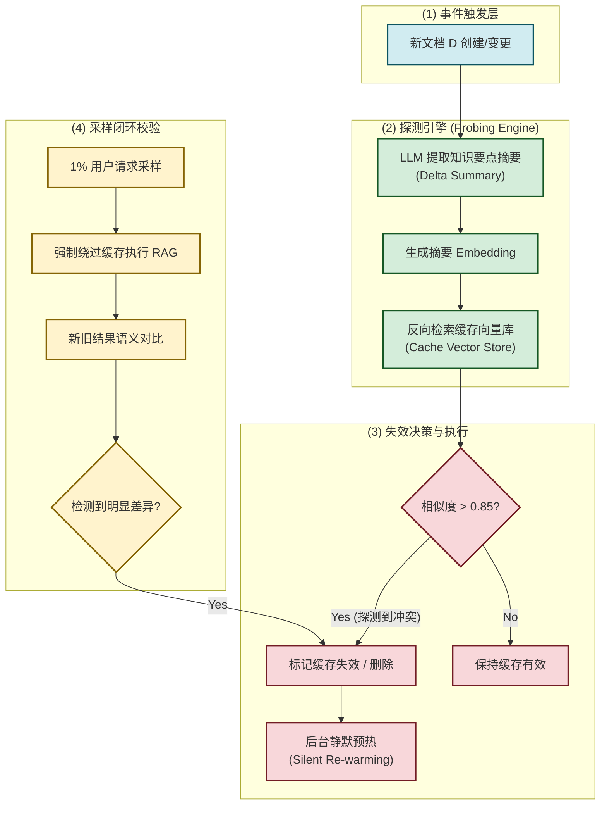
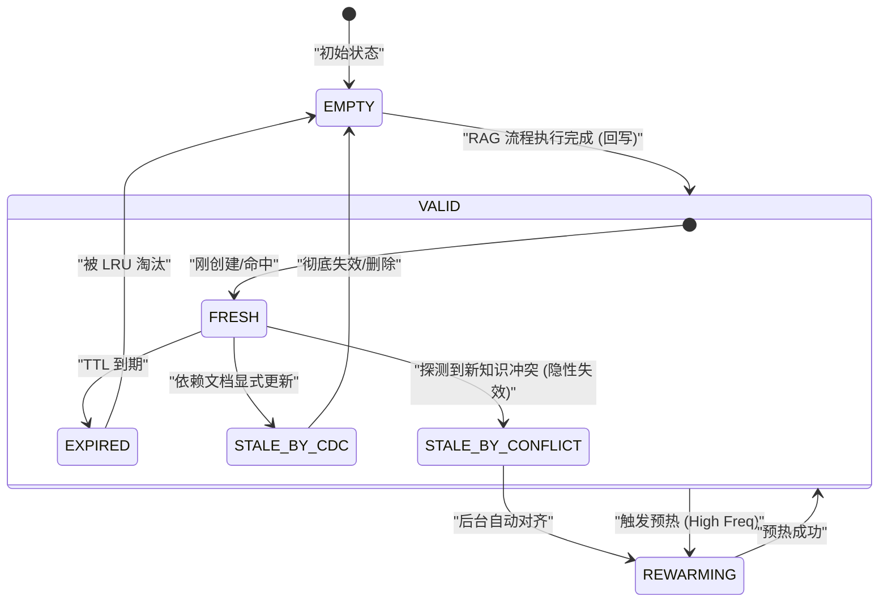
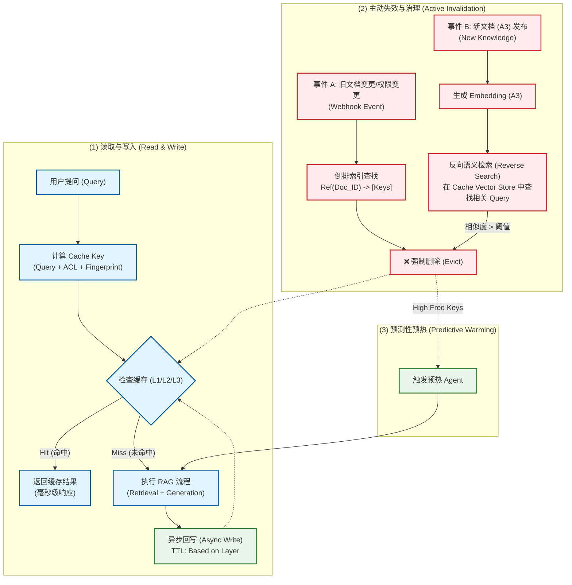
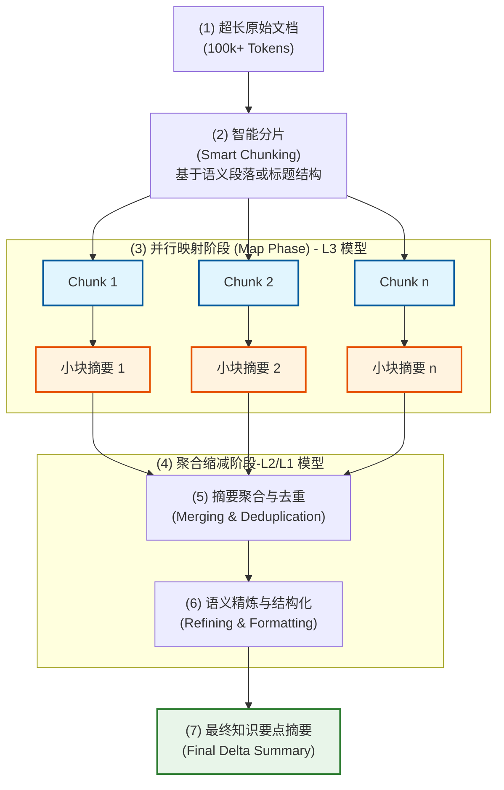
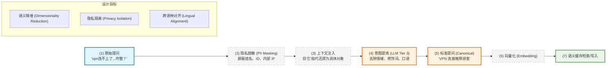
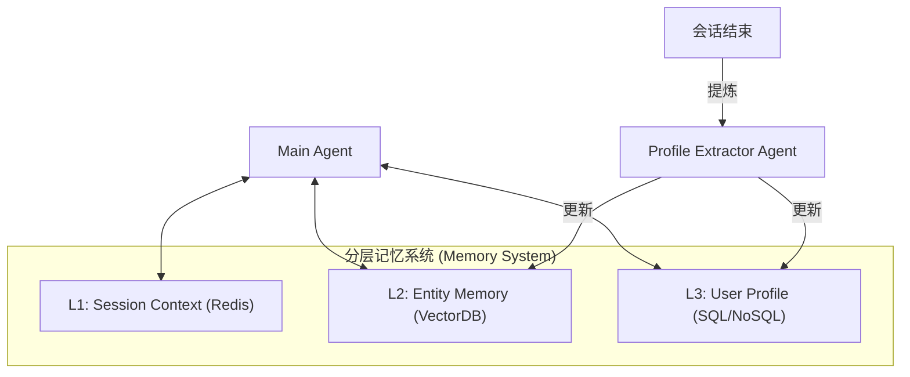

## 四、 企业级增强：可观测性、成本与性能 (Enterprise Enhancements)

### 4.1 全链路审计与溯源 (Traceability & Audit)
- **Session 轨迹记录**：利用 OpenCode 的 Session 机制，记录 Agent 的每一次 `Tool Call`、入参、出参以及对应的 `Identity Context`。
- **证据链可视化**：在最终答案中强制要求标注 **“引用源 (Citations)”**。
  - **精妙之处**：引用源不仅包含文档链接，还包含检索时的 **“权限快照”**。这确保了即便权限后来发生了变化，审计员也能知道当时 Agent 是合法访问的。

### 4.2 成本控制与配额管理 (Cost & Quota Management)

Agentic RAG 由于存在循环迭代，Token 消耗具有不可预测性。

- **能级预算 (Token Budgeting)**：为每个 Session 设置 `Hard Limit` 和 `Soft Limit`。
- **用户组配额**：通过 `Auth Gateway` 实现针对不同用户组的速率限制 (Rate Limiting) 和总额配额。
- **熔断机制与诚实回退 (Circuit Breaker & Honest Fallback)**：当循环迭代超过 5 轮且 `Critic` 仍不满意时，触发 **“诚实回退”**：终止检索，向用户明确回复“无法从现有授权信息源中找到答案”，并记录“知识缺口 (Knowledge Gap)”供后续优化，而非强行生成。仅在极高危场景下才触发人工介入。

### 4.3 智能缓存策略：平衡一致性与权限安全 (Smart Caching Strategy)

“增加全部热点问题缓存”在企业级场景下是一个**高风险高收益**的决策。虽然它能显著降低成本并提升一致性，但必须引入**“权限感知 (Permission-Awareness)”**以防止越权访问。

#### 4.3.1 核心风险：缓存中毒与越权 (The RBAC Trap)
*   **场景**：员工 A（高管）问“Q3 奖金池是多少？”，系统生成回答并缓存。
*   **风险**：员工 B（普通员工）随后问同样问题，若命中全局缓存，将直接看到高管视角的敏感数据。
*   **原则**：**绝对禁止在不校验权限的情况下共享生成结果。**

#### 4.3.2 解决方案：分层与分区缓存架构 (Layered & Partitioned Caching)

建议采用 **“业务域分区 + 权限指纹分层”** 的二维策略，既能防止跨部门数据泄露，又能最大化缓存命中率：

**维度一：业务域物理隔离 (Domain Partitioning)**
针对“大的用户组”（如 HR、财务、研发），建议在物理或逻辑上直接隔离缓存空间（Redis Namespaces）。
*   *目的*：防止不同业务线的敏感数据（如薪资 vs 代码）发生跨域混淆，降低“爆炸半径”。
*   *实现*：`Cache_Key_Prefix = {Dept_ID}::...`

**维度二：权限指纹逻辑隔离 (ACL Fingerprinting)**
在同一个业务域内，进一步根据细粒度权限进行隔离：

| 缓存层级 | 适用场景 | Cache Key 设计 | TTL |
| :--- | :--- | :--- | :--- |
| **L1: 域内公共区** | 部门规章、团队公告等**域内全员可见**内容。 | `Prefix + Hash(Query)` | 24h |
| **L2: 权限隔离区** | 项目文档、代码库等**受 RBAC 保护**的内容。 | `Prefix + Hash(Query + User_ACL_Fingerprint)` | 1h |
| **L3: 个人会话区** | 个人偏好、历史查询。 | `Prefix + Hash(Query + User_ID)` | Session |

*   **User_ACL_Fingerprint 实现**：将用户所属的所有 UserGroups 和 Roles 排序后进行 Hash 签名。只有具备完全相同权限集合的用户才能共享同一个缓存项。

#### 4.3.3 “黄金问答集”与预测性预热 (Golden Q&A & Predictive Warming)

针对平台高频热点问题，**主动生成答案并预热缓存是企业级 RAG 从“被动服务”转向“主动治理”的成熟标志**。该策略融合了人工精选的“权威性”与 AI 发现的“时效性”。

**1. 核心构成与合理性：**

- **黄金问答集 (Golden Q&A Set)**：
  - **定位**：针对 Top 100 极其稳定的高频问题（如“VPN 申请流程”、“公司班车表”）。
  - **生产**：由业务专家直接编写标准答案，确保 **100% 安全性** 与 **100% 权威一致性**。
- **预测性预热 (Predictive Warming)**：
  - **定位**：针对近期突发的爆款问题（如“公司昨日发布的年终奖政策”）。
  - **生产**：通过 AI 自动发现并生成，辅以快速人工审核。
  - **价值**：利用 **算力杠杆效应**，用一次高能级模型（如 GPT-4o）的离线推理，消除成千上万次在线重复检索的 **冷启动延迟**，FinOps 收益极高。

**2. 实现管线 (Active Governance Pipeline)：**

通过建立“发现-生成-审核”的闭环，将 RAG 系统升级为具备运营能力的知识中枢：

- **主动发现 (Semantic Mining)**：
  - 实时聚类：对 **Cache Miss** 请求进行 Embedding 聚类，而非仅看字符串匹配。
  - 异常检测：若某语义簇在 24 小时内密度激增（如 > 50 次请求），自动将其定义为“热点候选”报警。
- **智能生成与终审 (HITL)**：
  - **高能级生成**：调用最强模型（不计成本）生成包含 **完美引用溯源** 的标准答案草稿。
  - **专家确认**：引入运营人员“一键终审”界面，审核通过后即刻打入 L1 公共缓存区，并可手动标记为“黄金问答”。
- **短路拦截 (Query Interception)**：
  - 在 **Query Classifier** 阶段，若判定属于热点或黄金问答语义，直接 **短路 (Short-circuit)** 后续 RAG 流程，毫秒级返回标准答案。

**4. 实现落地的关键挑战与对策 (Implementation Challenges & Mitigation)：**

在工程实现时，必须处理以下四个“深水区”问题：

- **挑战 A：语义聚类的噪音与颗粒度 (Clustering Noise & Granularity)**
  - *风险*：若聚类太细，预热覆盖率低；若太粗，会导致“张冠李戴”（将 VPN 问题和内网权限问题混为一谈）。
  - *对策*：采用 **HDBSCAN** 等密度聚类算法，配合 **Centroid 压缩**。仅对 Top-N 的质心进行预热，并使用 `Cross-Encoder` 在拦截阶段进行二次语义等价性判定（确保 98%+ 的匹配度）。
- **挑战 B：权限泄露风险 (Permission Leakage) —— 🚨 极重要**
  - *风险*：Predictive Warming 可能是基于某个高权限用户的提问生成的（例如包含特定项目代号）。若将其放入公共 L1 缓存，会导致低权限用户看到敏感信息。
  - *对策*：**权限分区预热 (Permission-Partitioned Warming)**。对于自动发现的热点，默认标记为 `Restricted`，仅在缓存键中包含 `User_ACL_Fingerprint` 的副本。只有经过人工审核并标记为 `Public` 的答案，才能进入全局 L1 共享。
- **挑战 C：触发阈值的动态调整 (Dynamic Thresholding)**
  - *风险*：固定阈值（如 > 50次）在不同部门或不同时间段（如节假日）会失效。
  - *对策*：引入 **Z-Score 异常检测**。监控请求密度的增长率（Velocity）而非绝对值。若 1 小时内的请求数超过过去 7 天同时间段均值的 3 个标准差，即刻触发预热。
- **挑战 D：热点的“退潮”管理 (Staleness & Retirement)**
  - *风险*：预热缓存占据大量内存，且内容可能随时间过时。
  - *对策*：**衰减型 TTL (Decaying TTL)**。Predictive Warming 初始有效期短（如 4h），若持续被命中则自动延长；若 24h 未被命中，自动从 L1 降级回普通向量检索逻辑。

**3. 核心收益总结：**
- **0 成本与 0 延迟**：后续重复请求不再消耗在线推理算力。
- **口语一致性**：确保企业关键变动时期“一个声音说话”。
- **安全加固**：通过人工审核彻底排除幻觉风险。

#### 4.3.4 缓存生命周期管理：事件驱动的精准失效与重更新 (Event-Driven Invalidation & Re-warming)

为了解决“文档更新后缓存依然返回旧答案”的问题，必须建立一套**从数据源到缓存的拓扑追踪机制**，实现从“被动过期”向“主动失效”的跨越。

**1. 核心挑战：Query 与 Document 的多对多映射**
RAG 缓存通常是以 `Query` 为键的，但一个答案可能引用了 `Doc_A` 的片段 1 和 `Doc_B` 的片段 2。当 `Doc_A` 更新时，我们如何知道哪些 `Query` 的缓存失效了？

**2. 设计模式：文档-缓存倒排索引 (Document-to-Cache Inverted Index)**

建议在缓存层引入一个轻量级的关联表（通常存储在 Redis 或元数据库中）：

| 文档 ID (Doc_ID) | 关联的缓存键列表 (Cache_Keys) | 密级/版本号 |
| :--- | :--- | :--- |
| `wiki_789` | `[q_hash_1, q_hash_5, q_hash_10]` | `v2 / Public` |
| `jira_101` | `[q_hash_2, q_hash_3]` | `v1 / Restricted` |

**3. 级联失效与重更新流 (Cascading Invalidation & Re-warming Flow)：**

- **监听到变更事件 (Webhook/CDC)**：
  - 当外部系统（Wiki, Jira, Git）发生 `Update` 或 `Delete` 时，通过 Webhook 或 CDC (Change Data Capture) 捕获事件。
- **权限/密级变更 (ACL Events) —— 🚨 极重要**：
  - 若文档密级从“公开”变为“绝密”，必须根据倒排索引立即 **秒级爆破** 所有相关缓存。
  - 对于用户权限变更，建议在 `User_ACL_Fingerprint` 中引入 `Epoch` 版本号，一旦 IAM 发生变更，全局推高该版本号，迫使旧指纹缓存瞬间失效。
- **精准失效与重更新 (Targeted Re-fill)**：
  - 根据 `Doc_ID` 查询倒排索引，获取所有受影响的 `Cache_Keys` 并执行删除。
  - **重要对策**：对于那些被标记为“高频 (Hot)”或“黄金问答”的 Cache Key，后台自动触发一次新的 RAG 任务进行 **静默预热**。
  - **价值**：确保当用户再次提问时，看到的已经是基于新文档生成的答案，且没有感受到 RAG 检索的冷启动延迟。

**4. 兜底机制：语义版本号 (Semantic Versioning)**
- 在每个缓存项的元数据中存储 `Doc_Version_List`。
- 即使倒排索引因 system 故障未能及时更新，在 **Semantic Cache Hit** 阶段，引擎会快速核对引用的文档当前版本号。若版本不一致，强制触发 Cache Miss。

**5. 隐性失效：新知识注入引发的缓存过期 (Hidden Invalidation due to New Knowledge)**

你提出的“文档 B、C 未变，但新文档 D 的出现导致答案 A 失效”是一个非常深刻的**非单调逻辑 (Non-monotonic Logic)** 问题。这在企业动态知识库中不仅可能，而且非常合理。

- **场景复现**：
  - *提问 A*：“公司如何报销打车费？”
  - *旧答案 (基于 B/C)*：“使用报销系统 X 录入发票。”
  - *新文档 D*：“即日起打车费统一通过企业滴滴支付，无需手动报销。”
  - *冲突*：B 和 C 依然有效（可能记录的是旧流程），但 D 使得 A 的缓存答案变得具有误导性。

- **对策 1：反向语义探测 (Reverse Semantic Probing)**
  - **工程落地细节 (Technical Implementation)**：
    - **避坑指南：不要使用大文档全文**：大文档全文向量化会产生严重的“语义稀释”且受限于模型 Token 窗口（如 8k 限制），导致微小的知识变更被背景噪音淹没，从而引发探测失效。
    - **策略 A：增量摘要探测 (Delta Summary Probing) —— 推荐方案**：
      - *做法*：使用低能级模型（如 GPT-4o-mini）提取 D 的“变更摘要”或“知识要点”（如：“修改了打车报销流程，改为滴滴直付”）。
      - *优势*：摘要语义集中且精确，用其 Embedding 进行探测能极大提升对“隐性冲突”的识别率。

  - **UML 逻辑流：反向语义探测时序 (Reverse Semantic Probing Sequence)**
  ```mermaid
  sequenceDiagram
      autonumber
      participant DS as "数据源 (Data Source)"
      participant KI as "知识入库引擎 (Ingestor)"
      participant PE as "探测引擎 (Probing Engine)"
      participant CS as "缓存向量库 (Cache Vector Store)"
      participant RM as "预热引擎 (Re-warming Agent)"

      DS->>KI: "发送新文档 D (Webhook/CDC)"
      KI->>PE: "触发隐性失效检测"
      rect rgb(240, 248, 255)
      Note over PE: "提取增量摘要 (Delta Summary)"
      PE->>PE: "LLM 提炼知识要点摘要"
      PE->>PE: "生成摘要 Embedding"
      end
      PE->>+CS: "反向检索相似 Query (Similarity > 0.85)"
      CS-->>-PE: "返回受影响的 Cache Keys [Q_A, Q_X...]"
      
      loop "对每个受影响的 Key"
          PE->>CS: "标记状态: STALE_BY_CONFLICT"
          PE->>RM: "发起静默预热请求"
          RM->>RM: "执行完整 RAG 并更新 L1/L2 缓存"
      end
  ```

  - **对策 2：语义漂移采样校验 (Semantic Drift Sampling)**
  - 对于高频缓存项，不采取 100% 命中的策略。
  - **策略**：每 100 次请求中抽取 1 次执行完整的 RAG（Bypass Cache），对比生成的“新答案”与“缓存答案”的语义差异。
  - 若差异超过阈值（探测到语义漂移），立即废弃该缓存项并触发更新。

- **对策 3：话题聚类失效 (Topic-Based Invalidation)**
  - 将缓存按话题（Topic Cluster）进行归类。当新文档 D 归属于“财务/报销”话题时，该话题下所有的热点缓存均触发一次轻量级的重验证。

**6. 隐性失效治理流程图 (Hidden Invalidation Governance Flow)**



- **UML 状态机：缓存条目生命周期 (Cache Entry State Machine)**


#### 4.3.5 缓存全生命周期治理图 (Cache Lifecycle Governance Diagram)

解决**“隐性失效”**问题：当新文档 A3 发布时，虽然旧答案 A 依赖的 A1/A2 未变，但 A3 的出现可能使 A 变得过时或错误。
*   **挑战**：传统的 `Ref(Doc_ID)` 倒排索引无法处理“新文档”与“旧查询”的关联。
*   **机制：反向语义检索 (Reverse Semantic Search)**
    1.  **缓存向量化**：将所有高频 Cache Key（即 User Query）的 Embedding 存储在轻量级向量库中。
    2.  **新知扫描**：当新文档 A3 入库时，生成其 Embedding（或摘要 Embedding）。
    3.  **碰撞检测**：用 A3 的 Embedding 去检索 Cache Vector Store。
    4.  **智能判定**：若发现某旧查询 Q 与 A3 的相似度 > 0.85，意味着 A3 极可能是 Q 的新答案来源，立即失效该 Cache。
    5.  **主动更新**：(可选) 立即触发后台 Agent 重新生成 Q 的答案并预热缓存。

#### 4.3.5 缓存全生命周期治理图 (Cache Lifecycle Governance Diagram)



#### 4.3.6 长文档摘要的高效提取策略 (Efficient Long Document Summarization)

在处理长文档（如 500 页的 PDF 或超长代码库）时，直接调用 LLM 进行摘要提取会面临 **Token 溢出**、**推理成本高昂** 以及 **中间信息丢失 (Lost in the Middle)** 的挑战。

为了实现“低成本且高效”的摘要提取，推荐采用以下架构策略：

##### 1. 技术方案：分层摘要与 Map-Reduce 架构 (Hierarchical & Map-Reduce)



##### 2. 核心优化技巧 (Optimization Tactics)

1.  **能级路由 (Model Tiering)：高吞吐与成本平衡**
    - **Map 阶段（分片扫描）**：采用 **L3 级模型**（如 Gemini 3 Flash、Claude Haiku）。
        - *逻辑*：Map 任务具有高度重复性和低推理深度的特点。L3 模型凭借极低的 Token 单价（通常比 L1 便宜 20-50 倍）和原生的大上下文窗口，可以极速完成数千个分片的初步清理。
        - *产出*：生成每个分片的“事实孤岛（Fact Islands）”，将原始噪音文本压缩 80% 以上。
    - **Reduce 阶段（全局合成）**：采用 **L1/L2 级模型**（如 Gemini 3 Pro、Claude Sonnet）。
        - *逻辑*：Reduce 任务涉及跨分片的逻辑对齐、矛盾冲突仲裁及全局语义建模，需要极强的“全局视野”。
        - *产出*：确保最终摘要不是碎片的简单拼接，而是具有逻辑连贯性的深度洞察。

2.  **提取式摘要优先 (Extraction-First)：从“阅读理解”转向“断言提取”**
    - **预处理降噪**：在 LLM 介入前，利用 TF-IDF 或 RAKE 算法快速识别文档中的高权重关键词，并结合小型 Embedding（如 BGE-small）过滤掉文档中的页眉、页脚、版权声明等“无意义噪音”。

    ###### 2.1 关键词提取算法对比与语言适配

    | 维度 | **TF-IDF** | **RAKE** |
    | :--- | :--- | :--- |
    | **核心优势** | 擅长过滤通用词，突出跨文档的“独特性”特征。 | 无需语料库，仅靠单篇文档的共现逻辑提取高频短语。 |
    | **中英文适配** | **中规中矩**。中文需依赖 `jieba` 等分词器，对分词质量敏感。 | **英文极佳，中文需定制**。高度依赖标点和停用词作为边界。 |
    | **短语提取能力** | 弱（通常提取单字/词），需结合 N-Gram。 | **强**（天然提取复合短语，如 "Vector Database"）。 |
    | **计算复杂度** | 低（适合离线批处理或大规模倒排索引）。 | 极低（适合实时、在线的单篇摘要提取）。 |

    ###### 2.2 语言处理差异分析 (Lingual Adaption)

    在处理中英文文档时，两者的底层逻辑存在显著差异：

    1.  **分词依赖 (Tokenization)**：
        - **英文**：两者均表现优异。英文天然以空格分词，RAKE 可以通过空格轻松识别候选短语。
        - **中文**：**必须先进行分词 (Segmentation)**。TF-IDF 在中文分词后效果较好；而 RAKE 在中文中由于缺乏天然空格，必须依赖分词器切分出的词性或特定的停用词列表来模拟“边界”，否则提取出的往往是断裂的碎片。
    2.  **停用词机制 (Stop-words)**：
        - TF-IDF 依赖停用词表来过滤“的、了、是”等高频无意义词。
        - RAKE 则将停用词作为“分隔符”。在中文中，如果停用词表不全，RAKE 会将不相关的词连在一起形成超长无意义短语。

    **中文适配代码片段 (使用 jieba)：**

    ```python
    import jieba.analyse

    # 中文 TF-IDF 提取
    def extract_chinese_tfidf(text, top_k=5):
        # jieba 内部集成了 IDF 语料库
        return jieba.analyse.extract_tags(text, topK=top_k)

    # 中文 RAKE 模拟 (需要先分词)
    def extract_chinese_rake_sim(text):
        words = jieba.lcut(text)
        space_text = " ".join(words) # 模拟英文空格环境
        # 随后再调用 RAKE 库处理 space_text
        ...
    ```

    **Python 代码示例：**

    ```python
    # TF-IDF 实现示例 (使用 Scikit-Learn)
    from sklearn.feature_extraction.text import TfidfVectorizer

    def extract_keywords_tfidf(documents, top_k=5):
        vectorizer = TfidfVectorizer(stop_words='english')
        tfidf_matrix = vectorizer.fit_transform(documents)
        feature_names = vectorizer.get_feature_names_out()
        
        # 提取第一个文档的前 K 个关键词
        first_doc_vector = tfidf_matrix[0].toarray()[0]
        sorted_indices = first_doc_vector.argsort()[::-1]
        return [feature_names[i] for i in sorted_indices[:top_k]]

    # RAKE 实现示例 (使用 nlp_rake)
    import nlp_rake

    def extract_keywords_rake(text, max_words=2, min_freq=1):
        extractor = nlp_rake.Rake(max_words=max_words, min_freq=min_freq)
        keywords = extractor.extract(text)
        return [k[0] for k in keywords[:5]] # 返回得分最高的前 5 个短语
    ```

    - **Prompt 范式迁移**：
        - *传统做法*：“请总结这段文字。”（容易导致 LLM 生成笼统的废话）。
        - *优化做法*：“请从这段文字中提取所有关于 [系统配置参数] 的**原子断言 (Atomic Assertions)**。如果不存在，直接返回空。”
        - *收益*：通过将“生成式总结”降级为“结构化提取”，不仅显著减少了输出 Token（降低成本），还极大提高了信息的精确度。

3.  **增量更新 (Delta-Only Processing)：基于哈希指纹的最小化重算**
    - **哈希链路 (Hashing Chain)**：为文档的每个物理分片计算 MD5/SHA-256 指纹。
    - **变更检测**：当文档更新时，通过 CDC 链路识别出具体哪些分片的哈希值发生了变化。
    - **按需重算**：系统仅对“哈希失效”的分片重新触发 Map 任务。对于未变的分片，直接复用上一次的摘要结果进入 Reduce 阶段。
    - *工程价值*：在处理长达数万行的代码库或持续更新的技术手册时，这种“局部重算”机制可节省 90% 以上的计算资源。

4.  **分片上下文携带 (Chunk Overlapping & Metadata)：治理语义断层**
    - **精简上下文滑动窗口 (Sliding Context Window)**：在对 Chunk N 进行摘要时，不仅输入该块内容，还以 `System Message` 的形式喂入 Chunk N-1 的**精简摘要**。
    - **元数据锚点 (Metadata Anchoring)**：在每个摘要块中强制注入原始文档的章节 ID、行号范围或实体锚点。
    - *收益*：有效解决了 Map-Reduce 架构常见的“断章取义”问题。例如，Chunk N 中出现的代词“它”或未定义的缩写，可以通过 N-1 的上下文得到正确还原，保证了全局语义的一致性。

##### 3. 成本对比示例 (Cost Comparison)

| 策略 | 估算成本 (100k Tokens) | 质量 | 延迟 |
| :--- | :--- | :--- | :--- |
| **直接全量总结 (L1)** | ~$1.50 | 极高，但易受 Lost in Middle 影响 | 高 |
| **Map-Reduce (L3 + L2)** | **~$0.08** | 高 (结构化好，无信息遗漏) | 中 (可高度并行) |
| **提取式过滤 + LLM** | ~$0.15 | 中 (可能丢失深层语义关联) | **极低** |

---

#### 4.3.7 权衡与考量 (Trade-offs: Smart Caching)

- **性能收益 vs. 管理开销**：缓存极大降低了响应延迟和 Token 成本，但引入了复杂的 `Fingerprint` 计算和主动失效逻辑。
- **一致性 vs. 权限隔离**：过度共享缓存会导致越权，过度隔离（按用户隔离）会导致缓存命中率极低。`ACL Fingerprint` 是目前兼顾二者的平衡点。
- **语义失效的成本**：`Reverse Semantic Search` 虽然强大，但需要额外的向量库存储查询历史，并持续运行扫描任务。建议仅在“高频且对时效性极度敏感”的业务域开启。

#### 4.3.7 提示词缓存优化 (Prompt Caching Optimization)

在复杂的 Agentic RAG 流程中，System Prompt 和检索到的 Context 往往占据了 Token 消耗的 80% 以上。利用 LLM 厂商提供的 **Prompt Caching (如 Anthropic Prompt Caching, OpenAI Context Caching)** 可以显著降低首字延迟 (TTFT) 和成本。

- **静态前缀缓存 (Static Prefix Caching)**：将通用的 System Prompt、工具定义 (Tool Definitions) 设置为缓存点。
- **上下文块缓存 (Context Block Caching)**：在 RAG 检索后，将召回的 Top-K 文档块按顺序拼接并设置缓存锚点。
- **收益**：对于长上下文任务，最高可降低 **90% 的输入成本** 和 **80% 的延迟**。

#### 4.3.8 语义命中加速 (Semantic Cache Hit)

传统的 Key-Value 缓存依赖字符串完全匹配。引入 **语义缓存 (Semantic Cache)** 可以识别意思相近的提问。

- **工作流**：
    1. 计算当前 Query 的 Embedding。
    2. 在缓存向量库中进行相似度检索。
    3. 若 `Similarity > 0.98`（极高阈值），直接返回对应缓存结果。
- **风险控制**：语义命中仅适用于 **L1/L2 级别** 的公共知识，对于涉及个人隐私或极度精确的数据（如“我的余额是多少”），应禁用语义命中。

**🔥 深度实现进阶 (Implementation Deep Dive)：**

在生产级实现中，单纯依靠向量相似度往往会引入“语义偏离”风险。建议引入以下进阶机制：

##### 1. 技术架构流：双阶段验证 (Two-Stage Verification)

为了平衡速度与精度，推荐采用“粗筛+精排”的漏斗架构：

```mermaid
sequenceDiagram
    autonumber
    participant U as 用户 (User)
    participant C as 语义缓存引擎 (Semantic Cache Engine)
    participant V as 向量库 (Vector Store)
    participant E as Cross-Encoder / 小模型
    participant R as RAG 执行引擎

    U->>+C: 输入原始 Query ("vpn连不上了...")
    
    rect rgb(240, 248, 255)
    Note over C, V: 阶段一：向量粗筛 (Vector Search)
    C->>C: 查询归一化 (Canonicalization)
    C->>+V: 向量检索 (Top-1)
    V-->>-C: 返回相似项 (Score: 0.96)
    end
    
    alt 分数 > 0.98 (极高置信度)
        C-->>U: 直接返回缓存结果 (L1 Hit)
    else 分数在 0.92 ~ 0.98 (灰度区)
        rect rgb(255, 245, 230)
        Note over C, E: 阶段二：交叉验证 (Cross-Encoder Re-rank)
        C->>+E: 提交 {Query, Cache_Key} 进行精排
        E->>E: 语义等价性判定 (Entailment Check)
        end
        alt 判定为等价 (True)
            E-->>-C: 确认命中
            C-->>U: 返回缓存结果 (L2 Hit)
        else 判定为不等价 (False)
            E-->>-C: 拒绝命中
            C->>+R: 触发完整 RAG 流程
            R-->>-U: 返回新生成的答案
        end
    else 分数 < 0.92 (低相关)
        C->>+R: 触发完整 RAG 流程
        R-->>-U: 返回新生成的答案
    end
    deactivate C
```

##### 2. 查询归一化与标准化设计 (Query Normalization & Standardization Design)

在被动缓存（Passive Caching）中，直接缓存“原始问题”与“答案”是低效的。因为用户的提问具有极大的随机性（口语化、错别字、情绪化、中英混杂）。

**核心哲学**：不直接缓存“问题”，而是缓存**“语义意图 (Semantic Intent)”**。这需要将原始问题映射到一个**“标准提问空间 (Canonical Question Space)”**。

###### 2.1 归一化流水线 (Normalization Pipeline)

推荐在进入语义缓存之前，执行以下流水线：



###### 2.2 为什么必须进行“加工改造”？ (Design Rationale)

1.  **提高碰撞概率 (Hit Rate Optimization)**：
    - 原始提问：`“vpn 怎么连不上了，帮帮我”` 与 `“VPN连接失败排查”` 在向量空间虽然接近，但仍有距离。
    - 归一化后：两者均指向 `“VPN 连接故障排查”`，实现 100% 碰撞。
2.  **隐私脱敏 (Privacy-First Caching)**：
    - 原始提问可能包含 `“张三的 VPN 连不上了”`。如果不脱敏直接缓存，其他用户搜索 VPN 时可能会命中包含 `“张三”` 的缓存项，造成隐私泄露。
    - 归一化过程将 `“张三”` 抽象为 `“用户”`，确保缓存池的纯净与合规。
3.  **消除上下文依赖 (Context De-referencing)**：
    - 用户问：`“它怎么用？”`（前文提到了 VPN）。
    - 归一化引擎结合 Session Context，将其改写为 `“VPN 使用说明”`。这样该缓存项才能被其他没有相同前文的用户复用。

###### 2.3 实现进阶：标准问题库 (Standard Question Library)

在企业内部，可以进一步将 Canonical Query 与企业的 **“标准知识条目 (Knowledge Snippets)”** 挂钩。

- **多对一映射**：N 个 Raw Queries -> 1 个 Canonical Query -> 1 个 Verified Answer。
- **冷启动治理**：管理员可以预先导入 100 个高频标准问题及其 Canonical 形式，实现系统上线的“首日高命中率”。

##### 3. 语义等价性判定 (The "Judge" Model)

在灰度区，我们不关心向量距离，只关心**逻辑蕴含 (Logical Entailment)**。
- **推荐方案**：使用专门的 `Cross-Encoder` 模型（如 `cross-encoder/ms-marco-MiniLM-L-6-v2`）。它同时输入两个句子，输出 0-1 的得分。
- **优点**：Cross-Encoder 的精度远高于双塔架构（Vector Search），能识别出“我可以”与“我不可以”这种向量距离近但语义相反的微小差异。

##### 4. 权限指纹与语义缓存的耦合 (Permission-Aware Semantic Cache)

语义命中必须在 **“权限分区”** 内进行。

- **逻辑边界**：缓存项在存储时必须携带 `ACL_Fingerprint`。
- **检索约束**：
  ```sql
  -- 伪 SQL 逻辑
  SELECT answer FROM semantic_cache 
  WHERE vector_similarity(query_vector, cache_vector) > 0.92
  AND acl_fingerprint = CURRENT_USER_ACL_FINGERPRINT
  LIMIT 1;
  ```
- **原则**：**绝对不允许跨权限指纹进行语义命中**。即使两个提问语义完全相同，如果用户所属的权限组不同，也必须重新执行 RAG 或从其所属的分区中查找。

##### 5. 进阶治理：可观测性与并发控制 (Advanced Governance)

在极高并发的生产环境中，语义缓存还需要解决“缓存击穿”与“语义漂移”问题：

- **请求合并 (Request Collapsing / Joining)**：
  - *场景*：当一个爆款事件发生时（如“年终奖发放规则”），可能有 1000 个用户在 1 秒内问类似问题。
  - *机制*：如果语义缓存 Miss，引擎不应立即发起 1000 个 RAG 任务，而是针对该语义空间建立一个 **“执行锁 (Execution Lock)”**，让后续 999 个请求挂起等待，直到第一个任务回写缓存。
- **语义漂移检测 (Semantic Drift Detection)**：
  - *场景*：文档库在不断更新，一年前命中的语义关联现在可能已经过时。
  - *机制*：定期（或按比例）抽样语义命中的请求，强制执行一次真实的 RAG，并对比“缓存结果”与“新生成结果”的相似度。若偏差 > 0.1，说明该语义分区的知识已发生漂移，需全量失效。
- **可观测性指标 (Observability Metrics)**：
  - **语义命中精度 (Semantic Precision)**：通过人工审计或 Judge 模型验证命中的正确率。
  - **节约成本 (Token Saved)**：统计因语义命中而减少的 Input/Output Token 数量。
  - **延迟改善 (Latency Delta)**：对比 Cache Hit vs. RAG Loop 的响应时间差。

#### 4.3.9 成本感知淘汰策略 (Cost-Aware Eviction / FinOps)

并非所有缓存项的价值都是平等的。在资源受限的情况下，淘汰策略应从简单的 LRU 升级为 **“生成成本感知 (Cost-Aware)”** 模式：

- **权衡因子 (Weight Factor)**：`Value = (Regeneration_Cost * Hit_Frequency) / Storage_Cost`。
- **优先保留**：
    - **长上下文查询**：重新生成需要消耗大量 Token 的请求。
    - **慢速工具调用**：涉及复杂 API 或多步推理的查询（如财务报表汇总）。
    - **高频业务问题**：对整体命中率贡献最大的项。


### 4.4 分层记忆架构：从 Session 到 Profile (Hierarchical Memory)

企业级 Agent 的核心壁垒在于“越用越懂你”。建议从单一的会话记忆升级为三层记忆架构：

1.  **L1 短期记忆 (Session Context)**：当前会话的 `messages[]`，负责维持多轮对话的连贯性。
2.  **L2 实体记忆 (Entity Memory)**：针对特定项目、产品或术语的共享知识缓存。
    *   *示例*：“Project Apollo” = “新一代计费系统重构项目”。
    *   *价值*：避免每次提及专有名词都需要重新检索基础背景。
3.  **L3 长期画像 (User Profile)**：用户的技术栈偏好、角色职责与常用工具。
    *   *实现*：在 Session 结束时，通过后台 Agent 提炼 User Facts 并存入 `ProfileStore`。
    *   *场景*：如果用户被标记为“Java 专家”，Agent 在解释代码时将自动跳过基础语法，直接切入架构细节。

#### 4.4.1 分层记忆架构图 (Hierarchical Memory Diagram)



---
