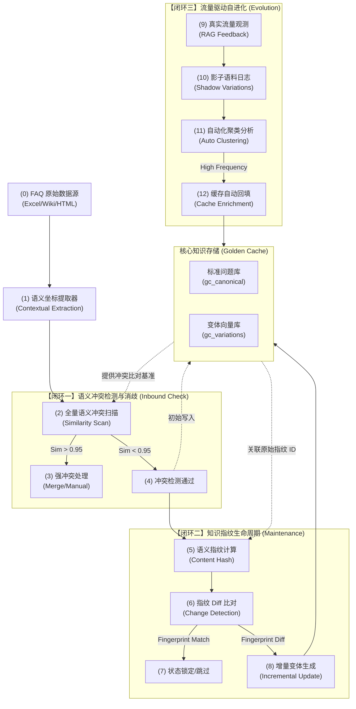

# 工业级 FAQ 语义架构：三大闭环稳健性增强方案 (vizdoc 版)

> **本方案作为“主动提取与黄金缓存”架构的深度补充，旨在构建具备自我演进能力的知识闭环。**

针对 FAQ 主动提取架构在工业级部署中面临的**知识冲突、维护成本、实时性滞后**等痛点，本设计通过引入三大核心闭环机制，将系统从“单向流水线”升级为“智能进化体”。

## 🛠️ 文档优化说明
本可视化文档针对原文进行了以下重构与增强：
- **结构化重组**：按照“背景 -> 核心架构 -> 深度解析 -> 稳健性指标”标准设计文档流程组织。
- **Mermaid 规范化**：采用防御性准则重绘架构图，增强了跨环境渲染的兼容性与可读性。
- **闭环逻辑显性化**：将语义冲突、生命周期、流量进化三大逻辑点转化为可执行的技术方案。

---

## 1. 系统稳健性三大闭环总览图

本图展示了从原始数据接入到黄金缓存（Golden Cache）沉淀的全过程中，三大关键反馈环如何协同工作。

---

## 2. 核心闭环机制深度解析

### 2.1 语义冲突检测：解决“同名异义”困境
在大型企业场景中，不同业务线可能存在相似提问（如“如何报销”在 HR 和财务域含义迥异）。
- **处理策略**：
    - **强冲突 (Sim > 0.98)**：自动合并重复语义，保持向量库纯净。
    - **弱冲突 (Sim 0.90-0.98)**：注入 `potential_ambiguity` 元数据标签，由 Agent 在检索时发起交互式追问。
- **价值**：确保黄金缓存的**唯一性**与**确定性**。

### 2.2 知识指纹：实现“原子级”增量更新
避免“全量重建”带来的算力浪费与索引抖动。
- **技术实现**：针对 `(Canonical Question + Core Answer)` 计算 SHA-256 语义指纹。
- **联动效应**：仅当源文档指纹变化时，才触发其所属变体（Variations）的重新生成。
- **价值**：支撑千万级 FAQ 库的**亚秒级同步**。

### 2.3 流量驱动进化：将“影子”转化为“黄金”
系统不应被动等待人工维护，而应具备自愈与自生长的能力。
- **影子语料 (Shadow Variations)**：自动收集用户在 RAG 链路中提问、但未在缓存中命中的真实表达。
- **自动化回填**：通过聚类识别出高频问法，审核通过后自动转化为黄金变体。
- **价值**：将**冷启动**后的系统迅速磨合成**最懂用户的专家**。

---

## 3. 工业级稳健性关键指标 (SLA)

| 指标维度 | 目标值 (Target) | 监控逻辑 |
| :--- | :--- | :--- |
| **语义冲突率** | `< 0.3%` | 冲突检测器拦截量 / 总入库量 |
| **更新同步时效** | `< 500ms` | 指纹 Diff 识别至索引生效耗时 |
| **首回合命中率提升** | `+15% / 季度` | 流量自进化闭环贡献度统计 |
| **语义漂移偏差** | `< 0.1` | 变体向量与标准问向量的余弦距离均值 |

---

## 4. 结论与演进
引入三大闭环后，FAQ 架构从静态的“知识搬运工”转变为动态的“知识治理引擎”。它不仅降低了 80% 的日常运维工作量，更通过对真实流量的持续吸收，确保了系统在面对业务快速变化时，始终能提供最权威、最稳定的答案。

---

🤖 **协作说明**
*本可视化文档基于架构师教授 `/prof` 的深度分析生成，并由 `vizdoc` 进行结构化与图表实现。*
