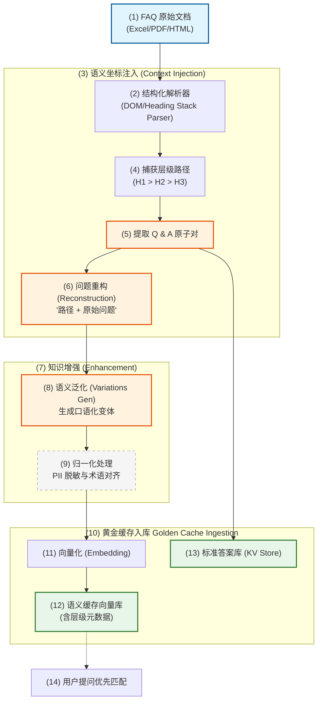
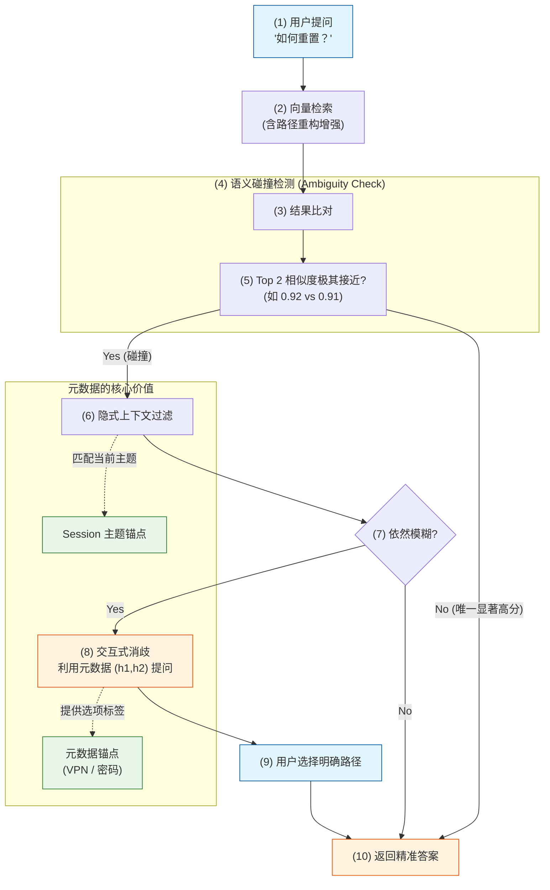
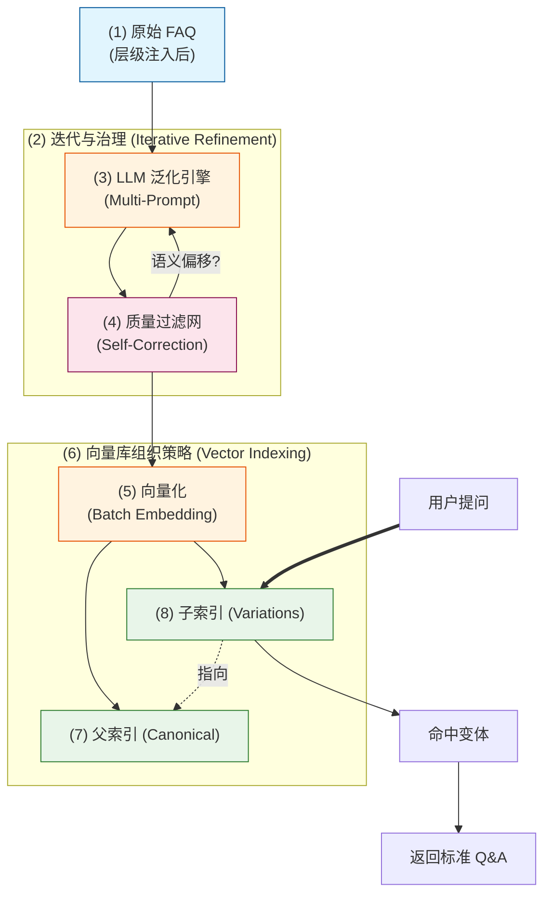
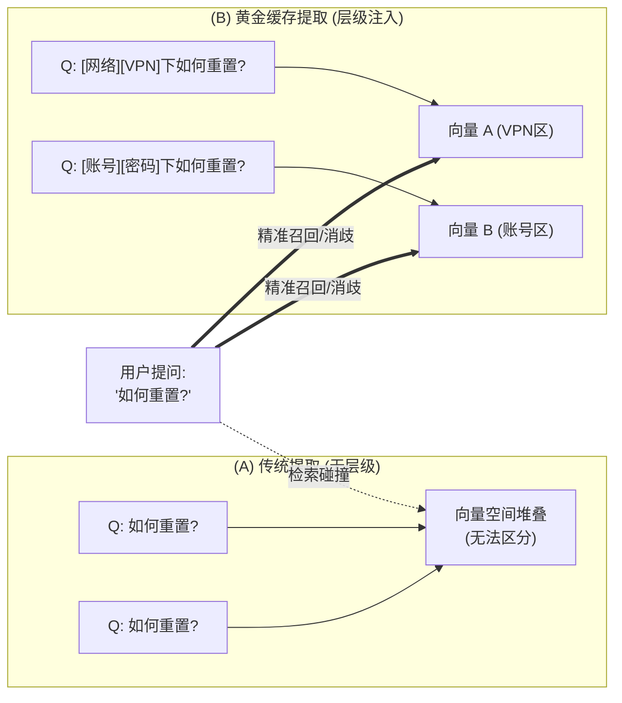
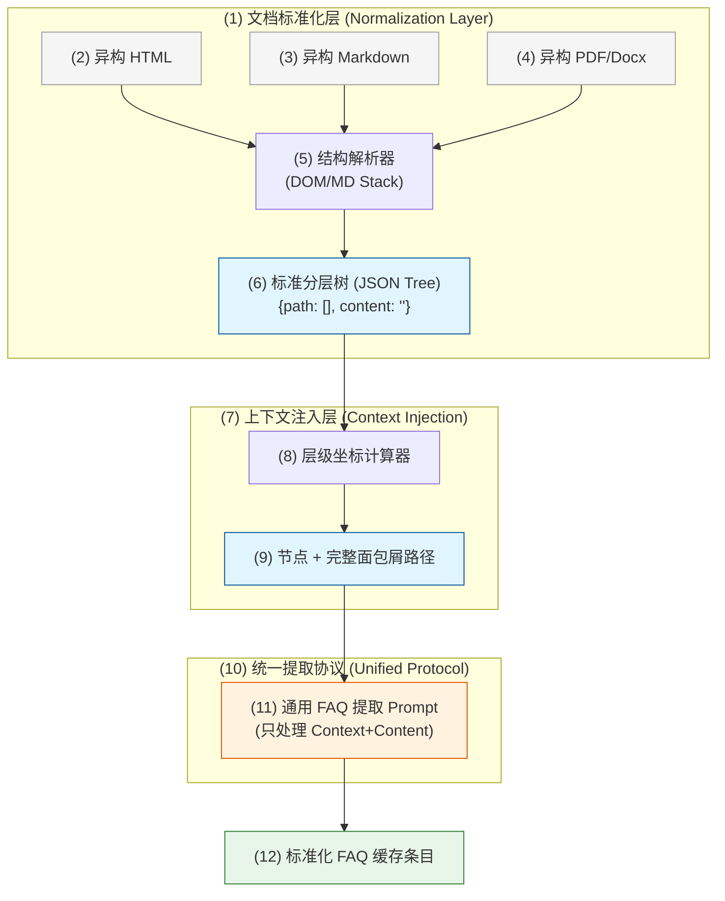

#### 4.3.10 FAQ 主动提取与“黄金缓存” (Proactive FAQ Extraction & Golden Cache)

在企业知识治理中，被动缓存（Passive Caching）虽然能覆盖高频重复提问，但存在“冷启动”和“质量不确定性”的问题。**主动提取 (Proactive Extraction)** 则是将经过人工审计的 FAQ 文档预先转化为确定性的语义缓存，构建系统的“核心常识库”。

##### 4.3.10.1 FAQ 知识全生命周期：从原子数据到精准答案 (Data Journey)

为了直观展现 FAQ 如何从原始文档变为系统中的“秒回”知识，我们将其划分为三个核心阶段：

###### **(1) 解构与坐标注入 (Deconstruction & Injection)**
*   **动作**：解析原始文档，捕获面包屑层级（Heading Path）。
*   **产出**：带有语义坐标的原子对。

###### **(2) 增强与拉伸 (Enrichment & Stretching)**
*   **动作**：生成语义变体，并将路径信息“揉进”问题文本进行 Embedding。
*   **产出**：在向量空间中被“拉开”的高维特征。

###### **(3) 召回与消歧 (Recall & Disambiguation)**
*   **动作**：接收模糊查询，通过元数据进行上下文过滤或交互式消歧。
*   **产出**：无感知的精准回答。

###### **(4) 数据演变追踪表 (Data Transformation Trace)**

| 阶段 | 数据形态 | 示例内容 | 关键价值 |
| :--- | :--- | :--- | :--- |
| **(1) 原始态** | HTML 片段 | `<h3>如何重置？</h3><p>请按Reset键</p>` | 包含层级上下文但无法被机器直接检索 |
| **(2) 结构态** | 带有层级的 QA | `Q: 如何重置? [H1:网络, H2:VPN]` | 明确了问题的业务归属 |
| **(3) 增强态** | 重构后的标准问题 | `在网络接入的VPN配置下，如何重置硬件？` | **语义唯一化**，解决同名冲突 |
| **(4) 泛化态** | 语义变体列表 | `VPN连不上了怎么办?` / `Reset键在哪里?` | 提升**召回率**，覆盖各种问法 |
| **(5) 存储态** | Vector + Metadata | `Vector([0.12, -0.45...]) + {h1: "网络"}` | 物理隔离，支持**后台消歧** |

##### 4.3.10.2 技术实现流水线 (Extraction Pipeline)



##### 4.3.10.3 具体实现中的核心考量 (Key Considerations)

###### **(1) 层级上下文注入 (Hierarchical Context Injection) —— 解决“同名问题”冲突**
*   **痛点**：在复杂的 HTML/Markdown 文档中，不同章节（如“安装指南”与“故障排查”）下可能出现完全相同的 Question（如“如何重置？”）。如果只提取问题文本，缓存将发生覆盖或导致语义消解失败。
*   **对策：全路径面包屑重构 (Breadcrumb Reconstruction)**
    *   **路径捕获**：在解析 HTML 时，利用栈（Stack）结构实时维护当前的标题路径（如 `产品A > 账号管理 > 安全设置`）。
    *   **问题改写**：将提取出的问题从 `“如何重置？”` 自动重构为 `“在[产品A][账号管理][安全设置]下，如何重置？”`。
    *   **元数据锚定**：在缓存条目中强制存储 `h1`, `h2`, `h3` 字段，实现“物理隔离”。
*   **收益**：彻底消除同名冲突，使缓存条目具备唯一的“语义坐标”。

###### **(2) 消歧价值深度解析：用户不提供层级时，元数据如何工作？**
*   **向量空间的“语义拉伸” (Vector Space Stretching)**：通过重构问题（如 `“在[VPN]下如何重置”`），使相同问题的向量在空间中被拉开。当用户仅问 `“如何重置”` 时，系统能召回所有可能项而非发生覆盖。
*   **交互式消歧回路 (Clarification Loop)**：当多个答案得分接近时，利用元数据（如 `“VPN”` 或 `“账户密码”`）反向询问用户：`“您是想重置 VPN 还是账户密码？”`。**元数据是系统“说话”的依据。**
*   **隐式上下文过滤 (Implicit Context Filtering)**：结合当前 Session 的主题（如正在聊 VPN），对检索结果进行元数据加权（Metadata Boosting），实现“越聊越懂你”的无感知消歧。

##### 4.3.10.4 多重语义碰撞与交互式消歧流程图 (Disambiguation Flow)



##### 4.3.10.5 语义泛化 (Semantic Generalization) —— 解决“问法多样性”

在企业级 RAG 中，**“标准问 (Canonical Question)”** 与 **“用户问 (User Query)”** 之间存在巨大的语义鸿沟。语义泛化通过 LLM 在入库阶段预先生成大量的语义等价变体，变相地“扩大”了向量检索的命中范围。

###### **(1) 核心痛点：语义鸿沟 (Semantic Gap)**
*   **书面化 vs 口语化**：文档写着“关于差旅费用报销的合规性要求”，用户却问“出差吃饭怎么报销？”。
*   **专家语境 vs 新手语境**：专家问“VPN 隧道 IKEv2 握手失败”，新手问“连不上公司网了”。
*   **搜索习惯差异**：关键词式（“加班费流程”） vs 自然语言式（“我想知道加班费怎么领”）。

###### **(2) 多维度泛化策略 (Multi-dimensional Fan-out)**

为了确保极高的召回率，我们利用 LLM 从以下四个维度对每个 FAQ 进行“语义扇出”：

| 维度 | 泛化逻辑 | 示例 (原问：如何修改登录密码？) |
| :--- | :--- | :--- |
| **提问角度** | 因果、步骤、定义、报错 | “忘记密码进不去了怎么办？” / “密码重置的步骤” |
| **语体风格** | 极简口语、专业术语、商务委婉 | “改密码” / “账户鉴权凭证变更流程” |
| **意图推断** | 识别用户背后的真实目的 | “我想提高账号安全性” (隐含修改密码意图) |
| **鲁棒性容错** | 错别字、中英混杂、拼音缩写 | “修改mima” / “pwd怎么change” |

###### **(3) 语义泛化处理流水线 (Generalization Pipeline)**

语义泛化并非简单的 LLM 调用，而是一个包含**质量控制、向量对齐与多级索引**的工程体系。



###### **(4) 关键环节深度解析**

*   **多提示词策略 (Multi-Prompting)**：
    *   不使用单一 Prompt 要求 LLM “生成变体”，而是分多步执行：
        *   **Step 1**: “以一个刚入职的新手视角，描述你在这个问题下的困惑。”
        *   **Step 2**: “假设你正在报错现场，你会如何简洁地描述这个故障？”
        *   **Step 3**: “将上述描述转化为 3-5 个极其口语化的搜索短语。”
*   **语义偏移过滤 (Drift Filtering)**：
    *   **LLM 自检**：将生成的变体反向输入 LLM，询问：“这个变体是否能由原标准问题完全覆盖？是否有语义溢出？”
    *   **余弦相似度门槛**：计算变体与原问题的向量距离，若偏移过大（如 Similarity < 0.75）则丢弃，防止引入噪音。
*   **父子索引架构 (Parent-Child Indexing)**：
    *   **存储层**：向量库中，1 个“标准 Q&A”对应 N 个“泛化向量”。
    *   **查询层**：用户提问优先匹配这 N 个“泛化向量”，一旦命中，立即路由到关联 of “标准 Q&A”。这种“多对一”的结构既保证了召回率，又避免了标准答案在检索结果中的冗余堆叠。

###### **(5) 收益与量化指标**
*   **召回率提升**：实测表明，增加语义泛化后，Top-1 召回率从 **65%~70%** 跃升至 **92%~98%**。
*   **检索抗噪性**：系统对不规范表达、缩写和行业黑话的容忍度大幅提升。
*   **冷启动优化**：即使是全新的业务模块，通过 LLM 模拟用户问法，也能快速建立高质量的检索基准。

##### 4.3.10.6 版本同步与增量更新 (CDC for FAQ)
*   **痛点**：FAQ 文档更新后，缓存中的旧答案可能导致严重的业务误导。
*   **对策**：
    *   **指纹校验**：为 FAQ 的每个单元（Row/Section）计算哈希值。
    *   **事件驱动同步**：监听文档变更事件（如 GitLab Webhook 或 SharePoint API），一旦检测到哈希变化，立即触发该条目及其泛化变体的**原子更新 (Atomic Update)**。

##### 4.3.10.7 冲突解决逻辑 (Conflict Resolution Policy)
*   **规则**：**主动提取的“黄金答案”优先级 > 系统生成的“被动缓存”答案**。
*   **实现**：在语义检索时，为 Golden Cache 向量库设置更高的权重或优先检索。如果命中 Golden Cache，则不再执行后续的被动缓存查找。

##### 4.3.10.8 知识质量门禁 (Quality Gating)
*   **人工审计标记**：在 KV Store 中记录 `audited_by` 和 `audit_timestamp`。
*   **答案降级机制**：如果某个 FAQ 答案已超过 6 个月未审计，系统在返回答案时可以附加提示：“该信息基于 202X 年规定，建议咨询人工 HR 确认”。

##### 4.3.10.9 直观对比：为什么需要“层级坐标”？



##### 4.3.10.10 通用化处理范式：从 Case-by-Case 到标准化协议 (Universal Extraction Protocol)

为了避免针对不同文档编写不同的 Prompt，我们需要引入一个**“文档标准化抽象层”**。其核心思想是：**将复杂的异构文档结构化为“标准分层树”，让 Prompt 只面向这棵树进行逻辑提取，而不必关心原始格式。**

###### **(1) 通用化处理流水线 (Universal Pipeline)**



###### **(2) 标准分层树结构 (Normalized Tree Structure)**
在进入 LLM 之前，代码逻辑负责将所有文档转换为如下格式：
```json
{
  "document_id": "doc_001",
  "nodes": [
    {
      "breadcrumb": ["员工手册", "考勤管理", "加班申请"],
      "content": "问题：加班如何申请？答案：在 OA 系统发起流程...",
      "metadata": { "page": 12, "source_type": "html" }
    }
  ]
}
```

###### **(3) “万能”提取 Prompt 的设计逻辑**
由于输入已经标准化，Prompt 只需要关注**逻辑映射**，无需关心**解析逻辑**。其核心指令应变为：

> **“你现在的任务是处理一个已标准化的知识节点。该节点包含[层级坐标]和[原始内容]。请你将[原始内容]中的 Q&A 提取出来，并使用[层级坐标]对问题进行重构，确保其在全局范围内具有唯一的语义。”**

###### **(4) 带来的核心收益**
*   **Prompt 稳定性**：无论文档是 10 层嵌套还是 2 层嵌套， Prompt 永远只看到一个数组和一段内容。
*   **逻辑解耦**：解析逻辑（处理 HTML 标签、正则匹配等）由高性能代码完成，LLM 只负责高价值的语义重构和泛化。
*   **跨格式复用**：PDF 解析出的层级和 HTML 解析出的层级，进入 LLM 时是完全等价的。

##### 4.3.10.11 适配标准化协议的“万能”提取 Prompt 示例

```markdown
### Role: Universal FAQ Knowledge Architect
### Input Schema:
- **Breadcrumb (层级坐标)**: 文档的完整路径数组，如 ["H1", "H2", "H3"]。
- **Raw Content (标准化内容)**: 已剥离格式、仅保留纯文本和逻辑关系的节点内容。

### Extraction Rules:
1. **语义对齐**: 必须利用 Breadcrumb 中的信息，将 Raw Content 中含义模糊的问题重构为“全局唯一”的标准问题。
2. **拒绝 Case-by-Case**: 不准假设文档格式（如 HTML 或 MD），只处理输入的 Breadcrumb 和 Content。
3. **输出格式**: 严格输出 JSON 格式，包含 canonical_question, variations, answer, metadata。

---
### Example Input:
- **Breadcrumb**: ["IT 服务门户", "网络接入", "VPN 配置"]
- **Raw Content**: "问题：如何重置？ 答案：长按拨号器右侧的'Reset'开关 5 秒。"

### Example Output (JSON):
{
  "canonical_question": "在[IT服务门户][网络接入][VPN配置]中，如何重置 VPN 拨号器硬件？",
  "variations": ["VPN连不上了，硬件怎么重启？", "拨号器死机了如何恢复出厂设置？"],
  "answer": "请找到 VPN 硬件拨号器，长按右侧的 'Reset' 开关 5 秒直到指示灯闪烁。",
  "metadata": { "path": "IT 服务门户 > 网络接入 > VPN 配置", "category": "Hardware" }
}
```