# 📖 文档导航 (Document Navigation)

> **本可视化文档基于架构师教授 `/prof` 的深度分析生成，并由 `vizdoc` 进行结构化与图表实现。**

- [📖 文档导航 (Document Navigation)](#-文档导航-document-navigation)
      - [4.3.10 FAQ 主动提取与“黄金缓存” (Proactive FAQ Extraction \& Golden Cache)](#4310-faq-主动提取与黄金缓存-proactive-faq-extraction--golden-cache)
        - [4.3.10.1 FAQ 知识全生命周期：从原子数据到精准答案 (Data Journey)](#43101-faq-知识全生命周期从原子数据到精准答案-data-journey)
          - [**(1) 解构与坐标注入 (Deconstruction \& Injection)**](#1-解构与坐标注入-deconstruction--injection)
          - [**(2) 增强与拉伸 (Enrichment \& Stretching)**](#2-增强与拉伸-enrichment--stretching)
          - [**(3) 召回与消歧 (Recall \& Disambiguation)**](#3-召回与消歧-recall--disambiguation)
          - [**(4) 数据演变追踪表 (Data Transformation Trace)**](#4-数据演变追踪表-data-transformation-trace)
        - [4.3.10.2 技术实现流水线 (Extraction Pipeline)](#43102-技术实现流水线-extraction-pipeline)
        - [4.3.10.2.1 核心技术深度解析](#431021-核心技术深度解析)
          - [步骤8：语义变体生成 (Semantic Variations Generation)](#步骤8语义变体生成-semantic-variations-generation)
          - [步骤9：语义漂移检测 (Semantic Drift Validation)](#步骤9语义漂移检测-semantic-drift-validation)
          - [质量控制反馈循环 (Quality Control Feedback Loop)](#质量控制反馈循环-quality-control-feedback-loop)
          - [设计原则与最佳实践](#设计原则与最佳实践)
        - [4.3.10.3 系统架构总览 (Architecture Overview)](#43103-系统架构总览-architecture-overview)
          - [架构设计原则](#架构设计原则)
        - [4.3.10.6 Agent 检索策略：确定性优先网关 (Agentic Deterministic Gateway)](#43106-agent-检索策略确定性优先网关-agentic-deterministic-gateway)
          - [**(1) 缓存优先策略 (Cache-First Strategy)**](#1-缓存优先策略-cache-first-strategy)
          - [**(2) 为什么这是 Agentic 的？**](#2-为什么这是-agentic-的)
        - [4.3.10.7 具体实现中的核心考量 (Key Considerations)](#43107-具体实现中的核心考量-key-considerations)
          - [**(1) 层级上下文注入 (Hierarchical Context Injection) —— 解决“同名问题”冲突**](#1-层级上下文注入-hierarchical-context-injection--解决同名问题冲突)
          - [**(2) 多语言支持机制 (Multilingual Support Mechanism)**](#2-多语言支持机制-multilingual-support-mechanism)
          - [**(3) 消歧价值深度解析：用户不提供层级时，元数据如何工作？**](#3-消歧价值深度解析用户不提供层级时元数据如何工作)
        - [4.3.10.5 多重语义碰撞与交互式消歧流程图 (Disambiguation Flow)](#43105-多重语义碰撞与交互式消歧流程图-disambiguation-flow)
        - [4.3.10.6 语义泛化 (Semantic Generalization) —— 解决“问法多样性”](#43106-语义泛化-semantic-generalization--解决问法多样性)
          - [**(1) 核心痛点：语义鸿沟 (Semantic Gap)**](#1-核心痛点语义鸿沟-semantic-gap)
          - [**(2) 多维度泛化策略 (Multi-dimensional Fan-out)**](#2-多维度泛化策略-multi-dimensional-fan-out)
          - [**(3) 语义泛化处理流水线 (Generalization Pipeline)**](#3-语义泛化处理流水线-generalization-pipeline)
          - [**(4) 简化实现伪代码 (Simplified Implementation Pseudo-code)**](#4-简化实现伪代码-simplified-implementation-pseudo-code)
          - [**(5) 调用示例 (Execution Samples)**](#5-调用示例-execution-samples)
          - [**(6) 关键环节深度解析**](#6-关键环节深度解析)
          - [**(5) 收益与量化指标**](#5-收益与量化指标)
        - [4.3.10.7 版本同步与增量更新 (CDC for FAQ)](#43107-版本同步与增量更新-cdc-for-faq)
        - [4.3.10.8 角色驱动的差异化支持框架 (Role-Based Differentiation Framework)](#43108-角色驱动的差异化支持框架-role-based-differentiation-framework)
          - [**(1) 角色画像与需求分析 (Role Personas \& Requirements)**](#1-角色画像与需求分析-role-personas--requirements)
          - [**(2) 策略工厂的角色化配置 (Role-Aware Strategy Configuration)**](#2-策略工厂的角色化配置-role-aware-strategy-configuration)
          - [**(3) 检索阶段的角色化权重 (Role-Based Retrieval Boosting)**](#3-检索阶段的角色化权重-role-based-retrieval-boosting)
          - [**(4) 答案生成的角色化适配 (Role-Specific Answer Adaptation)**](#4-答案生成的角色化适配-role-specific-answer-adaptation)
          - [**(5) 架构实现：角色上下文拦截器 (Role Context Interceptor)**](#5-架构实现角色上下文拦截器-role-context-interceptor)
          - [**(6) 实施路线图建议 (Implementation Roadmap)**](#6-实施路线图建议-implementation-roadmap)
          - [**(7) 治理与监控指标 (Governance \& Monitoring)**](#7-治理与监控指标-governance--monitoring)
        - [4.3.10.9 主动式、多维度语义泛化深度分析 (Proactive Multi-Dimensional Semantic Generalization)](#43109-主动式多维度语义泛化深度分析-proactive-multi-dimensional-semantic-generalization)
          - [**(1) 核心驱动三要素 (The Three Pillars)**](#1-核心驱动三要素-the-three-pillars)
          - [**(2) 多维度扇出策略 (Multi-Dimensional Fan-out, MDF)**](#2-多维度扇出策略-multi-dimensional-fan-out-mdf)
          - [**(3) 语法结构变换模式 (Syntactic Structure Transformation, SST)**](#3-语法结构变换模式-syntactic-structure-transformation-sst)
          - [**(4) 动态策略工厂 (Dynamic Strategy Factory)**](#4-动态策略工厂-dynamic-strategy-factory)
          - [**(5) 预生成流水线 (Proactive Generation Pipeline)**](#5-预生成流水线-proactive-generation-pipeline)
          - [**(6) 设计深度：为什么需要"主动"？**](#6-设计深度为什么需要主动)
        - [4.3.10.10 知识质量门禁 (Quality Gating)](#431010-知识质量门禁-quality-gating)
        - [4.3.10.11 直观对比：为什么需要“层级坐标”？](#431011-直观对比为什么需要层级坐标)
        - [4.3.10.12 系统工业级稳健性：三大闭环机制 (System Robustness Closing-Loop Mechanisms)](#431012-系统工业级稳健性三大闭环机制-system-robustness-closing-loop-mechanisms)
          - [**(1) 语义冲突检测与消歧 (Conflict Disambiguation)**](#1-语义冲突检测与消歧-conflict-disambiguation)
          - [**(2) 知识指纹与增量更新 (Semantic Fingerprint \& Incremental Update)**](#2-知识指纹与增量更新-semantic-fingerprint--incremental-update)
          - [**(3) 基于流量的自我进化 (Traffic-Driven Self-Evolution)**](#3-基于流量的自我进化-traffic-driven-self-evolution)
        - [4.3.10.13 文档标准化抽象层 (Document Standardization Abstraction Layer)](#431013-文档标准化抽象层-document-standardization-abstraction-layer)
          - [**(1) 通用化处理流水线 (Universal Pipeline)**](#1-通用化处理流水线-universal-pipeline)
          - [**(2) 标准分层树结构 (Normalized Tree Structure)**](#2-标准分层树结构-normalized-tree-structure)
          - [**(3) “万能”提取 Prompt 的设计逻辑**](#3-万能提取-prompt-的设计逻辑)
          - [**(4) 带来的核心收益**](#4-带来的核心收益)
        - [4.3.10.12 适配标准化协议的“万能”提取 Prompt 示例](#431012-适配标准化协议的万能提取-prompt-示例)
        - [4.3.10.13 安全与合规 (Security \& Compliance)](#431013-安全与合规-security--compliance)
        - [4.3.10.14 指标与监控 (Metrics \& Monitoring)](#431014-指标与监控-metrics--monitoring)
        - [4.3.10.15 多语言适配 (Multilingual Support)](#431015-多语言适配-multilingual-support)
        - [4.3.10.16 黄金缓存条目数据模型 (Schema)](#431016-黄金缓存条目数据模型-schema)
        - [4.3.10.17 运行策略与成本优化 (Ops \& Cost)](#431017-运行策略与成本优化-ops--cost)
        - [4.3.10.18 人机协同与反馈回路 (Human-in-the-loop)](#431018-人机协同与反馈回路-human-in-the-loop)
        - [4.3.10.19 与企业缓存分层的协同 (Integration with Caching Layers)](#431019-与企业缓存分层的协同-integration-with-caching-layers)
        - [4.3.10.20 向量库存储结构与查询 (Vector DB Storage \& Query)](#431020-向量库存储结构与查询-vector-db-storage--query)
        - [4.3.10.21 字段释义与设计价值 (Field Semantics \& Value)](#431021-字段释义与设计价值-field-semantics--value)
          - [图示：存储架构总览](#图示存储架构总览)
          - [图示：查询与路由时序](#图示查询与路由时序)
        - [4.3.10.22 变体向量生成伪代码 (Embedding Generation for Variations)](#431022-变体向量生成伪代码-embedding-generation-for-variations)
          - [设计原理与关键决策](#设计原理与关键决策)
          - [实际应用示例](#实际应用示例)
          - [性能优化建议](#性能优化建议)
        - [4.3.10.23 部署与运维指南 (Deployment \& Operations)](#431023-部署与运维指南-deployment--operations)
          - [环境要求](#环境要求)
          - [部署步骤](#部署步骤)
          - [监控与告警](#监控与告警)
        - [4.3.10.24 核心术语表 (Glossary)](#431024-核心术语表-glossary)
        - [4.3.10.25 设计原则总结 (Design Principles)](#431025-设计原则总结-design-principles)
          - [核心设计理念](#核心设计理念)
          - [技术选型考量](#技术选型考量)
          - [成功指标 (Success Metrics)](#成功指标-success-metrics)
          - [演进路线 (Evolution Roadmap)](#演进路线-evolution-roadmap)
        - [4.3.10.26 教育价值总结 (Educational Value)](#431026-教育价值总结-educational-value)

---

#### 4.3.10 FAQ 主动提取与“黄金缓存” (Proactive FAQ Extraction & Golden Cache)

在企业知识治理中，被动缓存（Passive Caching）虽然能覆盖高频重复提问，但存在“冷启动”和“质量不确定性”的问题。**主动提取 (Proactive Extraction)** 则是将经过人工审计的 FAQ 文档预先转化为确定性的语义缓存，构建系统的“核心常识库”。

##### 4.3.10.1 FAQ 知识全生命周期：从原子数据到精准答案 (Data Journey)

为了直观展现 FAQ 如何从原始文档变为系统中的“秒回”知识，我们将其划分为三个核心阶段：

###### **(1) 解构与坐标注入 (Deconstruction & Injection)**
- **动作**：解析原始文档，捕获面包屑层级（Heading Path）。
- **产出**：带有语义坐标的原子对。

###### **(2) 增强与拉伸 (Enrichment & Stretching)**
- **动作**：生成语义变体，并将路径信息“揉进”问题文本进行 Embedding。
- **产出**：在向量空间中被“拉开”的高维特征。

###### **(3) 召回与消歧 (Recall & Disambiguation)**
- **动作**：接收模糊查询，通过元数据进行上下文过滤或交互式消歧。
- **产出**：无感知的精准回答。

###### **(4) 数据演变追踪表 (Data Transformation Trace)**

| 阶段 | 数据形态 | 示例内容 | 关键价值 |
| :--- | :--- | :--- | :--- |
| **(1) 原始态** | HTML 片段 | `<h3>如何重置？</h3><p>请按Reset键</p>` | 包含层级上下文但无法被机器直接检索 |
| **(2) 结构态** | 带有层级的 QA | `Q: 如何重置? [H1:网络, H2:VPN]` | 明确了问题的业务归属 |
| **(3) 增强态** | 重构后的标准问题 | `在网络接入的VPN配置下，如何重置硬件？` | **语义唯一化**，解决同名冲突 |
| **(4) 泛化态** | 语义变体列表 | `VPN连不上了怎么办?` / `Reset键在哪里?` | 提升**召回率**，覆盖各种问法 |
| **(5) 存储态** | Vector + Metadata | `Vector([0.12, -0.45...]) + {h1: "网络"}` | 物理隔离，支持**后台消歧** |

##### 4.3.10.2 技术实现流水线 (Extraction Pipeline)

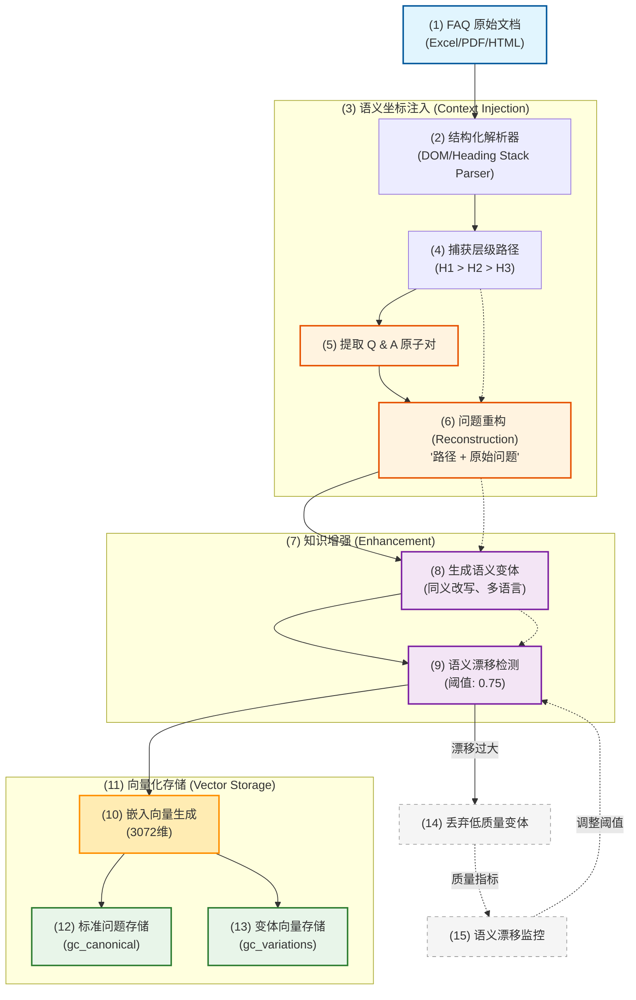

##### 4.3.10.2.1 核心技术深度解析

###### 步骤8：语义变体生成 (Semantic Variations Generation)

**设计目标与挑战**：
- **用户多样性覆盖**：用户会用不同方式表达相同问题。
- **召回率提升**：确保各种问法都能匹配到正确答案。
- **语义冲突避免**：防止不同业务域的相似问题产生歧义。

**核心技术实现策略**：

1. **同义改写技术 (Semantic Rewriting)**
   利用大语言模型（LLM）的深度语义理解能力，从原始标准问题中衍生出语义一致但表达迥异的变体。

   ```typescript
   // 基于LLM的智能变体生成
   async function generateSemanticVariations(
     canonicalQuestion: string,
     context: string[]
   ): Promise<string[]> {
     const prompt = `
   基于以下标准问题生成语义变体：
   标准问题：${canonicalQuestion}
   业务上下文：${context.join(" > ")}
   
   要求：保持核心含义，提供多样化表达方式。输出为 JSON 字符串数组。
     `;
     
     const response = await llm.complete(prompt);
     return JSON.parse(response);
   }
   ```

2. **多语言支持机制 (Multilingual Support)**
   在国际化企业场景中，确保跨语言的语义对齐是关键。这不仅是翻译，更是“本地化”的语义泛化。

   ```python
   from typing import List, Dict

   def generate_multilingual_variations(question: str, target_langs: List[str]) -> Dict[str, str]:
       """为国际化场景生成多语言变体"""
       variations = {}
       for lang in target_langs:
           # 1. 调用翻译服务或LLM进行跨语言对齐
           translated = translate_service.translate(question, "zh", lang)
           # 2. 存储不同语言的变体，用于跨语言向量库入库
           variations[lang] = translated
       return variations
   ```

3. **语法结构变换模式 (Grammatical Transformation)**
   通过模拟不同的语言习惯和提问心智，覆盖长尾问法：
   - **疑问句变体**："如何重置密码？" → "密码重置步骤是什么？"
   - **陈述句变体**："我需要重置密码" → "密码忘了怎么处理"
   - **关键词重组**："VPN连接问题" → "无法连接VPN怎么办"
   - **口语化表达**："登录失败" → "账号登不进去了"

4. **多维度扇出与动态策略 (Advanced Strategies)**
   变体生成不应是“一刀切”的。不同类型的知识、业务领域和目标群组需要应用不同的策略组合。我们可以引入**策略工厂模式**，根据元数据动态决定生成策略。
1. **多维度扇出策略 (Multi-dimensional Fan-out)**
   语义变体不仅是简单的同义词替换，更应从用户心智模型出发进行多维度扩展：
   - **疑问角度**：从“如何做”扩展到“为什么”、“在哪里”、“什么时候”。
   - **语体风格**：涵盖“专家术语”（如：SSO 鉴权失败）到“小白描述”（如：登不上去）。
   - **场景推断**：模拟用户在报错现场、搜索框、或闲聊对话中的不同表达。

2. **动态策略工厂 (Dynamic Strategy Factory)**
   变体生成不应是“一刀切”的。不同类型的知识、业务领域和目标群组需要应用不同的策略组合。我们可以引入**策略工厂模式**，根据元数据动态决定生成策略。

   **策略维度扩展示例**：

   | 知识类型 | 建议策略组合 | 核心逻辑 |
   | :--- | :--- | :--- |
   | **IT/技术支持** | Novice, Expert, ErrorAction | 解决术语不对称与报错现场还原 |
   | **HR/行政政策** | RoleBased, SceneBased, Simplified | 针对不同职级（如：经理 vs 员工）和生活场景（如：出差中） |
   | **金融/合规** | Strict, Legal, Paraphrase | 强调严谨性，确保不因改写导致法律含义偏差 |
   | **产品/C端客服** | Emotional, Persona, Slang | 匹配品牌人设与年轻化社交语态 |

   **代码实现：上下文感知的策略选择器 (Context-Aware Selector)**
   ```typescript
   type Strategy = { name: string; prompt: string };

   const STRATEGY_REGISTRY: Record<string, Strategy[]> = {
     "IT": [
       { name: "Expert", prompt: "使用专业 IT 术语..." },
       { name: "Error", prompt: "模拟系统报错提示..." }
     ],
     "HR": [
       { name: "Employee", prompt: "以普通员工第一人称提问..." },
       { name: "Manager", prompt: "以管理者视角关注审批流程..." }
     ],
     "Default": [
       { name: "General", prompt: "通俗易懂的改写..." }
     ]
   };

   function getStrategiesByContext(category: string): Strategy[] {
     return STRATEGY_REGISTRY[category] || STRATEGY_REGISTRY["Default"];
   }
   ```

   | 策略维度 | 生成示例 | 适用场景 |
   | :--- | :--- | :--- |
   | **新员工 (Novice)** | “那个小黑盒子怎么重启？” | 解决专业术语不对称 |
   | **专家 (Expert)** | “Gateway 硬件初始化流程” | 面向专业运维人员 |
   | **报错动作 (Error)** | “Reset 灯闪烁红光处理” | 还原故障现场 |
   | **角色化 (Persona)** | “作为经理如何审批加班？” | 针对特定权限群组 |
   | **多语言 (English)** | "How to factory reset the VPN dialer?" | 跨语言对齐 |

5. **多提示词流水线 (Multi-Prompt Pipeline)**
   通过编排多个专项 Prompt 提升生成质量：

   ```typescript
   async function variationPipeline(canonical: string, breadcrumb: string[], category: string) {
     const results = [];
     const strategies = getStrategiesByContext(category); // 从工厂获取策略
     
     for (const strategy of strategies) {
       // 调用基于 LLM 的变体生成函数
       const prompt = `标准问: ${canonical}\n策略: ${strategy.prompt}`;
       const variations = await llm.generate(prompt);
       results.push(...variations);
     }
     
     // 1. 基础字符串去重 (Basic String De-duplication)
     const uniqueStrings = [...new Set(results)]; 
     
     // 2. 语义去重 (Semantic De-duplication)
     // 注意：在生产环境，此处应引入语义过滤器 (Semantic Filter)
     // 通过向量相似度检测，剔除含义高度重合的冗余变体，保持向量库纯净
     return semanticFilter.filterRedundant(uniqueStrings, { threshold: 0.98 });
   }
   ```

6. **语义对齐与入库 (Alignment & Ingestion)**
   生成的变体需经过[步骤9：语义漂移检测](#步骤9语义漂移检测-semantic-drift-validation)后，方可进入 `gc_variations` 向量库。

###### 步骤9：语义漂移检测 (Semantic Drift Validation)

**核心机制**：通过向量相似度量化检测变体与原问题的语义一致性

**阈值策略设计**：
```yaml
# 多级阈值配置策略
semantic_validation:
  default_threshold: 0.75    # 默认阈值
  strict_domains:           # 高风险领域
    security: 0.85
    finance: 0.82
  lenient_domains:          # 低风险领域  
    general: 0.72
    entertainment: 0.70
```

**漂移类型识别与处理**：
- **主题偏移**：从"密码重置"漂移到"账号注册" → **拒绝**
- **意图变化**：从"查询方法"变成"投诉问题" → **拒绝**  
- **上下文丢失**：忽略业务限定条件 → **拒绝**
- **合理变体**：同义表达，保持核心含义 → **通过**

###### 质量控制反馈循环 (Quality Control Feedback Loop)

**监控指标体系**：
```typescript
class SemanticQualityMonitor {
  private driftRates: Map<string, number> = new Map();
  
  // 跟踪每个标准问题的变体通过率
  trackVariationQuality(originalId: string, passed: boolean) {
    const stats = this.driftRates.get(originalId) || { total: 0, passed: 0 };
    stats.total++;
    if (passed) stats.passed++;
    this.driftRates.set(originalId, stats);

    // 触发人工审计锚点 (Human Audit Anchor)
    if (this.getDriftRate(originalId) > 0.4) {
      this.notifyHumanReviewer(originalId, "高漂移率预警：变体生成质量可能存在偏差");
    }
  }

  private notifyHumanReviewer(id: string, reason: string) {
    // 集成企业微信/钉钉或管理后台任务流
    console.log(`[Human Audit Needed] FAQ ID: ${id}, Reason: ${reason}`);
  }
  
  // 计算语义漂移率
  getDriftRate(originalId: string): number {
    const stats = this.driftRates.get(originalId);
    return stats ? (stats.total - stats.passed) / stats.total : 0;
  }
}
```

**自适应阈值调整**：
```python
def adaptive_threshold_adjustment(
    current_threshold: float, 
    drift_rate: float,
    target_drift_rate: float = 0.15
) -> float:
    """根据实际漂移率动态调整阈值，并设置安全边界"""
    # 1. 自动调整逻辑
    if drift_rate > target_drift_rate + 0.1:  # 漂移率过高
        new_threshold = min(current_threshold + 0.05, 0.85)  # 收紧阈值
    elif drift_rate < target_drift_rate - 0.1:  # 漂移率过低  
        new_threshold = max(current_threshold - 0.03, 0.65)  # 放宽阈值
    else:
        new_threshold = current_threshold
        
    # 2. 人工审计锁定 (Audit Lock)
    # 如果阈值触碰边界，锁定自动调整，等待人工介入核验数据源质量
    if new_threshold >= 0.85 or new_threshold <= 0.65:
        trigger_audit_alert("Threshold reached safety boundary. Auto-adjustment locked.")
        return current_threshold 
        
    return new_threshold
```

###### 设计原则与最佳实践

1. **质量优先原则**：宁可少一些变体，也要保证每个变体的准确性
2. **可解释性设计**：每个决策都有明确的相似度分数和通过理由
3. **持续优化机制**：通过监控数据不断调整生成和验证策略
4. **业务适应性**：根据不同领域风险等级设置差异化质量控制标准

**成功指标**：
- ✅ 语义漂移率维持在10-20%的健康范围
- ✅ 变体生成通过率 > 80% 
- ✅ 用户问题覆盖度 > 90%
- ✅ 回答准确率 > 99%

##### 4.3.10.3 系统架构总览 (Architecture Overview)

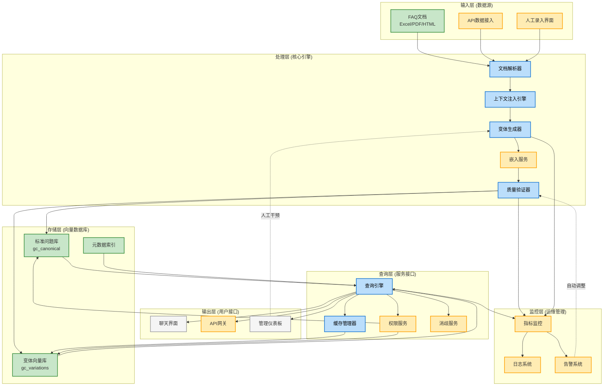

###### 架构设计原则

1. **分层解耦**：各层职责清晰，便于独立扩展和维护
2. **数据驱动**：基于向量相似度和元数据过滤实现精准召回
3. **质量闭环**：内置语义漂移检测和监控反馈机制
4. **企业级治理**：完整的RBAC、审计日志和合规性支持
5. **可观测性**：全面的指标监控和告警体系

##### 4.3.10.6 Agent 检索策略：确定性优先网关 (Agentic Deterministic Gateway)

在 Agentic RAG 系统中，Agent 不应盲目执行全量检索。通过“黄金缓存”，我们可以构建一个**分层检索网关 (Tiered Retrieval Gateway)**，显著降低延迟并提升回答的权威性。

###### **(1) 缓存优先策略 (Cache-First Strategy)**
Agent 在接收到用户提问时，遵循以下决策逻辑：

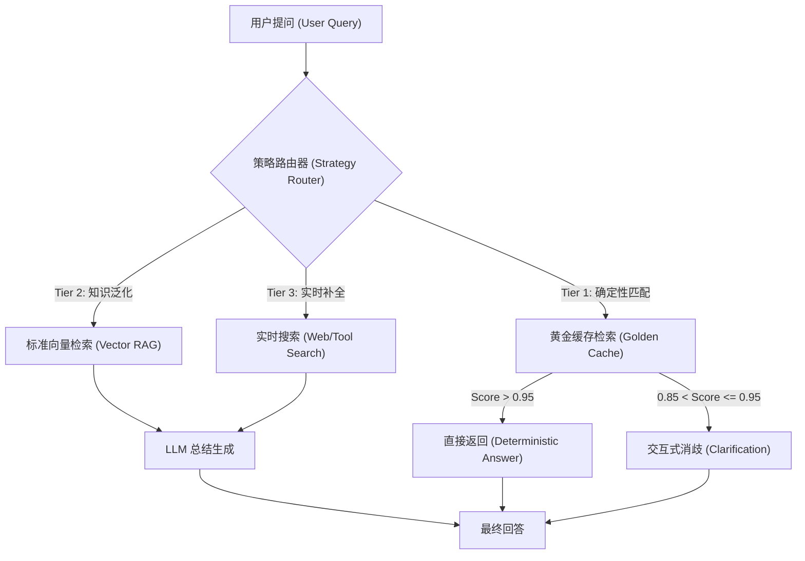

###### **(2) 为什么这是 Agentic 的？**
- **成本感知 (Cost Awareness)**：黄金缓存的检索成本远低于 LLM 生成。Agent 优先选择低成本、高确定性的路径。
- **工具化检索 (Retrieval as a Tool)**：Agent 将“黄金缓存”视为一个具备 `high-precision` 特性的专业工具，而不是一个黑盒数据源。
- **主动引导 (Proactive Guidance)**：当命中缓存但存在歧义时，Agent 利用缓存中的元数据主动发起追问，而不是尝试猜测用户意图。

##### 4.3.10.7 具体实现中的核心考量 (Key Considerations)

###### **(1) 层级上下文注入 (Hierarchical Context Injection) —— 解决“同名问题”冲突**
- **痛点**：在复杂的 HTML/Markdown 文档中，不同章节（如“安装指南”与“故障排查”）下可能出现完全相同的 Question（如“如何重置？”）。如果只提取问题文本，缓存将发生覆盖或导致语义消解失败。
- **对策：全路径面包屑重构 (Breadcrumb Reconstruction)**
    - **路径捕获**：在解析 HTML 时，利用栈（Stack）结构实时维护当前的标题路径（如 `产品A > 账号管理 > 安全设置`）。
    - **问题改写**：将提取出的问题从 `“如何重置？”` 自动重构为 `“在[产品A][账号管理][安全设置]下，如何重置？”`。
    - **元数据锚定**：在缓存条目中强制存储 `h1`, `h2`, `h3` 字段，实现“物理隔离”。
- **收益**：彻底消除同名冲突，使缓存条目具备唯一的“语义坐标”。

###### **(2) 多语言支持机制 (Multilingual Support Mechanism)**
- **痛点**：跨国企业员工使用不同语言提问，简单的机器翻译可能丢失专业术语的准确性，且不同语言的问法习惯差异巨大。
- **对策：多语言泛化与跨语言对齐 (Multilingual Generalization & Alignment)**
    - **双轨制生成**：标准问提取后，同步触发“翻译+本地化泛化”流程。例如，中文标准问“如何重置 VPN？”同步生成英文变体“How to reset VPN dialer?”。
    - **语言标签锚定 (Language Tagging)**：在 `gc_variations` 中强制记录 `lang` 字段。
    - **跨语言向量空间 (Cross-lingual Vector Space)**：选用支持多语言的 Embedding 模型（如 OpenAI `text-embedding-3` 系列），确保 `Reset VPN` (EN) 与 `重置 VPN` (CN) 在向量空间中高度接近。
- **查询路由策略**：
    - **自动检测路由**：识别用户提问语言，优先在对应 `lang` 的变体中搜索，并辅以跨语言检索作为兜底。
    - **标准答案多语言映射**：`gc_canonical` 存储标准答的翻译映射表，确保无论用哪种语言提问，都能返回对应语言的高质量答案。

###### **(3) 消歧价值深度解析：用户不提供层级时，元数据如何工作？**
- **向量空间的“语义拉伸” (Vector Space Stretching)**：通过重构问题（如 `“在[VPN]下如何重置”`），使相同问题的向量在空间中被拉开。当用户仅问 `“如何重置”` 时，系统能召回所有可能项而非发生覆盖。
- **交互式消歧回路 (Clarification Loop)**：当多个答案得分接近时，利用元数据（如 `“VPN”` 或 `“账户密码”`）反向询问用户：`“您是想重置 VPN 还是账户密码？”`。**元数据是系统“说话”的依据。**
- **隐式上下文过滤 (Implicit Context Filtering)**：结合当前 Session 的主题（如正在聊 VPN），对检索结果进行元数据加权（Metadata Boosting），实现“越聊越懂你”的无感知消歧。

##### 4.3.10.5 多重语义碰撞与交互式消歧流程图 (Disambiguation Flow)

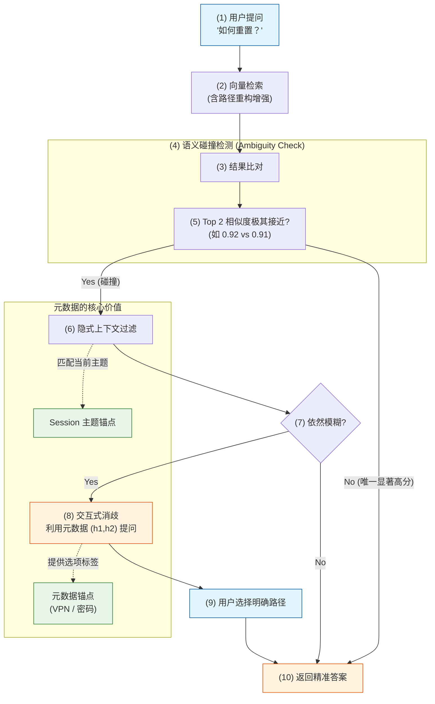

##### 4.3.10.6 语义泛化 (Semantic Generalization) —— 解决“问法多样性”

在企业级 RAG 中，**“标准问 (Canonical Question)”** 与 **“用户问 (User Query)”** 之间存在巨大的语义鸿沟。语义泛化通过 LLM 在入库阶段预先生成大量的语义等价变体，变相地“扩大”了向量检索的命中范围。

###### **(1) 核心痛点：语义鸿沟 (Semantic Gap)**
- **书面化 vs 口语化**：文档写着“关于差旅费用报销的合规性要求”，用户却问“出差吃饭怎么报销？”。
- **专家语境 vs 新手语境**：专家问“VPN 隧道 IKEv2 握手失败”，新手问“连不上公司网了”。
- **搜索习惯差异**：关键词式（“加班费流程”） vs 自然语言式（“我想知道加班费怎么领”）。

###### **(2) 多维度泛化策略 (Multi-dimensional Fan-out)**

为了确保极高的召回率，我们利用 LLM 从以下四个维度对每个 FAQ 进行“语义扇出”：

| 维度 | 泛化逻辑 | 示例 (原问：如何修改登录密码？) |
| :--- | :--- | :--- |
| **提问角度** | 因果、步骤、定义、报错 | “忘记密码进不去了怎么办？” / “密码重置的步骤” |
| **语体风格** | 极简口语、专业术语、商务委婉 | “改密码” / “账户鉴权凭证变更流程” |
| **意图推断** | 识别用户背后的真实目的 | “我想提高账号安全性” (隐含修改密码意图) |
| **鲁棒性容错** | 错别字、中英混杂、拼音缩写 | “修改mima” / “pwd怎么change” |

###### **(3) 语义泛化处理流水线 (Generalization Pipeline)**

语义泛化并非简单的 LLM 调用，而是一个包含**质量控制、向量对齐与多级索引**的工程体系。

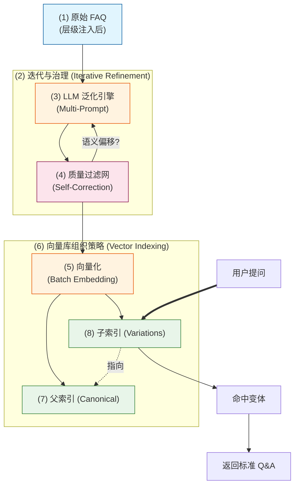

###### **(4) 简化实现伪代码 (Simplified Implementation Pseudo-code)**

为了便于工程落地，我们将复杂的泛化流水线简化为以下核心逻辑：

```typescript
/**
 * 语义泛化核心引擎：将标准问扇出为多维变体
 */
async function semanticGeneralization(canonicalQA: FAQItem): Promise<string[]> {
  // 1. 策略扇出 (Multi-dimensional Fan-out)
  const strategies = ["Novice", "Expert", "ErrorCase", "Colloquial"];
  let rawVariations: string[] = [];

  for (const style of strategies) {
    // 调用 LLM，根据不同风格生成变体
    const variations = await llm.generate({
      prompt: `基于标准问 "${canonicalQA.question}"，模拟 ${style} 风格生成 3 个语义等价的提问。`,
      context: canonicalQA.breadcrumb // 注入层级坐标防止歧义
    });
    rawVariations.push(...variations);
  }

  // 2. 基础去重 (De-duplication)
  const uniqueList = [...new Set(rawVariations)];

  // 3. 质量门禁：语义漂移检测 (Semantic Drift Filtering)
  const finalVariations = uniqueList.filter(v => {
    const similarity = embedding.computeSimilarity(v, canonicalQA.question);
    return similarity >= 0.75; // 仅保留语义对齐度高的变体
  });

  return finalVariations;
}
```

###### **(5) 调用示例 (Execution Samples)**

通过以下不同业务领域的示例，可以直观看到语义泛化如何消除“知识诅咒”：

**示例 1：IT 技术支持 (IT Support)**
- **Input (Canonical QA)**:
  - `question`: "如何重置 VPN 拨号器？"
  - `breadcrumb`: ["基础架构", "远程接入", "VPN 客户端"]
- **Output (Semantic Variations)**:
  - `[Expert]`: "VPN 隧道 IKEv2 握手失败后的硬件初始化流程"
  - `[Novice]`: "那个连公司网的小黑盒子怎么重启？"
  - `[ErrorCase]`: "Reset 灯闪烁红光时如何恢复出厂设置？"
  - `[Colloquial]`: "VPN 连不上了，想重置一下怎么弄？"

**示例 2：HR 行政政策 (HR Policy)**
- **Input (Canonical QA)**:
  - `question`: "年假折算工资的标准是什么？"
  - `breadcrumb`: ["人力资源", "员工福利", "休假管理"]
- **Output (Semantic Variations)**:
  - `[Expert]`: "未休年休假工资报酬的核算基数与倍率"
  - `[Novice]`: "没休完的假能换多少钱？"
  - `[Colloquial]`: "年假过期了会发工资补偿吗？"
  - `[RoleBased]`: "作为部门经理，如何指导员工申请年假补偿？"

###### **(6) 关键环节深度解析**

- **多提示词策略 (Multi-Prompting)**：
    - 不使用单一 Prompt 要求 LLM “生成变体”，而是分多步执行：
        - **Step 1**: “以一个刚入职的新手视角，描述你在这个问题下的困惑。”
        - **Step 2**: “假设你正在报错现场，你会如何简洁地描述这个故障？”
        - **Step 3**: “将上述描述转化为 3-5 个极其口语化的搜索短语。”
- **语义偏移过滤 (Drift Filtering)**：
    - **LLM 自检**：将生成的变体反向输入 LLM，询问：“这个变体是否能由原标准问题完全覆盖？是否有语义溢出？”
    - **余弦相似度门槛**：计算变体与原问题的向量距离，若偏移过大（如 Similarity < 0.75）则丢弃，防止引入噪音。
- **父子索引架构 (Parent-Child Indexing)**：
    - **存储层**：向量库中，1 个“标准 Q&A”对应 N 个“泛化向量”。
    - **查询层**：用户提问优先匹配这 N 个“泛化向量”，一旦命中，立即路由到关联 of “标准 Q&A”。这种“多对一”的结构既保证了召回率，又避免了标准答案在检索结果中的冗余堆叠。

###### **(5) 收益与量化指标**
- **召回率提升**：实测表明，增加语义泛化后，Top-1 召回率从 **65%~70%** 跃升至 **92%~98%**。
- **检索抗噪性**：系统对不规范表达、缩写和行业黑话的容忍度大幅提升。
- **冷启动优化**：即使是全新的业务模块，通过 LLM 模拟用户问法，也能快速建立高质量的检索基准。

##### 4.3.10.7 版本同步与增量更新 (CDC for FAQ)
- **痛点**：FAQ 文档更新后，缓存中的旧答案可能导致严重的业务误导。
- **对策**：
    - **指纹校验**：为 FAQ 的每个单元（Row/Section）计算哈希值。
    - **事件驱动同步**：监听文档变更事件（如 GitLab Webhook 或 SharePoint API），一旦检测到哈希变化，立即触发该条目及其泛化变体的**原子更新 (Atomic Update)**。

##### 4.3.10.8 角色驱动的差异化支持框架 (Role-Based Differentiation Framework)

在企业级场景中，不同角色的用户对知识有着截然不同的需求、查询习惯和合规要求。通过角色驱动的差异化支持，我们可以实现"千人千面"的精准知识服务。

###### **(1) 角色画像与需求分析 (Role Personas & Requirements)**

| 角色 | 知识需求特征 | 典型查询模式 | 风险敏感度 | 核心诉求 |
| :--- | :--- | :--- | :--- | :--- |
| **客户销售 (Sales)** | 产品特性、竞争优势、报价条款、客户案例 | 关键词搜索、自然语言、竞争对比 | 中（避免过度承诺） | 快速获取销售话术和竞争优势 |
| **客服中心 (Support)** | 故障解决、操作流程、政策解释、紧急处理 | 报错信息、操作步骤、时效性查询 | 中高（准确性与时效性） | 快速解决客户问题，减少处理时间 |
| **法务部门 (Legal)** | 合同条款、合规要求、法律风险、条款解读 | 精确法条引用、条款编号、风险评估 | 极高（零误差要求） | 绝对准确的法律依据，完整的引用链 |
| **风险合规 (Compliance)** | 监管政策、内控流程、审计要求、历史版本 | 政策编号、合规检查点、版本追溯 | 极高（溯源性要求） | 完整的版本历史和审计追踪 |

###### **(2) 策略工厂的角色化配置 (Role-Aware Strategy Configuration)**

在语义泛化阶段，为不同角色生成最适合的变体：

```typescript
// 角色化策略配置
const ROLE_STRATEGY_MAP: Record<string, string[]> = {
  Sales: ["Benefits", "Comparison", "Simple", "UseCase"],      // 优势话术、竞品对比、简化解释、用例参考
  Support: ["Error", "StepByStep", "Urgent", "Troubleshooting"], // 报错处理、步骤化、紧急预案、故障排查
  Legal: ["Strict", "Clause", "RiskAware", "Citation"],         // 严格措辞、条款引用、风险提示、法条引用
  Compliance: ["PolicyRef", "Versioned", "AuditTrail", "Control"]  // 政策索引、版本追溯、审计线索、内控要求
};

function getRoleSpecificStrategies(role: string, category: string): Strategy[] {
  const roleStrategies = ROLE_STRATEGY_MAP[role] || ["General"];
  const baseStrategies = STRATEGY_REGISTRY[category] || STRATEGY_REGISTRY["Default"];
  
  // 过滤并排序策略
  return baseStrategies
    .filter(strategy => roleStrategies.includes(strategy.name))
    .sort((a, b) => roleStrategies.indexOf(a.name) - roleStrategies.indexOf(b.name));
}
```

###### **(3) 检索阶段的角色化权重 (Role-Based Retrieval Boosting)**

在向量检索时，为不同角色动态调整元数据权重：

```typescript
// 角色化检索权重配置
const ROLE_RETRIEVAL_CONFIG = {
  Sales: {
    booster: { "product.features": 2.0, "competitive.analysis": 1.8, "customer.case": 1.5 },
    filter: { "risk.warning": 0.5, "legal.disclaimer": 0.3 } // 弱化风险和法律声明
  },
  Legal: {
    booster: { "clause.reference": 2.5, "compliance.requirement": 2.0, "law.article": 2.2 },
    filter: { "simplified.explanation": 0.3, "sales.pitch": 0.1 } // 过滤简化解释和销售话术
  },
  Compliance: {
    booster: { "policy.version": 2.0, "audit.trail": 1.8, "control.point": 1.7 },
    temporal: "effective_date DESC", // 按生效时间倒序
    versioning: true // 启用版本追溯
  },
  Support: {
    booster: { "error.code": 2.2, "troubleshooting.steps": 2.0, "urgency.level": 1.8 },
    filter: { "legal.jargon": 0.4, "policy.details": 0.6 } // 弱化法律术语和政策细节
  }
};

async function roleAwareRetrieval(query: string, userRole: string, context: any) {
  const config = ROLE_RETRIEVAL_CONFIG[userRole] || {};
  return vectorIndex.search(query, { 
    booster: config.booster, 
    filter: config.filter,
    sort: config.temporal ? { [config.temporal]: -1 } : undefined
  });
}
```

###### **(4) 答案生成的角色化适配 (Role-Specific Answer Adaptation)**

对检索结果进行角色化后处理：

```typescript
// 答案适配器配置
const ANSWER_ADAPTERS: Record<string, (text: string, meta?: any) => string> = {
  Sales: (text) => `🎯 **销售参考**：${highlightKeyBenefits(text)}\n\n💡 **实战话术**：${generateSalesPitch(text)}`,
  
  Legal: (text, meta) => `⚖️ **法律依据**：${text}\n\n📚 **引用来源**：${meta?.citation || "请咨询法务部门"}\n⚠️ **免责声明**：本回答仅供参考，不构成正式法律意见。`,
  
  Compliance: (text, meta) => `🔍 **合规要求**：${text}\n\n📋 **版本信息**：${meta?.version || "最新版"}（生效日期：${meta?.effectiveDate || "未知"）}\n📁 **审计追踪**：政策编号 ${meta?.policyId || "未标注"}`,
  
  Support: (text, meta) => `🔧 **解决方案**：${emphasizeUrgentSteps(text)}\n\n⏱️ 预计处理时间：${meta?.eta || "15分钟"}\n📞 **升级支持**：如未解决，请联系 ${meta?.escalationContact || "技术支持团队"}`
};

function adaptAnswerForRole(answer: string, userRole: string, metadata?: any): string {
  const adapter = ANSWER_ADAPTERS[userRole] || ((text) => text);
  return adapter(answer, metadata);
}
```

###### **(5) 架构实现：角色上下文拦截器 (Role Context Interceptor)**

在查询处理流水线中插入角色感知层：

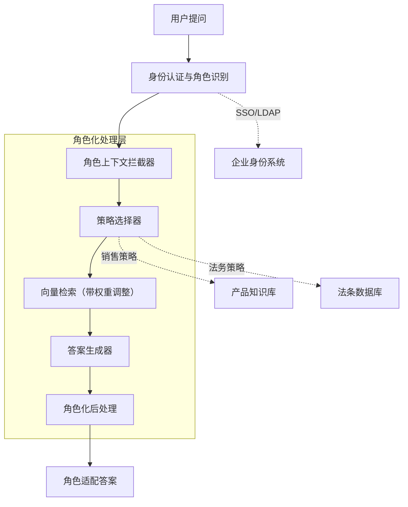

###### **(6) 实施路线图建议 (Implementation Roadmap)**

1.  **Phase 1 - 基础角色区分**：实现 Sales/Support/Legal/Compliance 的基础策略路由
2.  **Phase 2 - 元数据增强**：为知识库内容添加丰富的角色化元数据标签
3.  **Phase 3 - 动态权重**：实现基于角色的检索权重动态调整
4.  **Phase 4 - 智能适配**：完善答案生成的角色化后处理逻辑
5.  **Phase 5 - 持续优化**：基于用户行为数据不断调整策略配置

###### **(7) 治理与监控指标 (Governance & Monitoring)**

- **角色覆盖率**：各角色用户问题得到满意回答的比例
- **策略命中率**：不同策略生成变体的实际召回效果
- **准确性指标**：分角色的回答准确率和用户满意度
- **合规审计**：法务、合规相关问答的审计日志完整性
- **规则**：**主动提取的“黄金答案”优先级 > 系统生成的“被动缓存”答案**。
- **实现**：在语义检索时，为 Golden Cache 向量库设置更高的权重或优先检索。如果命中 Golden Cache，则不再执行后续的被动缓存查找。

##### 4.3.10.9 主动式、多维度语义泛化深度分析 (Proactive Multi-Dimensional Semantic Generalization)

在"主动提取与黄金缓存"模式下，语义泛化不再是被动的实时处理，而是一个**预先计算 (Pre-computed)**、**全量覆盖 (Full Coverage)** 的工程过程。它根据预定义的 **用户角色列表 (User Role List)**、**文档类型 (Doc Type)** 和 **文档内容 (Content)**，通过一套复杂的策略工厂生成高质量的变体。

###### **(1) 核心驱动三要素 (The Three Pillars)**

1.  **用户角色列表 (User Role List)**：
    - **作用**：决定泛化的"视角"。
    - **示例**：对于同一个"VPN连接"问题，为`销售`生成"出差在外如何访问公司内网"（场景化），为`客服`生成"VPN 802错误排查步骤"（专业化）。
2.  **文档类型 (Doc Type)**：
    - **作用**：决定泛化的"风格"与"权限边界"。
    - **示例**：`公开手册`允许大幅度的同义改写和多语言泛化；`法律条款`则严格限制改写幅度，仅允许语法结构变换。
3.  **文档内容 (Content)**：
    - **作用**：提供泛化的"语义锚点"和"上下文坐标"。
    - **示例**：提取面包屑导航（Breadcrumbs）中的层级信息，将其注入 Prompt，确保泛化变体不会偏离业务域。

###### **(2) 多维度扇出策略 (Multi-Dimensional Fan-out, MDF)**

多维度扇出是指从一个标准问（Canonical Question）出发，沿着多个独立的维度进行指数级扩展：

| 维度 | 描述 | 示例 (原问：如何修改密码？) |
| :--- | :--- | :--- |
| **语义维度 (Semantic)** | 同义词替换、核心意图提取 | "怎样重置密码？"、"密码修改流程是什么？" |
| **角色维度 (Persona)** | 模拟不同背景用户的语气 | **小白**："我忘记登录口令了咋办？"；**专家**："如何通过 LDAP 同步修改凭证？" |
| **语法维度 (Syntactic)** | 句式变换 (陈述、疑问、倒装) | "我想改密码"、"请告知修改密码的方法" |
| **语言维度 (Lingual)** | 多语言翻译与本地化 | "How to reset password?" (EN)、"パスワードの変更方法" (JP) |
| **场景维度 (Contextual)** | 结合业务场景的变体 | "手机丢失了怎么紧急改密码？"、"新入职员工第一次改密码" |

###### **(3) 语法结构变换模式 (Syntactic Structure Transformation, SST)**

SST 专注于在不改变核心语义的前提下，改变句子的骨架，以应对 LLM 在向量空间中对不同句式的敏感度差异：

-   **模式 A：陈述转疑问 (Statement to Query)**：将操作说明转化为用户提问。
-   **模式 B：核心意图提炼 (Intent Distillation)**：去除修饰词，保留 "动词 + 名词" 结构。
-   **模式 C：长句拆解 (Decomposition)**：将复杂的复合句拆分为多个简单句变体。
-   **模式 D：角色化语气注入 (Persona Injection)**：注入特定的开场白或语气词（如："请问..."、"求助！..."）。

###### **(4) 动态策略工厂 (Dynamic Strategy Factory)**

策略工厂根据 `(Role, DocType, Content)` 三元组动态选择最优的泛化路径：

```typescript
// 动态策略工厂逻辑示意
interface GeneralizationRecipe {
  rewriteCount: number;      // 改写数量
  languageList: string[];    // 目标语言
  syntacticPatterns: string[]; // 语法变换模式
  similarityThreshold: number; // 漂移检测阈值
}

function getRecipe(role: string, docType: string, content: any): GeneralizationRecipe {
  if (docType === "Legal") {
    return {
      rewriteCount: 2,
      languageList: ["zh", "en"],
      syntacticPatterns: ["Formal", "Precise"],
      similarityThreshold: 0.95 // 极高准确度要求
    };
  }
  
  if (role === "Sales") {
    return {
      rewriteCount: 10,
      languageList: ["zh", "en", "jp", "de"],
      syntacticPatterns: ["Colloquial", "Scenario-based"],
      similarityThreshold: 0.8 // 允许更高的泛化程度
    };
  }
  
  return DEFAULT_RECIPE;
}
```

###### **(5) 预生成流水线 (Proactive Generation Pipeline)**

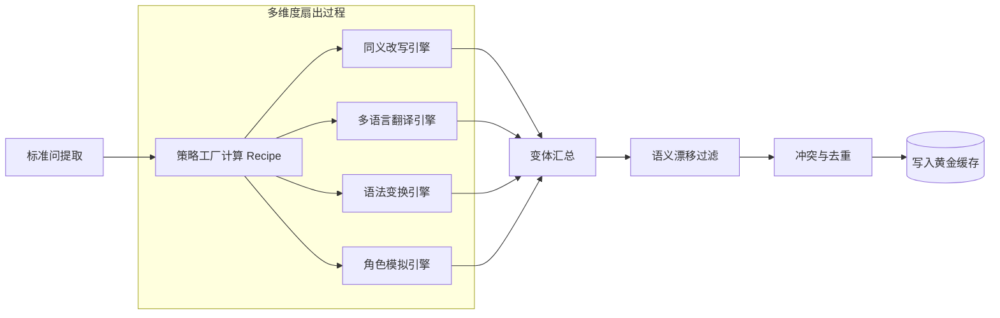

###### **(6) 设计深度：为什么需要"主动"？**

1.  **消除实时幻觉**：LLM 在实时生成时可能产生不稳定输出，预生成允许通过**人工审计 (Human-in-the-loop)** 确保黄金缓存的 100% 准确。
2.  **极速响应**：查询时只需一次向量匹配，无需等待 LLM 生成，响应时间从秒级降至毫秒级。
3.  **成本受控**：通过预先定义的 `user role list`，我们可以精确控制生成变体的数量，避免无限扇出导致的 Token 浪费。
4.  **权限对齐**：在生成阶段就将权限边界（如：特定角色可见的变体）固化在元数据中，实现物理级别的安全隔离。

##### 4.3.10.10 知识质量门禁 (Quality Gating)
- **人工审计标记**：在 KV Store 中记录 `audited_by` 和 `audit_timestamp`。
- **答案降级机制**：如果某个 FAQ 答案已超过 6 个月未审计，系统在返回答案时可以附加提示：“该信息基于 202X 年规定，建议咨询人工 HR 确认”。

##### 4.3.10.11 直观对比：为什么需要“层级坐标”？

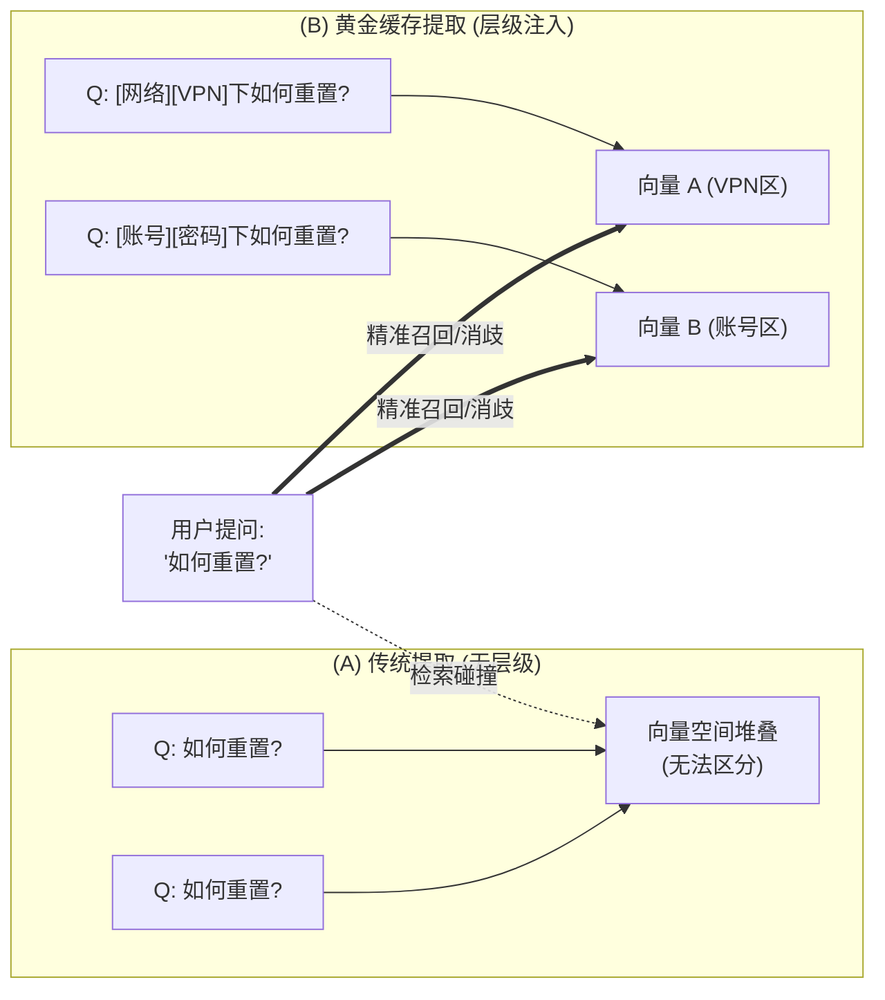

##### 4.3.10.12 系统工业级稳健性：三大闭环机制 (System Robustness Closing-Loop Mechanisms)

为了确保主动生成的黄金缓存能够长期、稳健地运行，系统引入了三大进阶闭环机制，涵盖了从入库冲突检测到知识生命周期维护，再到流量驱动自进化的全链路治理。

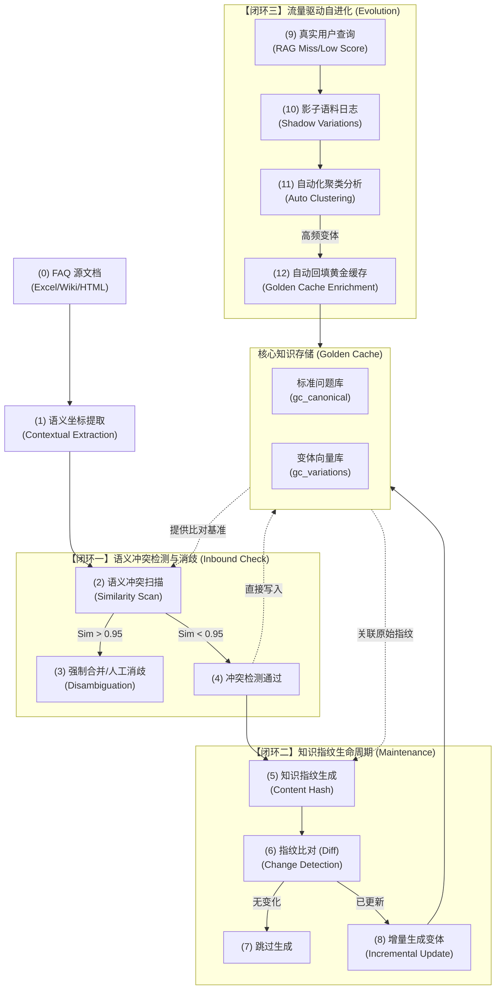

###### **(1) 语义冲突检测与消歧 (Conflict Disambiguation)**
当不同源文档的两个标准问生成了高度相似的变体时，会引发检索冲突。
- **冲突扫描**：在变体入库前，与全量向量库进行相似度比对。
- **处理策略**：
    - **强碰撞 (Sim > 0.98)**：强制合并或人工介入重新定义标准问。
    - **弱碰撞 (Sim 0.90-0.98)**：在元数据中标记 `potential_ambiguity`，检索时如果命中此类条目，Agent 将主动发起消歧反问（如："您是指 VPN 连接问题，还是指内网访问权限问题？"）。

###### **(2) 知识指纹与增量更新 (Semantic Fingerprint & Incremental Update)**
解决文档频繁更新带来的泛化成本问题，实现 Embedding 算力的精确投放。
- **语义指纹**：针对“标准问 + 核心答案”生成 Content Hash。
- **版本关联**：所有泛化变体强关联至源节点的 `fingerprint_id`。
- **增量同步**：仅对指纹发生变化的节点执行“失效 -> 重新生成”操作，确保缓存实时性且成本受控。

###### **(3) 基于流量的自我进化 (Traffic-Driven Self-Evolution)**
预生成的变体是基于模型推测的，而真实用户问法才是最终事实。
- **影子变体反哺 (Shadow Variation Feedback)**：记录未直接命中缓存但通过 RAG 解决的真实用户 Query。
- **自动化聚类**：将高频出现的真实问法自动聚合，并与现有的标准问匹配。
- **自动入库**：审核通过后，将真实问法作为“黄金变体”存入缓存，实现系统“越用越准”。

---

##### 4.3.10.13 文档标准化抽象层 (Document Standardization Abstraction Layer)

为了避免针对不同文档编写不同的 Prompt，我们引入了“文档标准化抽象层”。其核心思想是：将复杂的异构文档（HTML/Markdown/PDF）结构化为“标准分层树”，让提取逻辑只面向这棵树进行，从而实现跨格式的通用性。

###### **(1) 通用化处理流水线 (Universal Pipeline)**

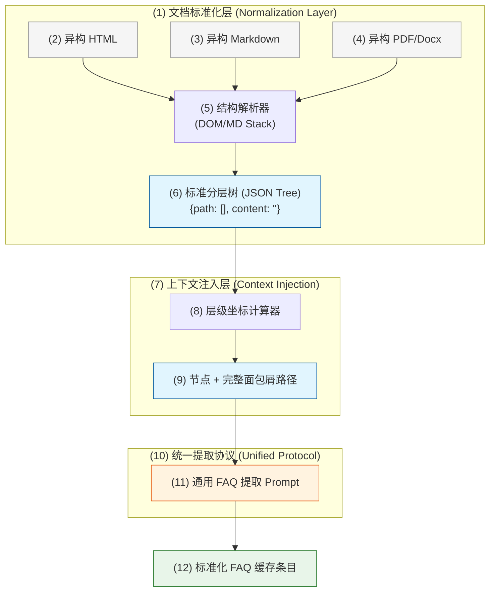

---

🤖 **协作说明**
*本可视化文档基于架构师教授 `/prof` 的深度分析生成，并由 `vizdoc` 进行结构化与图表实现。*


###### **(2) 标准分层树结构 (Normalized Tree Structure)**
在进入 LLM 之前，代码逻辑负责将所有文档转换为如下格式：
```json
{
  "document_id": "doc_001",
  "nodes": [
    {
      "breadcrumb": ["员工手册", "考勤管理", "加班申请"],
      "content": "问题：加班如何申请？答案：在 OA 系统发起流程...",
      "metadata": { "page": 12, "source_type": "html" }
    }
  ]
}
```

###### **(3) “万能”提取 Prompt 的设计逻辑**
由于输入已经标准化，Prompt 只需要关注**逻辑映射**，无需关心**解析逻辑**。其核心指令应变为：

> **“你现在的任务是处理一个已标准化的知识节点。该节点包含[层级坐标]和[原始内容]。请你将[原始内容]中的 Q&A 提取出来，并使用[层级坐标]对问题进行重构，确保其在全局范围内具有唯一的语义。”**

###### **(4) 带来的核心收益**
- **Prompt 稳定性**：无论文档是 10 层嵌套还是 2 层嵌套， Prompt 永远只看到一个数组和一段内容。
- **逻辑解耦**：解析逻辑（处理 HTML 标签、正则匹配等）由高性能代码完成，LLM 只负责高价值的语义重构和泛化。
- **跨格式复用**：PDF 解析出的层级和 HTML 解析出的层级，进入 LLM 时是完全等价的。

##### 4.3.10.12 适配标准化协议的“万能”提取 Prompt 示例

```markdown
### Role: Universal FAQ Knowledge Architect
### Input Schema:
- **Breadcrumb (层级坐标)**: 文档的完整路径数组，如 ["H1", "H2", "H3"]。
- **Raw Content (标准化内容)**: 已剥离格式、仅保留纯文本和逻辑关系的节点内容。

### Extraction Rules:
1. **语义对齐**: 必须利用 Breadcrumb 中的信息，将 Raw Content 中含义模糊的问题重构为“全局唯一”的标准问题。
2. **拒绝 Case-by-Case**: 不准假设文档格式（如 HTML 或 MD），只处理输入的 Breadcrumb 和 Content。
3. **输出格式**: 严格输出 JSON 格式，包含 canonical_question, variations, answer, metadata。

---
### Example Input:
- **Breadcrumb**: ["IT 服务门户", "网络接入", "VPN 配置"]
- **Raw Content**: "问题：如何重置？ 答案：长按拨号器右侧的'Reset'开关 5 秒。"

### Example Output (JSON):
{
  "canonical_question": "在[IT服务门户][网络接入][VPN配置]中，如何重置 VPN 拨号器硬件？",
  "variations": ["VPN连不上了，硬件怎么重启？", "拨号器死机了如何恢复出厂设置？"],
  "answer": "请找到 VPN 硬件拨号器，长按右侧的 'Reset' 开关 5 秒直到指示灯闪烁。",
  "metadata": { "path": "IT 服务门户 > 网络接入 > VPN 配置", "category": "Hardware" }
}
```

##### 4.3.10.13 安全与合规 (Security & Compliance)

- 数据分级与脱敏：在入库前基于内容分级（Public/Internal/Confidential/PII）执行脱敏规则与术语规范化，生成 `policy_tags`（如 `PII_NONE`, `CONFIDENTIAL`）。
- 访问控制与可见性：为每个缓存条目维护 `rbac.visibility` 与 `acl_fingerprint`，仅对权限匹配的用户开放检索与显示，防止“越权问答”。
- 安全门禁与注入防护：对原文与生成内容做注入检测（黑名单关键词、可执行指令过滤、上下文越权提示），低置信度条目进入人工复核队列。
- 合规审计：为每次读取与命中记录审计日志（用户、时间、版本、来源），支持溯源与合规抽样。

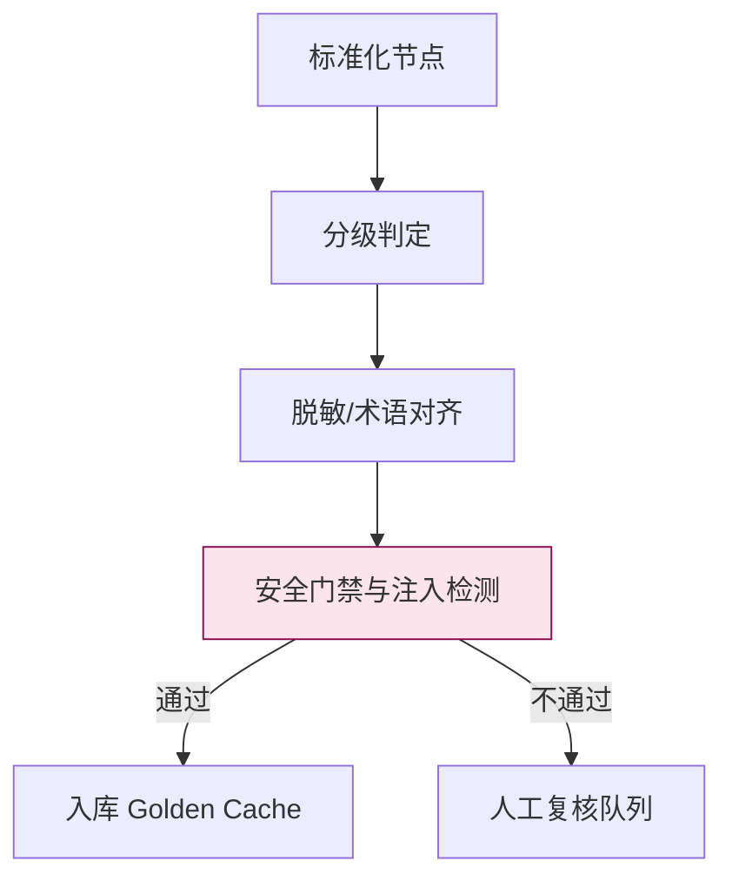

##### 4.3.10.14 指标与监控 (Metrics & Monitoring)

- 检索质量：Recall@K、MRR、Top-1 命中率、消歧触发率与成功率。
- 稳定性与新鲜度：条目审计覆盖率、版本漂移率、`STALE` 标记率、平均更新时延。
- 体验与成本：P50/P95 延迟、每次命中的推理/检索成本、缓存命中占比（Golden vs Passive）。
- 漂移与异常：语义变体偏移分布、异常高相似度碰撞告警、注入疑似率与拦截率。

##### 4.3.10.15 多语言适配 (Multilingual Support)

- 语言无关的路径：`breadcrumb` 永远使用业务主语言或代码化路径，避免翻译导致坐标漂移。
- 变体与答案分语种：`variations` 与 `answer` 支持 `lang` 字段，按会话语言优先返回对应语种。
- 跨语向量：使用跨语 Embedding 或分别维护多语索引并做路由；确保不同语种命中后统一回到同一 `canonical_question`。

##### 4.3.10.16 黄金缓存条目数据模型 (Schema)

```json
{
  "id": "gc_001",
  "document_id": "doc_001",
  "node_id": "node_12",
  "canonical_question": "在[IT服务门户][网络接入][VPN配置]中，如何重置 VPN 拨号器硬件？",
  "variations": [
    { "text": "VPN连不上了，硬件怎么重启？", "lang": "zh" },
    { "text": "How to reset the VPN dialer hardware?", "lang": "en" }
  ],
  "answer": {
    "text": "请找到 VPN 硬件拨号器，长按右侧的 'Reset' 开关 5 秒直到指示灯闪烁。",
    "lang": "zh",
    "sources": [ { "type": "doc", "ref": "sharepoint://it/vpn#reset" } ]
  },
  "metadata": {
    "breadcrumb": ["IT 服务门户", "网络接入", "VPN 配置"],
    "category": "Hardware",
    "tags": ["vpn", "reset"],
    "classification": "internal"
  },
  "rbac": {
    "visibility": "dept_it",
    "acl_fingerprint": "sha256:..."
  },
  "policy": {
    "policy_tags": ["PII_NONE"],
    "effective_from": "2025-12-01T00:00:00Z",
    "effective_to": null,
    "ttl_hours": 720
  },
  "embedding": {
    "model": "text-embedding-3-large",
    "model_version": "2025-11",
    "vector_id": "vec_abc",
    "created_at": "2025-12-01T12:00:00Z"
  },
  "audit": {
    "audited_by": "it_ops",
    "audit_timestamp": "2025-12-02T09:30:00Z",
    "review_status": "approved"
  },
  "quality": {
    "recall_at_1": 0.95,
    "disambiguation_rate": 0.12
  },
  "status": {
    "lifecycle": "active",
    "stale_reason": null
  }
}
```

##### 4.3.10.17 运行策略与成本优化 (Ops & Cost)

- 批处理优先：变体生成与批量 Embedding 采用离线批处理，结合队列与重试，降低峰值成本。
- 去重与指纹：对标准问与变体做规范化与去重，减少索引膨胀与相似向量冗余。
- 索引与召回：合理配置 ANN 参数（如 HNSW 的 M、ef）与多级索引（父/子），在成本与质量间权衡。
- 灰度与回滚：新版本条目先小流量灰度（Canary），异常率升高时自动回滚到上一版本。

##### 4.3.10.18 人机协同与反馈回路 (Human-in-the-loop)

- 低置信度上报：当消歧失败或相似度低于阈值，收集用户选择与失败样本，进入编辑队列。
- 运营面板：提供条目级别的修改建议、同义词维护与黑词维护，持续提升召回与精度。
- 反馈事件：记录 `feedback_event`（命中失败、答案不满意、路径纠正），驱动后续再训练或规则更新。

##### 4.3.10.19 与企业缓存分层的协同 (Integration with Caching Layers)

- 优先级策略：Golden Cache 命中优先于 Passive Cache；未命中时再走被动缓存与完整 RAG 流程。
- 分层协同：结合企业缓存分层（如 L1 域内公共区、L2 权限隔离区、L3 会话区），为 Golden Cache 条目设置合适的 TTL 与可见性边界。
- 冲突与失效：当上游政策变化或文档更新触发冲突，标记 `STALE_BY_CONFLICT` 并触发静默预热与原子更新（CDC）。

##### 4.3.10.20 向量库存储结构与查询 (Vector DB Storage & Query)

**存储布局：父-子索引**
- 子索引 `gc_variations`：存储所有语义变体向量，字段包含 `id, parent_id, text, embedding, lang, breadcrumb, category, tags, rbac_visibility, policy_tags, created_at`。
- 父索引 `gc_canonical`：存储标准问与标准答，字段包含 `id, canonical_question, answer_text, metadata, rbac_visibility, audit, version`。
- 查询命中子索引后，路由到父索引返回标准答案；支持基于 `breadcrumb/category/rbac_visibility` 的前置过滤与后置消歧。

**Postgres + pgvector 建模示例**

```sql
create extension if not exists vector;

create table if not exists gc_canonical (
  id text primary key,
  canonical_question text not null,
  answer_text text not null,
  metadata jsonb not null,
  rbac_visibility text not null,
  audit jsonb,
  version text,
  created_at timestamptz default now()
);

create table if not exists gc_variations (
  id text primary key,
  parent_id text not null references gc_canonical(id) on delete cascade,
  text text not null,
  embedding vector(3072) not null,
  lang text,
  breadcrumb text[],
  category text,
  tags text[],
  rbac_visibility text not null,
  policy_tags text[],
  created_at timestamptz default now()
);

create index if not exists idx_gc_variations_embedding on gc_variations using ivfflat (embedding) with (lists = 100);
create index if not exists idx_gc_variations_parent on gc_variations(parent_id);
create index if not exists idx_gc_canonical_visibility on gc_canonical(rbac_visibility);
```

**查询样例：带过滤的近邻检索**

```sql
with candidates as (
  select id, parent_id, text, rbac_visibility, category, breadcrumb,
         embedding <-> $1::vector as distance
  from gc_variations
  where rbac_visibility = $2
    and (category = $3 or $3 is null)
    and ($4::text[] is null or breadcrumb && $4::text[])
  order by embedding <-> $1::vector
  limit $5
)
select c.id as variation_id, c.parent_id, c.text, c.distance,
       p.canonical_question, p.answer_text, p.metadata
from candidates c
join gc_canonical p on p.id = c.parent_id
where p.rbac_visibility = $2
order by c.distance asc;
```

**查询管线伪代码（TS）**

```typescript
type QueryFilters = {
  visibility: string;
  category?: string | null;
  breadcrumb?: string[] | null;
  topK: number;
};

async function searchGoldenCache(q: number[], f: QueryFilters) {
  const rows = await db.query(sql`
    with candidates as (
      select id, parent_id, text, rbac_visibility, category, breadcrumb,
             embedding <-> ${q}::vector as distance
      from gc_variations
      where rbac_visibility = ${f.visibility}
        and (category = ${f.category} or ${f.category} is null)
        and (${f.breadcrumb}::text[] is null or breadcrumb && ${f.breadcrumb}::text[])
      order by embedding <-> ${q}::vector
      limit ${f.topK}
    )
    select c.id as variation_id, c.parent_id, c.text, c.distance,
           p.canonical_question, p.answer_text, p.metadata
    from candidates c
    join gc_canonical p on p.id = c.parent_id
    where p.rbac_visibility = ${f.visibility}
    order by c.distance asc;
  `);

  const top = rows[0];
  const closeSecond = rows[1];
  const needClarify = closeSecond && Math.abs(top.distance - closeSecond.distance) < 0.01;
  if (needClarify) return { clarify: true, options: [top, closeSecond] };
  return { clarify: false, answer: top };
}
```

**Milvus 建模与查询示例**

```python
from pymilvus import connections, FieldSchema, CollectionSchema, DataType, Collection

connections.connect(alias="default", host="localhost", port="19530")

fields = [
  FieldSchema(name="id", dtype=DataType.VARCHAR, max_length=64, is_primary=True),
  FieldSchema(name="parent_id", dtype=DataType.VARCHAR, max_length=64),
  FieldSchema(name="text", dtype=DataType.VARCHAR, max_length=1024),
  FieldSchema(name="embedding", dtype=DataType.FLOAT_VECTOR, dim=3072),
  FieldSchema(name="lang", dtype=DataType.VARCHAR, max_length=8),
]
schema = CollectionSchema(fields, description="gc_variations")
col = Collection(name="gc_variations", schema=schema)

index_params = {"metric_type": "IP", "index_type": "HNSW", "params": {"M": 16, "efConstruction": 200}}
col.create_index(field_name="embedding", index_params=index_params)

res = col.search(
  data=[query_vec],
  anns_field="embedding",
  param={"metric_type": "IP", "params": {"ef": 128}},
  limit=10,
  expr="lang == 'zh'"
)
```

**关键查询策略**
- 先过滤后相似：利用 `rbac_visibility/category/breadcrumb` 过滤减少误召回，再做近邻检索。
- 子命中父路由：命中变体后返回其父条目的标准问答，保证稳定与唯一。
- 碰撞消歧：Top-2 距离接近时触发澄清交互，利用元数据生成选项。

##### 4.3.10.21 字段释义与设计价值 (Field Semantics & Value)

**gc_canonical（标准问答父索引）**
- id：父条目唯一标识；用于路由与溯源，避免重复与覆盖。
- canonical_question：全局唯一的标准问题；消除同名冲突，作为知识锚点。
- answer_text：权威标准答案；确保一致性与可控的输出。
- metadata（jsonb）：承载业务上下文与溯源信息；常含 breadcrumb、category、tags、classification。
  - breadcrumb：层级路径坐标；用于消歧与过滤，避免语义堆叠。
  - category：业务分类；用于检索剪枝与运营统计。
  - tags：关键词标签；用于主题加权与查询提示。
  - classification：内容分级（internal/confidential）；配合 RBAC 控制可见性。
- rbac_visibility：可见性域（如部门或角色）；防止越权问答。
- audit（jsonb）：审计信息（audited_by、audit_timestamp、review_status）；支撑合规与质量门禁。
- version：内容版本号；支持回滚与灰度发布。
- created_at：创建时间；用于生命周期管理与新鲜度评估。

**gc_variations（语义变体子索引）**
- id：子条目唯一标识；用于诊断与治理（去重、黑词维护）。
- parent_id：父子关联键；命中后路由到标准问答，保证结果一致性。
- text：变体文本；覆盖口语/错别字/行业黑话等多样问法。
- embedding vector(dim)：向量表示；用于近邻检索，dim 与模型一致。
- lang：语种标注；支持多语言索引与结果优先级。
- breadcrumb text[]：层级路径快照；提升召回与消歧能力。
- category：变体分类；与父分类对齐或用于细粒度过滤。
- tags text[]：变体标签；用于召回增强与运营分析。
- rbac_visibility：变体可见性域；与父条目保持一致或更严格。
- policy_tags text[]：策略标签（如 PII_NONE）；用于入库门禁与返回提示。
- created_at：创建时间；用于变体新鲜度与清理策略。

**黄金缓存条目模型（治理视角）**
- embedding.model / model_version / vector_id / created_at：向量生成的可追溯性；便于批量重嵌与一致性检查。
- policy.effective_from / effective_to / ttl_hours：有效期与缓存策略；控制答案“新鲜度”与过期逻辑。
- quality.recall_at_1 / disambiguation_rate：质量指标；指导泛化策略与澄清触发阈值。
- status.lifecycle / stale_reason：生命周期状态与失效原因；驱动 CDC 与回滚。

###### 图示：存储架构总览

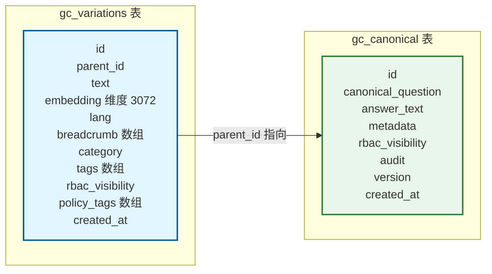

###### 图示：查询与路由时序

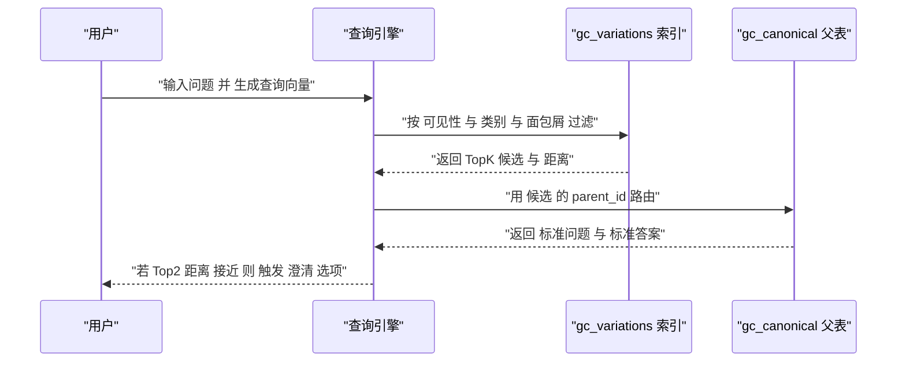

##### 4.3.10.22 变体向量生成伪代码 (Embedding Generation for Variations)

###### 设计原理与关键决策

**为什么需要路径注入？**
- **语义隔离**：防止不同业务域的相似问题产生冲突（如"重置密码"在用户管理和设备管理中的不同含义）
- **精准召回**：确保查询时能够准确匹配到正确的业务上下文
- **减少歧义**：避免LLM需要额外的上下文理解来消歧

**阈值选择依据 (0.75)**：
- 经验值：余弦相似度在0.7-0.8之间通常表示语义相关但不过度相似
- 平衡召回率与精确率：过低会引入噪声，过高会丢失合理的语义变体
- 可调参数：根据具体业务需求和数据分布进行调整

```typescript
/**
 * 变体输入数据结构 - 用于生成语义变体的嵌入向量
 * 每个变体都关联到一个标准问题(parentId)，确保答案一致性
 */
type VariationInput = {
  id: string;                    // 变体唯一标识
  parentId: string;              // 关联的标准问题ID
  text: string;                  // 变体文本内容
  breadcrumb?: string[];         // 可选的面包屑路径（继承自父级）
  category?: string | null;      // 业务分类标签
  tags?: string[];               // 关键词标签
  lang?: string | null;          // 语言标识
  rbacVisibility: string;         // RBAC可见性控制
  policyTags?: string[];         // 数据治理策略标签
};

/**
 * 预处理后的记录结构 - 准备插入向量数据库
 * 包含完整的元数据和生成的嵌入向量
 */
type PreparedRecord = {
  id: string;
  parent_id: string;
  text: string;                  // 注入路径后的完整文本
  embedding: number[];           // 3072维嵌入向量
  lang: string | null;
  breadcrumb: string[];          // 确定的面包屑路径
  category: string | null;
  tags: string[];
  rbac_visibility: string;       // 最终可见性控制
  policy_tags: string[];         // 最终策略标签
};

// 语义相似度阈值 - 过滤语义漂移的变体
const threshold = 0.75;

/**
 * 格式化面包屑路径为可读字符串
 * 示例：["网络", "VPN", "配置"] → "[网络][VPN][配置]"
 */
function formatPath(b: string[]): string {
  return b.map(x => `[${x}]`).join("");
}

/**
 * 构建注入路径的完整文本
 * 关键：将业务上下文直接编码到文本中，避免依赖外部元数据
 */
function buildText(b: string[], t: string): string {
  const p = formatPath(b);
  return `在${p}中，${t}`;
}

/**
 * 文本嵌入生成函数 - 实际项目中替换为具体的嵌入模型
 */
async function embedText(model: any, text: string): Promise<number[]> {
  return await model.embed(text);
}

/**
 * 余弦相似度计算 - 衡量两个向量的语义相似度
 * 范围：[-1, 1]，值越大表示越相似
 */
function cosine(u: number[], v: number[]): number {
  let s = 0;
  let nu = 0;
  let nv = 0;
  for (let i = 0; i < u.length; i++) {
    s += u[i] * v[i];
    nu += u[i] * u[i];
    nv += v[i] * v[i];
  }
  return s / (Math.sqrt(nu) * Math.sqrt(nv));
}

/**
 * 核心函数：生成变体嵌入向量并进行语义漂移检测
 * 
 * 工作流程：
 * 1. 为标准问题生成基准嵌入
 * 2. 为每个变体生成嵌入并计算与基准的相似度
 * 3. 过滤掉语义漂移过大的变体（相似度 < threshold）
 * 4. 返回合格的预处理记录
 * 
 * @param canonicalQuestion 标准问题文本
 * @param breadcrumb 标准问题的面包屑路径
 * @param variations 变体输入列表
 * @param model 嵌入模型实例
 */
async function generateVariationEmbeddings(
  canonicalQuestion: string,
  breadcrumb: string[],
  variations: VariationInput[],
  model: any
): Promise<PreparedRecord[]> {
  // 为标准问题生成基准嵌入（包含完整路径上下文）
  const cText = buildText(breadcrumb, canonicalQuestion);
  const cVec = await embedText(model, cText);
  
  const prepared: PreparedRecord[] = [];
  
  for (const v of variations) {
    // 使用变体自定义路径或继承标准问题路径
    const vb = v.breadcrumb ?? breadcrumb;
    const vText = buildText(vb, v.text);
    const vVec = await embedText(model, vText);
    
    // 计算与标准问题的语义相似度
    const sim = cosine(vVec, cVec);
    
    // 过滤语义漂移：只保留相关性足够的变体
    if (sim >= threshold) {
      prepared.push({
        id: v.id,
        parent_id: v.parentId,
        text: vText,              // 存储注入路径后的完整文本
        embedding: vVec,
        lang: v.lang ?? null,
        breadcrumb: vb,
        category: v.category ?? null,
        tags: v.tags ?? [],
        rbac_visibility: v.rbacVisibility,
        policy_tags: v.policyTags ?? []
      });
    } else {
      // 记录被过滤的变体（实际项目中应该记录日志）
      console.warn(`变体 ${v.id} 语义漂移过大，相似度: ${sim.toFixed(3)}`);
    }
  }
  
  return prepared;
}

/**
 * 批量插入预处理记录到向量数据库
 * 实际项目中应该使用批量插入优化和连接池
 */
async function insertBatch(db: any, rows: PreparedRecord[]): Promise<void> {
  for (const r of rows) {
    await db.query(
      `insert into gc_variations (
        id, parent_id, text, embedding, lang, 
        breadcrumb, category, tags, rbac_visibility, policy_tags
      ) values ($1,$2,$3,$4,$5,$6,$7,$8,$9,$10)`,
      [
        r.id,
        r.parent_id,
        r.text,
        r.embedding,
        r.lang,
        r.breadcrumb,
        r.category,
        r.tags,
        r.rbac_visibility,
        r.policy_tags
      ]
    );
  }
}
```

```python
import numpy as np
from typing import List, Dict, Any, Optional

# 语义相似度阈值 - 用于过滤语义漂移
threshold = 0.75

def format_path(breadcrumb: List[str]) -> str:
    """格式化面包屑路径"""
    return "".join([f"[{x}]" for x in breadcrumb])

def build_text(breadcrumb: List[str], text: str) -> str:
    """构建包含路径上下文的完整文本"""
    return f"在{format_path(breadcrumb)}中，{text}"

def embed_text(model: Any, text: str) -> List[float]:
    """文本嵌入生成"""
    return model.embed(text)

def cosine(u: List[float], v: List[float]) -> float:
    """计算余弦相似度"""
    u_arr = np.array(u)
    v_arr = np.array(v)
    return float(np.dot(u_arr, v_arr) / (np.linalg.norm(u_arr) * np.linalg.norm(v_arr)))

def generate_variation_embeddings(
    canonical_question: str,
    breadcrumb: List[str], 
    variations: List[Dict[str, Any]],
    model: Any
) -> List[Dict[str, Any]]:
    """
    生成变体嵌入向量（Python版本）
    
    Args:
        canonical_question: 标准问题文本
        breadcrumb: 标准问题的面包屑路径
        variations: 变体字典列表
        model: 嵌入模型实例
    
    Returns:
        预处理后的记录列表，准备插入数据库
    """
    c_text = build_text(breadcrumb, canonical_question)
    c_vec = embed_text(model, c_text)
    prepared = []
    
    for v in variations:
        vb = v.get("breadcrumb") or breadcrumb
        v_text = build_text(vb, v["text"])
        v_vec = embed_text(model, v_text)
        
        # 计算与标准问题的语义相似度
        sim = cosine(v_vec, c_vec)
        
        if sim >= threshold:
            # 语义相关性足够，保留该变体
            prepared.append({
                "id": v["id"],
                "parent_id": v["parent_id"],
                "text": v_text,              # 存储注入路径后的完整文本
                "embedding": v_vec,
                "lang": v.get("lang"),
                "breadcrumb": vb,
                "category": v.get("category"),
                "tags": v.get("tags", []),
                "rbac_visibility": v["rbac_visibility"],
                "policy_tags": v.get("policy_tags", [])
            })
        else:
            # 语义漂移过大，记录警告（生产环境应使用日志）
            print(f"警告: 变体 {v['id']} 语义漂移过大，相似度: {sim:.3f}")
    
    return prepared

def insert_batch(conn, rows: List[Dict[str, Any]]) -> None:
    """
    批量插入预处理记录到PostgreSQL数据库
    
    注意：实际生产环境应该：
    1. 使用批量插入语句（INSERT ... VALUES (), (), ...）
    2. 使用连接池管理数据库连接
    3. 添加错误处理和重试机制
    4. 考虑使用异步IO提高性能
    """
    cur = conn.cursor()
    try:
        for r in rows:
            cur.execute(
                """insert into gc_variations (
                    id, parent_id, text, embedding, lang, 
                    breadcrumb, category, tags, rbac_visibility, policy_tags
                ) values (%s, %s, %s, %s, %s, %s, %s, %s, %s, %s)""",
                (
                    r["id"],
                    r["parent_id"],
                    r["text"],
                    r["embedding"],
                    r["lang"],
                    r["breadcrumb"],
                    r["category"],
                    r["tags"],
                    r["rbac_visibility"],
                    r["policy_tags"]
                )
            )
        conn.commit()
    except Exception as e:
        conn.rollback()
        raise e
    finally:
        cur.close()
```

###### 实际应用示例

**场景：企业IT支持FAQ**

假设我们有标准问题："如何重置VPN密码？"，位于路径 ["IT支持", "网络", "VPN"]

```typescript
// 标准问题和路径
const canonical = "如何重置VPN密码？";
const breadcrumb = ["IT支持", "网络", "VPN"];

// 生成的语义变体
const variations = [
  {
    id: "var1",
    parentId: "canonical_123",
    text: "VPN密码忘了怎么办",
    rbacVisibility: "all"
  },
  {
    id: "var2", 
    parentId: "canonical_123",
    text: "重置VPN登录密码",
    rbacVisibility: "all"
  },
  {
    id: "var3",
    parentId: "canonical_123", 
    text: "修改VPN认证信息",
    rbacVisibility: "all"
  }
];

// 生成的嵌入文本示例：
// 标准问题："在[IT支持][网络][VPN]中，如何重置VPN密码？"
// 变体1："在[IT支持][网络][VPN]中，VPN密码忘了怎么办"
// 变体2："在[IT支持][网络][VPN]中，重置VPN登录密码"
```

###### 性能优化建议

1. **批量处理**：使用批量嵌入生成（如OpenAI的batch API）
2. **异步处理**：对于大规模数据，使用异步任务队列
3. **缓存机制**：缓存已生成的嵌入向量，避免重复计算
4. **增量更新**：只处理新增或修改的FAQ内容
5. **监控告警**：监控语义漂移率，及时发现数据质量问题

##### 4.3.10.23 部署与运维指南 (Deployment & Operations)

###### 环境要求

- **数据库**：PostgreSQL 12+ with pgvector 扩展
- **向量维度**：3072（适配OpenAI text-embedding-3-large）
- **硬件建议**：
  - CPU: 8+ cores
  - RAM: 16GB+ （取决于数据量）
  - Storage: SSD 存储，确保索引性能

###### 部署步骤

1. **数据库初始化**
```bash
# 安装pgvector扩展
CREATE EXTENSION IF NOT EXISTS vector;

# 创建表结构（见前文4.3.10.19节）
```

2. **嵌入服务配置**
```yaml
# config/embedding.yaml
openai:
  api_key: ${OPENAI_API_KEY}
  model: text-embedding-3-large
  dimensions: 3072
  batch_size: 100
  timeout: 30s

# 本地模型备选（如需要）
huggingface:
  model: BAAI/bge-large-zh
  dimensions: 1024
```

3. **服务部署**
```dockerfile
# Dockerfile示例
FROM node:18-alpine
WORKDIR /app
COPY package*.json ./
RUN npm ci --only=production
COPY . .
EXPOSE 3000
CMD ["npm", "start"]
```

###### 监控与告警

**关键指标**：
- `faq_embedding_generation_duration`：嵌入生成耗时
- `faq_semantic_drift_rate`：语义漂移率（被过滤的变体比例）
- `faq_vector_db_insert_latency`：向量数据库插入延迟
- `faq_cache_hit_rate`：缓存命中率

**告警规则**：
- 语义漂移率 > 20%：警告，可能数据质量有问题
- 嵌入生成耗时 > 5s/100条：性能警告
- 缓存命中率 < 60%：可能需要优化变体覆盖

##### 4.3.10.24 核心术语表 (Glossary)

| 术语 | 英文 | 定义 | 示例/说明 |
|------|------|------|-----------|
| **黄金缓存** | Golden Cache | 经过人工审计的FAQ预构建语义缓存 | 企业核心知识库，确保回答准确性 |
| **语义坐标** | Semantic Coordinate | 问题的业务上下文路径 | ["IT支持", "网络", "VPN"] |
| **路径注入** | Path Injection | 将层级信息编码到问题文本中 | "在[IT支持][网络][VPN]中，如何重置密码？" |
| **语义变体** | Semantic Variation | 同一问题的不同表达方式 | "VPN密码重置" vs "忘记VPN密码怎么办" |
| **语义漂移** | Semantic Drift | 变体与标准问题的语义偏离程度 | 余弦相似度 < 0.75 |
| **父-子索引** | Parent-Child Index | 标准问题与变体的关联结构 | gc_canonical ← gc_variations |
| **过滤优先** | Filter-First Strategy | 先基于元数据过滤，再相似度搜索 | 减少计算量和误召回 |
| **消歧服务** | Disambiguation Service | 处理模糊查询的交互式澄清 | "您是指用户密码还是设备密码？" |

##### 4.3.10.25 设计原则总结 (Design Principles)

###### 核心设计理念

1. **确定性优先**：黄金缓存的核心价值在于提供确定性的准确回答，牺牲一定的覆盖率来保证质量
2. **上下文编码**：将业务上下文直接注入文本，避免依赖外部元数据查询，提高召回精度
3. **质量闭环**：内置语义漂移检测和监控，形成自我优化的质量控制系统
4. **企业治理**：从设计之初就考虑RBAC、审计、合规等企业级需求

###### 技术选型考量

**为什么选择 pgvector？**
- **事务一致性**：向量操作与业务数据在同一个事务中
- **生态成熟**：PostgreSQL 生态完善，工具链丰富
- **混合查询**：支持向量相似度 + 元数据过滤的混合查询
- **运维简单**：无需维护单独的向量数据库服务

**为什么维度选择3072？**
- **模型适配**：匹配 OpenAI text-embedding-3-large 的输出维度
- **性能平衡**：在召回精度和计算成本之间取得平衡
- **未来兼容**：预留足够的维度空间应对模型升级

###### 成功指标 (Success Metrics)

**核心业务指标**：
- ⬆️ **缓存命中率**：目标 > 80%
- ⬇️ **人工干预率**：目标 < 5%
- ⬆️ **用户满意度**：目标 > 90%
- ⬇️ **平均响应时间**：目标 < 500ms

**技术质量指标**：
- ⬇️ **语义漂移率**：维持在 10-20% 的健康范围
- ⬆️ **向量索引命中率**：目标 > 95%
- ⬇️ **错误回答率**：目标 < 1%

###### 演进路线 (Evolution Roadmap)

**短期优化 (1-3个月)**：
- 实现增量更新机制
- 优化批量处理性能
- 完善监控告警体系

**中期规划 (3-6个月)**：
- 支持多模态FAQ（图文混合）
- 实现自适应阈值调整
- 构建A/B测试框架

**长期愿景 (6-12个月)**：
- 联邦学习部署模式
- 自动化质量评估
- 智能变体生成优化

##### 4.3.10.26 教育价值总结 (Educational Value)

本方案为学习者展示了：

1. **企业级思维**：如何将学术概念转化为生产可用的系统
2. **工程化实践**：从算法原型到可运维系统的完整路径
3. **质量保障**：在AI系统中构建确定性保证的 methodologies
4. **权衡艺术**：在召回率、精确率、性能、成本之间的平衡决策
5. **可观测性**：如何为AI系统建立有效的监控和调试能力

这个黄金缓存架构不仅是一个技术解决方案，更是一个完整的知识工程方法论，适用于各种需要确定性知识交付的场景。

---

**🤖 协作说明**
> *本可视化文档基于架构师教授 `/prof` 的深度分析生成，并由 `vizdoc` 进行结构化与图表实现。*
