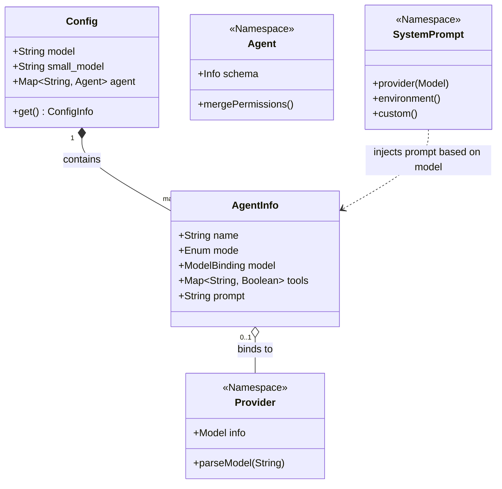
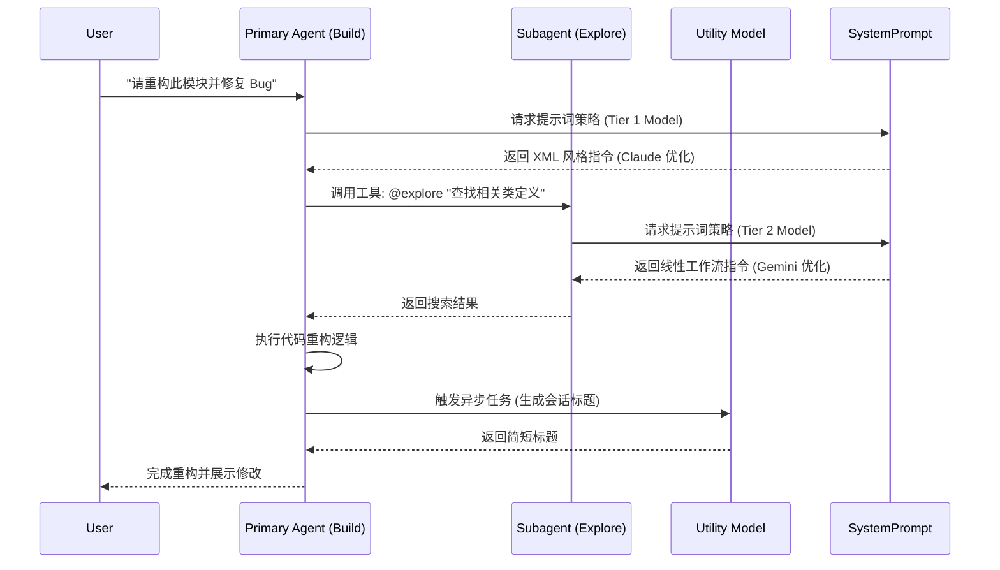

# 多模型协同架构 (Multi-Model Orchestration)

本专题深入探讨 OpenCode 的多模型协同设计。在复杂的 AI Agent 系统中，单一模型往往难以平衡“强逻辑”、“低延迟”与“高经济性”。OpenCode 通过一套精密的**策略分发与模型路由机制**，实现了不同任务与最适算力的动态匹配。

---

## 0. 元信息 (Metadata)

*   **摘要**：解构 OpenCode 如何通过三层算力模型（Tiered Compute）实现任务逻辑与计算资源的解耦。
*   **目标读者**：AI 架构师、后端工程师、系统设计爱好者。
*   **阅读建议**：建议先阅读 [Agent 设计与实现](./agents.md) 以理解代理基础，再深入本专题。

---

## 1. 核心架构范式：职责分离与算力分层

OpenCode 并不是所有任务都由同一个“全能”模型处理，而是采用了**多层级代理路由（Multi-Tier Agent Routing）**架构。

### 1.1 三层算力模型定义 (Tiered Compute Model)

系统按任务的本质特征将其划分为三个能级，并为其配置差异化的模型策略（已更新至 2025 年 Q4 尖端模型）：

| 层次 | 核心角色 | 典型任务 | 推荐模型特征 (2025 最新) |
| :--- | :--- | :--- | :--- |
| **Tier 1: 决策层** | **主代理 (Primary)** | 全局规划、代码重构、复杂逻辑推理 | **顶级推理模型**：GPT-5.2 Pro, Claude 4.1 Opus, Gemini 3.0 Pro (Ultra Think), OpenAI o3 |
| **Tier 2: 执行层** | **子代理 (Subagent)** | 代码库检索、多步工具调用、长文本研究 | **高性能中型模型**：Claude 4.1 Sonnet, Gemini 3.0 Flash, GPT-5.2 mini, Mistral Large 3 |
| **Tier 3: 辅助层** | **实用型 (Utility)** | 标题生成、对话总结、数据格式化 | **极速小型模型**：Gemini 3.0 Flash Lite, GPT-4.1 mini, Llama 4 Scout, Qwen-3-7B |

### 1.2 核心角色职责映射

- **主代理 (Total Contractor)**：
    - **代表**：`Build`, `Plan`
    - **职责**：处理高层意图理解、全局规划。
    - **核心价值**：利用 **GPT-5.2 / Gemini 3.0 Pro** 等具备极致逻辑深度与“系统 2 思维”的模型，确保架构设计的严密性。
- **子代理 (Specialized Worker)**：
    - **代表**：`General`, `Explore`
    - **职责**：执行特定领域的繁重任务（如全文扫描、文档研究）。
    - **核心价值**：通过 **Gemini 3.0 Flash** 的超大规模上下文（原生支持 10M+ tokens）或 **GPT-5.2 mini** 的极高性价比执行多步检索。
- **实用型小模型 (Utility Cavalry)**：
    - **配置项**：`small_model`
    - **职责**：处理低逻辑要求的文本转换。
    - **核心价值**：利用 **Gemini 3.0 Flash Lite** 或 **GPT-4.1 mini** 实现近乎零延迟的 UI 交互反馈。

---

## 2. 系统建模：结构与行为分析

### 2.1 核心类图 (Structural View)

展示配置系统、代理抽象与模型提供者之间的静态依赖关系：



### 2.2 任务流转时序图 (Behavioral View)

以“重构模块”这一典型任务为例，展示内部算力协同的时序逻辑：



---

## 3. 关键实现细节：动态分发机制

### 3.1 声明式绑定与逐级回退机制

在 `packages/opencode/src/config/config.ts` 中，模型配置遵循**能力与执行器解耦**的逐级覆盖原则：

1.  **Agent 级绑定**：如果 `agent.model` 已定义，则使用该模型。
2.  **全局默认**：若无 Agent 绑定，回退至全局 `model` 配置。
3.  **能力专用回退**：对于 `title` 或 `summary` 任务，若未指定 Agent 模型，则强制回退至 `small_model`。

```json
{
  "model": "anthropic/claude-3-5-sonnet", // 全局默认
  "small_model": "anthropic/claude-3-haiku", // 轻量任务专用
  "agent": {
    "explore": {
      "model": "google/gemini-1.5-flash", // 针对大规模上下文优化
      "mode": "subagent"
    }
  }
}
```

### 3.2 策略驱动的提示词路由 (Strategy Pattern)

在 `packages/opencode/src/session/system.ts` 中，`SystemPrompt.provider()` 将模型视为指令集“方言”的接收者，动态映射最适配的提示词模板：

```typescript
export function provider(model: Provider.Model) {
  // 根据模型特征码，动态选择预置提示词模板 (如 anthropic.txt, gemini.txt, beast.txt)
  if (model.api.id.includes("gpt-5")) return [PROMPT_CODEX]
  if (model.api.id.includes("claude")) return [PROMPT_ANTHROPIC]
  if (model.api.id.includes("gemini-")) return [PROMPT_GEMINI]
  // 确保每种模型都能在其擅长的格式偏好（XML vs Markdown）下运行
  return [PROMPT_DEFAULT]
}
```

---

## 4. 动态决策机制：模型如何被选中？

在多模型架构中，最核心的问题是：**在当前这一秒，系统是如何决定调用哪个 LLM 的？** OpenCode 采用了一套基于“上下文上下文”（Context of Context）的动态分发逻辑。

### 4.1 任务类型判定 (Task Type Detection)

系统在处理任何请求前，首先会识别任务的“能级”。这决定了后续是进入高性能通道还是高逻辑通道。

#### **判定维度与机制**

| 任务类型 | 触发源 (Trigger) | 识别逻辑 (Detection Logic) |
| :--- | :--- | :--- |
| **辅助任务 (Auxiliary)** | 系统生命周期钩子 | 检查 `assistantMessage.finish` 状态。若需生成 `title` 或 `summary`，自动标记为 `small=true`。 |
| **显式业务 (Explicit)** | 用户输入 / 插件调用 | 扫描用户输入中的 `@agent` 指令。例如输入 `@explore` 会被解析为 `agent: "explore"`。 |
| **隐式业务 (Implicit)** | Session 状态机 | 若无显式指令，系统根据 `Session.Info` 中的 `mode` 或 `agent` 字段回退至默认业务 Agent（如 `build`）。 |
| **维护任务 (Maintenance)** | Token 计数器 | `SessionCompaction.isOverflow()` 实时监控。若 Token 超过模型阈值的 80%，触发压缩任务。 |

#### **UML 任务类型判定流程 (Task Type Detection Flow)**

```mermaid
flowchart TD
    Start([收到请求/触发器]) --> Source{来源?}
    
    Source -- 用户输入 --> ParseAgent[解析 @Agent 指令]
    ParseAgent --> HasAgent{包含 @?}
    HasAgent -- 是 --> TypeBusiness[类型: 业务任务 (显式)]
    HasAgent -- 否 --> TypeBusinessDefault[类型: 业务任务 (隐式)]
    
    Source -- 生命周期钩子 --> CheckState{检查消息状态}
    CheckState -- 消息刚结束 --> NeedsTitle{需要标题/摘要?}
    NeedsTitle -- 是 --> TypeAux[类型: 辅助任务]
    
    Source -- Token 监控 --> CheckLimit{是否接近阈值?}
    CheckLimit -- 是 --> TypeMaint[类型: 维护任务 (Compaction)]
    
    TypeAux --> RouteSmall[路由至 small_model]
    TypeBusiness --> RouteAgent[路由至 Agent 指定模型]
    TypeBusinessDefault --> RouteGlobal[路由至全局默认模型]
    TypeMaint --> RouteMaint[路由至策略压缩模型]
```

### 4.2 决策路径：从任务到模型 (Decision Funnel)

一旦任务类型确定，系统进入决策漏斗：

1.  **辅助任务特殊通道**：
    *   **实现逻辑**：在 `SessionSummary` 中，系统会通过 `Provider.getSmallModel()` 获取配置中的 `small_model`。
    *   **兜底**：若未配置 `small_model`，则降级使用全局 `model`。

2.  **业务任务路由**：
    *   **Agent 优先**：检查 `packages/opencode/src/agent/agent.ts` 中定义的 Agent 配置。如果 Agent 绑定了特定模型（如 `explore` 绑定 `gemini-1.5-flash`），则优先使用。
    *   **Session 粘性**：如果用户通过 `/models` 命令手动指定了模型，该设定会存储在 Session 上下文中，覆盖 Agent 默认值。
    *   **全局默认**：最后的兜底。

### 4.3 核心实现代码解析

#### **判定与路由的核心逻辑 (`packages/opencode/src/session/summary.ts`)**

```typescript
// 辅助任务判定与模型选择
async function summarizeMessage(input: { messageID: string; messages: MessageV2.WithParts[] }) {
  // ... 逻辑处理 ...
  const assistantMsg = messages.find(m => m.info.role === 'assistant')!.info as MessageV2.Assistant;
  
  // 1. 获取小模型配置 (small_model)
  const small = await Provider.getSmallModel(assistantMsg.providerID) 
               ?? await Provider.getModel(assistantMsg.providerID, assistantMsg.modelID);

  // 2. 如果 Agent 有私有模型配置，则使用；否则使用 small 模型
  const agent = await Agent.get("title");
  const stream = await LLM.stream({
    agent,
    model: agent.model ? await Provider.getModel(agent.model.providerID, agent.model.modelID) : small,
    small: true, // 关键：标记为辅助任务
    // ...
  });
}
```

#### **业务循环中的路由逻辑 (`packages/opencode/src/session/prompt.ts`)**

```typescript
export const loop = fn(Identifier.schema("session"), async (sessionID) => {
  // ...
  while (true) {
    const lastUser = msgs.findLast(m => m.info.role === "user")!.info as MessageV2.User;
    
    // 1. 业务 Agent 判定
    const agent = await Agent.get(lastUser.agent); 
    
    // 2. 模型解析逻辑：遵循 Agent -> Global 的覆盖顺序
    const model = await Provider.getModel(lastUser.model.providerID, lastUser.model.modelID);
    
    // 3. 启动处理器
    const processor = SessionProcessor.create({
      assistantMessage: { /* ... */ },
      model, // 传入选定的模型
      // ...
    });
  }
});
```

---

## 5. 生产级深度考量：效能、鲁棒性与组织映射

### 5.1 性能与经济性评估 (Efficiency & Economics)

- **响应延迟 (Latency)**：将 UI 交互轻量任务分配给小模型，可将延迟从 5-8 秒降低至 1 秒以内。
- **运营成本 (Economics)**：在典型的开发 Session 中，子代理和总结任务占据了大量的 Token 消耗。协同架构使整体成本可降低 40% - 60%。

### 5.2 关注点分离与故障隔离 (SoC & Isolation)

- **关注点分离 (SoC)**：主代理关注“做什么（Intent）”，子代理关注“怎么找（Execution）”。子代理的思考过程被隔离在独立的子 Session 中，避免了主窗口冗余和 Token 窗口爆炸。
- **鲁棒性与隔离**：如果子代理崩溃（如长文本溢出），不会影响主代理状态。主代理可捕获错误并决定重试或采用替代路径。

### 5.3 行业横向对比 (Industry Comparison)

在 2025 年底的 AI IDE 领域，模型分层已成为事实上的行业标准。以下是 OpenCode 的分层策略与行业主流工具的横向对比：

| 工具 | Tier 1 (Decision/Logic) | Tier 2 (Execution/Agent) | Tier 3 (Utility/Latency) |
| :--- | :--- | :--- | :--- |
| **OpenCode** | **GPT-5.2 / Claude 4.5 Opus** | **Gemini 3.0 Flash / Sonnet 4.5** | **Gemini 3.0 Flash Lite** |
| **Claude Code** | Claude 5.0 Opus (Plan Mode) | Claude 4.5 Sonnet | Claude 4.5 Haiku |
| **Cursor** | o3 / Claude 3.7 (Think Mode) | Claude 4.0 Sonnet | GPT-5 mini / Cursor-small |
| **Windsurf** | SWE-1.5 / GPT-5.2 | SWE-1 / Claude 4.5 | SWE-1 Lite |
| **GitHub Copilot**| GPT-5 / Opus 4.1 | GPT-4o / Sonnet 3.7 | o4-mini / Gemini 2.0 Flash |

#### **核心设计共识 (Industry Consensus)**

1.  **“思考”与“执行”的分离**：行业领头羊（如 Cursor, Windsurf）均采用了将“逻辑规划模型”（Tier 1）与“代码操作模型”（Tier 2）解耦的策略。Tier 1 负责生成高层思路，Tier 2 负责具体搬砖。
2.  **上下文的极端化趋势**：Tier 2 正在追求超大规模原生上下文（如 Gemini 的 10M+ tokens），而 Tier 1 正在追求极长的推理链（CoT），即便上下文受限，只要逻辑足够深即可。
3.  **自研小模型的崛起**：Cursor (cursor-small) 和 Windsurf (SWE-1 Lite) 均开始使用基于开源模型（如 Llama/Qwen）微调的专用小模型来承载 Tier 3 任务，以追求极致的延迟和成本控制。

---

> **教授箴言**
>
> “一个优秀的架构师不应该追求‘最强的工具’，而应该追求‘最合适的组合’。多模型协同不是简单的堆砌，而是对‘分治法’（Divide and Conquer）的深度演进。它通过将**任务逻辑**与**计算算力**解耦，实现了系统柔性与效能的统一。”
>
> “在分布式智能系统中，**‘模型协同’本质上是‘认知成本’的精细化管理**。它模拟了人类专家团队的工作模式：主架构师定调，资深工程师执行，初级助理整理。这种对人类组织行为学的架构映射，是其能够在复杂工程场景中保持稳定的核心秘诀。”
