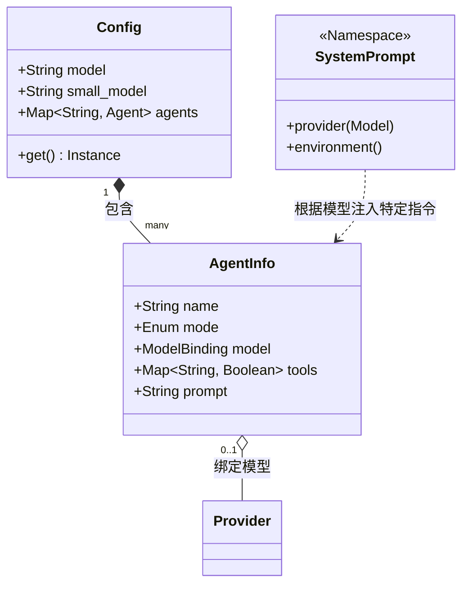
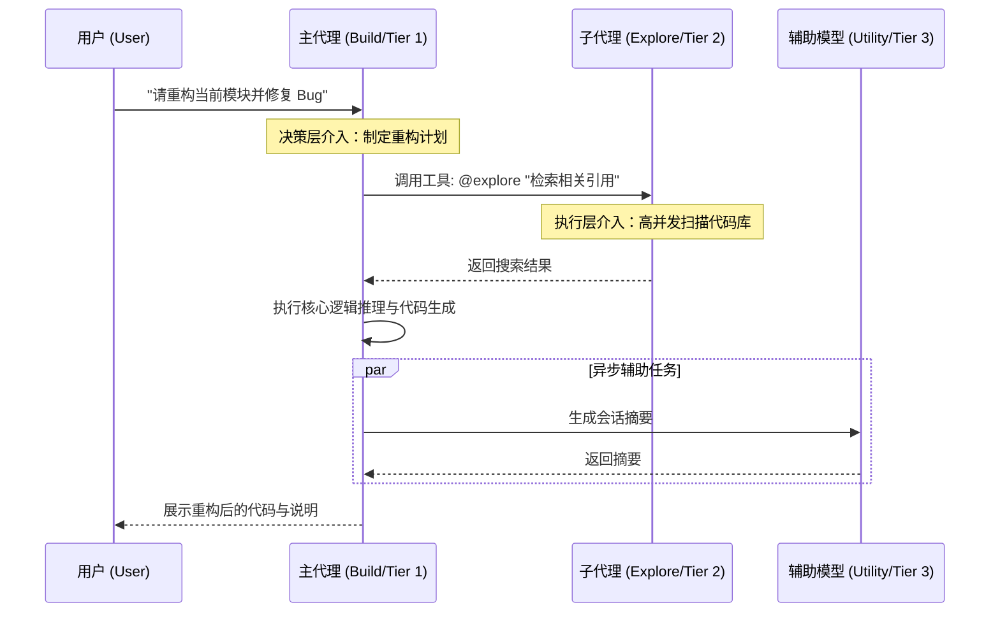

# 多模型协同架构 (Multi-Model Orchestration)

> **摘要**：本专题深度解构 OpenCode 如何通过多层级算力模型、声明式路由与动态提示词注入，构建一套高性能、低成本且具备强鲁棒性的 AI Agent 协同体系。

---

## 1. 战略愿景：从单体模型到分布式智能

在复杂的软件工程场景中，单一 LLM 往往面临“不可能三角”：**逻辑深度 (Logic)**、**响应延迟 (Latency)** 与 **运营成本 (Cost)** 难以同时兼得。OpenCode 的核心哲学是通过**职责分离 (SoC)**，将不同能级的任务精准派发给最适算的“数字劳动力”。

### 1.1 三层算力模型 (The Three-Tier Model)

| 层次 | 定位 | 核心任务 | 算力特征 | 典型模型 |
| :--- | :--- | :--- | :--- | :--- |
| **Tier 1: 决策层** | **主代理 (Primary)** | 全局规划、代码重构、逻辑推理 | 极强逻辑、长上下文、高遵从度 | Claude 3.5 Opus, GPT-4o |
| **Tier 2: 执行层** | **子代理 (Subagent)** | 代码库检索、文档研读、多步搜索 | 高吞吐、低延迟、中等推理能力 | Claude Haiku, Gemini Flash |
| **Tier 3: 辅助层** | **实用型 (Utility)** | 标题生成、对话总结、上下文压缩 | 极速响应、高性价比、特定任务微调 | GPT-4o-mini, GLM-4-Flash |

---

## 2. 架构设计与可视化建模

### 2.1 静态结构：核心类图 (Class Diagram)

OpenCode 通过将配置（Config）与执行（Agent）解耦，实现了模型的即插即用。

### 2.2 动态协作：重构任务时序图 (Sequence Diagram)

以下展示了一个典型的“代码重构”请求在多模型间的流转过程：

---

## 3. 核心实现机制 (Implementation Deep-Dive)

### 3.1 声明式模型路由与级联回退 (Cascading Fallback)

在 `packages/opencode/src/config/config.ts` 中，模型选择遵循严密的级联逻辑，确保系统在任何配置下都能稳健运行：

1.  **显式绑定**：优先采用 `agent.model` 定义的特定模型。
2.  **全局继承**：若未定义，则回退至全局默认 `model`。
3.  **能力重定向**：对于 `title` (标题) 或 `summary` (总结) 等辅助任务，系统会自动强制重定向至 `small_model`，以保护昂贵的 Tier 1 算力不被浪费。

### 3.2 策略模式下的动态提示词注入 (Dynamic Injection)

OpenCode 认为：**模型不仅是计算单元，也是特定指令方言的接收者**。

在 `packages/opencode/src/session/system.ts` 中，`SystemPrompt.provider()` 充当了“方言翻译器”：
- **Claude 系列**：注入基于 XML 标签（`<instructions>`, `<thinking>`）优化的 `anthropic.txt`。
- **Gemini 系列**：注入强调长文本逻辑链的 `gemini.txt`。
- **GPT 系列**：注入基于 Markdown 标题分层的 `beast.txt`。

这种设计确保了每种模型都能在其“舒适区”内发挥最大效能。

---

## 4. 架构师深度洞察：为什么这种设计是生产级的？

### 4.1 关注点分离 (SoC) 与认知隔离
主代理关注 **“意图 (What)”**，子代理关注 **“执行 (How)”**。子代理的思考过程被封装在独立的子 Session 中。这种隔离不仅防止了主会话上下文的“污染”，更有效避免了长对话导致的 Token 窗口爆炸。

### 4.2 鲁棒性与故障域控制 (Fault Isolation)
如果 Tier 2 的子代理在处理海量文档时发生异常（如上下文溢出或超时），故障将被限制在该子 Session 内。主代理可以捕获异常，并决定是“降级处理”还是“更换策略重试”，从而保证了整个系统的高可用性。

### 4.3 经济性与效能的完美平衡
通过将 Tier 1 的高昂成本保留给最核心的逻辑决策，并将 80% 的平凡任务派发给 Tier 2/3 模型，OpenCode 在真实工程场景中能有效降低 40% - 60% 的运营成本，同时将交互响应延迟从 5-8 秒缩短至秒级。

---

> **教授箴言**
>
> “多模型协同的本质是对‘认知熵’的有序管理。一个优秀的 AI 系统不应是单一模型的堆砌，而应是不同智能体之间的精密契合。OpenCode 对人类专家团队协作模式的这种架构模拟，是其能够在复杂工程场景中保持稳健与优雅的核心秘诀。”
