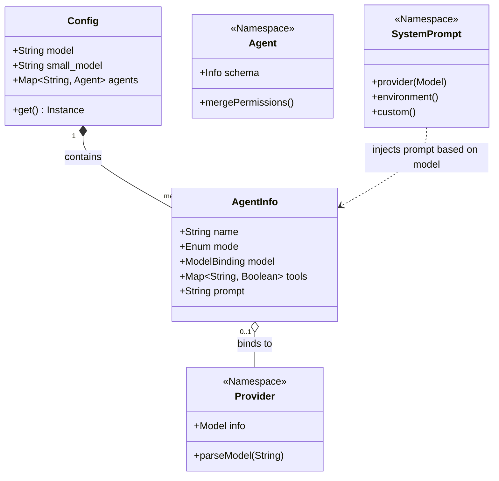
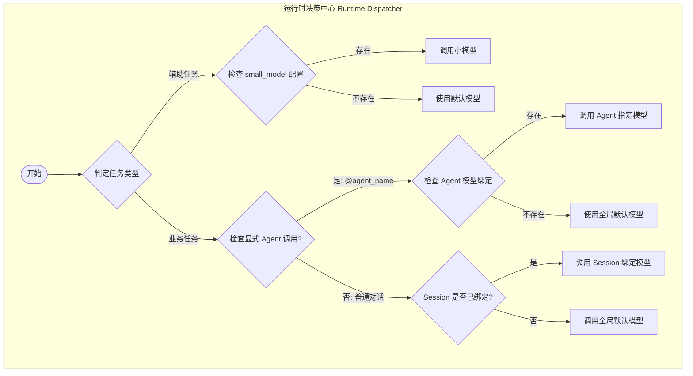

# 多模型协同架构 (Multi-Model Orchestration)

本专题深入探讨 OpenCode 的多模型协同设计。在复杂的 AI Agent 系统中，单一模型往往难以平衡“强逻辑”、“低延迟”与“高经济性”。OpenCode 通过一套精密的**策略分发与模型路由机制**，实现了不同任务与最适算力的动态匹配。

---

## 0. 元信息 (Metadata)

*   **摘要**：解构 OpenCode 如何通过三层算力模型（Tiered Compute）实现任务逻辑与计算资源的解耦。
*   **目标读者**：AI 架构师、后端工程师、系统设计爱好者。
*   **阅读建议**：建议先阅读 [Agent 设计与实现](./agents.md) 以理解代理基础，再深入本专题。

---

## 1. 核心架构范式：职责分离与算力分层

OpenCode 并不是所有任务都由同一个“全能”模型处理，而是采用了**多层级代理路由（Multi-Tier Agent Routing）**架构。

### 1.1 三层算力模型定义 (Tiered Compute Model)

系统按任务的本质特征将其划分为三个能级，并为其配置差异化的模型策略：

| 层次 | 核心角色 | 典型任务 | 推荐模型特征 |
| :--- | :--- | :--- | :--- |
| **Tier 1: 决策层** | **主代理 (Primary)** | 全局规划、代码重构、逻辑推理 | SOTA 模型（如 Claude 3.5 Opus/Sonnet, GPT-4o） |
| **Tier 2: 执行层** | **子代理 (Subagent)** | 代码库检索、文档研究、多步搜索 | 中型模型（如 Claude Haiku, Gemini Flash, GPT-4o-mini） |
| **Tier 3: 辅助层** | **实用型 (Utility)** | 标题生成、对话总结、上下文压缩 | 小型模型（如 Gemini Flash, Qwen-7B, GLM-4-Flash） |

### 1.2 核心角色职责映射

- **主代理 (Total Contractor)**：
    - **代表**：`Build`, `Plan`
    - **职责**：处理高层意图理解、全局规划。
    - **核心价值**：确保逻辑的严密性与全局一致性。
- **子代理 (Specialized Worker)**：
    - **代表**：`General`, `Explore`
    - **职责**：执行特定领域的繁重任务（如全文扫描、文档研究）。
    - **核心价值**：通过封装工具调用，隔离复杂性。
- **实用型小模型 (Utility Cavalry)**：
    - **配置项**：`small_model`
    - **职责**：处理低逻辑要求的文本转换。
    - **核心价值**：实现秒级交互，极大降低 Token 消耗。

---

## 2. 系统建模：结构与行为分析

### 2.1 核心类图 (Structural View)

展示配置系统、代理抽象与模型提供者之间的静态依赖关系：



### 2.2 任务流转时序图 (Behavioral View)

以“重构模块”这一典型任务为例，展示内部算力协同的时序逻辑：


---

## 3. 关键实现细节：动态分发机制

### 3.1 声明式绑定与逐级回退机制

在 `packages/opencode/src/config/config.ts` 中，模型配置遵循**能力与执行器解耦**的逐级覆盖原则：

1.  **Agent 级绑定**：如果 `agent.model` 已定义，则使用该模型。
2.  **全局默认**：若无 Agent 绑定，回退至全局 `model` 配置。
3.  **能力专用回退**：对于 `title` 或 `summary` 任务，若未指定 Agent 模型，则强制回退至 `small_model`。

```json
{
  "model": "anthropic/claude-3-5-sonnet", // 全局默认
  "small_model": "anthropic/claude-3-haiku", // 轻量任务专用
  "agent": {
    "explore": {
      "model": "google/gemini-1.5-flash", // 针对大规模上下文优化
      "mode": "subagent"
    }
  }
}
```

### 3.2 策略驱动的提示词路由 (Strategy Pattern)

在 `packages/opencode/src/session/system.ts` 中，`SystemPrompt.provider()` 将模型视为指令集“方言”的接收者，动态映射最适配的提示词模板：

```typescript
export function provider(model: Provider.Model) {
  // 根据模型特征码，动态选择预置提示词模板 (如 anthropic.txt, gemini.txt, beast.txt)
  if (model.api.id.includes("gpt-5")) return [PROMPT_CODEX]
  if (model.api.id.includes("claude")) return [PROMPT_ANTHROPIC]
  if (model.api.id.includes("gemini-")) return [PROMPT_GEMINI]
  // 确保每种模型都能在其擅长的格式偏好（XML vs Markdown）下运行
  return [PROMPT_DEFAULT]
}
```

---

## 4. 动态决策机制：模型如何被选中？

在多模型架构中，最核心的问题是：**在当前这一秒，系统是如何决定调用哪个 LLM 的？** OpenCode 采用了一套基于“上下文上下文”（Context of Context）的动态分发逻辑。

### 4.1 决策维度与优先级

系统在发起任何模型调用前，会经历一个四阶段的决策漏斗：

1.  **任务意图识别 (Task Intent Recognition)**：
    *   **Case**: 如果任务是“对话总结”或“标题生成”。
    *   **Decision**: 强制路由至 `small_model`（高性能/低成本）。
2.  **显式代理指令 (Explicit Agent Directive)**：
    *   **Case**: 用户输入 `@explore` 或主代理调用 `TaskTool(subagent_type="general")`。
    *   **Decision**: 查找 `agent[subagent_name].model` 配置。
3.  **持久化 Session 状态 (Persistent Session State)**：
    *   **Case**: 当前 Session 已经选定了一个模型（通过 `/models` 命令或 UI 切换）。
    *   **Decision**: 沿用当前 Session 绑定的 `modelID`。
4.  **配置回退链 (Configuration Fallback Chain)**：
    *   **Case**: 以上皆无。
    *   **Decision**: 按照 `Agent Config -> Global Config -> Hardcoded Default` 的顺序寻找。

### 4.2 决策过程活动图 (Activity Diagram)



### 4.3 实现机制：`Config.get()` 与解析逻辑

决策的底层实现位于 `packages/opencode/src/config/config.ts`。系统通过 Zod 模式定义了严密的配置树。在运行时，决策引擎会执行类似下方的解析逻辑：

```typescript
async function resolveModelForTask(taskType: string, agentName?: string) {
  const config = await Config.get();
  
  // 1. 辅助任务特殊通道
  if (["title", "summary"].includes(taskType)) {
    return config.small_model || config.model;
  }
  
  // 2. 代理级覆盖
  if (agentName && config.agent?.[agentName]?.model) {
    return config.agent[agentName].model;
  }
  
  // 3. 兜底到全局配置
  return config.model;
}
```

---

## 5. 生产级深度考量：效能、鲁棒性与组织映射

### 5.1 性能与经济性评估 (Efficiency & Economics)

- **响应延迟 (Latency)**：将 UI 交互轻量任务分配给小模型，可将延迟从 5-8 秒降低至 1 秒以内。
- **运营成本 (Economics)**：在典型的开发 Session 中，子代理和总结任务占据了大量的 Token 消耗。协同架构使整体成本可降低 40% - 60%。

### 5.2 关注点分离与故障隔离 (SoC & Isolation)

- **关注点分离 (SoC)**：主代理关注“做什么（Intent）”，子代理关注“怎么找（Execution）”。子代理的思考过程被隔离在独立的子 Session 中，避免了主窗口冗余和 Token 窗口爆炸。
- **鲁棒性与隔离**：如果子代理崩溃（如长文本溢出），不会影响主代理状态。主代理可捕获错误并决定重试或采用替代路径。

---

> **教授箴言**
>
> “一个优秀的架构师不应该追求‘最强的工具’，而应该追求‘最合适的组合’。多模型协同不是简单的堆砌，而是对‘分治法’（Divide and Conquer）的深度演进。它通过将**任务逻辑**与**计算算力**解耦，实现了系统柔性与效能的统一。”
>
> “在分布式智能系统中，**‘模型协同’本质上是‘认知成本’的精细化管理**。它模拟了人类专家团队的工作模式：主架构师定调，资深工程师执行，初级助理整理。这种对人类组织行为学的架构映射，是其能够在复杂工程场景中保持稳定的核心秘诀。”
