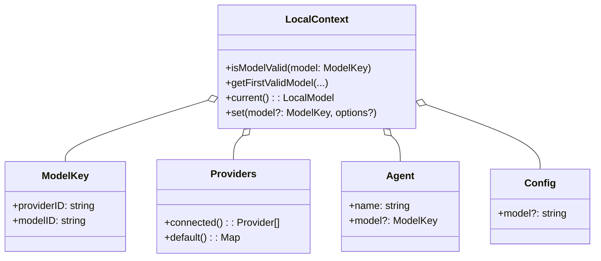

# 通信协议与 LLM 集成 (Protocols & LLM Integration)

本模块详细介绍了 OpenCode 与大语言模型 (LLM) 的集成方式以及客户端与 Agent 之间的通信协议。

## 2.1 LLM 集成与模型管理 (LLM Integration)

OpenCode 的 LLM 层构建在 Vercel AI SDK 之上，提供了强大的模型抽象和动态配置能力。

### 2.1.1 为什么选择 Vercel AI SDK？ (Why Vercel AI SDK?)

在 OpenCode 这种对交互延迟和控制精度要求极高的场景下，选择 Vercel AI SDK 而非重型框架（如 LangChain）主要基于以下考量：

- **统一的模型抽象 (Model Agnostic)**：通过统一的 `streamText` 和 `generateText` 接口，屏蔽了不同 Provider 在 API 格式上的差异。
- **原生支持工具调用 (Tool Calling)**：SDK 内置了对 `tool-call` 的结构化处理逻辑，能够自动处理 LLM 生成的参数并与本地 TypeScript 函数绑定。
- **极致的流式处理性能 (Streaming First)**：专为流式响应优化，支持毫秒级的首屏渲染 (TTFT)。
- **类型安全与开发者体验 (TS-First)**：与 Zod 深度集成，确保全链路类型安全。
- **低抽象成本 (Minimalist)**：库而非框架，方便底层深度定制。

### 2.1.2 Provider 抽象 (`Provider`)

位于 `packages/opencode/src/provider/provider.ts`，负责管理不同厂商的 LLM 集成。

- **Bundled Providers**: 内置支持 OpenAI, Anthropic, Google Vertex, AWS Bedrock 等 (`BUNDLED_PROVIDERS` map)。
- **Custom Loaders**: 针对特定 Provider 的特殊处理逻辑 (`CUSTOM_LOADERS`)。
    - **Anthropic**: 自动注入 Beta Headers (`claude-code-20250219` 等)。
    - **OpenCode**: 处理自定义鉴权。

### 2.1.3 模型元数据与选择

- **models.dev 集成**: 通过 `packages/opencode/src/provider/models.ts` 定期拉取最新的模型元数据。
- **模型选择策略**:
    1.  **Ephemeral**: 当前会话临时选择的模型。
    2.  **Agent Config**: Agent 配置中绑定的模型。
    3.  **Fallback**: 最近使用的模型或 Provider 的默认模型。

### 2.1.4 UML 视图：Select Model 逻辑

## 2.2 Agent Client Protocol (ACP) 详解

ACP (`packages/opencode/src/acp/`) 是 Client 和 Agent 之间的通信协议，基于事件驱动架构。

### 2.2.1 协议职责

ACP 负责建立连接、管理 Session 生命周期，并处理权限请求和工具调用。

### 2.2.2 会话生命周期

1.  **Initialize**: 握手，交换 Capabilities。
2.  **NewSession**: 创建新会话，初始化 `ACPSessionManager`。
3.  **LoadSession**: 加载历史会话，重放消息历史以恢复状态。

### 2.2.3 事件驱动机制

`ACP.Agent` 监听 SDK 发出的事件：

- **`permission.updated`**: 当 Agent 需要执行敏感操作时触发，转换为 `requestPermission` 发送给 Client。
- **`message.part.updated`**: 当 LLM 生成内容或工具调用状态变化时触发。

### 2.2.4 特殊工具处理

- **`edit` 工具**: 生成 `diff` 类型的 update，供前端展示。
- **`todowrite` 工具**: 转换为 `sessionUpdate: "plan"`，用于在 UI 上展示任务清单。

---

> **教授箴言**
>
> “协议决定了能力的边界。OpenCode 的 ACP 协议不仅是数据的载体，更是**‘意图’与‘行为’**的纽带。通过将复杂的 Agent 内部状态抽象为标准化的事件流，我们实现了极简而高效的前后端解耦。”
