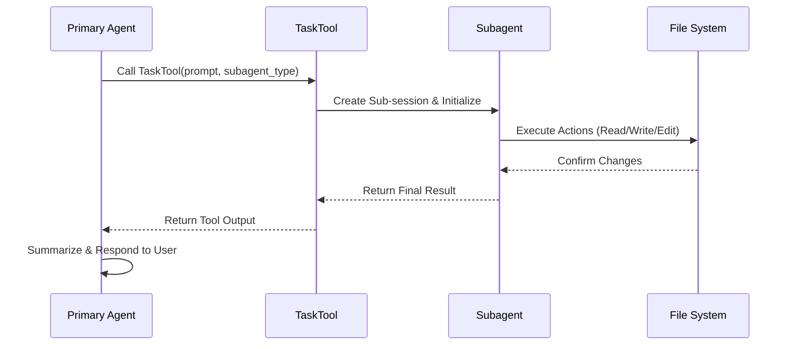

# Session 管理与智能体编排 (Session & Orchestration)

本模块深入探讨了 OpenCode 如何管理会话状态，以及主从智能体之间如何进行数据传递与协同工作。

## 4.1 核心范式与战略价值

**模式识别**：基于 **“物理共享、逻辑隔离”** 的层级化会话编排模式。

**价值解构**：
这种范式解决了 AI Agent 在处理复杂、长链任务时的“上下文爆炸”与“幻觉累积”问题。
- **上下文精简**：通过将子任务分配给独立的子会话，主会话只需保留任务的最终结果，而非繁琐的中间过程。
- **确定性执行**：物理文件系统的共享保证了 Agent 之间操作的原子性与可见性。
- **可追溯性**：每个子任务都有独立的 Session ID，方便开发者在调试时进行针对性的日志回溯。

## 4.2 架构机制精妙之处

### 4.2.1 Session 持久化与生命周期

OpenCode 的 Session 并非内存中的临时状态，而是**一等公民的持久化实体**。
- **存储路径**：`.opencode/session/{projectID}/{sessionID}.json`。
- **关键属性**：包含工作目录、父会话 ID、关联项目以及完整的消息轨迹。
- **ACP 同步**：利用 `ACPSessionManager` 将本地文件状态实时同步至前端响应式 Store。

### 4.2.2 任务编排流程 (Sequence Diagram)

## 4.3 典型案例分析 (Case Studies)

为了更好地理解这一机制，我们来看两个具体的工程场景。

### 4.3.1 案例 A：跨文件重构任务 (The "Refactor" Flow)

**场景**：用户要求“重构 `src/utils` 下的所有导出，并同步更新所有调用处”。

1. **主 Agent (Primary)**：接收指令，意识到这是一个涉及大量文件搜索和修改的复杂任务。
2. **委派 (Delegation)**：主 Agent 调用 `TaskTool`，参数如下：
   - `subagent_type`: `"explore"`
   - `prompt`: "找出所有引用了 `src/utils` 的文件，并列出受影响的函数名。"
3. **子会话执行**：`explore` Agent 在独立的子会话中运行 `grep` 和 `ls` 工具。它的思考过程（例如“正在检查 `src/components/Button.tsx`...”）全部记录在子 Session 中。
4. **结果回传**：`explore` Agent 返回 a JSON 列表。
5. **后续操作**：主 Agent 拿到列表后，再次启动 a `"general"` Agent，分批次执行具体的 `edit` 操作.

**架构价值**：主会话的 UI 界面始终保持整洁，用户只看到“正在搜索引用...”和最终的“重构完成”总结，而不会被成百上千行的搜索日志淹没。

### 4.3.2 案例 B：Slash Command 执行 (The "/review" Flow)

**场景**：用户输入 `/review`。

1. **触发**：系统解析 `/review` 命令，映射到 `review.txt` 模板。
2. **主 Agent 行为**：主 Agent 不亲自读取 git diff，而是直接通过 `TaskTool` 委派：
   - `subagent_type`: `"general"`
   - `prompt`: "执行 `git diff main`，分析代码变更，并给出优化建议。"
3. **并行能力**：如果变更非常大，主 Agent 甚至可以并行启动两个 `general` Agent，一个负责逻辑审查，一个负责安全审计。

## 4.4 可迁移的设计模式与思想

- **中介者模式 (Mediator Pattern)**：`TaskTool` 充当了 Agent 间通信的中介者，避免了 Agent 之间的直接耦合。
- **状态快照 (State Snapshot)**：在创建子会话时传递的 Prompt 实际上是当前任务状态的一个语义快照。

**思想升华**：
> “在构建 AI 系统时，**不要试图构建一个全能的单体，而要构建一个能够自我复制与委派的细胞。**” OpenCode 的设计哲学是将复杂性通过“分治法”摊销到多个微小的、可管理的 Session 中。

## 4.5 横向对比与场景拓展

**同类对比**：
- **对比 AutoGPT**：AutoGPT 往往在单一上下文中不断循环，容易迷失。OpenCode 的层级 Session 提供了明确的“递归出口”。
- **对比 Microsoft AutoGen**：AutoGen 侧重于多 Agent 对话流；OpenCode 侧重于**任务驱动的层级委派**。

**场景外推**：
- **自动化测试流水线**：主 Agent 规划测试用例，子 Agent 分别负责执行、日志分析与修复建议。
- **复杂文档生成**：主 Agent 设定大纲，子 Agent 并行撰写各章节。

## 4.6 工程实践与启发

- **文件系统作为单一真理来源**：Agent 之间不需要复杂的内存同步协议，直接通过读写文件进行“最强解耦”。
- **异步事件驱动的 UI 刷新**：在处理长耗时的子任务时，通过 ACP 事件流保持 UI 的响应性。

---

> **教授箴言**
>
> “Session 不仅仅是历史记录，它是智能体的**执行上下文容器**。通过将会话层级化，我们实际上是在模仿人类解决问题的方式：将大问题拆解为小问题，在独立的空间内解决它们，最后汇总答案。”
