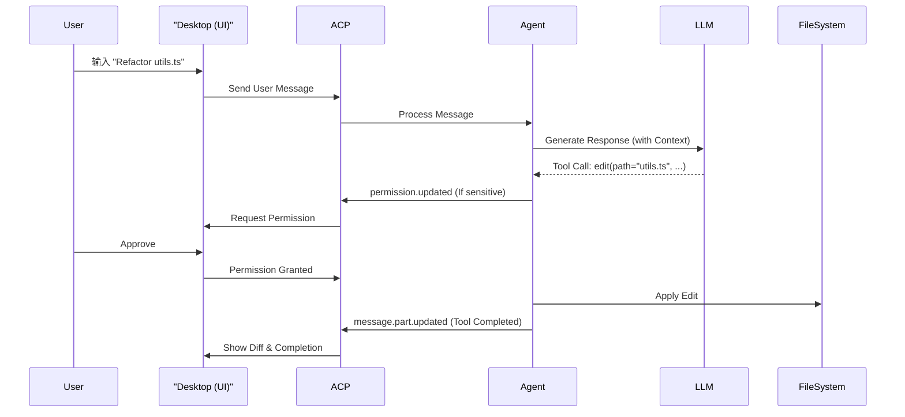

# 业务流程、安全与状态管理 (Workflows, Security & State)

本模块涵盖了系统的核心业务流程、安全沙箱机制以及复杂的会话状态管理。

## 3.1 核心业务流程 (Key Workflows)

### 3.1.1 代码生成/修改流程

### 3.1.2 上下文收集流程

1. 用户提问涉及代码库知识。
2. Agent 决定调用 `explore` subagent 或直接使用 `bash` 工具。
3. Agent 执行 `ls -R` 或 `grep` 命令。
4. 命令输出作为 Tool Output 返回给 LLM。
5. LLM 基于检索到的上下文生成最终回答。

## 3.2 安全与沙箱 (Security & Sandboxing)

OpenCode 采用 "Human-in-the-loop" 的安全模型。

### 3.2.1 权限拦截

所有敏感操作均需经过权限检查 (`packages/opencode/src/agent/agent.ts:57`)。
- **配置驱动**: `Config.Permission` 定义了 `allow`, `ask`, `deny` 三种状态。
- **动态请求**: 当遇到 `ask` 权限时，Agent 暂停挂起，等待用户通过 UI 授权。

### 3.2.2 命令过滤

`bash` 权限支持 glob 模式匹配。
- **安全白名单**: `ls`, `git status`, `grep` 等只读命令通常默认允许。
- **危险命令**: `rm`, `mkfs` 等破坏性命令被标记为 `ask` 或 `deny`。

## 3.3 Session 状态管理与同步 (Session State Management)

OpenCode 采用了 **“单向数据流 + 响应式本地镜像 (Reactive Local Mirror)”** 的状态管理架构。

### 3.3.1 架构三层模型

1.  **持久化层 (Backend Persistence)**: 作为“单一真理来源”。Session 信息通过 `Storage.write` 写入本地文件系统 (`.opencode/`)。
2.  **通信层 (ACP Event Stream)**: 利用 ACP 建立长连接，后端通过全局 `Bus` 广播事件。支持 **16ms (约 60FPS)** 的批处理优化。
3.  **视图层 (Reactive Store)**: 基于 **SolidJS Store** 实现细粒度响应式更新。

### 3.3.2 关键技术点

-   **细粒度响应式更新**: 使用 SolidJS 的 `reconcile` 算法，降低内存抖动。
-   **二分查找优化 (Binary Search)**: 在大规模会话中保持 $O(\log n)$ 的操作复杂度。
-   **最终一致性**: 后端处理完成后通过事件流反馈给前端，实现多端同步。

---

> **教授箴言**
>
> “在处理 AI 流式输出这种‘高频微小更新’时，传统的全量状态替换是性能的杀手。OpenCode 通过 ACP 事件批处理与 SolidJS 的细粒度响应式结合，实现了丝滑的交互体验。”
