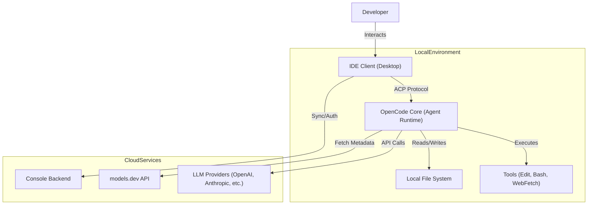

# OpenCode AI IDE 架构深度分析 (v1.0)

OpenCode 是一个专为 AI 辅助编程设计的集成开发环境 (IDE)，其核心价值在于将 LLM 深度集成到开发工作流中，通过 Agent 架构实现代码的自动探索、规划与修改。

---

## 📖 架构文档索引 (Documentation Index)

为了提高阅读体验，我们将详尽的架构分析拆分为以下模块：

### 1. [Agent 设计与实现](./arch/agents.md)
深入了解 OpenCode 的智能体体系，包括：
- **1.1 Agent 定义**：`Agent.Info` 配置结构与核心元数据。
- **1.2 权限系统**：细粒度的 Human-in-the-loop 安全策略。
- **1.3 内置 Agent**：build, plan, explore, general 等角色分工。
- **1.4 Slash Commands**：命令处理流程与 TaskTool 委派机制。
- **1.5 编排哲学**：主从 Agent 的层级化分治与辩证关系。
- **1.6 进阶机制**：Compaction 自动压缩、动态工具沙箱与 HITL 状态机。

### 2. [通信协议与 LLM 集成](./arch/protocols.md)
解析 Client 与 Agent 的连接纽带：
- **2.1 LLM 集成**：基于 Vercel AI SDK 的多模型管理与 Provider 抽象。
- **2.2 ACP 协议**：基于事件驱动的 Agent Client Protocol 详解。

### 3. [业务流程、安全与状态管理](./arch/workflows.md)
系统的运行动态与保障：
- **3.1 核心业务流程**：代码生成、上下文收集的 Sequence Diagram。
- **3.2 安全与沙箱**：权限拦截与敏感命令过滤机制。
- **3.3 状态管理**：单向数据流与响应式本地镜像架构。

### 4. [Session 管理与智能体编排](./arch/session-orchestration.md)
解析 Agent 间的协同与状态持久化：
- **4.1 核心范式**：物理共享、逻辑隔离的层级化会话。
- **4.2 架构机制**：Session 持久化生命周期与 TaskTool 编排。
- **4.3 典型案例**：跨文件重构与 Slash Command 的执行流分析。
- **4.4-4.6 设计模式与实践**：中介者模式、状态快照及工程启发。

### 5. [架构专家深度评论 (Deep Dive)](./arch/deep-dive.md)
从架构师视角解构精妙之处：
- **5.1-5.2 核心范式与机制**：基于 MCP 的分布式能力网格与隔离会话。
- **5.3 设计模式**：策略模式与注册表模式的极致应用。
- **5.4-5.5 横向对比与工程实践**：对比 LangChain/AutoGPT 及其生产级考量。
- **5.6 提示词架构专题**：策略驱动的多模型提示词注入解析。
- **5.7 最佳提示词方法论**：体系化工程视角下的 Prompt 推导。
- **5.8 [Prompt 自动化迭代](./arch/prompt-automation.md)**：从手工业到工业化的 Prompt 演进。
- **5.9 [多模型协同架构](./arch/multi-model-orchestration.md)**：策略路由与职责分离的深度解析。

### 6. [技术栈与生态映射](./arch/ecosystem.md)
工程实践参考：
- **6.1 Python 复刻指南**：利用 PydanticAI 和 LiteLLM 实现类似架构。
- **6.2 关键技术栈**：从 SolidJS 到 Turborepo 的全链路依赖解析。

---

## 🏗️ 系统全景架构 (System Architecture)

OpenCode 的架构可以分为三个主要部分：Desktop (IDE UI), OpenCode Core (Agent Runtime), 和 Console (Backend Services)。

### 组件关系图

### 数据流 (Data Flow)

1.  **User Input**: 用户在 IDE 聊天界面输入 Prompt。
2.  **ACP Request**: Desktop 通过 SDK 将请求发送给 Agent Runtime。
3.  **Agent Processing**: Agent 根据配置和权限选择模型与工具。
4.  **LLM Interaction**: Agent 调用 LLM 获取回复或工具调用指令。
5.  **Tool Execution**: 执行文件修改或 Bash 命令。
6.  **Event Update**: 通过 ACP 事件将流式响应实时推回 Desktop。
7.  **UI Update**: Desktop 更新聊天界面和编辑器视图。

---

## 📝 执行摘要 (Executive Summary)

**核心架构风格**：
- **Monorepo**: 采用 Monorepo 结构管理所有包。
- **Frontend**: 基于 **SolidJS** 构建，强调高性能与响应式状态管理。
- **Runtime**: Agent 运行时基于 **Node.js**，通过 **ACP** 与客户端通信。
- **LLM Integration**: 深度集成 **Vercel AI SDK**，支持多模型动态切换。

---

## ❓ 待确认事项与假设 (Open Questions & Assumptions)

- **Assumption**: 假设 `packages/sdk` 封装了 ACP 的客户端逻辑。
- **Assumption**: 假设 `models.dev` 是 OpenCode 维护的中心化模型元数据服务。
- **Open Question**: `subagent` 的具体调度逻辑（即主 Agent 如何决定调用哪个 subagent）主要依赖 Prompt 驱动。
