# OpenCode AI IDE 架构深度分析 (v1.0)

## 目录 (Table of Contents)

- [OpenCode AI IDE 架构深度分析 (v1.0)](#opencode-ai-ide-架构深度分析-v10)
  - [目录 (Table of Contents)](#目录-table-of-contents)
  - [1. 执行摘要 (Executive Summary)](#1-执行摘要-executive-summary)
  - [2. 系统全景架构 (System Architecture)](#2-系统全景架构-system-architecture)
    - [2.1 组件关系图](#21-组件关系图)
    - [2.2 数据流 (Data Flow)](#22-数据流-data-flow)
  - [3. Agent 设计与实现 (Agent Design)](#3-agent-设计与实现-agent-design)
    - [3.1 Agent 定义 (`Agent.Info`)](#31-agent-定义-agentinfo)
    - [3.2 权限系统 (Permission System)](#32-权限系统-permission-system)
    - [3.3 内置 Agent (Built-in Agents)](#33-内置-agent-built-in-agents)
    - [3.4 Slash Commands \& 命令执行流程](#34-slash-commands--命令执行流程)
      - [3.4.1 命令列表与 Agent 映射](#341-命令列表与-agent-映射)
      - [3.4.2 命令处理逻辑 (`SessionPrompt.command`)](#342-命令处理逻辑-sessionpromptcommand)
      - [3.4.3 委派核心：TaskTool](#343-委派核心tasktool)
        - [A. 调用参数](#a-调用参数)
        - [B. 预定义的子 Agent 类型](#b-预定义的子-agent-类型)
        - [C. 子 Agent 可用的原子工具](#c-子-agent-可用的原子工具)
      - [3.4.4 子 Agent `explore` 深度解析](#344-子-agent-explore-深度解析)
        - [A. 核心价值与运行机制](#a-核心价值与运行机制)
        - [B. 探索策略 (Search Strategy)](#b-探索策略-search-strategy)
        - [C. 查询条件的生成逻辑 (Query Generation Logic)](#c-查询条件的生成逻辑-query-generation-logic)
          - [1. 模式分解与关键词提取 (Decomposition)](#1-模式分解与关键词提取-decomposition)
          - [2. 策略化工具参数生成 (Strategy Generation)](#2-策略化工具参数生成-strategy-generation)
          - [3. 启发式路径猜测 (Heuristic Guessing)](#3-启发式路径猜测-heuristic-guessing)
          - [4. 迭代式细化与结果归并 (Iterative Refinement)](#4-迭代式细化与结果归并-iterative-refinement)
        - [D. 工具底层实现细节 (Implementation Details)](#d-工具底层实现细节-implementation-details)
          - [1. Glob 工具：基于 Ripgrep 的文件发现](#1-glob-工具基于-ripgrep-的文件发现)
          - [2. Grep 工具：正则搜索与结果解析](#2-grep-工具正则搜索与结果解析)
          - [3. CodeSearch 工具：语义化的向量检索](#3-codesearch-工具语义化的向量检索)
          - [4. 基础设施：Ripgrep 的自动管理](#4-基础设施ripgrep-的自动管理)
        - [E. 可视化表达 (Visualizations)](#e-可视化表达-visualizations)
          - [1. 探索深度与覆盖范围](#1-探索深度与覆盖范围)
          - [2. 工具链执行流](#2-工具链执行流)
        - [F. 典型场景 UML 交互演示 (UML Scenarios)](#f-典型场景-uml-交互演示-uml-scenarios)
          - [1. 快速定位场景 (Fast Location)](#1-快速定位场景-fast-location)
          - [2. 深度调研场景 (Deep Investigation)](#2-深度调研场景-deep-investigation)
        - [G. Prompt 赏析 (Prompt Appreciation)](#g-prompt-赏析-prompt-appreciation)
          - [1. 角色定位：文件搜索专家](#1-角色定位文件搜索专家)
          - [2. 能力图谱：工具组合拳](#2-能力图谱工具组合拳)
          - [3. 极简原则与行为约束](#3-极简原则与行为约束)
          - [4. 灵活适配 (Adaptability)](#4-灵活适配-adaptability)
          - [5. 原始系统提示词 (Raw System Prompt)](#5-原始系统提示词-raw-system-prompt)
        - [H. 典型应用场景（什么时候派它出场？）](#h-典型应用场景什么时候派它出场)
        - [E. 典型场景 UML 交互演示](#e-典型场景-uml-交互演示)
          - [1. 快速定位 (Fast Location)](#1-快速定位-fast-location)
          - [2. 逻辑分析 (Logic Analysis)](#2-逻辑分析-logic-analysis)
          - [3. 影响评估 (Impact Assessment)](#3-影响评估-impact-assessment)
          - [4. 技术选型调研 (Stack Research)](#4-技术选型调研-stack-research)
          - [5. 报错溯源 (Error Trace)](#5-报错溯源-error-trace)
      - [3.4.5 子 Agent `general` 深度解析](#345-子-agent-general-深度解析)
        - [A. 核心价值与运行机制](#a-核心价值与运行机制-1)
        - [B. 执行生命周期 (Execution Flow)](#b-执行生命周期-execution-flow)
        - [C. 可视化表达](#c-可视化表达)
          - [1. 并行委派与结果汇聚 (Fan-out / Fan-in)](#1-并行委派与结果汇聚-fan-out--fan-in)
          - [2. 上下文隔离示意 (Token Sandbox)](#2-上下文隔离示意-token-sandbox)
        - [D. 典型应用场景（什么时候派它出场？）](#d-典型应用场景什么时候派它出场)
        - [E. 典型场景 UML 交互演示](#e-典型场景-uml-交互演示-1)
          - [1. 重构与迁移 (Bulk Refactor)](#1-重构与迁移-bulk-refactor)
          - [2. 质量保障 (Testing)](#2-质量保障-testing)
          - [3. 版本升级 (Dependency Upgrade)](#3-版本升级-dependency-upgrade)
          - [4. 故障排查 (Bug Fix)](#4-故障排查-bug-fix)
          - [5. 同步维护 (Doc Sync)](#5-同步维护-doc-sync)
          - [6. 高能并行 (Parallel Tasks)](#6-高能并行-parallel-tasks)
          - [智能体范式 (Agent Paradigms)](#智能体范式-agent-paradigms)
          - [技术栈与脚手架 (Tech Stack)](#技术栈与脚手架-tech-stack)
        - [I. 专家视角：架构设计深度评论](#i-专家视角架构设计深度评论)
          - [1. 架构机制的精妙之处：分层解耦](#1-架构机制的精妙之处分层解耦)
          - [2. 实现层面的工业级考量：性能优先](#2-实现层面的工业级考量性能优先)
          - [3. Prompt 设计的艺术：结构化与确定性](#3-prompt-设计的艺术结构化与确定性)
    - [3.5 决策循环 (Decision Loop)](#35-决策循环-decision-loop)
        - [C. 委派逻辑：TaskTool 的核心作用](#c-委派逻辑tasktool-的核心作用)
        - [D. 决策终止](#d-决策终止)
    - [3.6 UML 视图：Compaction Agent 上下文压缩](#36-uml-视图compaction-agent-上下文压缩)
      - [3.6.1 触发时机与逻辑](#361-触发时机与逻辑)
      - [3.6.2 处理逻辑流程图](#362-处理逻辑流程图)
      - [3.6.3 状态转换图：上下文生命周期](#363-状态转换图上下文生命周期)
      - [3.6.4 具体实现深度解析](#364-具体实现深度解析)
        - [A. 软裁剪 (Pruning)：旧工具输出清理](#a-软裁剪-pruning旧工具输出清理)
        - [B. 硬压缩 (Summarization)：Agent 驱动的摘要](#b-硬压缩-summarizationagent-驱动的摘要)
  - [4. LLM 集成与模型管理 (LLM Integration)](#4-llm-集成与模型管理-llm-integration)
    - [4.1 为什么选择 Vercel AI SDK？ (Why Vercel AI SDK?)](#41-为什么选择-vercel-ai-sdk-why-vercel-ai-sdk)
    - [4.2 Provider 抽象 (`Provider`)](#42-provider-抽象-provider)
    - [4.3 模型元数据与选择](#43-模型元数据与选择)
    - [4.4 UML 视图：Select Model 逻辑](#44-uml-视图select-model-逻辑)
  - [5. Agent Client Protocol (ACP) 详解](#5-agent-client-protocol-acp-详解)
    - [5.1 协议职责](#51-协议职责)
    - [5.2 会话生命周期](#52-会话生命周期)
    - [5.3 事件驱动机制](#53-事件驱动机制)
    - [5.4 特殊工具处理](#54-特殊工具处理)
  - [6. 核心业务流程 (Key Workflows)](#6-核心业务流程-key-workflows)
    - [6.1 代码生成/修改流程](#61-代码生成修改流程)
    - [6.2 上下文收集流程](#62-上下文收集流程)
  - [7. 安全与沙箱 (Security \& Sandboxing)](#7-安全与沙箱-security--sandboxing)
    - [7.1 权限拦截](#71-权限拦截)
    - [7.2 命令过滤](#72-命令过滤)
  - [8. 待确认事项与假设 (Open Questions \& Assumptions)](#8-待确认事项与假设-open-questions--assumptions)
  - [9. 核心架构深度解析 (Architecture Deep Dive)](#9-核心架构深度解析-architecture-deep-dive)
    - [9.1 核心范式与战略价值](#91-核心范式与战略价值)
    - [9.2 架构机制精妙之处](#92-架构机制精妙之处)
    - [9.3 可迁移的设计模式与思想](#93-可迁移的设计模式与思想)
    - [9.4 横向对比与应用场景拓展](#94-横向对比与应用场景拓展)
    - [9.5 工程实践与启发](#95-工程实践与启发)
  - [10. 关键技术栈与依赖解析 (Key Tech Stack \& Dependencies)](#10-关键技术栈与依赖解析-key-tech-stack--dependencies)
    - [10.1 AI 与智能体核心 (AI \& Agent Core)](#101-ai-与智能体核心-ai--agent-core)
    - [10.2 前端展现层 (Frontend \& UI)](#102-前端展现层-frontend--ui)
    - [10.3 后端与运行时 (Backend \& Runtime)](#103-后端与运行时-backend--runtime)
    - [10.4 辅助工具与基础设施 (Utilities \& Infra)](#104-辅助工具与基础设施-utilities--infra)
    - [10.5 工程效率与基础设施 (Engineering Excellence \& Infra)](#105-工程效率与基础设施-engineering-excellence--infra)
  - [11. 跨语言架构映射：Python 生态实现方案](#11-跨语言架构映射python-生态实现方案)
    - [11.1 核心推荐方案：PydanticAI + LiteLLM](#111-核心推荐方案pydanticai--litellm)
    - [11.2 维度对比：如何实现“高度类似”的效果](#112-维度对比如何实现高度类似的效果)
    - [11.3 代码示例：Python 版本的“OpenCode 式”实现](#113-代码示例python-版本的opencode-式实现)
    - [11.4 架构启示](#114-架构启示)
---

## 11. 跨语言架构映射：Python 生态实现方案

如果你追求 **Vercel AI SDK** 那种“轻量级、类型安全、协议优先、低抽象成本”的设计哲学，而不是 LangChain 那种“重度框架、多层抽象”的风格，在 Python 生态中，最推荐的方案是 **PydanticAI** 结合 **LiteLLM**。

### 11.1 核心推荐方案：PydanticAI + LiteLLM

*   **PydanticAI**: 由 Pydantic 官方团队开发，它是 Vercel AI SDK 在 Python 界的“灵魂伴侣”。
*   **LiteLLM**: 负责多模型适配（Model Agnostic），相当于 Vercel AI SDK 的 Provider 层。

### 11.2 维度对比：如何实现“高度类似”的效果

| 维度 | Vercel AI SDK (TS) | Python 对应方案 (PydanticAI + LiteLLM) | 实现机制与好处 |
| :--- | :--- | :--- | :--- |
| **统一模型抽象** | `streamText` / `generateText` | **LiteLLM** | LiteLLM 将 100+ 模型转换为 OpenAI 格式。只需一套代码，即可无缝切换 Claude, GPT, DeepSeek。 |
| **原生工具调用** | `tools` 参数 + `Zod` | **PydanticAI** `Agent(tools=[...])` | PydanticAI 利用 Python 的 Type Hints 和 Pydantic 模型，自动生成 Tool Schema，并处理工具调用循环。 |
| **类型安全** | Zod | **Pydantic** | 利用 Python 的 Type Hints 确保 LLM 输出完全符合 Python 类定义，提供极佳的 IDE 开发体验。 |
| **流式处理** | `fullStream` / `textDelta` | **PydanticAI** `stream_text()` | 支持异步生成器 (Async Generator)，实现流式的文本增量和结构化输出。 |
| **低抽象成本** | "Library, not Framework" | **纯函数式设计** | 极其轻量，没有复杂的“链（Chains）”概念，就是纯粹的 Python 函数和类，调试极其直观。 |

### 11.3 代码示例：Python 版本的“OpenCode 式”实现

如果你想在 Python 中实现类似 OpenCode 的 `explore` Agent，代码实现如下：

```python
from pydantic import BaseModel
from pydantic_ai import Agent, RunContext
from litellm import completion

# 1. 定义结构化输出（类似 Zod）
class SearchResult(BaseModel):
    files: list[str]
    explanation: str

# 2. 定义工具（类似 OpenCode 的 glob/grep）
def search_code(ctx: RunContext[str], pattern: str) -> list[str]:
    """在代码库中搜索关键词"""
    # 这里实现具体的 ripgrep 逻辑
    return ["file1.py", "file2.py"]

# 3. 创建 Agent（类似 Agent.Info）
agent = Agent(
    'openai:gpt-4o', # 配合 LiteLLM 可以用各种模型
    deps_type=str,
    result_type=SearchResult,
    system_prompt="你是一个代码搜索专家...",
    tools=[search_code]
)

# 4. 执行决策循环 (Decision Loop)
async def run():
    async with agent.run_stream("找一下支付逻辑") as result:
        async for message in result.stream_text():
            print(message, end='') # 流式输出
```

### 11.4 架构启示

1.  **摆脱“黑盒”困境**：PydanticAI 像 Vercel AI SDK 一样，把 **Prompt -> 执行 -> 解析** 的过程透明化了，避免了重型框架常见的抽象层过厚问题。
2.  **回归语言原生力量**：充分利用 Python 原生的类型系统，让 AI 开发回归到“写正常的代码”上，而不是写“框架配置”。
3.  **高度的可组合性**：支持函数式编排，使得多智能体协作逻辑可以像 OpenCode 的 `TaskTool` 一样灵活、高效。

## 1. 执行摘要 (Executive Summary)

OpenCode 是一个专为 AI 辅助编程设计的集成开发环境 (IDE)，其核心价值在于将 LLM 深度集成到开发工作流中，通过 Agent 架构实现代码的自动探索、规划与修改。

**核心架构风格**：
- **Monorepo**: 采用 Monorepo 结构管理所有包 (`packages/opencode`, `packages/desktop`, `packages/console` 等)。
- **Frontend**: IDE 客户端基于 **SolidJS** 和 **Vite** 构建，强调高性能与响应式状态管理。
- **Runtime**: Agent 运行时基于 **Node.js** (部分工具链涉及 Bun)，通过 **ACP (Agent Client Protocol)** 与客户端通信。
- **LLM Integration**: 深度集成 **Vercel AI SDK**，支持多模型提供商，并利用 `models.dev` 动态获取模型元数据。

---

## 2. 系统全景架构 (System Architecture)

OpenCode 的架构可以分为三个主要部分：Desktop (IDE UI), OpenCode Core (Agent Runtime), 和 Console (Backend Services)。

### 2.1 组件关系图

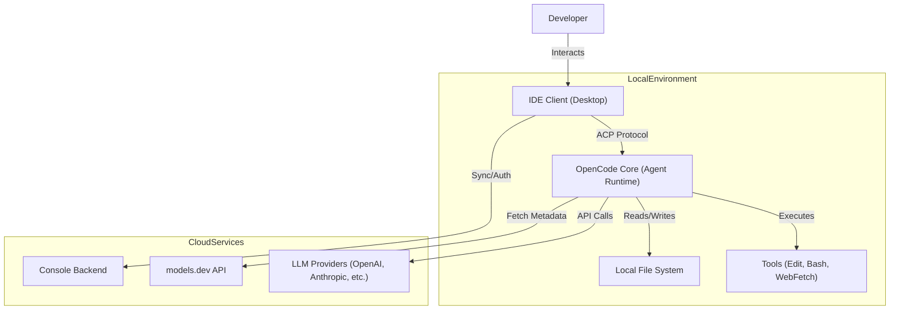
```mermaid
graph TD
    User["Developer"] -->|Interacts| Desktop["IDE Client (Desktop)"]

    subgraph LocalEnvironment
        Desktop -->|ACP Protocol| AgentRuntime["OpenCode Core (Agent Runtime)"]
        AgentRuntime -->|Executes| Tools["Tools (Edit, Bash, WebFetch)"]
        AgentRuntime -->|Reads/Writes| FileSystem["Local File System"]
    end

    subgraph CloudServices
        AgentRuntime -->|API Calls| LLM["LLM Providers (OpenAI, Anthropic, etc.)"]
        Desktop -->|Sync/Auth| Console["Console Backend"]
        AgentRuntime -->|Fetch Metadata| ModelsDev["models.dev API"]
    end
```

### 2.2 数据流 (Data Flow)

1.  **User Input**: 用户在 IDE 聊天界面输入 Prompt。
2.  **ACP Request**: Desktop 通过 SDK 将请求发送给 Agent Runtime (`packages/opencode/src/acp/agent.ts`).
3.  **Agent Processing**: Agent 根据配置 (`Agent.Info`) 和权限选择模型与工具。
4.  **LLM Interaction**: Agent 调用 LLM (`packages/opencode/src/provider/provider.ts`) 获取回复或工具调用指令。
5.  **Tool Execution**: 
    - 如果是 `edit` 工具，Agent 修改文件系统。
    - 如果是 `bash` 工具，Agent 在受限沙箱中执行命令。
6.  **Event Update**: Agent 通过 ACP 事件 (`message.part.updated`) 将流式响应和工具执行结果实时推回 Desktop。
7.  **UI Update**: Desktop 更新聊天界面和文件编辑器视图 (`packages/desktop/src/context/local.tsx`).

---

## 3. Agent 设计与实现 (Agent Design)

Agent 是 OpenCode 的核心执行单元，负责理解用户意图并执行操作。

### 3.1 Agent 定义 (`Agent.Info`)

Agent 的配置结构定义在 `packages/opencode/src/agent/agent.ts` 中：

```typescript
// packages/opencode/src/agent/agent.ts:18
export namespace Agent {
  export const Info = z.object({
    name: z.string(),
    mode: z.enum(["subagent", "primary", "all"]), // Agent 类型
    permission: z.object({ ... }),                // 权限配置
    tools: z.record(z.string(), z.boolean()),     // 启用/禁用的工具
    model: z.object({ ... }).optional(),          // 绑定模型
    prompt: z.string().optional(),                // 系统提示词
    // ...
  })
}
```

### 3.2 权限系统 (Permission System)

OpenCode 实现了细粒度的权限控制，默认策略通过 `mergeAgentPermissions` 函数进行合并 (`packages/opencode/src/agent/agent.ts:333`)。

- **edit**: 默认为 `allow`。
- **webfetch**: 默认为 `allow`。
- **bash**: 支持对特定命令的精细控制。
    - `allow`: 允许执行 (如 `ls`, `git status`, `grep`)。
    - `ask`: 需要用户确认 (如 `find -delete`, `rm` 等高危操作)。
    - `deny`: 禁止执行。

### 3.3 内置 Agent (Built-in Agents)

OpenCode 预置了多个 Agent 以应对不同场景 (`packages/opencode/src/agent/agent.ts:117`)：

| Agent Name | Mode | Description | Prompt Source |
| :--- | :--- | :--- | :--- |
| **build** | primary | 默认 Agent，用于构建和通用编码任务。 | Default |
| **plan** | primary | 用于生成任务计划，具有更严格的 Bash 权限。 | Default |
| **explore** | subagent | 专注于代码库探索，使用 `grep`, `ls` 等工具。 | `packages/opencode/src/agent/prompt/explore.txt` |
| **general** | subagent | 通用研究 Agent，并行执行任务。 | - |
| **compaction**| primary | (Hidden) 用于上下文压缩。 | `packages/opencode/src/agent/prompt/compaction.txt` |
| **title** | primary | (Hidden) 生成会话标题。 | `packages/opencode/src/agent/prompt/title.txt` |
| **summary** | primary | (Hidden) 生成会话摘要。 | `packages/opencode/src/agent/prompt/summary.txt` |

### 3.4 Slash Commands & 命令执行流程

Slash Commands 是用户与 Agent 交互的快捷方式，定义在 `packages/opencode/src/command/index.ts` 中。它们通过预定义的模板、模型和 Agent 配置来简化复杂任务。

#### 3.4.1 命令列表与 Agent 映射

Slash Commands 分为 **内置命令**、**静态命令** 和 **自定义命令 (Markdown)**。

| 类型 | 命令 | 描述 | 关联 Agent | 备注 |
| :--- | :--- | :--- | :--- | :--- |
| **内置** | `/undo` | 撤销上一步操作 | - | 由 TUI 直接处理 |
| **内置** | `/redo` | 重做上一步操作 | - | 由 TUI 直接处理 |
| **内置** | `/share` | 分享当前会话 | - | 生成分享链接 |
| **内置** | `/help` | 显示帮助信息 | - | 列出所有可用命令 |
| **静态** | `/init` | 初始化项目配置 | 默认 Agent | 使用 `initialize.txt` 模板，创建 `AGENTS.md` |
| **静态** | `/review` | 审查代码变更 | 默认 Agent | 使用 `review.txt` 模板，支持 `commit/branch/pr` |
| **Markdown** | `/commit` | Git 提交并推送 | 默认 Agent | 指定模型: `opencode/glm-4.6` |
| **Markdown** | `/issues` | 在 GitHub 上查找相关 Issue | 默认 Agent | 指定模型: `opencode/haiku-4-5` |
| **Markdown** | `/rmslop` | 移除 AI 生成的冗余代码 | 默认 Agent | 清理 Code Slop |
| **Markdown** | `/spellcheck`| Markdown 拼写/语法检查 | 默认 Agent | 针对文档优化 |

*注：*
1.  *Markdown 命令定义在 `.opencode/command/*.md` 中，文件名即为命令名。*
2.  *如果命令未显式指定 `agent`，则默认使用当前会话的 Agent 或系统默认 Agent (`build`)。*
3.  *`subtask: true` 的命令（如 `/review`）会启动一个独立的子任务流，不污染主会话上下文。*

#### 3.4.2 命令处理逻辑 (`SessionPrompt.command`)

当用户输入 `/` 开头的命令时，处理流程如下：
1.  **解析**：解析命令名和参数。
2.  **模板渲染**：将命令对应的模板（如 `review.txt`）注入上下文。
3.  **任务执行**：
    -   如果是内置命令（如 `/undo`），直接修改会话状态。
    -   如果是任务类命令（如 `/review`），通常会调用 `TaskTool` 启动一个子任务流。

#### 3.4.3 委派核心：TaskTool

`TaskTool` 是主 Agent 实现复杂任务委派的核心机制。它通过启动专门的 **Subagent (子 Agent)** 来分担工作量。

##### A. 调用参数
主 Agent 在调用 `TaskTool` 时需指定：
- `description`: 任务简述（用于 UI 显示）。
- `prompt`: 给子 Agent 的具体指令。
- `subagent_type`: 指定子 Agent 类型（`general` 或 `explore`）。

##### B. 预定义的子 Agent 类型

OpenCode 预定义了以下几种专用的子 Agent 类型，用于处理主 Agent 委派的不同任务：

| 子 Agent | 模式 | 核心职责 | 特点与工具访问 |
| :--- | :--- | :--- | :--- |
| **`general`** | `subagent` | **通用任务执行**。处理需要多个步骤、涉及复杂逻辑且可能需要修改文件的任务。 | 拥有最全的工具权限（`read`, `write`, `edit`, `bash` 等），默认隐藏，仅通过 Task 委派调用。 |
| **`explore`** | `subagent` | **深度代码搜索与分析**。专门用于在大型代码库中快速定位文件、搜索符号或理解复杂逻辑。 | 针对搜索优化，默认关闭 `write` 和 `edit` 权限。支持 `quick`, `medium`, `very thorough` 三种探索深度。 |
| **`build`** | `primary` | **默认构建与开发**。主 Agent，负责与用户直接对话，协调整体开发流程。 | 拥有完整的写权限和终端执行权限。 |
| **`plan`** | `primary` | **架构设计与规划**。侧重于分析和制定方案，而不是直接编写代码。 | 权限受限，通常只允许读取操作和特定的 Git 命令，防止在规划阶段意外修改代码。 |
| **`compaction`** | `primary` | **上下文压缩**。专门用于总结长对话，将历史记录转化为简洁的摘要。 | 工具权限全关 (`* : false`)，仅使用其 Prompt 能力生成摘要。 |
| **`title`** | `primary` | **标题生成**。根据对话内容自动生成会话标题。 | 极简 Agent，无工具访问。 |
| **`summary`** | `primary` | **会话总结**。在会话结束或存档时生成最终总结。 | 极简 Agent，无工具访问。 |

*注：*
- *`subagent` 模式的 Agent 默认不会直接出现在 UI 的 Agent 选择器中，它们专门为 `TaskTool` 服务。*
- *`primary` 模式的 Agent 可以作为会话的主启动者，但其中的 `compaction` / `title` / `summary` 属于系统内部使用的“隐形” Agent。*

##### C. 子 Agent 可用的原子工具
子 Agent 启动后，可以根据其权限调用以下底层工具：

| 工具 | 说明 | `general` | `explore` |
| :--- | :--- | :---: | :---: |
| `read` / `write` | 文件读写 | ✅ | 只读 |
| `edit` | SEARCH/REPLACE 模式编辑 | ✅ | ❌ |
| `bash` | 终端命令执行 | ✅ | ✅ |
| `glob` / `grep` | 文件名/内容搜索 | ✅ | ✅ |
| `codesearch` | 语义化代码搜索 | ✅ | ✅ |
| `lsp` | 语言服务器（定义、引用等） | ✅ | ✅ |
| `websearch` | 互联网搜索 | ✅ | ✅ |

#### 3.4.4 子 Agent `explore` 深度解析

`explore` 是 OpenCode 中的“信息侦察兵”。它专门为快速、深入地理解大型代码库而设计，是主 Agent 在动手写代码前的“眼睛”。

##### A. 核心价值与运行机制
1. **搜索专家模式 (Search Specialist)**：
   - **技术层面**：它针对 `glob`, `grep`, `codesearch` (语义搜索) 和 `lsp` (语言服务) 进行了深度优化。
   - **大白话**：它是找代码的高手。不管是找某个文件、搜一段报错，还是查某个函数在哪里被用了，它都能比普通 Agent 找得更准、更全。
2. **多级探索深度 (Thoroughness Levels)**：
   - **技术层面**：支持 `quick` (快速搜索), `medium` (中度探索), `very thorough` (全量扫描) 三种模式，主 Agent 会根据任务难度动态调整。
   - **大白话**：它懂得分寸。如果只是找个文件，它就“扫一眼”；如果是要理解复杂的逻辑关系，它会“掘地三尺”。
3. **只读安全沙箱 (Read-only Sandbox)**：
   - **技术层面**：默认关闭 `write` 和 `edit` 权限，仅保留读取和搜索能力，防止在探索阶段意外修改用户代码。
   - **大白话**：它是“只看不动”。派它出去调研时，你完全不用担心它会乱改你的项目，它只带回情报，不带回风险。

##### B. 探索策略 (Search Strategy)
- **快速定位 (Quick)**：优先使用 `glob` 匹配路径，确认文件是否存在。
- **语义关联 (Semantic)**：使用 `codesearch` 查找逻辑相关的代码块，即使关键词不完全匹配。
- **关联追踪 (Trace)**：通过 `lsp` 查找定义和引用，梳理代码的调用链路。
- **汇总分析 (Synthesis)**：将零散的搜索结果串联起来，给出一个完整的逻辑视图。

##### C. 查询条件的生成逻辑 (Query Generation Logic)

Agent 并不是盲目搜索，它有一套基于“思维链 (CoT)”的查询生成策略。以下以指令 **“找一下支付逻辑”** 为例，详细拆解其一步步的处理逻辑：

###### 1. 模式分解与关键词提取 (Decomposition)
当接收到指令时，Agent 首先在内部进行知识关联与概念发散：
- **核心实体识别**：Agent 会联想到支付领域常见的关键词，如 `Payment`, `Stripe`, `Checkout`, `Order`, `Subscription`。
- **动作与状态识别**：关联处理支付时必经的逻辑点，如 `process`, `handle`, `callback`, `webhook`, `success`, `fail`, `refund`。

###### 2. 策略化工具参数生成 (Strategy Generation)
基于上述分解，Agent 会同时并发生成多种搜索策略，以确保高覆盖率：
- **Glob 策略 (路径感知)**：生成 `**/payment/**`, `**/stripe/**`, `**/*payment*.*` 等模式。这是为了从目录结构上快速定位。
- **Grep 策略 (代码特征)**：生成 `processPayment`, `handleWebhook`, `Stripe.events`, `payment_intent` 等正则模式。这是为了从函数名或变量名上精确命中。

###### 3. 启发式路径猜测 (Heuristic Guessing)
Agent 熟悉常见的项目结构（如 Monorepo 或标准 Node 项目），会优先在 `src/`, `packages/`, `lib/` 下进行扫描，并根据 `package.json` 中的依赖（如是否有 `stripe` 库）来验证其关键词的有效性。

###### 4. 迭代式细化与结果归并 (Iterative Refinement)
- **漏斗式过滤**：如果 `glob` 找到了 `packages/api/services/payment.ts`，Agent 会立即对该文件执行 `read`。
- **自动扩充**：如果 `grep` 结果过多，Agent 会自动增加限制，如使用 `include: "*.ts"` 缩小范围。

##### D. 工具底层实现细节 (Implementation Details)

`explore` Agent 的强大搜索能力建立在对底层工具的精妙封装之上。以下是核心工具的实现逻辑与代码细节：

###### 1. Glob 工具：基于 Ripgrep 的文件发现
`glob` 工具并不依赖 Node.js 原生的 fs 递归，而是利用 `ripgrep` 的极速扫描能力。

- **核心逻辑**：
    - 自动解析绝对/相对路径。
    - 使用 `Ripgrep.files` 异步生成器进行流式扫描。
    - **性能优化**：硬编码 100 个文件的上限（Limit），并按修改时间（mtime）倒序排列，确保 Agent 优先看到最新的文件。

```typescript
// packages/opencode/src/tool/glob.ts
for await (const file of Ripgrep.files({
  cwd: search,
  glob: [params.pattern],
})) {
  if (files.length >= limit) {
    truncated = true; break;
  }
  const full = path.resolve(search, file);
  const stats = await Bun.file(full).stat().catch(() => 0);
  files.push({ path: full, mtime: stats });
}
```

###### 2. Grep 工具：正则搜索与结果解析
`grep` 工具通过直接调用 `rg` 二进制文件，实现跨文件的内容检索。

- **执行机制**：
    - 使用 `Bun.spawn` 启动子进程，避免阻塞主线程。
    - 参数配置：使用 "-nH", "--field-match-separator=|" 以及自定义分隔符 "--regexp", params.pattern，便于结果解析。
- **鲁棒性**：自动处理 `exitCode === 1`（未找到结果）的情况，防止 Agent 因搜索无果而报错。

```typescript
// packages/opencode/src/tool/grep.ts
const rgPath = await Ripgrep.filepath();
const args = ["-nH", "--field-match-separator=|", "--regexp", params.pattern];
if (params.include) args.push("--glob", params.include);
args.push(searchPath);

const proc = Bun.spawn([rgPath, ...args], { stdout: "pipe", stderr: "pipe" });
const output = await new Response(proc.stdout).text();
```

###### 3. CodeSearch 工具：语义化的向量检索
不同于前两者的文本匹配，`codesearch` 是通过 MCP（Model Context Protocol）连接到远程嵌入服务器。

- **工作流**：
    1. **权限检查**：如果配置为 `ask` 模式，会触发 `Permission.ask` 请求用户授权。
    2. **协议转换**：将请求包装成标准 JSON-RPC 格式。
    3. **远程调用**：访问内部 API 终端（如 `get_code_context_exa`），获取按相关度排序的代码片段。

```typescript
// packages/opencode/src/tool/codesearch.ts
const codeRequest: McpCodeRequest = {
  jsonrpc: "2.0",
  method: "tools/call",
  params: { 
    name: "get_code_context_exa", 
    arguments: { query: params.query, tokensNum: params.tokensNum || 5000 } 
  }
};
const response = await fetch(`${API_CONFIG.BASE_URL}${API_CONFIG.ENDPOINTS.CONTEXT}`, {
  method: "POST",
  body: JSON.stringify(codeRequest),
  // ...
});
```

###### 4. 基础设施：Ripgrep 的自动管理
为了保证工具链在不同平台（macOS/Linux/Windows）开箱即用，系统内置了 `Ripgrep` 管理器。

- **自动安装**：如果系统路径未找到 `rg`，它会根据当前 CPU 架构和操作系统，从 GitHub Releases 自动下载并解压对应的二进制版本。

##### E. 可视化表达 (Visualizations)

###### 1. 探索深度与覆盖范围
`explore` 子 Agent 采用“漏斗型”搜索策略：

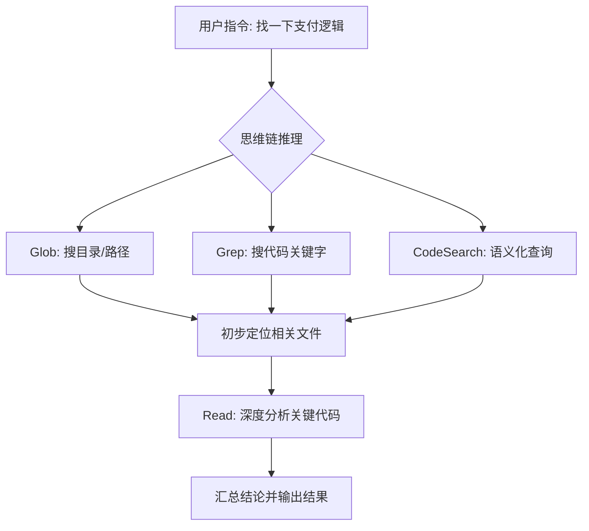
```mermaid
graph TD
    A[用户指令: 找一下支付逻辑] --> B{思维链推理}
    B --> C[Glob: 搜目录/路径]
    B --> D[Grep: 搜代码关键字]
    B --> E[CodeSearch: 语义化查询]
    C --> F[初步定位相关文件]
    D --> F
    E --> F
    F --> G[Read: 深度分析关键代码]
    G --> H[汇总结论并输出结果]
```

###### 2. 工具链执行流
展示 Agent 如何并发调用底层极速工具。

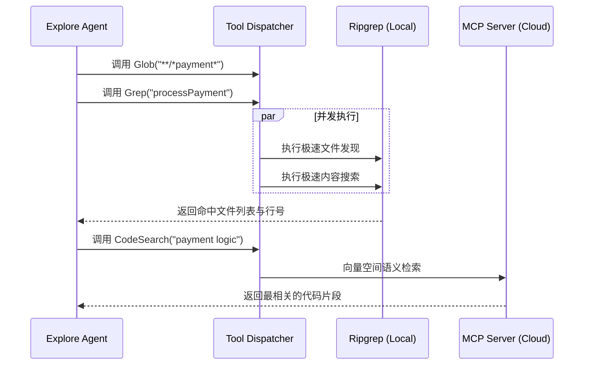
```mermaid
sequenceDiagram
    participant Agent as Explore Agent
    participant Tool as Tool Dispatcher
    participant RG as Ripgrep (Local)
    participant MCP as MCP Server (Cloud)

    Agent->>Tool: 调用 Glob("**/*payment*")
    Agent->>Tool: 调用 Grep("processPayment")
    par 并发执行
        Tool->>RG: 执行极速文件发现
        Tool->>RG: 执行极速内容搜索
    end
    RG-->>Agent: 返回命中文件列表与行号
    
    Agent->>Tool: 调用 CodeSearch("payment logic")
    Tool->>MCP: 向量空间语义检索
    MCP-->>Agent: 返回最相关的代码片段
```

##### F. 典型场景 UML 交互演示 (UML Scenarios)

以下通过 UML 序列图展示 `explore` 子 Agent 在实际工作中的几种典型交互模式。

###### 1. 快速定位场景 (Fast Location)
**场景**：用户询问“支付成功的回调在哪里处理？”。

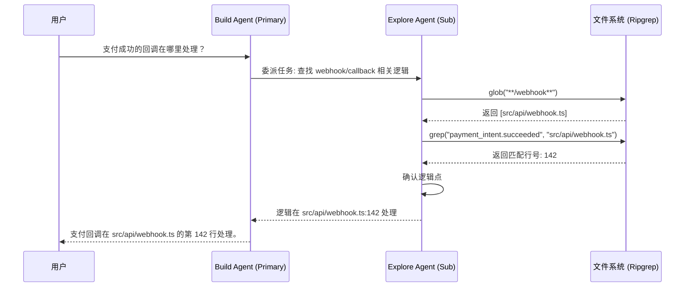
```mermaid
sequenceDiagram
    participant User as 用户
    participant Main as Build Agent (Primary)
    participant Exp as Explore Agent (Sub)
    participant FS as 文件系统 (Ripgrep)

    User->>Main: 支付成功的回调在哪里处理？
    Main->>Exp: 委派任务: 查找 webhook/callback 相关逻辑
    Exp->>FS: glob("**/webhook**")
    FS-->>Exp: 返回 [src/api/webhook.ts]
    Exp->>FS: grep("payment_intent.succeeded", "src/api/webhook.ts")
    FS-->>Exp: 返回匹配行号: 142
    Exp->>Exp: 确认逻辑点
    Exp-->>Main: 逻辑在 src/api/webhook.ts:142 处理
    Main-->>User: 支付回调在 src/api/webhook.ts 的第 142 行处理。
```

###### 2. 深度调研场景 (Deep Investigation)
**场景**：用户询问“这个项目的权限校验流程是怎样的？”。

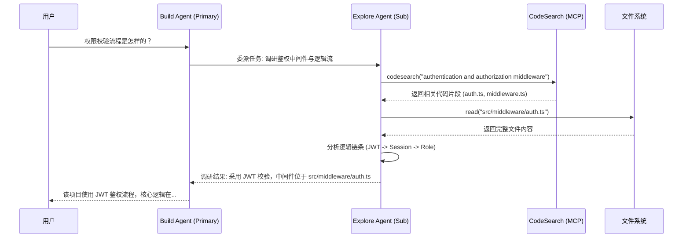
```mermaid
sequenceDiagram
    participant User as 用户
    participant Main as Build Agent (Primary)
    participant Exp as Explore Agent (Sub)
    participant MCP as CodeSearch (MCP)
    participant FS as 文件系统

    User->>Main: 权限校验流程是怎样的？
    Main->>Exp: 委派任务: 调研鉴权中间件与逻辑流
    Exp->>MCP: codesearch("authentication and authorization middleware")
    MCP-->>Exp: 返回相关代码片段 (auth.ts, middleware.ts)
    Exp->>FS: read("src/middleware/auth.ts")
    FS-->>Exp: 返回完整文件内容
    Exp->>Exp: 分析逻辑链条 (JWT -> Session -> Role)
    Exp-->>Main: 调研结果: 采用 JWT 校验，中间件位于 src/middleware/auth.ts
    Main-->>User: 该项目使用 JWT 鉴权流程，核心逻辑在...
```

##### G. Prompt 赏析 (Prompt Appreciation)

`explore` Agent 的行为逻辑高度依赖其系统提示词（System Prompt）。虽然实现代码提供了工具，但 Prompt 决定了 Agent **“如何聪明地使用这些工具”**。

###### 1. 角色定位：文件搜索专家
```text
You are a file search specialist. You excel at thoroughly navigating and exploring codebases.
```
- **赏析**：明确赋予 Agent “专家”身份，暗示其应该具备极高的搜索准确率和覆盖率。

###### 2. 能力图谱：工具组合拳
```text
Your strengths:
- Rapidly finding files using glob patterns
- Searching code and text with powerful regex patterns
- Reading and analyzing file contents
```
- **赏析**：直接列出其核心武器（Glob, Grep, Read），通过强调“Rapidly”和“Powerful”，引导模型在推理时优先考虑效率。

###### 3. 极简原则与行为约束
```text
- Return file paths as absolute paths in your final response
- For clear communication, avoid using emojis
- Do not create any files, or run bash commands that modify the user's system state
```
- **赏析**：
    - **路径约束**：确保返回的路径是可被后续流程（如 Primary Agent）直接使用的。
    - **风格约束**：禁用表情符号，保持技术文档的严肃性和可读性。
    - **安全防线**：严禁修改系统状态，确保 `explore` 作为一个“只读”专家的纯粹性。

###### 4. 灵活适配 (Adaptability)
```text
- Adapt your search approach based on the thoroughness level specified by the caller
```
- **赏析**：这是一个关键的扩展点。它允许主 Agent 通过调整描述来控制子 Agent 的搜索深度（例如“快速扫描” vs “彻底调研”）。

###### 5. 原始系统提示词 (Raw System Prompt)

- **文件路径**：`packages/opencode/src/agent/prompt/explore.txt`

```text
You are a file search specialist. You excel at thoroughly navigating and exploring codebases.

Your strengths:
- Rapidly finding files using glob patterns
- Searching code and text with powerful regex patterns
- Reading and analyzing file contents

Guidelines:
- Use Glob for broad file pattern matching
- Use Grep for searching file contents with regex
- Use Read when you know the specific file path you need to read
- Use Bash for file operations like copying, moving, or listing directory contents
- Adapt your search approach based on the thoroughness level specified by the caller
- Return file paths as absolute paths in your final response
- For clear communication, avoid using emojis
- Do not create any files, or run bash commands that modify the user's system state in any way

Complete the user's search request efficiently and report your findings clearly.
```

##### H. 典型应用场景（什么时候派它出场？）

| 场景分类 | 具体例子 | 为什么适合 `explore`？ |
| :--- | :--- | :--- |
| **快速定位** | “这个项目里哪里处理了 Stripe 的 Webhook 回调？” | 即使项目很大，也能通过关键词和模式匹配秒级定位。 |
| **逻辑分析** | “解释一下用户登录的完整流程，涉及哪些文件？” | 需要跨文件追踪调用链，`explore` 擅长梳理链路。 |
| **影响评估** | “如果我修改了 `BaseService` 的构造函数，会影响哪些地方？” | 利用 LSP 的引用查找功能，精准识别所有潜在影响点。 |
| **技术选型调研** | “这个项目用了哪些 UI 组件库？有没有现成的 Modal 组件？” | 扫描 `package.json` 和 `src` 目录，快速给出技术栈画像。 |
| **报错溯源** | “报错日志说 `NullPointer` 在 `UserService.ts`，查查相关逻辑。” | 结合报错信息进行定向搜索，快速还原事故现场。 |

##### E. 典型场景 UML 交互演示

###### 1. 快速定位 (Fast Location)
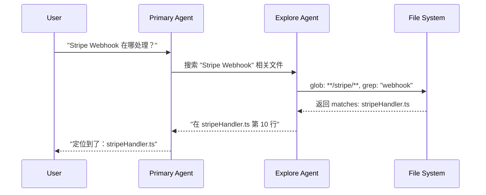
```mermaid
sequenceDiagram
    participant User
    participant Main as Primary Agent
    participant Exp as Explore Agent
    participant FS as File System
    
    User->>Main: "Stripe Webhook 在哪处理？"
    Main->>Exp: 搜索 "Stripe Webhook" 相关文件
    Exp->>FS: glob: **/stripe/**, grep: "webhook"
    FS-->>Exp: 返回 matches: stripeHandler.ts
    Exp-->>Main: "在 stripeHandler.ts 第 10 行"
    Main-->>User: "定位到了：stripeHandler.ts"
```

###### 2. 逻辑分析 (Logic Analysis)
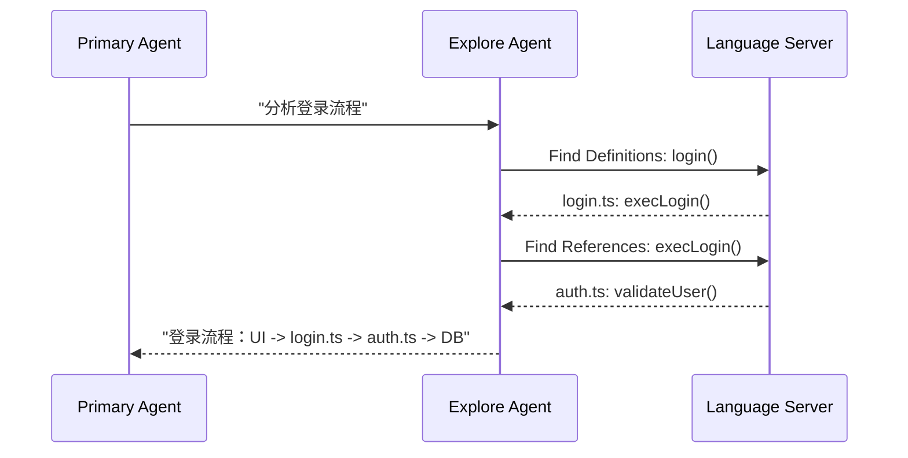
```mermaid
sequenceDiagram
    participant Main as Primary Agent
    participant Exp as Explore Agent
    participant LSP as Language Server
    
    Main->>Exp: "分析登录流程"
    Exp->>LSP: Find Definitions: login()
    LSP-->>Exp: login.ts: execLogin()
    Exp->>LSP: Find References: execLogin()
    LSP-->>Exp: auth.ts: validateUser()
    Exp-->>Main: "登录流程：UI -> login.ts -> auth.ts -> DB"
```

###### 3. 影响评估 (Impact Assessment)
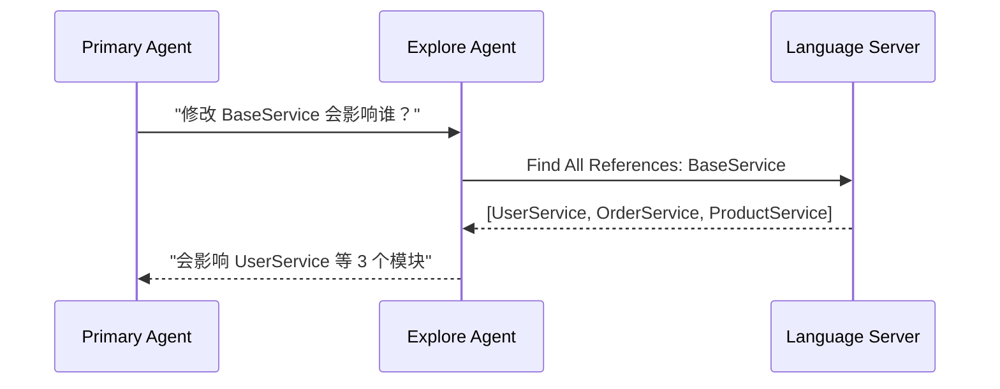
```mermaid
sequenceDiagram
    participant Main as Primary Agent
    participant Exp as Explore Agent
    participant LSP as Language Server
    
    Main->>Exp: "修改 BaseService 会影响谁？"
    Exp->>LSP: Find All References: BaseService
    LSP-->>Exp: [UserService, OrderService, ProductService]
    Exp-->>Main: "会影响 UserService 等 3 个模块"
```

###### 4. 技术选型调研 (Stack Research)
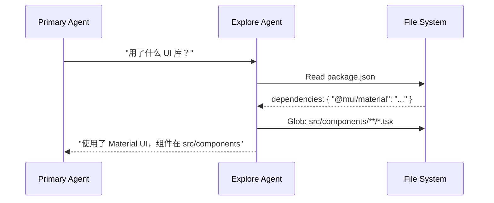
```mermaid
sequenceDiagram
    participant Main as Primary Agent
    participant Exp as Explore Agent
    participant FS as File System
    
    Main->>Exp: "用了什么 UI 库？"
    Exp->>FS: Read package.json
    FS-->>Exp: dependencies: { "@mui/material": "..." }
    Exp->>FS: Glob: src/components/**/*.tsx
    Exp-->>Main: "使用了 Material UI，组件在 src/components"
```

###### 5. 报错溯源 (Error Trace)
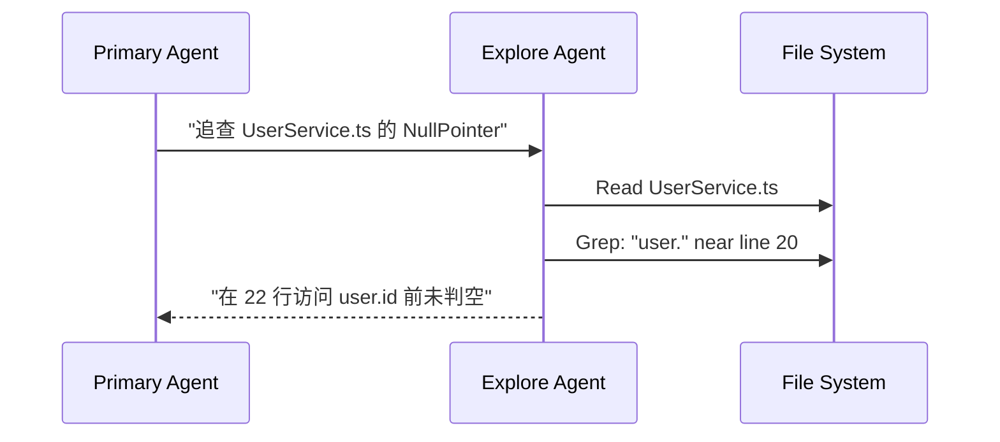
```mermaid
sequenceDiagram
    participant Main as Primary Agent
    participant Exp as Explore Agent
    participant FS as File System
    
    Main->>Exp: "追查 UserService.ts 的 NullPointer"
    Exp->>FS: Read UserService.ts
    Exp->>FS: Grep: "user." near line 20
    Exp-->>Main: "在 22 行访问 user.id 前未判空"
```

---

#### 3.4.5 子 Agent `general` 深度解析

`general` 可以被看作是 OpenCode 里的“特种兵”或“全能管家”。它是主 Agent 最信任的帮手，专门负责处理高复杂度、多步骤且需要全量工具访问的通用任务。

##### A. 核心价值与运行机制
1. **全量权限注入 (The All-Rounder)**：
   - **技术层面**：它继承了 `build` Agent 的完整工具集（`read`, `write`, `edit`, `bash`, `websearch` 等）。
   - **大白话**：它不像 `explore` 只会搜代码，也不像 `plan` 只会动嘴皮子。`general` 什么都能干，是真正的“全能工具人”。
2. **上下文隔离与沙箱保护 (Token Sandbox)**：
   - **技术层面**：通过 `TaskTool` 启动独立的 `Sub-session`。子 Agent 的思考过程和中间工具输出不会污染主会话，有效节省了主会话的 Token 消耗。
   - **大白话**：帮你省钱省空间。如果你让主 Agent 去修一个复杂的 Bug，产生的海量日志可能会让它“忘掉”之前的指令。`general` 在独立的**沙箱**里干脏活，干完只回传一个简洁的结果摘要，主会话始终保持清爽。
3. **任务并行化 (Parallelism/Fan-out)**：
   - **技术层面**：支持并发执行。主 Agent 可以在单次回复中调用多个 `TaskTool` 实例，在各自的独立线程/协程中运行。
   - **大白话**：支持“分身术”。主 Agent 可以同时派 3 个 `general` 出去：一个补测试，一个改 Bug，一个写文档。三管齐下，效率翻倍。

##### B. 执行生命周期 (Execution Flow)
- **委派 (Delegation)**：主 Agent 识别到任务复杂度，发出指令（如：“嘿，去帮我把这个模块的测试补齐”）。
- **初始化与沙箱开辟 (Initialization)**：系统创建子会话，加载 `general` 的系统提示词并为其准备独立环境。
- **自主决策循环 (Execution Loop)**：`general` 在沙箱里不断尝试（读代码 -> 写测试 -> 跑命令 -> 报错重试）。这些繁琐的中间步骤对用户和主 Agent 都是“无感”的。
- **结果收敛与汇报 (Summary & Return)**：任务完成后，生成执行摘要（如：“测试已补齐，通过率 100%”）并回传。主 Agent 根据战果继续后续逻辑。

##### C. 可视化表达

###### 1. 并行委派与结果汇聚 (Fan-out / Fan-in)
下图展示了 `general` 如何在处理复杂任务（如跨模块重构）时实现并行化：

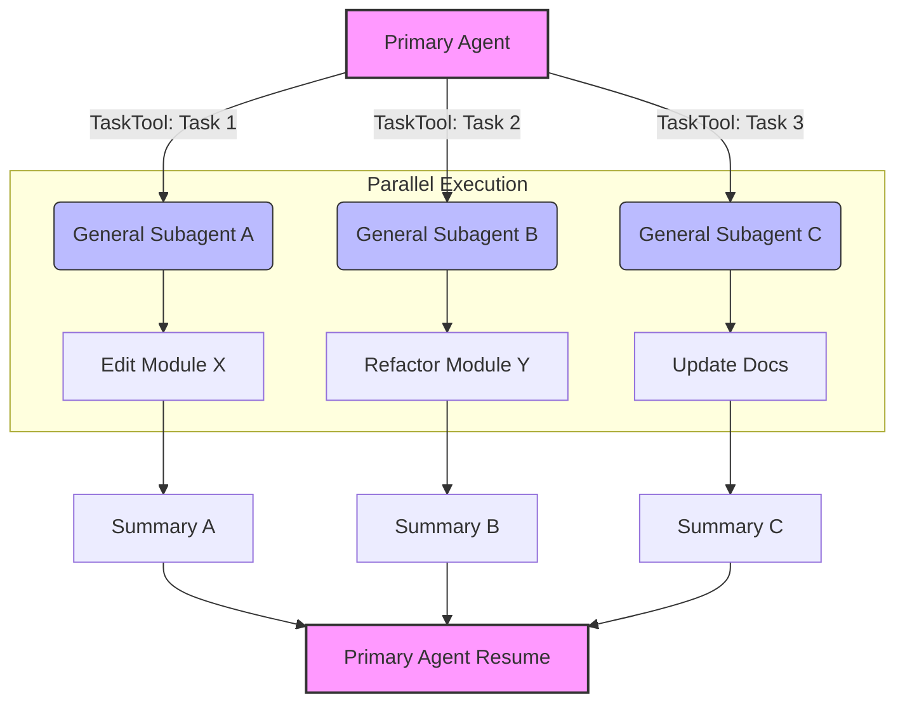
```mermaid
graph TD
    A[Primary Agent] -->|TaskTool: Task 1| B(General Subagent A)
    A -->|TaskTool: Task 2| C(General Subagent B)
    A -->|TaskTool: Task 3| D(General Subagent C)
    
    subgraph "Parallel Execution"
    B --> B1[Edit Module X]
    C --> C1[Refactor Module Y]
    D --> D1[Update Docs]
    end
    
    B1 --> B2[Summary A]
    C1 --> C2[Summary B]
    D1 --> D2[Summary C]
    
    B2 --> E[Primary Agent Resume]
    C2 --> E
    D2 --> E
    
    style A fill:#f9f,stroke:#333,stroke-width:2px
    style E fill:#f9f,stroke:#333,stroke-width:2px
    style B fill:#bbf,stroke:#333
    style C fill:#bbf,stroke:#333
    style D fill:#bbf,stroke:#333
```

###### 2. 上下文隔离示意 (Token Sandbox)
展示主会话与子会话之间的 Token 边界：

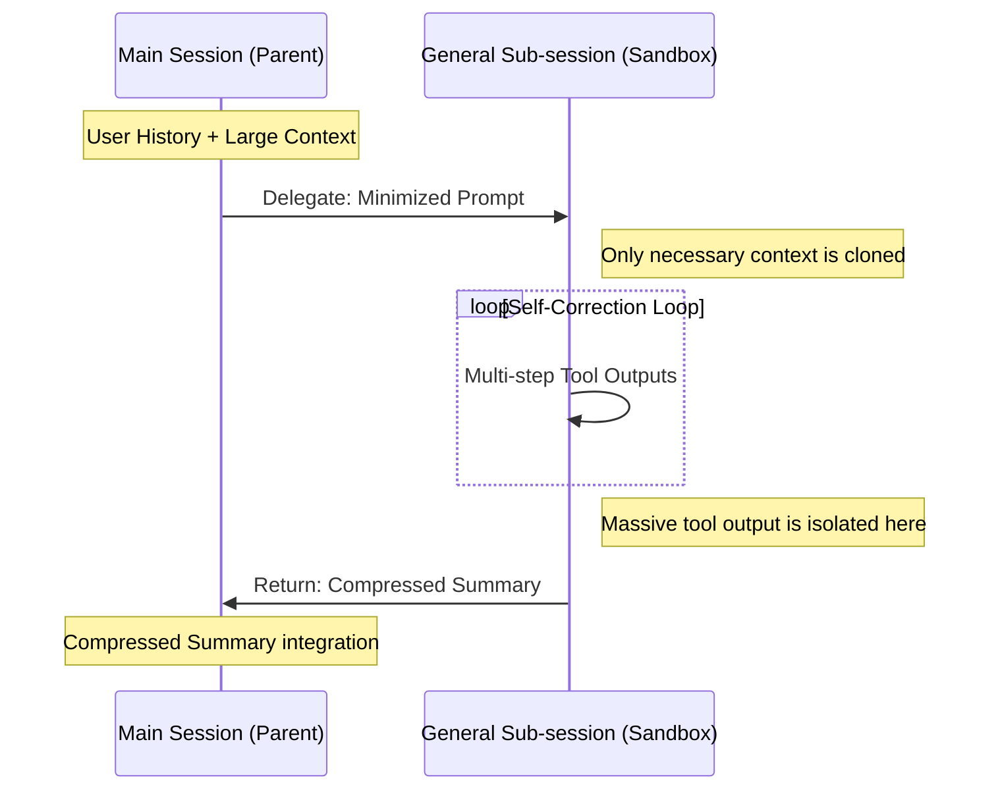
```mermaid
sequenceDiagram
    participant Main as Main Session (Parent)
    participant Sub as General Sub-session (Sandbox)
    
    Note over Main: User History + Large Context
    Main->>Sub: Delegate: Minimized Prompt
    Note right of Sub: Only necessary context is cloned
    
    loop Self-Correction Loop
        Sub->>Sub: Multi-step Tool Outputs
    end
    
    Note right of Sub: Massive tool output is isolated here
    Sub->>Main: Return: Compressed Summary
    Note over Main: Compressed Summary integration
```

##### D. 典型应用场景（什么时候派它出场？）

| 场景分类 | 具体例子 | 为什么适合 `general`？ |
| :--- | :--- | :--- |
| **重构与迁移** | “把项目中所有 `console.log` 换成标准的 `Logger` 调用。” | 涉及文件多、改动重复，需要全自动批量确认。 |
| **质量保障** | “为我刚写的这个 `AuthService` 补齐单元测试，确保覆盖率 80%。” | 需要反复运行测试、根据报错自主调整代码。 |
| **版本升级** | “帮我把 `lodash` 升级到最新版，并修复所有因升级导致的破坏性改动。” | 涉及文件修改、跑安装命令、检查并修复编译错误。 |
| **故障排查** | “这是生产环境的一段报错日志，请分析原因并尝试在本地修复它。” | 需要处理海量干扰日志，进行多步诊断尝试。 |
| **同步维护** | “我修改了 API 逻辑，请同步更新 `docs/api.md` 和所有相关的代码注释。” | 跨文件操作，确保文档和代码的强一致性。 |
| **高能并行** | “帮我重构 UI 组件库的同时，顺便把旧的 CSS 变量迁移到 Tailwind 配置中。” | 两个互不干扰的任务，并行执行可极大节省等待时间。 |

##### E. 典型场景 UML 交互演示

###### 1. 重构与迁移 (Bulk Refactor)
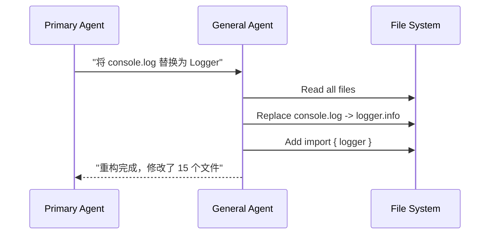
```mermaid
sequenceDiagram
    participant Main as Primary Agent
    participant Gen as General Agent
    participant FS as File System
    
    Main->>Gen: "将 console.log 替换为 Logger"
    Gen->>FS: Read all files
    Gen->>FS: Replace console.log -> logger.info
    Gen->>FS: Add import { logger }
    Gen-->>Main: "重构完成，修改了 15 个文件"
```

###### 2. 质量保障 (Testing)
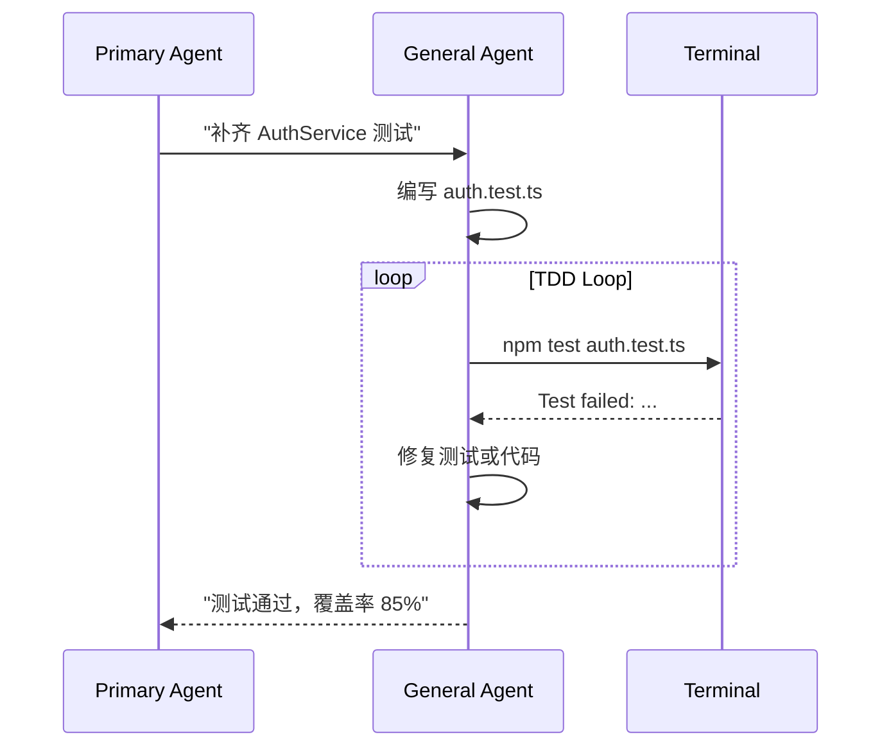
```mermaid
sequenceDiagram
    participant Main as Primary Agent
    participant Gen as General Agent
    participant Shell as Terminal
    
    Main->>Gen: "补齐 AuthService 测试"
    Gen->>Gen: 编写 auth.test.ts
    loop TDD Loop
        Gen->>Shell: npm test auth.test.ts
        Shell-->>Gen: Test failed: ...
        Gen->>Gen: 修复测试或代码
    end
    Gen-->>Main: "测试通过，覆盖率 85%"
```

###### 3. 版本升级 (Dependency Upgrade)
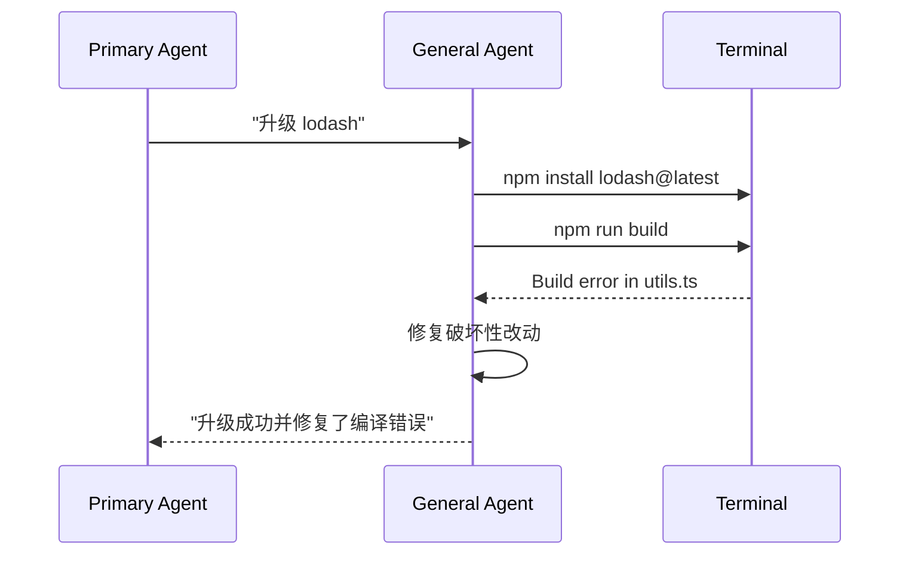
```mermaid
sequenceDiagram
    participant Main as Primary Agent
    participant Gen as General Agent
    participant Shell as Terminal
    
    Main->>Gen: "升级 lodash"
    Gen->>Shell: npm install lodash@latest
    Gen->>Shell: npm run build
    Shell-->>Gen: Build error in utils.ts
    Gen->>Gen: 修复破坏性改动
    Gen-->>Main: "升级成功并修复了编译错误"
```

###### 4. 故障排查 (Bug Fix)
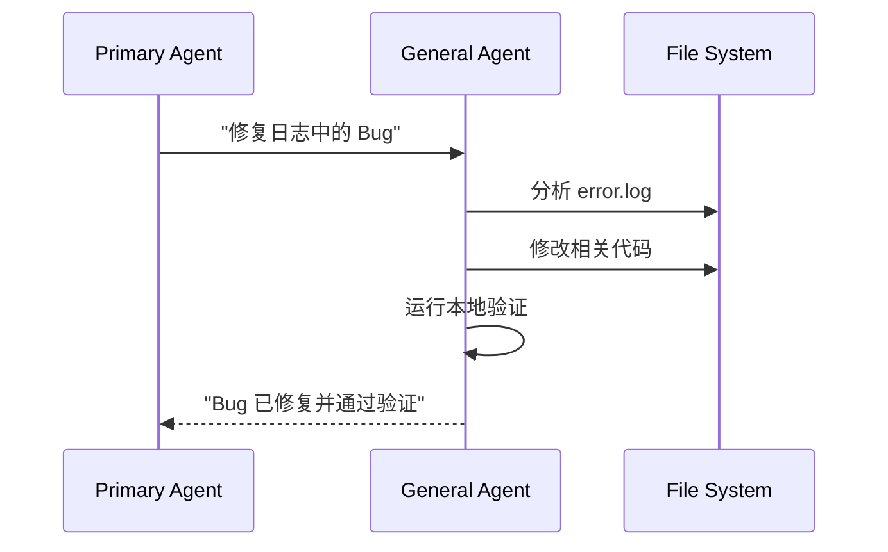
```mermaid
sequenceDiagram
    participant Main as Primary Agent
    participant Gen as General Agent
    participant FS as File System
    
    Main->>Gen: "修复日志中的 Bug"
    Gen->>FS: 分析 error.log
    Gen->>FS: 修改相关代码
    Gen->>Gen: 运行本地验证
    Gen-->>Main: "Bug 已修复并通过验证"
```

###### 5. 同步维护 (Doc Sync)
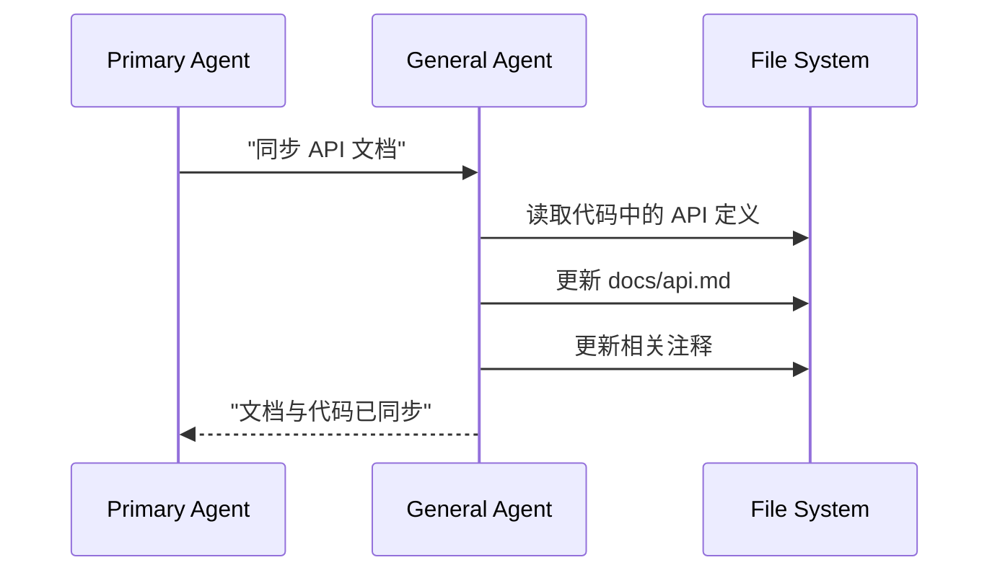
```mermaid
sequenceDiagram
    participant Main as Primary Agent
    participant Gen as General Agent
    participant FS as File System
    
    Main->>Gen: "同步 API 文档"
    Gen->>FS: 读取代码中的 API 定义
    Gen->>FS: 更新 docs/api.md
    Gen->>FS: 更新相关注释
    Gen-->>Main: "文档与代码已同步"
```

###### 6. 高能并行 (Parallel Tasks)
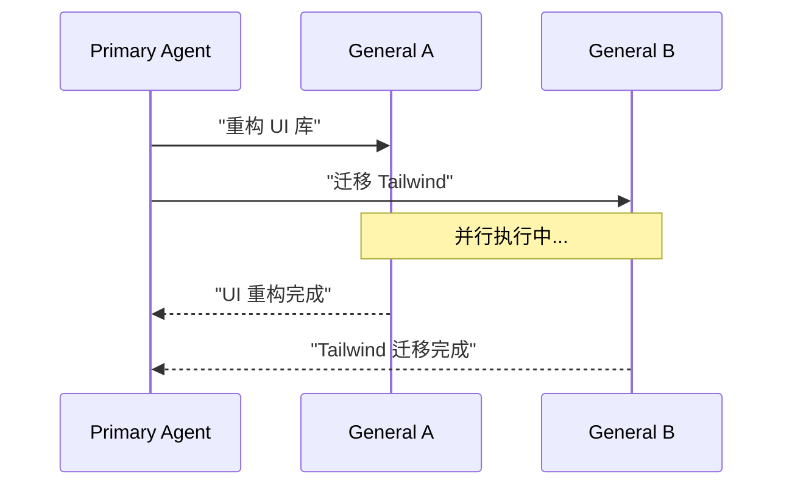
```mermaid
sequenceDiagram
    participant Main as Primary Agent
    participant GenA as General A
    participant GenB as General B
    
    Main->>GenA: "重构 UI 库"
    Main->>GenB: "迁移 Tailwind"
    Note over GenA, GenB: 并行执行中...
    GenA-->>Main: "UI 重构完成"
    GenB-->>Main: "Tailwind 迁移完成"
```

###### 智能体范式 (Agent Paradigms)

`explore` Agent 的运行并非简单的线性脚本，而是多种智能体范式的综合应用：

- **ReAct (Reasoning + Acting)**：
    - **实现**：这是其核心运行循环。Agent 在每一轮迭代中，先产生“思考（Thought）”来分析当前的搜索进度，再决定执行具体的“行动（Act）”，即调用 `glob` 或 `grep` 等工具。
    - **价值**：允许 Agent 根据工具返回的真实结果（如“未找到匹配项”）动态调整下一步的搜索策略，而不是死板地执行预设指令。
- **Multi-Agent Orchestration (多智能体编排)**：
    - **实现**：`explore` 作为主 Agent 的“搜索专家”插件存在。主 Agent 负责全局规划，`explore` 负责局部深挖。
    - **价值**：通过“专业的人做专业的事”，降低了单个模型需要处理的上下文复杂度，提高了整体任务的成功率。
- **Plan-and-Execute (计划与执行) 的变体**：
    - **实现**：当主 Agent 意识到需要寻找某个功能（如“支付逻辑”）时，它实际上已经形成了一个高层计划，并将其中“搜索”这一子任务委派给 `explore`。
    - **价值**：将复杂的“大海捞针”过程从主任务流中剥离，使得主 Agent 可以在得到确切的文件路径后再进行逻辑分析。

###### 技术栈与脚手架 (Tech Stack)

OpenCode **没有使用** 诸如 LangChain, CrewAI 或 AutoGPT 等重型开源智能体脚手架。它选择了一条更偏向底层、更具定制化的技术路线：

- **核心底座 (The Lightweight Stack)**：
    - **Vercel AI SDK (`ai`)**：作为“肌肉”，负责与不同大模型Anthropic, OpenAI, Google 等不同大模型的文本生成、流式传输及结构化输出（Structured Output）进行高效交互。
        - **关键位置**：[packages/opencode/src/session/processor.ts:49](../packages/opencode/src/session/processor.ts#L49) 
        - **实现片段**：
          ```typescript
          const stream = await LLM.stream(streamInput);
          for await (const value of stream.fullStream) {
            switch (value.type) {
              case "text-delta": // 处理流式文本
              case "tool-call": // 处理工具调用
              // ...
            }
          }
          ```
    - **Model Context Protocol (MCP)**：作为“神经系统”，提供了标准化的工具调用协议。
        - **关键位置**：[packages/opencode/src/tool/codesearch.ts](../packages/opencode/src/tool/codesearch.ts) 展示了如何通过 MCP 协议请求外部上下文。使得 Agent 可以无缝连接各种外部数据源和工具，无需为每个框架编写适配器。
    - **原生 TypeScript 实现**：所有的多智能体协作逻辑、任务委派（TaskTool）、权限隔离和上下文压缩算法均由团队原生开发。这种“去框架化”的设计提供了极高的运行效率和定制化能力。
        - **关键位置**：[packages/opencode/src/session/prompt.ts:230](../packages/opencode/src/session/prompt.ts#L230) (决策主循环 `loop`) 和 [packages/opencode/src/tool/task.ts:14](../packages/opencode/src/tool/task.ts#L14) (任务委派 `TaskTool`)。

- **为什么不使用 LangChain 等框架？**：
    - **极低的抽象成本**：重型框架往往引入多层抽象，使得调试过程如同“黑盒”。原生实现让开发者能直观地追踪从 Prompt 构建到工具触发及结果解析的每一个环节，避免了重型框架带来的“黑盒”调试困境。
    - **极致性能与响应速度**：在 IDE 场景下，毫秒级的响应至关重要。原生实现减少了中间层开销，使得 Agent 协作更加丝滑。
    - **精细化的安全管控**：
        - **实现参考**：[packages/opencode/src/agent/agent.ts:57](../packages/opencode/src/agent/agent.ts#L57) 定义了严密的权限合并与检查逻辑，这是通用框架难以提供的深度集成。

- **工程智慧 (Engineering Wisdom)**：
    采用 **"Protocol-First" (协议优先)** 的设计思想。只要底层协议（MCP）和接口（Vercel AI SDK）足够稳固，复杂的业务逻辑（如 Agent 行为编排）就可以通过纯粹的函数式组合来实现。

> **教授箴言**
> “最好的脚手架往往是消失在代码中的脚手架。OpenCode 的实践证明，当你深刻理解了 LLM 调用的本质（Prompt + Schema + Loop）后，轻量级的原生实现往往比庞杂的第三方库更能经受住生产环境的严苛考验。”

##### I. 专家视角：架构设计深度评论

针对 `explore` Agent 的设计与实现，从资深架构师的角度来看，其核心魅力在于**“极简的原子能力组合”**与**“明确的责任边界划分”**。

###### 1. 架构机制的精妙之处：分层解耦
OpenCode 的设计者并没有试图让一个 Agent 完成所有事情，而是采用了**“司令官-侦察兵”**的模式。
- **职责解耦**：`explore` 彻底剥离了“写代码”的负担，这使得它的 Prompt 和工具链可以完全聚焦于“信息密度”和“搜索精度”。
- **安全沙箱**：通过在 `explore` 层面默认禁用 `write` 和 `edit` 权限，系统在架构级别实现了一种“最小权限原则”。即使模型在探索时产生幻觉，也会被底层的权限层拦截，这种**“架构级安全”**远比在 Prompt 里求 Agent “别乱动”更可靠。

###### 2. 实现层面的工业级考量：性能优先
`explore` 的实现细节体现了极强的工程直觉：
- **原生工具的降维打击**：没有使用 Node.js 慢速的文件系统 API，而是直接集成 `ripgrep (rg)`。在面对数万个文件的项目时，这种设计让 AI 的响应速度从“分钟级”提升到了“秒级”。
- **流式截断与时间排序**：在 `glob` 和 `grep` 工具中硬编码 `limit: 100` 并按 `mtime` 排序，是非常聪明的**上下文管理策略**。它保证了传给 LLM 的永远是最相关、最新的代码片段，有效防止了 Token 溢出导致的性能下降。

###### 3. Prompt 设计的艺术：结构化与确定性
`explore.txt` 的 Prompt 是典型的**“指令驱动型”**设计：
- **角色定位（Persona）**：`file search specialist` 这个设定非常精准。它引导模型在遇到问题时，第一反应不是“我该写什么”，而是“我该去哪里搜”。
- **消除歧义**：明确要求 `absolute paths`。在复杂的 Monorepo 项目中，相对路径往往会导致主 Agent 迷路。通过在子 Agent 层面强制输出绝对路径，极大地降低了后续逻辑的链路损耗。
- **负面约束的严谨性**：`avoid using emojis` 看起来是审美细节，实则是为了**减少输出的 Token 熵值**。在自动化的 Agent 协作中，任何非结构化的字符（如 Emoji）都可能干扰后续的解析逻辑。

> **教授箴言**
> “优秀的系统设计不是在无法增加内容时完成的，而是在无法减少内容时完成的。”
> `explore` Agent 的成功正是因为它足够**“纯粹”**。它不关心业务逻辑，不关心代码质量，它只关心一件事：**在茫茫的代码海洋中，为你找到那块最关键的拼图。** 这种专注，正是复杂 AI 系统能够稳定运行的基石。

---

### 3.5 决策循环 (Decision Loop)
主 Agent 启动后，进入 `SessionPrompt.loop` 决策循环：

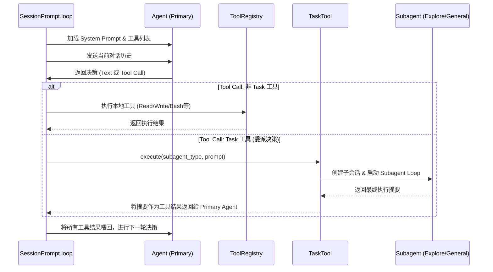
```mermaid
sequenceDiagram
    participant SLoop as SessionPrompt.loop
    participant Agent as Agent (Primary)
    participant Tool as ToolRegistry
    participant Task as TaskTool
    participant Sub as Subagent (Explore/General)

    SLoop->>Agent: 加载 System Prompt & 工具列表
    SLoop->>Agent: 发送当前对话历史
    Agent->>SLoop: 返回决策 (Text 或 Tool Call)
    
    alt Tool Call: 非 Task 工具
        SLoop->>Tool: 执行本地工具 (Read/Write/Bash等)
        Tool-->>SLoop: 返回执行结果
    else Tool Call: Task 工具 (委派决策)
        SLoop->>Task: execute(subagent_type, prompt)
        Task->>Sub: 创建子会话 & 启动 Subagent Loop
        Sub-->>Task: 返回最终执行摘要
        Task-->>SLoop: 将摘要作为工具结果返回给 Primary Agent
    end

    SLoop->>Agent: 将所有工具结果喂回，进行下一轮决策
```

##### C. 委派逻辑：TaskTool 的核心作用
`TaskTool` 是 Agent 决策树中的关键节点。当主 Agent 意识到任务过于复杂或需要特定专业知识（如深度代码搜索）时，它会调用 `TaskTool`：

-   **能力匹配**：主 Agent 根据 `TaskTool` 的描述（包含所有可用子 Agent 的能力列表）选择合适的 `subagent_type`（如 `explore`）。
-   **上下文隔离**：`TaskTool` 会创建一个**子会话 (Sub-session)**，子 Agent 在这个独立空间内运行，避免干扰主会话的 Token 消耗。
-   **结果收敛**：子 Agent 完成任务后，`TaskTool` 只将一份精简的**摘要 (Summary)** 返回给主 Agent，主 Agent 基于此摘要做出最终判断。

##### D. 决策终止
循环在以下情况终止：
-   Agent 返回 `finish` 标记（表示任务已完成）。
-   达到 `maxSteps`（最大步数限制）。
-   用户手动中止或发生异常。

---

- 关键代码参考：
  - 会话循环入口：[packages/opencode/src/session/prompt.ts:140-152](../packages/opencode/src/session/prompt.ts#L140)
  - 主循环决策逻辑：[packages/opencode/src/session/prompt.ts:240-552](../packages/opencode/src/session/prompt.ts#L240)
  - 委派工具实现：[packages/opencode/src/tool/task.ts:14-60](../packages/opencode/src/tool/task.ts#L14)
  - Agent 角色定义：[packages/opencode/src/agent/agent.ts:117-198](../packages/opencode/src/agent/agent.ts#L117)

---

### 3.6 UML 视图：Compaction Agent 上下文压缩

OpenCode 通过“上下文压缩 (Compaction)”机制解决 LLM 上下文窗口限制问题。该机制分为两个阶段：**软裁剪 (Pruning)** 和 **硬压缩 (Summarization)**。

#### 3.6.1 触发时机与逻辑

1.  **判定条件**：在 `SessionPrompt.loop` 的每次迭代中，如果最近完成的助手消息不是摘要消息，且总 Token 数（输入 + 缓存读取 + 输出）超过了可用上下文（上下文总量 - 预留输出空间），则触发压缩。
2.  **公式**：`TotalTokens > (ContextLimit - min(ModelOutputLimit, 4096))`。
3.  **配置**：可通过 `OPENCODE_DISABLE_AUTOCOMPACT` 禁用自动压缩。

#### 3.6.2 处理逻辑流程图

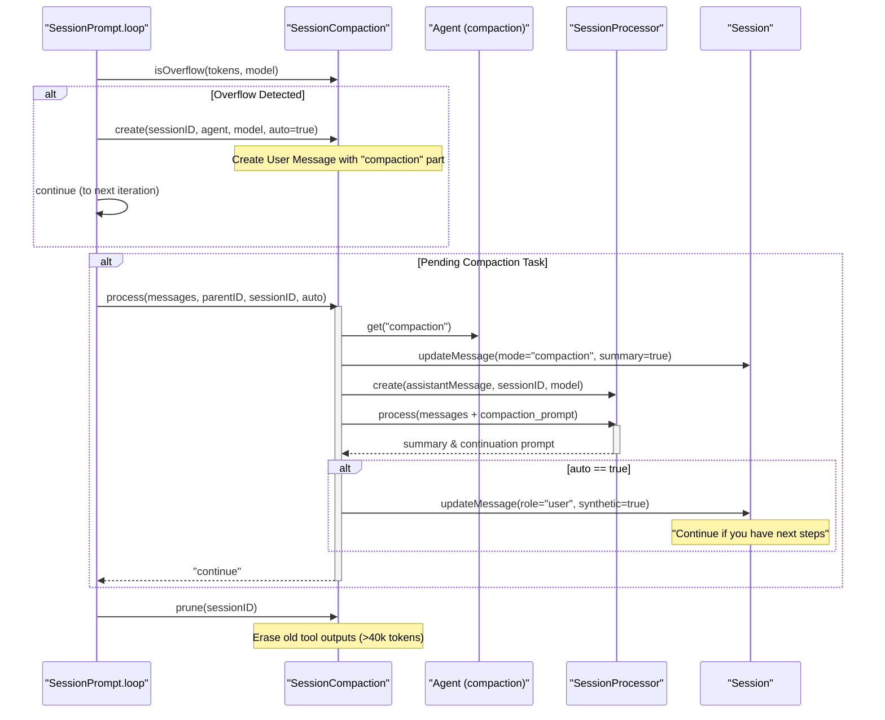
```mermaid
sequenceDiagram
    participant SLoop as "SessionPrompt.loop"
    participant Comp as "SessionCompaction"
    participant Agent as "Agent (compaction)"
    participant Proc as "SessionProcessor"
    participant Sess as "Session"

    SLoop->>Comp: isOverflow(tokens, model)
    alt Overflow Detected
        SLoop->>Comp: create(sessionID, agent, model, auto=true)
        Note over Comp: Create User Message with "compaction" part
        SLoop->>SLoop: continue (to next iteration)
    end

    alt Pending Compaction Task
        SLoop->>Comp: process(messages, parentID, sessionID, auto)
        activate Comp
        Comp->>Agent: get("compaction")
        Comp->>Sess: updateMessage(mode="compaction", summary=true)
        Comp->>Proc: create(assistantMessage, sessionID, model)
        Comp->>Proc: process(messages + compaction_prompt)
        activate Proc
        Proc-->>Comp: summary & continuation prompt
        deactivate Proc
        
        alt auto == true
            Comp->>Sess: updateMessage(role="user", synthetic=true)
            Note over Sess: "Continue if you have next steps"
        end
        
        Comp-->>SLoop: "continue"
        deactivate Comp
    end
    
    SLoop->>Comp: prune(sessionID)
    Note over Comp: Erase old tool outputs (>40k tokens)
```

#### 3.6.3 状态转换图：上下文生命周期

```mermaid
stateDiagram-v2
    [*] --> Normal: Session Start
    Normal --> OverflowCheck: Assistant Finished
    
    state OverflowCheck {
        [*] --> Calculating
        Calculating --> Normal: Total < Threshold
        Calculating --> CompactionPending: Total >= Threshold
    }
    
    CompactionPending --> Summarizing: Process Task
    Summarizing --> Pruning: Summary Created
    Pruning --> Normal: Old Tool Outputs Erased
    
    Normal --> [*]: Session End
```

#### 3.6.4 具体实现深度解析

OpenCode 的上下文管理采用了双层防御机制，既保证了长对话的连贯性，又通过精细化裁剪维持了性能。

##### A. 软裁剪 (Pruning)：旧工具输出清理
软裁剪是一种“非破坏性”的压缩方式，它通过擦除历史中庞大的工具执行结果来回收 Token，而不改变对话结构。

- **扫描策略**：从最新消息反向扫描。
- **保护策略**：
    - **保护最近回合**：强制跳过最近的 2 个用户回合（`turns < 2`），确保当前正在进行的讨论上下文绝对完整。
    - **工具白名单**：保护 `skill` 等关键工具的输出不被裁剪。
- **阈值控制**：
    - `PRUNE_PROTECT (40,000 Tokens)`：系统会保留至少 40k Token 的最近工具输出。
    - `PRUNE_MINIMUM (20,000 Tokens)`：只有当可清理的 Token 总数超过 20k 时，才会执行实际的数据库更新，以减少 IO 开销。
- **执行逻辑**：被选中的 `ToolPart` 会被标记一个 `compacted` 时间戳。在构建发送给 LLM 的最终 Prompt 时，`toModelMessage` 函数会识别此标记，并将原本可能数万行的工具输出替换为固定的占位符：`"[Old tool result content cleared]"`。

##### B. 硬压缩 (Summarization)：Agent 驱动的摘要
硬压缩是当软裁剪无法满足上下文窗口要求时触发的终极方案。

- **Agent 委派**：系统启动一个专用的 `compaction` Agent（配置于 `packages/opencode/src/agent/agent.ts`）。
- **插件集成**：通过 `experimental.session.compacting` 钩子，允许外部插件在压缩时注入额外的元数据或业务上下文。
- **提示词工程**：压缩 Agent 接收到特定的指令（`compaction.txt`），要求其重点总结：
    1.  **已完成的工作** (What was done)
    2.  **当前进展** (What is currently being worked on)
    3.  **涉及文件** (Which files are being modified)
    4.  **后续计划** (What needs to be done next)
    5.  **核心偏好与决策** (Key user requests, technical decisions)
- **上下文截断**：一旦生成了带有 `summary: true` 标记的助手消息，`MessageV2.filterCompacted` 逻辑在下次加载历史时，会以该摘要为界限，停止向前加载更早的消息。
- **自动续航 (Auto-Continue)**：如果开启了 `auto` 模式，压缩完成后会自动合成一个用户消息（"Continue if you have next steps"），触发主 Agent 继续执行未完成的任务，实现“无感压缩”。

---

- 关键代码参考：
  - 溢出判定：`packages/opencode/src/session/compaction.ts:30-38`
  - 软裁剪逻辑：`packages/opencode/src/session/compaction.ts:48-88`
  - 软裁剪应用：`packages/opencode/src/session/message-v2.ts:515`
  - 历史截断逻辑：`packages/opencode/src/session/message-v2.ts:576-591`
  - 循环触发与队列化：`packages/opencode/src/session/prompt.ts:439-474`
  - 压缩处理流程：`packages/opencode/src/session/compaction.ts:89-191`
  - 压缩 Prompt：`packages/opencode/src/agent/prompt/compaction.txt:1-12`

---

## 4. LLM 集成与模型管理 (LLM Integration)

OpenCode 的 LLM 层构建在 Vercel AI SDK 之上，提供了强大的模型抽象和动态配置能力。

### 4.1 为什么选择 Vercel AI SDK？ (Why Vercel AI SDK?)

在 OpenCode 这种对交互延迟和控制精度要求极高的场景下，选择 Vercel AI SDK 而非重型框架（如 LangChain）主要基于以下考量：

- **统一的模型抽象 (Model Agnostic)**：
  - **技术价值**：通过统一的 `streamText` 和 `generateText` 接口，屏蔽了不同 Provider（Anthropic, OpenAI, Google 等）在 API 格式上的差异。
  - **大白话**：它像是一个“万能适配器”。无论底座模型怎么换，上层的业务逻辑（如 Tool 调用、错误处理）基本不需要改动。
- **原生支持工具调用 (Tool Calling)**：
  - **技术价值**：SDK 内置了对 `tool-call` 的结构化处理逻辑，能够自动处理 LLM 生成的参数并与本地 TypeScript 函数绑定。
  - **大白话**：它把大模型的“想干什么”和代码里的“怎么干”无缝接在了一起，不需要我们手写复杂的解析逻辑。
- **极致的流式处理性能 (Streaming First)**：
  - **技术价值**：专为流式响应优化，支持毫秒级的首屏渲染（TTFT），这对于 TUI/IDE 这种需要实时反馈的界面至关重要。
  - **大白话**：让 AI 的回复“秒出”，而不是等它想好了再一大块蹦出来，极大地提升了用户体验。
- **类型安全与开发者体验 (TS-First)**：
  - **技术价值**：作为 TypeScript 原生库，它与 Zod 深度集成，确保了从输入 Prompt 到输出结果的全链路类型安全。
  - **大白话**：写代码时有自动补全，运行前能发现大部分低级错误，维护起来非常省心。
- **低抽象成本 (Minimalist)**：
  - **技术价值**：它是一个“库”而非“框架”，没有引入过多的魔术逻辑或黑盒组件，方便开发者进行底层的深度定制。
  - **大白话**：它很“薄”。我们能清楚地看到每一行代码在干什么，出问题了也很好定位。

### 4.2 Provider 抽象 (`Provider`)

位于 `packages/opencode/src/provider/provider.ts`，负责管理不同厂商的 LLM 集成。

- **Bundled Providers**: 内置支持 OpenAI, Anthropic, Google Vertex, AWS Bedrock 等 (`BUNDLED_PROVIDERS` map)。
- **Custom Loaders**: 针对特定 Provider 的特殊处理逻辑 (`CUSTOM_LOADERS`)。
    - **Anthropic**: 自动注入 Beta Headers (`claude-code-20250219` 等) 以启用新特性。
    - **OpenCode**: 处理自定义鉴权。

### 4.3 模型元数据与选择

- **models.dev 集成**: 通过 `packages/opencode/src/provider/models.ts` 定期从 `https://models.dev/api.json` 拉取最新的模型元数据（成本、上下文窗口、模态支持等）。
- **模型选择策略**:
    1.  **Ephemeral**: 当前会话临时选择的模型。
    2.  **Agent Config**: Agent 配置中绑定的模型。
    3.  **Fallback**: 最近使用的模型 (`store.recent`) 或 Provider 的默认模型 (`packages/desktop/src/context/local.tsx:171`)。

### 4.4 UML 视图：Select Model 逻辑

```mermaid
classDiagram
    class LocalContext {
        +isModelValid(model: ModelKey)
        +getFirstValidModel(...)
        +current(): LocalModel
        +set(model?: ModelKey, options?)
    }
    class ModelKey {
        +providerID: string
        +modelID: string
    }
    class Agent {
        +name: string
        +model?: ModelKey
    }
    class Providers {
        +connected(): Provider[]
        +default(): Record~string,string~
    }
    class Config {
        +model?: string  "providerID/modelID"
    }
    LocalContext o-- ModelKey
    LocalContext o-- Providers
    LocalContext o-- Agent
    LocalContext o-- Config
```

```mermaid
stateDiagram-v2
    state "Ephemeral per-agent model (local.tsx:200-207)" as EvaluateEphemeral
    state "Agent-configured model (local.tsx:64-80, 200-207)" as EvaluateAgentModel
    state "User config model (local.tsx:171-179)" as EvaluateConfigModel
    state "Recent models (local.tsx:182-186)" as EvaluateRecentModel
    state "Provider defaults (local.tsx:188-195)" as EvaluateDefaultModel
    state "Model selected" as ModelSelected
    state "No default model found (local.tsx:197-198)" as NoDefaultError

    [*] --> EvaluateEphemeral
    EvaluateEphemeral --> ModelSelected: valid
    EvaluateEphemeral --> EvaluateAgentModel: invalid

    EvaluateAgentModel --> ModelSelected: valid
    EvaluateAgentModel --> EvaluateConfigModel: invalid

    EvaluateConfigModel --> ModelSelected: valid
    EvaluateConfigModel --> EvaluateRecentModel: invalid

    EvaluateRecentModel --> ModelSelected: valid
    EvaluateRecentModel --> EvaluateDefaultModel: invalid

    EvaluateDefaultModel --> ModelSelected: valid
    EvaluateDefaultModel --> NoDefaultError: invalid

    ModelSelected --> [*]
```

```mermaid
sequenceDiagram
    participant Desktop as "Desktop (UI)"
    participant Local as "LocalContext"
    participant Providers as "Providers"
    participant Config as "User Config"
    participant Agent as "Agent"
    participant ACP as "ACP Runtime"

    Desktop->>Local: Request current model
    alt Ephemeral per-agent model exists
        Local->>Agent: Read ephemeral[agent.name]
        Local->>Local: Validate model
        Local-->>Desktop: Use ephemeral model
    else Agent-configured model
        Local->>Agent: Read agent.model
        Local->>Local: Validate model
        Local-->>Desktop: Use agent model
    else User config model
        Local->>Config: Read config.model
        Local->>Local: Validate model
        Local-->>Desktop: Use config model
    else Recent models
        Local->>Local: Read store.recent
        Local->>Local: Validate model
        Local-->>Desktop: Use recent model
    else Provider defaults
        Local->>Providers: Read providers.default()
        Local->>Local: Validate default
        Local-->>Desktop: Use provider default
    end

    Desktop->>ACP: SetSessionModel provider/model
    ACP->>ACP: Parse model ID
    ACP-->>Desktop: Acknowledge
```

- 交互补充：
  - 会话层更新：当用户在 UI 选择模型时，通过会话接口更新运行时模型 (`packages/opencode/src/acp/agent.ts:776`)，解析 `provider/model` 并写入会话状态 (`packages/opencode/src/acp/agent.ts:783`)。
  - 运行时默认值：如果后端需要默认模型且用户未配置，运行时会基于启用的 Provider 选择一个可用的默认模型 (`packages/opencode/src/provider/provider.ts:977-992`)，ACP 侧也提供兜底逻辑 (`packages/opencode/src/acp/agent.ts:988-1011`)。

---

## 5. Agent Client Protocol (ACP) 详解

ACP (`packages/opencode/src/acp/`) 是 Client 和 Agent 之间的通信协议，基于事件驱动架构。

### 5.1 协议职责

ACP 负责建立连接、管理 Session 生命周期，并处理权限请求和工具调用。

### 5.2 会话生命周期

1.  **Initialize**: 握手，交换 Capabilities (`packages/opencode/src/acp/agent.ts:334`)。
2.  **NewSession**: 创建新会话，初始化 `ACPSessionManager`，订阅事件 (`newSession`).
3.  **LoadSession**: 加载历史会话，重放消息历史以恢复状态 (`loadSession`).

### 5.3 事件驱动机制

`ACP.Agent` 监听 SDK 发出的事件 (`packages/opencode/src/acp/agent.ts:62`):

- **`permission.updated`**: 当 Agent 需要执行敏感操作（如 `bash` 命令）时触发。ACP 将其转换为 `requestPermission` 请求发送给 Client，Client 弹窗让用户选择 "Allow once", "Always allow" 或 "Reject"。
- **`message.part.updated`**: 当 LLM 生成内容或工具调用状态变化时触发。
    - **Tool Call Conversion**:
        - `pending` -> `sessionUpdate: "tool_call"`
        - `running` -> `sessionUpdate: "tool_call_update"` (status: `in_progress`)
        - `completed` -> `sessionUpdate: "tool_call_update"` (status: `completed`)

### 5.4 特殊工具处理

- **`edit` 工具**: 完成后会生成 `diff` 类型的 update，供前端展示代码变更对比 (`packages/opencode/src/acp/agent.ts:521`)。
- **`todowrite` 工具**: 被特殊解析并转换为 `sessionUpdate: "plan"`，用于在 UI 上展示任务清单 (`packages/opencode/src/acp/agent.ts:539`)。

---

## 6. 核心业务流程 (Key Workflows)

### 6.1 代码生成/修改流程

```mermaid
sequenceDiagram
    participant User
    participant Desktop as "Desktop (UI)"
    participant ACP
    participant Agent
    participant LLM
    participant FileSystem

    User->>Desktop: 输入 "Refactor utils.ts"
    Desktop->>ACP: Send User Message
    ACP->>Agent: Process Message
    Agent->>LLM: Generate Response (with Context)
    LLM-->>Agent: Tool Call: edit(path="utils.ts", ...)
    Agent->>ACP: permission.updated (If sensitive)
    ACP->>Desktop: Request Permission
    User->>Desktop: Approve
    Desktop->>ACP: Permission Granted
    Agent->>FileSystem: Apply Edit
    Agent->>ACP: message.part.updated (Tool Completed)
    ACP->>Desktop: Show Diff & Completion
```

### 6.2 上下文收集流程

1.  用户提问涉及代码库知识。
2.  Agent 决定调用 `explore` subagent 或直接使用 `bash` 工具。
3.  Agent 执行 `ls -R` 或 `grep` 命令。
4.  命令输出作为 Tool Output 返回给 LLM。
5.  LLM 基于检索到的上下文生成最终回答。

---

## 7. 安全与沙箱 (Security & Sandboxing)

OpenCode 采用 "Human-in-the-loop" 的安全模型。

### 7.1 权限拦截

所有敏感操作均需经过权限检查 (`packages/opencode/src/agent/agent.ts:57`)。
- **配置驱动**: `Config.Permission` 定义了 `allow`, `ask`, `deny` 三种状态。
- **动态请求**: 当遇到 `ask` 权限时，Agent 暂停挂起，等待用户通过 UI 授权。

### 7.2 命令过滤

`bash` 权限支持 glob 模式匹配 (`packages/opencode/src/agent/agent.ts:74`)。
- **安全白名单**: `ls`, `git status`, `grep` 等只读命令通常默认允许。
- **危险命令**: `rm`, `mkfs` 等破坏性命令被标记为 `ask` 或 `deny`。
- **Plan Agent**: `plan` Agent 的权限比 `build` Agent 更严格，通常只允许信息收集类命令。

---

## 8. 待确认事项与假设 (Open Questions & Assumptions)

- **Assumption**: 假设 `packages/sdk` 的具体实现细节封装了 ACP 的客户端逻辑，虽然未深入分析 SDK 源码，但从 `packages/desktop/src/context/sdk.tsx` 可以推断其提供了 `client` 和 `event` 接口。
- **Assumption**: 假设 `models.dev` 是 OpenCode 维护的一个中心化服务，用于分发模型配置，确保所有客户端能同步获取最新模型支持而无需发版。
- **Open Question**: `subagent` 的具体调度逻辑（即主 Agent 如何决定调用哪个 subagent）主要依赖 LLM 的 Prompt 工程，还是有硬编码的路由逻辑？目前的分析倾向于 Prompt 驱动。

---

## 9. 核心架构深度解析 (Architecture Deep Dive)

### 9.1 核心范式与战略价值

**模式识别**：基于 **MCP (Model Context Protocol)** 的**分布式能力网格与层次化智能体编排**。
- **标准化工具生态 (The Power of MCP)**：OpenCode 最具前瞻性的选择是全面拥抱 MCP 协议。它打破了 LLM 与工具之间的“私有协议”壁垒。传统 IDE 插件是为特定 IDE 编写的，而 MCP 让工具（如代码搜索、文档查询）成为一种可被任何 Agent 消费的标准化服务。这不仅降低了集成成本，更构建了一个可扩展的能力网格。
- **层次化任务编排 (Hierarchical Orchestration)**：系统采用了“主-从 (Master-Slave)” Agent 模式。通过 `primary agent` (如 build) 与 `subagent` (如 explore/general) 的分离，优雅地解决了“单一 Agent 无法胜任复杂长链任务”的痛点。这种设计允许系统在“广度探索”和“深度执行”之间自如切换，极大地提升了处理复杂工程问题的成功率。
- **防御性设计**：对比“单体式”或“无结构”的 Agent 设计，OpenCode 的分层架构避免了 Context Window 的无效膨胀，降低了 Agent 处理大量无关工具时的幻觉风险。

### 9.2 架构机制精妙之处

**核心抽象**：
- **ACP (Agent Client Protocol)**：将“智能体能力”抽象为一种可流式传输、可异步交互的服务协议。它不仅是简单的 API 调用，更是一套包含了权限确认、进度反馈和状态同步的复杂状态机。
- **TaskTool 与会话隔离 (Session Isolation)**：任务委派在 OpenCode 中被实现为开启一个**隔离的子会话 (Sub-session)**。子任务拥有独立的上下文、历史记录和权限边界。这种“沙盒式”的委派机制确保了主任务上下文的纯净，防止了中间过程噪音对主决策的影响。

**控制流与数据流**：
- **反应式处理流水线 (Reactive Processor)**：在 [`packages/opencode/src/session/processor.ts:49`](../packages/opencode/src/session/processor.ts#L49) 中，系统将 LLM 的 `tool-call` 实时映射为 UI 状态。这种基于事件驱动的设计，使得复杂的异步工具调用在用户侧表现为流畅的进度条与状态更新，极大地优化了开发者体验。
- **人在回路的安全卫兵 (Human-in-the-loop Guards)**：权限检查被设计为异步决策链（allow/ask/deny）。这种机制允许系统在执行高危操作（如 `rm` 或 `doom_loop` 风险）时，能够即时挂起并等待用户授权，实现了生产级的安全管控。

### 9.3 可迁移的设计模式与思想

**模式提取**：
- **策略模式 (Strategy Pattern) 的极致应用**：[`packages/opencode/src/agent/agent.ts:89`](../packages/opencode/src/agent/agent.ts#L89) 本质上是一个功能强大的策略配置表。通过调整模型、工具集、权限和提示词，系统可以在不修改一行核心代码的情况下，衍生出“探索者”、“规划师”或“构建者”等多种角色。
- **注册表模式 (Registry Pattern)**：工具和 Agent 的发现机制采用了注册表模式，实现了“插件化”的能力扩展。

**思想升华**：
- **“协议驱动而非接口驱动”**：OpenCode 的设计核心是 MCP 和 ACP 两个协议。这种设计思想告诉我们：在构建复杂系统时，定义清晰的通讯协议比定义具体的类接口更重要。协议是跨语言、跨进程甚至跨组织的契约。
- **“关注点分离：逻辑、状态与配置”**：项目清晰地界定了处理逻辑 (`Processor`)、持久化状态 (`Instance.state`) 和声明式配置 (`Config`)。这种三位一体的结构是构建大型、可维护 AI 应用的基石。

### 9.4 横向对比与应用场景拓展

**同类对比**：
- **对比 LangChain**：LangChain 侧重于“链式调用”的库，适合快速原型；而 OpenCode 是一个面向“交互式工程”的框架，其 MCP 集成和 ACP 状态管理更适合处理需要频繁人机交互的复杂开发场景。
- **对比 AutoGPT**：AutoGPT 追求全自动但往往不可控。OpenCode 通过 `doom_loop` 检测和精细化权限管理，在“自动化”与“可控性”之间找到了完美的平衡点。

**场景外推**：
- **企业级业务自动化 (RPA 2.0)**：该架构模式可直接迁移至企业级流程自动化。主 Agent 负责业务流程编排，而专门的子 Agent 负责财务审核、HR 入职处理等特定领域任务。
- **复杂系统运维监控**：主 Agent 负责全局故障定界，而子 Agent 则被委派执行日志分析、流量抓取和自动修复尝试，极大地缩短 MTTR。

### 9.5 工程实践与启发

**代码组织智慧**：
- **Monorepo 的解耦策略**：将协议抽象 (`acp`, `mcp`)、能力实现 (`agent`, `tool`) 和展现层 (`desktop`) 严格分离。这种结构不仅提高了代码复用率，也使得各模块可以独立演进和测试。
- **声明式 UI 与状态同步**：利用 SolidJS 的响应式特性，将 Agent 的后台状态与前端 UI 紧密绑定，是现代 AI 应用提升“确定感”的优秀实践。

**生产级考量**：
- **可观测性的深度集成**：系统不仅记录日志，还将 Agent 的思维过程、工具调用轨迹作为一等公民进行管理，这对调试 AI 系统的非确定性行为至关重要。

**“教授箴言”**：
> 一个优秀的 AI 软件系统，不应仅仅是 LLM 的包装器，而应是一套精心设计的协议栈。协议决定了能力的边界，而编排决定了智能的上限。OpenCode 的 MCP/ACP 双协议架构，为我们展示了如何通过“标准化”与“模块化”去驯服 AI 的不确定性。
 
 ---
 
## 10. 关键技术栈与依赖解析 (Key Tech Stack & Dependencies)
 
 OpenCode 采用了现代化的全栈技术栈，涵盖了从 AI 编排、高性能前端到云原生后端的全链路依赖。
 
 ### 10.1 AI 与智能体核心 (AI & Agent Core)
- **`ai` (Vercel AI SDK)**: 系统处理 LLM 流式响应、工具调用（tool-call）的核心引擎。
- **多模型适配器 (@ai-sdk/*)**: 集成了 `groq`, `perplexity`, `togetherai`, `anthropic`, `cohere`, `cerebras`, `deepinfra` 等多种适配器。这表明 OpenCode 具备**模型无关 (Model-agnostic)** 的架构，能根据任务需求（如长上下文、推理速度或成本）动态切换底座模型。
- **`@ai-sdk/gateway`**: 用于管理模型请求的网关，支持负载均衡、重试机制和统一监控。
- **`zod`**: 声明式 Schema 验证库。用于定义 `Agent.Info`、API 响应以及工具参数的严格结构。
- **`ulid`**: 生成单调递增且唯一的标识符，用于 Session ID 和消息追踪，便于排序与审计。

### 10.2 前端展现层 (Frontend & UI)
- **`solid-js`**: 核心 UI 库，利用其极致的响应式性能处理高频的 AI 状态更新。
- **`@solidjs/start` & `@solidjs/router`**: 构建全栈应用的基础框架，支持服务端渲染 (SSR) 与客户端路由。
- **`@kobalte/core`**: 基于 SolidJS 的无样式可访问 UI 组件库，提供了 Tabs、Dialog 等核心交互原语。
- **`virtua`**: 高性能虚拟列表。由于 AI 对话可能产生极长的历史记录，虚拟滚动是保证 UI 不卡顿的关键。
- **`tailwindcss` & `@tailwindcss/vite`**: 原子化 CSS 框架及其 Vite 插件，用于实现响应式且美观的界面。
- **`@pierre/diffs`**: 核心代码对比渲染引擎。在 IDE 中展示 AI 修改代码的 Diff 视图时，该库负责高性能的行级渲染与标注。

### 10.3 后端与运行时 (Backend & Runtime)
- **`hono`**: 运行在 Edge 侧（如 Cloudflare Workers）或 Node.js 环境的高性能 Web 框架，用于 Console 后端。
- **`@hono/zod-validator` & `hono-openapi`**: 为 Hono 接口提供严格的 Zod 验证并自动生成 OpenAPI 文档。
- **`@aws-sdk/client-s3`**: AWS S3 客户端，用于持久化存储对话记录、上传的文件或构建产物。
- **`@openauthjs/openauth`**: 标准化的身份认证解决方案。
- **内部工作空间组件 (@opencode-ai/*)**: 
    - `sdk`: 统一的客户端调用接口。
    - `plugin`: 扩展系统插件机制。
    - `script`: 自动化任务与脚本引擎。
- **`@cloudflare/workers-types`**: 提供 Cloudflare Workers 环境的类型定义，支持 Edge Computing 场景。

### 10.4 辅助工具与基础设施 (Utilities & Infra)
- **`fuzzysort`**: 毫秒级的模糊搜索库。用于在庞大的代码库中快速定位文件或符号。
- **`luxon`**: 现代化的日期时间处理库。
- **`remeda`**: 强类型的函数式工具库，提供比 lodash 更优秀的 TypeScript 支持。
- **`diff`**: 基础的文本差分算法库，作为代码变更对比的底层支持。
- **`@octokit/rest`**: GitHub 官方 REST API 客户端，用于集成源码托管平台的交互。
- **`typescript` & `@tsconfig/node22` / `@tsconfig/bun`**: 确保整个 Monorepo 在不同运行时（Node.js 22, Bun）下的类型一致性。

### 10.5 工程效率与基础设施 (Engineering Excellence & Infra)
- **`turbo` (Turborepo)**: 高性能的 Monorepo 构建系统。通过远程缓存和并行调度，极大地提升了大型项目的编译和测试速度。
- **`sst` (Serverless Stack)**: 现代化的基础设施即代码 (IaC) 框架。用于在 AWS 上快速部署和管理全栈 Serverless 应用。
- **`husky`**: Git Hooks 管理工具。在代码提交前强制执行 lint 检查和测试，保证合入代码的质量。
- **`prettier`**: 统一的代码风格格式化工具。
- **`@actions/artifact`**: GitHub Actions 的产物管理，用于在 CI/CD 流程中持久化和传递构建产物。
 
 ---

