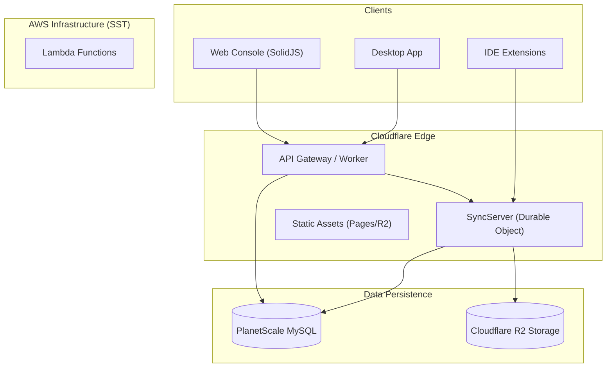
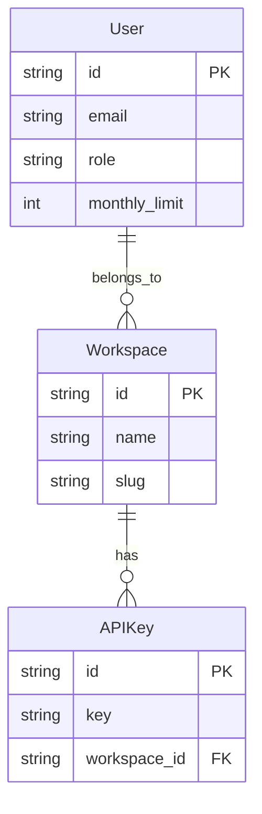
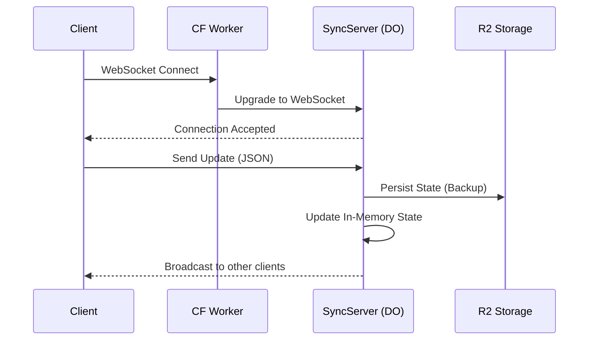

文件实际保存路径：`docs/project-overview.md`
文档版本号：v0.1
生成时间：2025-12-23
生成工具：Trae AI (Gemini-3-Pro-Preview), 架构总览指令 v2

---

# 已扫描范围与未覆盖区域

**已扫描的关键区域：**
- **入口与基础设施**：`infra/app.ts` (SST 入口), `infra/secret.ts`, `package.json` (Root)
- **核心服务 (Console)**：
  - `packages/console/app` (Frontend: SolidJS + Vite)
  - `packages/console/core` (Backend Logic: Drizzle ORM + MySQL)
  - `packages/console/function` (Lambda/Worker Handlers)
- **数据模型**：`packages/console/core/src/schema/*.sql.ts` (User, Workspace, etc.)
- **关键服务**：`packages/function/src/api.ts` (SyncServer Durable Object)
- **部署配置**：`.github/workflows/deploy.yml`

**未覆盖/受限区域（合理假设）：**
- **Desktop 细节**：`packages/desktop` 概览了结构，推测为基于 Web 技术的桌面壳（Electron/Tauri），未深入其原生桥接实现。
- **Extension 实现**：`packages/extensions` 仅做目录级扫描。
- **具体业务逻辑细节**：未逐行阅读所有 API Handler 的实现逻辑。

---

# 1. 执行摘要

## 项目使命与状态
Opencode 是一个集成了 AI 能力的现代开发平台，旨在通过云端协作、智能辅助和高效的资源管理提升开发效率。当前项目处于活跃开发阶段，采用 Monorepo 架构管理全栈代码。

## 读者画像与使用指引
本文档旨在帮助新成员快速建立系统认知。
- **后端工程师**：请重点关注 `4. 系统全景架构`、`6. 数据模型与存储` 和 `10. 配置、密钥与环境`。
- **前端工程师**：请优先阅读 `5. 模块与职责` 中的 Console App 部分及 `8. 外部接口与契约`。
- **DevOps/SRE**：请查阅 `4. 系统全景架构`、`12. 部署与 CI/CD` 及 `13. 观测性与故障处理`。

## 推荐阅读顺序
1. **后端工程师**：`4. 系统全景架构` → `5. 模块与职责` → `6. 数据模型与存储` → `11. 构建与运行`
2. **前端工程师**：`5. 模块与职责` (App) → `8. 外部接口与契约` → `11. 构建与运行`
3. **DevOps**：`4. 系统全景架构` → `10. 配置、密钥与环境` → `12. 部署与 CI/CD`

---

# 2. 业务背景与问题陈述
Opencode 解决的核心问题是开发环境的割裂与协作的低效。通过提供统一的云端控制台（Console）、桌面端接入（Desktop）以及 IDE 扩展，实现配置同步、资源共享和 AI 辅助编程。

---

# 3. 目标与非目标
**目标**：
- 提供高性能、低延迟的实时同步服务（SyncServer）。
- 构建统一的计费与用户管理系统。
- 实现多端（Web, Desktop, IDE）无缝体验。

**非目标**（推断）：
- 暂不构建自研的大规模底座模型（主要依赖外部 Provider 如 OpenAI/Anthropic，见 `packages/console/core/src/provider.ts`）。

---

# 4. 系统全景架构

项目采用 **Monorepo** 结构，基于 **Bun** 包管理器。基础设施完全构建在 **AWS** (通过 SST 部署) 和 **Cloudflare** 之上。



**关键技术栈**：
- **Runtime**: Bun, Node.js
- **Frontend**: SolidJS, Vite
- **Backend**: Cloudflare Workers, Durable Objects, AWS Lambda (via SST)
- **Database**: PlanetScale (MySQL), Drizzle ORM
- **IaC**: SST (Serverless Stack)

---

# 5. 模块与职责

| 模块路径 | 类型 | 职责 | 技术栈 |
| :--- | :--- | :--- | :--- |
| `packages/console/app` | Frontend | Web 控制台主应用，用户界面 | SolidJS, Vite, Tailwind |
| `packages/console/core` | Backend Lib | 核心业务逻辑、数据库 Schema、ORM 定义 | Drizzle ORM, Zod |
| `packages/console/function` | Backend | 具体的 API Handlers 和 Lambda 函数 | AWS Lambda / CF Workers |
| `packages/console/mail` | Service | 邮件模板与发送逻辑 | @jsx-email |
| `packages/function` | Backend | 通用 API 及 SyncServer 实现 | Hono, Cloudflare Durable Objects |
| `infra` | Infrastructure | SST 基础设施定义文件 | SST (TypeScript) |

---

# 6. 数据模型与存储

核心数据存储在 **PlanetScale (MySQL)** 中，使用 **Drizzle ORM** 管理。

**Schema 位置**: `packages/console/core/src/schema/`



- **User**: 用户身份与全局属性 (`packages/console/core/src/schema/user.sql.ts`)。
- **Workspace**: 租户隔离单元，计费与资源归属主体。
- **Usage/Billing**: 计费相关数据（推断存在于 `billing.sql.ts`）。

---

# 7. 关键流程与时序

## 实时同步流程 (SyncServer)

`SyncServer` (`packages/function/src/api.ts`) 是一个 Cloudflare Durable Object，用于处理多端实时状态同步。



---

# 8. 外部接口与契约

- **API Endpoint**: `api.${domain}` (定义在 `infra/app.ts`)
- **Web Interface**: `packages/console/app/src/routes/api` 下定义了面向前端的 API。
- **Sync Protocol**: 基于 WebSocket 的自定义 JSON 协议，主要处理 `session/` 开头的 key-value 更新。

---

# 9. 依赖与第三方服务

| 服务/库 | 用途 | 关键版本 | 风险提示 |
| :--- | :--- | :--- | :--- |
| **PlanetScale** | 核心数据库 | - | 依赖外部托管，需关注连接数限制 |
| **Cloudflare** | 边缘计算与存储 | Workers, R2 | 强绑定厂商特性 (Durable Objects) |
| **SST** | 基础设施管理 | v3.x | 部署依赖 AWS 凭证 |
| **Stripe** | 支付与计费 | v18.0.0 | 需保持 API 版本兼容 |
| **OpenAuth** | 身份认证 | - | `packages/console/app/package.json` 中引用 |

---

# 10. 配置、密钥与环境

**密钥管理**：
- 使用 `sst.Secret` 进行管理 (`infra/secret.ts`)。
- 关键密钥：`GITHUB_APP_ID`, `STRIPE_SECRET_KEY`, `PLANETSCALE_SERVICE_TOKEN`。
- 环境变量：通过 `sst.config.ts` 或 `app.ts` 中的 `environment` 字段注入到 Lambda/Worker。

**环境区分**：
- `dev`: 本地开发或开发环境。
- `production`: 生产环境。
- 逻辑判断：`$app.stage === "production"` (`infra/app.ts:30`)。

---

# 11. 构建与运行

确保已安装 **Bun**。

1. **安装依赖**：
   ```bash
   bun install
   ```

2. **本地开发 (Console)**：
   ```bash
   cd packages/console/app
   bun dev
   # 或在根目录
   bun dev
   ```

3. **数据库迁移**：
   ```bash
   # 在 packages/console/core 下
   bun db-dev  # 开发环境
   ```

---

# 12. 部署与 CI/CD

**部署工具**: SST (`bun sst deploy`)

**CI/CD 流程**: `.github/workflows/deploy.yml`
1. **Trigger**: Push to `dev` or `production`.
2. **Environment**: Ubuntu, Node 24, Bun installed.
3. **Secrets**: 注入 `CLOUDFLARE_API_TOKEN`, `PLANETSCALE_...`, `STRIPE_...`.
4. **Command**: `bun sst deploy --stage=${{ github.ref_name }}`.

---

# 13. 观测性与故障处理

- **日志**: Cloudflare Worker Logs (Logpush enabled in `infra/app.ts:19`).
- **排障**:
  - 如果 SyncServer 无响应，检查 Cloudflare Durable Object 状态。
  - 如果数据库连接失败，检查 PlanetScale 凭证及 IP 白名单。

---

# 14. 测试策略与覆盖

- **类型检查**: `bun typecheck` (TypeScript)。
- **单元/集成测试**: `packages/enterprise/test` 包含测试用例，核心逻辑测试覆盖率待确认。
- **建议**: 在 `packages/console/core` 中增加对核心业务逻辑的单元测试。

---

# 15. 性能与扩展性

- **瓶颈**: Durable Object 是单线程的，单个 DO 实例可能成为热点（SyncServer）。
- **扩展**: Cloudflare Workers 自动水平扩展。
- **数据库**: PlanetScale 提供良好的水平分片能力。

---

# 16. 可靠性与容错

- **数据备份**: SyncServer 会将状态异步写入 R2 (`packages/function/src/api.ts:54`)。
- **重试**: 客户端需实现 WebSocket 断连重连机制。

---

# 17. 安全与合规

- **认证**: 使用 JWT 或 OpenAuth。
- **权限**: 数据库访问通过 SST 最小权限原则绑定。

---

# 18. 维护与运维手册

**新手常见踩坑清单**：
1. **SST 凭证**: 首次运行 `bun dev` 或 `sst deploy` 必须配置好 AWS/Cloudflare 凭证，否则报错。
2. **Node 版本**: 必须使用 Node 22+ (CI 使用 24)，低版本可能导致构建失败。
3. **数据库连接**: 本地开发连接开发库时，需确保网络畅通且有权限访问 PlanetScale。
4. **Monorepo 引用**: 在添加新包依赖时，记得使用 `workspace:*` 并在根目录 `bun install`。
5. **Durable Object 本地调试**: 本地模拟 DO 可能与线上行为有细微差异，需注意 `miniflare` 或 `sst dev` 的限制。

---

# 19. 风险与技术债

## 代码热区
- **`packages/function/src/api.ts`**:
  - **原因**: 核心同步逻辑，Durable Object 实现，状态管理复杂。
  - **风险**: 修改不当可能导致数据丢失或同步冲突。
- **`packages/console/core/src/schema/*.ts`**:
  - **原因**: 数据库模型定义。
  - **风险**: 变更需谨慎处理迁移，避免锁表或数据不一致。

---

# 20. 改进建议与路线图

- **短期**: 完善 `packages/console/core` 的单元测试覆盖率。
- **中期**: 引入端到端 (E2E) 测试，覆盖核心同步流程。
- **长期**: 探索多区域 Durable Objects 部署以降低延迟。

---

# 21. 快速上手清单 (新人 10 步)

1. **环境准备**: 安装 Bun, Node.js 22+, VS Code.
2. **克隆代码**: `git clone <repo>`
3. **安装依赖**: `bun install`
4. **配置凭证**: 配置 AWS 和 Cloudflare 环境变量/Profiles。
5. **检查状态**: `bun typecheck` 确保代码无静态错误。
6. **启动开发环境**: 在根目录运行 `bun dev` (或 `bun sst dev`)。
7. **浏览 Console**: 打开 `http://localhost:3000` (端口视配置而定)。
8. **查看数据库**: 浏览 `packages/console/core/src/schema` 理解数据结构。
9. **尝试修改**: 在 `packages/console/app` 修改一个 UI 组件并观察热更新。
10. **提交变更**: 遵循 Git 规范提交代码。

---

# 22. 术语表与参考

- **SST**: Serverless Stack (Infrastructure as Code).
- **DO**: Durable Object (Cloudflare 有状态计算单元).
- **R2**: Cloudflare 对象存储 (S3 Compatible).

---

# 23. 合理假设 (Assumptions)

1. **Desktop 架构**: 假设 Desktop App 是基于 Web 技术栈的壳应用，复用了大部分 Web Console 的逻辑或组件。
   - *影响*: 如果是纯原生开发，则文档中的技术栈描述需修正。
2. **Auth 流程**: 假设使用 `OpenAuth` 或类似标准 OAuth 流程，基于 `packages/console/app` 中的依赖推断。
   - *影响*: 认证模块的理解。
3. **数据库方言**: 明确假设为 MySQL (PlanetScale)，基于配置文件。

---

# 24. 待确认事项 (Open Questions)

1. **Desktop 具体实现**: Desktop App 的原生能力边界在哪里？(建议咨询: Desktop 负责人)
2. **SyncServer 扩容策略**: 单个 Session 的连接数上限是多少？(建议咨询: 架构师/后端负责人)
3. **邮件服务**: `packages/console/mail` 是仅作为模板库还是包含发送逻辑？(建议咨询: 后端工程师)
