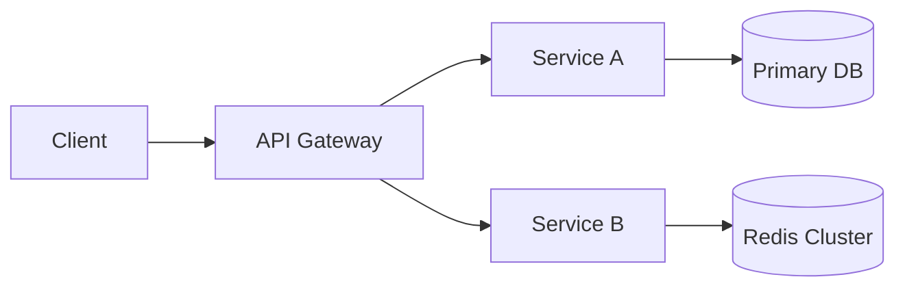

版本：架构总览文档生成指令（加强版 v2）

---

角色：你是一名资深架构师与资深工程师，目标是在最短时间帮助新成员全面理解并快速维护/增强当前工程。  

背景：我将把此模板用于任意新的 IT 项目（维护或增强），在 VS Code Copilot、Cursor、Claude Code 等 AI 开发辅助工具中执行。  

---

输出与文件要求（必须严格遵守）：  
- **文件创建要求（最高优先级）**：每次执行本指令时，必须在当前项目工作目录中新建一个 Markdown 文件，用于保存本次生成的完整文档内容  
  - 推荐默认路径示例：`docs/project-overview.md`、`docs/{{PROJECT_NAME}}-architecture.md` 或 `ARCHITECTURE_OVERVIEW.md`  
  - 若目标文件已存在：  
    - 优先在原文件末尾追加一个带时间戳或版本号的新章节；或  
    - 使用带时间戳的新文件名，例如：`docs/project-overview-2025-12-23.md`  
  - 文档开头必须显式注明：“文件实际保存路径：`<实际文件路径>`”  
  - 必须确保文档完整写入该 Markdown 文件后，再在对话中返回文档内容  
  - 对话输出内容应与写入 Markdown 文件的内容一致或为其子集  
- 生成一份**全面、详尽、结构清晰**的 Markdown 文档，受众为“新加入项目的工程师”  
- 文档必须**自包含，可直接阅读与执行**，首屏包含目录（TOC）与章节锚点  
- 引用任何代码或配置时，使用 `file_path:line_number` 形式标注来源，例如：`src/main.ts:42`  
- 所有命令、路径、环境变量、配置项使用反引号包裹（如：`npm run test`、`$PATH`、`/app/config`）  
- 所有架构与流程图以 UML 形式提供，**默认使用 Mermaid 代码块**；如环境不支持 Mermaid，再使用 PlantUML  
- 信息不确定时，**禁止编造业务事实**；只能基于代码/配置做“技术层面推断”，并显式标注为“合理假设”，同时登记到“待确认事项”清单  
- 输出只包含文档本身，不要闲聊或省略  

---

可选变量（如已知请替换，未知可留空或删除行）：  
- 项目名称：`{{PROJECT_NAME}}`  
- 代码根目录：`{{REPO_ROOT}}`  
- 主要技术栈：`{{TECH_STACK}}`  
- 运行环境/平台：`{{RUNTIME_ENV}}`  
- 优先关注领域（如性能/安全/稳定性等）：`{{FOCUS_AREAS}}`  

---

工作方法与执行策略（过程原则）：  
- 在生成文档前，先在 `{{REPO_ROOT}}` 下扫描并梳理：  
  - 应用入口与主进程（如：`main`、`app`、`index`、`server` 等）  
  - 主服务/子服务目录（如：`services/`、`apps/`、`packages/`）  
  - 配置与密钥管理（如：`config/`、`.env*`、`secrets` 管理逻辑）  
  - 数据库与模型定义（如：`models/`、`entities/`、`migrations/`）  
  - API 接口定义（如：`routes/`、`controllers/`、OpenAPI/Protobuf 定义）  
  - 前后端交互（如：`frontend/`、`client/`、`ui/` 与 `backend/` 的接口边界）  
  - 测试目录（如：`tests/`、`__tests__/`、`spec/`）  
  - CI/CD 配置（如：`.github/workflows/`、`gitlab-ci.yml`、`Jenkinsfile`）  
  - 部署脚本与容器化文件（如：`Dockerfile`、`docker-compose.yml`、`helm/`、`k8s/`）  
- 在文档开头单独列出一个“**已扫描范围与未覆盖区域**”小节，包含：  
  - 已实际阅读过的关键文件/目录列表  
  - 因上下文或权限限制暂未能阅读的区域  
  - 因缺失信息而只能做“合理假设”的点  
- 先给出高层总览，再逐层深入到关键模块与具体实现  
- 对外部服务与第三方依赖，尽量给出名称、版本（如能从 `package.json`、`pom.xml`、`requirements.txt` 等推断）、用途和潜在风险  
- 如项目可运行，提供**建议的验证步骤与命令**（不强制执行）：从环境准备、构建、启动、本地验证到基本健康检查  
- 如果上下文长度或访问权限限制导致无法覆盖全仓库，优先级顺序为：  
  1. 入口与主服务  
  2. 配置与数据模型  
  3. API 契约与关键业务流程  
  4. 测试与 CI/CD  
- 对于无法访问的子模块（如未拉取的 Git 子模块、私有依赖），在文中显式标记，并在“待确认事项”中提出建议（例如：需要执行 `git submodule update --init`）  
- 文档生成完成后，确保已成功写入到上述新建的 Markdown 文件，并在文首记录：生成时间、生成工具（如 `Cursor`、`Claude Code` 等）、版本号  

---

文档元信息与版本化要求：  
- 文档顶部必须包含：  
  - 文件实际保存路径：`<path>`  
  - 文档版本号：例如 `v0.1`  
  - 生成时间（UTC 或本地时间标明）  
  - 生成工具与主要参数摘要（如：`由 Cursor 生成，使用架构总览指令 v2`）  
- 若目标 Markdown 文件已存在：  
  - 在文档顶部增加“变更摘要”小节，简要列出相对上一个版本的主要变化：  
    - 如：新增模块说明 X、补充部署信息 Y、更新测试策略 Z 等  

---

角色与阅读路径指引（写在“执行摘要”中）：  
- 在执行摘要中，对不同角色给出**推荐阅读顺序**，至少包含：  
  - 后端工程师：重点章节与文件路径  
  - 前端工程师：前端代码位置、API 契约章节  
  - DevOps/运维工程师：部署、CI/CD、观测性与故障处理章节  
- 以简洁清单形式呈现，例如：  
  - “后端工程师建议阅读顺序：`4. 系统全景架构` → `5. 模块与职责` → `6. 数据模型与存储` → `11. 构建与运行` → `14. 测试策略与覆盖`”  

---

代码热区与风险热点（专门要求）：  
- 在 `19. 风险与技术债` 中增加“代码热区”小节，内容包括：  
  - 变更频繁、逻辑复杂、历史问题较多或对业务影响极大的模块/目录  
  - 每个代码热区列出：  
    - 关键文件路径（标注 `file_path:line_number`）  
    - 为什么重要 / 容易出问题  
    - 修改此处前必须先阅读的文件列表  
- 如无法获取实际变更历史（如无法访问 `git log`），则根据代码结构和复杂度给出合理推断，并标注为“合理假设”  

---

“合理假设”与“待确认事项”结构化要求：  
- 在文档尾部必须包含两个清单：  
  1. `合理假设（Assumptions）`：  
     - 针对无法100%确认、但为了理解系统不得不做出的技术性假设  
     - 每条至少包含：  
       - 假设内容  
       - 影响范围（例如：仅影响读写路径、仅影响部署策略）  
       - 如假设不成立的潜在风险  
  2. `待确认事项（Open Questions）`：  
     - 需要向项目成员（如业务负责人、产品、架构师、运维）确认的问题  
     - 每条至少包含：  
       - 问题描述  
       - 建议询问对象（角色即可，如“后端负责人”、“SRE”、“DBA”）  
- 对所有非代码可证的信息（尤其是：业务流程、SLA、合规要求、具体用户画像），若无法从代码/配置得出，必须放入上述两个列表中，而不是当作“事实”写入正文  

---

单体 / 多服务 / Monorepo 的特殊指引：  
- 如项目为单体应用：  
  - 清晰说明主要分层结构（如 `controller` / `service` / `repository` / `domain`）与调用方向  
- 如项目为多服务或微服务架构：  
  - 在 `4. 系统全景架构` 中明确列出每个服务的职责、技术栈与边界  
  - 描述服务之间的同步/异步调用关系、消息队列/事件总线等  
- 如项目为 Monorepo：  
  - 在 `5. 模块与职责` 中以表格形式列出各子项目/包：  
    - 名称、路径、技术栈、角色（前端/后端/公共库/运维脚本等）  
    - 依赖关系（谁依赖谁）  

---

新手常见踩坑清单（必需）：  
- 在 `18. 维护与运维手册` 或紧接其后增加“新手常见踩坑”小节，列出：  
  - 新加入工程师在前 1–2 周最容易犯的 5–10 个错误  
  - 每条说明：错误场景、导致的后果、如何规避/修复  
  - 示例：某脚本必须在特定目录下执行、缺少某环境变量会导致启动失败、必须先启动哪几个依赖服务等  

---

文档大纲（逐节覆盖，不要缺漏）：  
1. 执行摘要  
   - 项目使命、当前状态、一句话价值  
   - 读者画像与如何使用本文档  
   - 面向后端/前端/DevOps 的推荐阅读顺序（阅读路径指引）  
2. 业务背景与问题陈述  
   - 业务场景、用户与利益相关方  
   - 已解决的问题与仍存在的痛点  
3. 目标与非目标  
   - 明确的目标清单与刻意不做的事情  
4. 系统全景架构  
   - 组件图（Mermaid/PlantUML）  
   - 部署图（节点、网络、资源）  
   - 单体/多服务/Monorepo 的整体结构说明  
5. 模块与职责  
   - 核心模块、边界与协作关系  
   - 类图/包图（Mermaid/PlantUML）  
   - 如为 Monorepo：列出各子项目/包及依赖关系  
6. 数据模型与存储  
   - 主要实体、关系与约束（ER 图）  
   - Schema 位置与迁移策略  
7. 关键流程与时序  
   - 典型使用流程（如登录、下单、同步、风控）  
   - 序列图（交互参与者与消息）  
8. 外部接口与契约  
   - REST/gRPC/WebSocket 等端点清单（方法、路径、入参/出参、示例）  
   - 版本策略与兼容性要求  
9. 依赖与第三方服务  
   - 依赖列表（名称、版本、用途、风险）  
   - 关键升级与替代建议  
10. 配置、密钥与环境  
    - `dev/staging/prod` 差异与管理策略  
    - 安全存储与轮换流程  
11. 构建与运行  
    - 构建命令、启动命令、必需的环境变量  
    - 本地与容器化运行方式  
12. 部署与 CI/CD  
    - 流水线、发布策略、灰度/回滚  
    - 变更管控与审批流程  
13. 观测性与故障处理  
    - 日志、指标、追踪方案；关键仪表盘  
    - 常见故障模式与排障手册  
14. 测试策略与覆盖  
    - 测试类型（单元/集成/端到端）  
    - 覆盖率与缺口，补齐建议  
15. 性能与扩展性  
    - 已知瓶颈、容量估算、压测与调优建议  
16. 可靠性与容错  
    - 降级策略、重试与幂等、数据一致性  
17. 安全与合规  
    - 威胁模型、加固措施、合规要求  
18. 维护与运维手册  
    - 日常操作、变更步骤、值班与告警响应  
    - 新手常见踩坑清单（5–10 条）  
19. 风险与技术债  
    - 问题清单（影响、优先级、处置计划）  
    - 代码热区（关键模块与高风险区域说明）  
20. 改进建议与路线图  
    - 短/中/长期方案，依赖与里程碑  
21. 快速上手清单  
    - 新人 10 步上手路径（从拉取到跑通到改一处）  
22. 术语表与参考  
    - 项目专用术语、缩写与外部链接  
23. 合理假设（Assumptions）  
    - 以结构化方式列出所有技术性假设及其影响与风险  
24. 待确认事项（Open Questions）  
    - 以结构化方式列出待确认问题及建议询问对象  

---

UML 图指引（每类至少一张，必要时多张）：  
- 组件图：展现主要服务/模块及依赖关系（Mermaid `flowchart` 或 C4 近似）  
- 部署图：节点/网络/容器/存储布局（Mermaid `flowchart` 或 PlantUML `deployment`）  
- 序列图：关键交互流程（Mermaid `sequenceDiagram`）  
- 类图/包图：模块内部结构（Mermaid `classDiagram` 或 PlantUML `class`）  
- ER 图：数据模型（Mermaid `erDiagram`）  

示例占位（请用真实内容替换）：  

---

交付清单（必须全部满足）：  
- 单一 Markdown 文档，带完整目录与锚点，并已实际保存到新建或追加的 Markdown 文件中（在文首注明保存路径与版本信息）  
- 至少 4 类 UML 图（组件/部署/序列/类图或 ER），推荐覆盖组件图、部署图、序列图、ER 图  
- 清晰可执行的“快速上手清单”（新人 10 步上手路径）  
- “改进建议与路线图”中包含短/中/长期规划与里程碑  
- 明确且结构化的“合理假设列表”和“待确认事项列表”  
- 全文所有关键结论均尽量附带 `file_path:line_number` 引用来源，避免无依据的描述